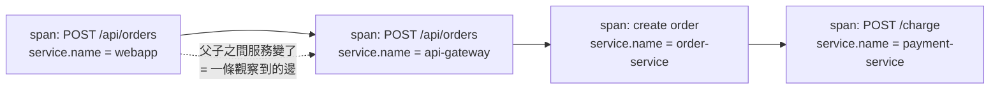
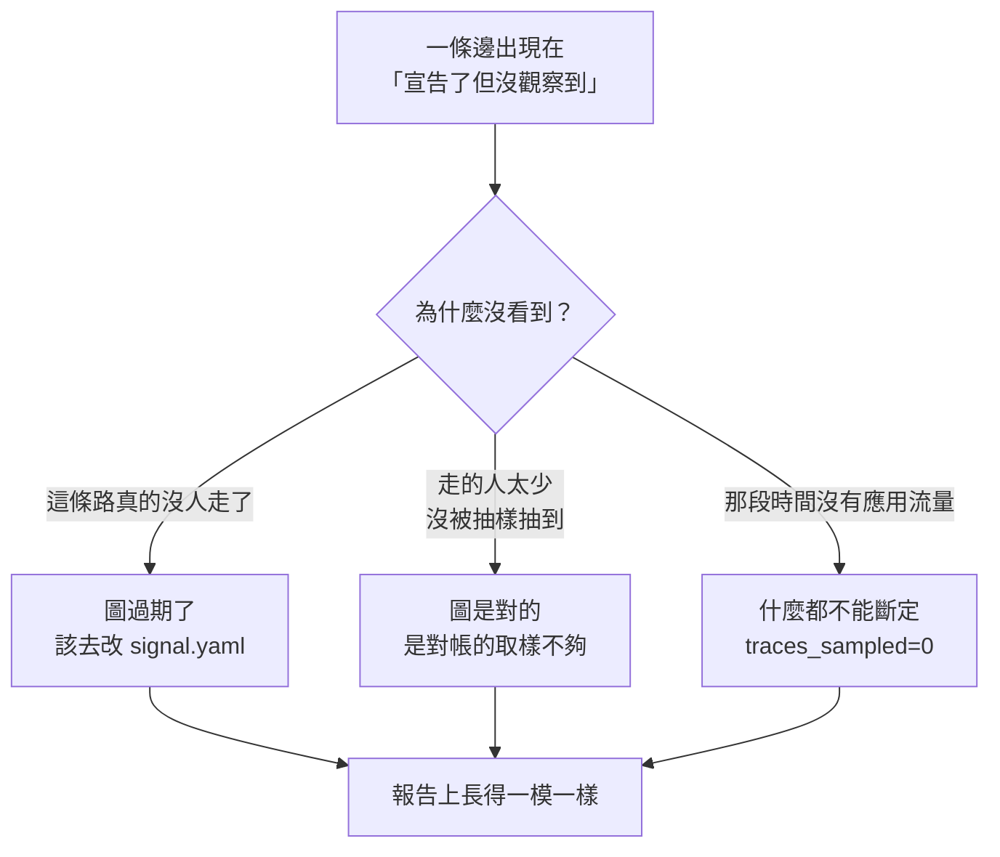

# Day15：拓撲對帳，那張圖到底準不準

> 一張沒有人驗過的架構圖
> 跟一張畫錯的架構圖
> 在會議室的投影幕上長得一模一樣

昨天那張九宮格，中間「對帳」那一欄三格全是空的，而其中一格的具體長相是這樣：

```console
$ uv run python -c "from app.signals.dq import dq_verdict; print(dq_verdict())"
{'proven_good': False, 'score': None, 'note': 'topology not reconciled against live traces; DQ unproven'}
```

DQ 是 Data Quality。這句 `DQ unproven` 的意思不是圖畫錯了，是從來沒有人去驗過。今天就是去驗那一次。

程式碼在範例 repo [`OTel_AIOps_Agent`](https://github.com/tedmax100/OTel_AIOps_Agent) 的 [`ironman-2026/day15/`](https://github.com/tedmax100/OTel_AIOps_Agent/tree/main/ironman-2026/day15)。要跑的 `reconcile.py` 是 agent 服務自己的原始碼，我一個字都沒改，這個資料夾裡放的是「跑之前該先確認什麼」的那支工具。驗證環境是 Tempo 2.6.0。

## 一張沒人對過的圖，比沒有圖更危險

`topology.yaml` 宣告了六條邊：誰呼叫誰。agent 拿它來決定「這個服務的錯誤該怪它自己，還是怪它下游」。

問題是這種宣告的圖有一個很難察覺的失效模式。它不會壞掉，它只會慢慢跟現實脫節。某個團隊上週把同步呼叫改成走訊息佇列了，某個服務三個月前就沒有人在打了，而那份 YAML 一個字都不會變。**沒有圖的時候 agent 會說「我不知道依賴關係」，有一張過期的圖，它會很有自信地把你指向一個早就不存在的方向。**

所以這張圖必須是一份持續跟遙測對齊的東西，不是一頁 wiki。而要對齊，得先回答一個問題：怎麼從 trace 裡看出一條邊。

## 一條邊在 trace 裡長什麼樣

答案比想像中簡單，而且不需要任何額外的埋點。用 httpx 加 FastAPI 的自動注入時，服務 A 呼叫服務 B，A 會產一個 CLIENT span，B 會產一個 SERVER span，而 B 的 SERVER span 的 parent 就是 A 的 CLIENT span。也就是說，`service.name` 剛好在呼叫的那一刻改變。



所以判斷條件只有一行：**一個 span 的服務跟它 parent 的服務不一樣，那就是一條觀察到的邊。**

```python
for sid, svc in svc_of.items():
    psvc = svc_of.get(parent_of.get(sid))
    if psvc and svc and psvc != svc:
        edges.add((psvc, svc))
```

把一批 trace 這樣掃過去，取聯集，就得到「觀察到的邊」的集合。跟宣告的那六條做集合運算，就是兩份清單：宣告了但沒觀察到，以及觀察到但沒宣告。

## 第一次跑，六條邊全滅

```console
$ uv run python -m app.signals.reconcile
topology v1.0.0 reconciled against 0 traces
  declared=6 observed=0 dq_score=None
  declared but not observed (stale or low traffic):
      api-gateway → order-service
      api-gateway → payment-service
      api-gateway → user-service
      order-service → payment-service
      order-service → user-service
      webapp → api-gateway
```

六條邊，一條都沒觀察到。如果照字面讀，這份報告在說「你宣告的整張圖跟現實完全對不上」。

而它其實只是在說沒有流量。`traces_sampled` 是 0，那一行就寫在最上面，但它排在報告的第一行、字很小，而下面那六條紅通通的邊佔了整個畫面。`dq_score` 給的是 `None` 而不是 `0.0`，這個區分是對的（沒有資料，跟資料顯示一致性為零，是兩件事），但這個區分只活在那個回傳值裡，沒有活在人看到的畫面上。

會沒有流量，是因為 `reconcile` 在搜尋的時候套了一個過濾器：

```python
{"q": "{ trace:duration > 5ms }", "start": ..., "end": ..., "limit": limit}
```

這個過濾器是必要的。我寫了一支小工具去看那段時間 Tempo 裡到底有什麼：

```console
$ python3 ironman-2026/day15/tempo_probe.py http://localhost:3210 120
http://localhost:3210 → Tempo 2.6.0 (rev e85bbc57d)
  last 120s: 214 traces
    slowest seen           : 1ms
    survives the >5ms filter: 0
    ⚠ reconcile would sample 0 traces here and report every declared
      edge as unobserved. That is 'no traffic', not 'the graph is wrong'.
```

214 筆 trace，最長 1 毫秒，全部是 kubelet 打的 `GET /health` 跟 `GET /healthz`。健康檢查會把 Tempo 灌滿，而且它們不跨服務，一條邊都貢獻不了。不濾掉它們，那個取樣上限會被探針吃光。**但同一個過濾器，在沒有應用流量的時候會把畫面清成全空，而全空跟「圖全錯」在報告上長得一模一樣。**

> 這是這個系列第幾次遇到「空結果沒有錯誤訊息」我已經數不清了。第一天是 Prometheus 回 `status: success` 加空陣列，這次是一個對帳報告的空集合。形狀完全一樣：查詢成功、結果是空的、而空的原因有兩種，工具不告訴你是哪一種。

## 插一段：我自己在這裡卡了很久

在拿到上面那個結論之前，我先繞了一大圈，而這個坑值得寫出來。

我用 `kubectl port-forward` 把 Tempo 轉到本機的 3200，然後 `curl` 得到回應、`reconcile` 拿到 0 筆、collector 的計數器顯示它送出了四萬多個 span 而且零失敗、Tempo 的 log 顯示它正在寫 block。每一個元件都說自己沒事，資料卻不在。我一路查到懷疑是 Tempo 版本不對，還去重新拉了一次 image。

真相是那句 `port-forward` 根本沒成功：

```console
Unable to listen on port 3200: bind: address already in use
```

本機的 3200 早就被另一座 k3d 叢集的 load balancer 佔著了，那座叢集裡也有一個 Tempo。所以我所有的查詢都打到了另一座 Tempo，而它的資料本來就停在兩小時前。

```console
$ curl -s http://localhost:3200/api/status/buildinfo
{"version":"2.10.3", ...}          ← 另一座叢集
$ curl -s http://localhost:3210/api/status/buildinfo
{"version":"2.6.0", ...}           ← 我以為我在查的那座
```

**兩個東西共用一個埠號，失敗的那個安靜地退場，而活著的那個照常回答問題。** 我後來把「這個位址上的 Tempo 到底是哪一版」加進那支探針工具的第一行輸出，就是因為這件事。一個對帳工具在報告差異之前，得先能證明它在跟正確的對象講話。

## 有流量之後

灌了 70 秒的流量再跑一次：

```console
topology v1.0.0 reconciled against 50 traces
  declared=6 observed=5 dq_score=1.0
  declared but not observed (stale or low traffic):
      api-gateway → payment-service
```

這次像樣了。取樣 50 筆 trace，宣告六條、觀察到五條，`dq_score` 是 1.0。

那個 1.0 的意思要看清楚，它算的是「觀察到的邊裡面，有幾成是宣告過的」。1.0 代表沒有任何一條真實流量走在圖上沒有的路徑上。這是刻意選的方向，因為`未宣告的邊`是比較危險的那一種：它代表有人加了一個依賴而沒有人知道。

剩下那條 `api-gateway → payment-service` 是宣告了但沒觀察到。到這裡，一份正常的排查會停在「這條邊大概是舊的，去問問看還有沒有人在用」。

## 那條邊到底存不存在

我沒有停在那裡，因為那個括號裡寫著 `stale or low traffic`，兩種可能塞在同一個清單裡。

先去翻原始碼，api-gateway 確實有這條路：

```python
@app.post("/api/payments")
async def payments_charge(request: Request):
    return await _proxy("POST", f"{PAYMENT_SERVICE_URL}/charge", request)
```

所以邊是存在的，只是 `load.sh` 的端點組合裡沒有直接打 `/api/payments`，付款都是經由 order-service 進去的。手動打了十二次之後再跑，結果沒變，還是 `unobserved`。

於是我去 Tempo 裡撈一筆真的走過那條路的 trace，然後把同一個函式套上去：

```console
$ uv run python -c "... edges_from_trace(raw) ..."
edges in that one payment trace: {('api-gateway', 'payment-service')}
```

**那條邊看得見，是對帳沒有看到它。** 問題出在取樣：`reconcile` 預設抓 50 筆 trace，而那段時間 Tempo 裡的 trace 由結帳流量主導，我那十二筆付款請求根本沒被抽中。同一份程式碼、同一個視窗、同一座 stack，只把取樣數往上調：

```console
max_traces=50   sampled=50   observed=5  dq=1.0  unobserved=[('api-gateway', 'payment-service')]
max_traces=100  sampled=100  observed=5  dq=1.0  unobserved=[('api-gateway', 'payment-service')]
max_traces=300  sampled=300  observed=6  dq=1.0  unobserved=[]
```

50 跟 100 說這條邊死了，300 說一切正常。而**預設值是 50**。



三種原因，一種呈現。而它們的處置完全相反：第一種要去改宣告，第二種要去改對帳的參數，第三種什麼都不該做。

這件事讓我對這個模組的評價往下修了一格。它不是壞掉，它做的事情是對的，但它**把一個統計取樣的結果，用一個斷言的語氣印出來**。`observed` 是一個下界，不是一個事實；`unobserved` 是「我沒看到」，不是「它不存在」。這兩個詞現在讀起來的份量是一樣的。

> 稀有路徑本來就是最難用取樣看到、也最值得知道的東西。錯誤處理的分支、降級的備援路徑、只有月底才會走的結算流程，全部都是低流量高風險。而一個照流量比例取樣的對帳，剛好對它們最盲。

## 值班的時候會怎樣

把這件事放回凌晨三點。agent 說「order-service 在噴錯，但它的下游 payment-service 是健康的，所以問題應該在 order-service 自己」。

如果那張圖裡 `order-service → payment-service` 這條邊因為取樣不足被判定成不存在，agent 就不會去看 payment，也不會把它列進候選。你拿到的是一段推理完整、語氣肯定、而且少了一整個分支的結論。**它不會告訴你它少看了哪裡，因為它自己也不知道。**

反過來，如果 `dq_score` 跟那份 `unobserved` 清單有跟著送到值班的人面前，至少你會知道「這個判斷是建立在一張有兩條邊沒被驗證的圖上」。這個資訊現在算得出來，`context.py` 也真的會把漂移標記注進去，但前提是有人跑過對帳。而今天之前，沒有人跑過。

## 誰該擁有這件事

從平台工程的角度，這裡有個界線要畫清楚。

那六條邊的宣告是**產品團隊擁有的**，寫在各自服務的 `signal.yaml` 裡，每個服務只宣告自己打出去的邊。這個設計前面講過，它讓新加服務不用去改一份公用檔案。而對帳這件事剛好相反，它必然是**平台團隊的**，因為它要跨所有服務去看 Tempo，任何單一團隊都拿不到全貌。

所以這裡的介面設計是：平台團隊提供對帳，產品團隊收到「你宣告的這條邊我沒看到」的通知，然後由他們決定那是該刪的舊邊還是流量太低。**平台團隊不該替他們決定，因為只有那個團隊知道那條路是不是只有月底才會走。**

而這也直接決定了那份報告該長什麼樣。現在那句 `stale or low traffic` 把判斷丟回給讀的人，卻沒有給他判斷需要的東西。要讓對方自己修得動，至少得補上「這條邊上一次被觀察到是什麼時候」跟「這次取樣涵蓋了多少比例的流量」。前者現在完全沒有，因為對帳沒有留歷史，每次都是從零開始看最近一小時。

## 今天沒做的事

沒有讓對帳定期跑。今天全部是手動敲的，而一個要靠人記得跑的資料品質檢查，跟前面那些「寫好了但沒有在跑」的東西是同一個問題。

沒有處理取樣。最直接的做法是把取樣數調高，但那只是把界線往後推，不是解決。比較對的方向大概是不要用一次性的取樣去回答這個問題，而是讓對帳留下歷史，用「這條邊連續幾天沒被看到」取代「這一次沒看到」。這件事沒做。

沒有讓 `unobserved` 帶上時間。一條邊上次被觀察到是十分鐘前還是三個月前，是決定要不要動手刪它的關鍵，而現在這兩者在報告上完全一樣。

也沒有量「取樣涵蓋率」。要判斷 50 筆夠不夠，得先知道那個視窗裡總共有多少筆，而那個數字現在只有我手動用探針工具問出來，沒有進到報告裡。

## 小結

總結來說，今天做的事其實只有「把一支寫好很久的程式跑起來」，聽起來不太值得寫一天。但跑之前我以為的結果是「圖大概八成準」，跑完拿到的是三個不同的答案，取決於我把取樣數設成多少。

比較有價值的大概是那個 `api-gateway → payment-service`。它被報成一條死掉的邊，實際上活得好好的，而我是靠著撈一筆單獨的 trace、把同一個函式套上去，才證明它存在。**一個對帳工具說「這裡有差異」的時候，你還是得有辦法去驗證那個差異本身。** 這跟第一天寫評分器時得出的那句「一個會給錯答案的評分器比沒有評分器更糟」是同一件事，只是這次的受測物換成了一張圖。

至於那個埠號撞在一起的坑，講難聽點就是我花了一個多小時，在對一座根本不相干的 Tempo 做根因分析。

明天讓這件事有個資料源，不要再靠我手動決定要對哪些服務。

> 那一個多小時，我對著一座根本不相干的 Tempo 做根因分析。
> 查得很認真，方法也沒錯，就是查錯了那一台 XD
