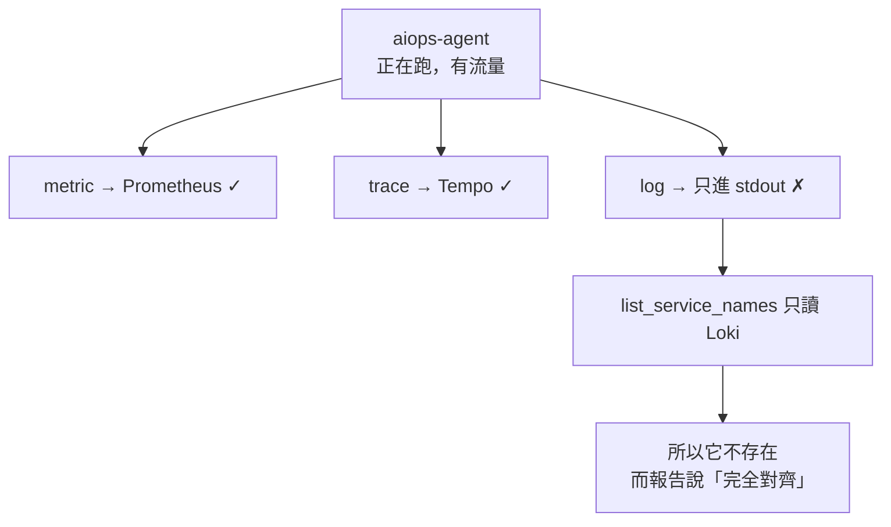
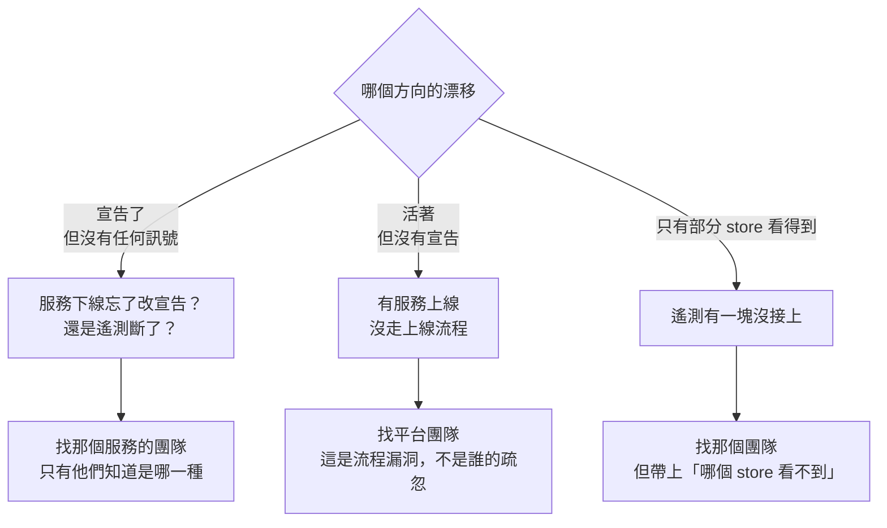

# Day16：這張圖上該有誰，一個問了三次才問對的問題

> 一份宣告漏掉一個服務
> 這套機制不會報錯
> 它會安靜地把那個服務當成不存在

昨天那份對帳的結論是取樣不夠，`api-gateway → payment-service` 明明活著卻被報成死掉的邊。但那整件事有個更前面的前提我沒有質疑過：**那張圖上的五個服務，是誰決定的。**

答案是我。`topology.yaml` 裡那五個節點，是五個服務各自的 `signal.yaml` 編出來的，而那五份檔案是人寫的。如果有第六個服務跑起來卻沒有人寫那份宣告，這整套東西不會有任何反應。

今天要處理的就是這件事，順便讓它從「我想到才敲一次」變成一個排程跑得動的東西。

程式碼在範例 repo [`OTel_AIOps_Agent`](https://github.com/tedmax100/OTel_AIOps_Agent) 的 [`ironman-2026/day16/`](https://github.com/tedmax100/OTel_AIOps_Agent/tree/main/ironman-2026/day16)，一支 `topology_watch.py`。驗證環境是 Loki 3.x、Tempo 2.6.0、Prometheus，都跑在同一座 k3d 叢集裡。

## 現成的答案：問 Loki

agent 服務裡本來就有一個函式在做這件事：

```python
async def list_service_names(lookback: str = "now-6h") -> list[str]:
    """The set of service_name values actually present in Loki right now."""
    data = await _get_json(
        settings.loki_url,
        "/loki/api/v1/label/service_name/values",
        {"start": _epoch_ns(start), "end": _epoch_ns(end)},
    )
```

而 `topology.py` 也早就有一支 CLI 把它接起來了。跑一次：

```console
$ uv run python -m app.signals.topology validate
topology v1.0.0 aligns with 5 live services
```

宣告五個，活著五個，完全對齊。這是今天的第一個答案，而它是錯的。

> 順帶一提，那個 `start`／`end` 不是可有可無的。Loki 的 label values 端點沒給時間範圍會回一個空陣列而不是報錯，這個坑我在別的地方踩過一次。又是同一個形狀：查詢成功、結果是空的、沒有任何東西說你少給了參數。

## 同一個問題問三次

會去懷疑，是因為前一天翻 Tempo 的時候，看到過一個不在那五個裡面的名字。所以我把同一個問題分別問了三個 store：

```console
$ curl -s ".../loki/api/v1/label/service_name/values" | jq -c .data
["api-gateway","order-service","payment-service","user-service","webapp"]

$ curl -s ".../api/v1/label/service_name/values" | jq -c .data
["aiops-agent","api-gateway","order-service","payment-service","user-service","webapp"]

$ curl -s ".../api/v2/search/tag/resource.service.name/values" | jq -c '[.tagValues[].value]|sort'
["aiops-agent","api-gateway","order-service","payment-service","user-service","webapp"]
```

Loki 說五個，Prometheus 說六個，Tempo 說六個。多出來的那個是 `aiops-agent`，也就是這個系列從第一天用到現在的那隻 agent 自己。它跑在同一個 namespace 裡、有 trace、有 metric，就是沒有 log 進 Loki。我把視窗拉到七天，Loki 還是沒看過它。

原因查得到：demo 那組服務共用一份 `o11y_shared/logging.py`，裡面把 OTLP 的 logger provider 接起來了；agent 服務沒有這個東西，它的 log 只進 stdout。所以**這不是資料掉了，是這個服務從一開始就沒有把 log 送進來，而它的另外兩種訊號都好好的。**



## 一個假綠燈是怎麼長出來的

把這件事講清楚：`list_service_names()` 沒有 bug，它做的事情跟它的 docstring 一字不差，「Loki 裡現在有哪些 `service_name`」。問題出在呼叫它的那一行，把這個答案當成了「現在有哪些服務」。

這兩句話在五個服務都乖乖送三種訊號的時候是同一件事，在第六個服務只送兩種的時候就不是了。而**偏偏是那些不完整的服務最需要被發現**，因為「這個服務沒有送 log」本身就是一件該有人知道的事。

所以現在這個檢查有一個很難看的性質：一個服務越不合規，它越不容易被這個檢查抓到。這跟前面那份上線 checklist 的第八項是同一種諷刺，那次是命名寫錯的服務躲過了值域檢查，這次是不送 log 的服務躲過了存在性檢查。

## 那就三個都問

改法本身沒什麼技術含量，把三個 store 都問一遍，取聯集：

```console
$ python3 ironman-2026/day16/topology_watch.py \
    --topology aiops-agent/service/app/signals/topology.yaml \
    --loki ... --prom ... --tempo ... --lookback 6h

# topology watch — declared 5, lookback 6h
  loki        sees  5: api-gateway, order-service, payment-service, user-service, webapp
  prometheus  sees  6: aiops-agent, api-gateway, order-service, payment-service, user-service, webapp
  tempo       sees  6: aiops-agent, api-gateway, order-service, payment-service, user-service, webapp
  ~ 'aiops-agent' is missing from loki but present in others
  ✗ live 'aiops-agent' is not declared (seen by prometheus, tempo)
```

`exit=1`。而只問 Loki 的版本，也就是今天一開始那個答案：

```console
  loki        sees  5: api-gateway, order-service, payment-service, user-service, webapp
  ✓ declared set matches the live set (5 services)
```

`exit=0`。同一座叢集、同一個時間、同一份拓撲，一個說有漂移，一個說完全對齊。

那行 `~` 是我後來才加的，它單獨列出「有些 store 看得到、有些看不到」的服務。這一行本身就是一個訊號：**一個服務只出現在三分之二的 store 裡，通常代表它的遙測有一塊沒接上，而不是它半死不活。** 這個資訊比最後那行漂移判定更早、也更可行動。

## 第三種離開碼

前一天抱怨過一件事：對帳報告把「圖錯了」「流量太低」「根本沒流量」三種原因塞進同一個畫面。今天這支腳本至少把最後一種拆出來了：

```console
$ python3 ironman-2026/day16/topology_watch.py --topology ... --loki http://localhost:9999
  ! loki did not answer (Connection refused) — treating it as no evidence
  no source answered; cannot tell alignment from silence
$ echo $?
2
```

| 碼 | 意思 | 排程上該怎麼反應 |
| --- | --- | --- |
| 0 | 宣告的跟活著的一致 | 什麼都不用做 |
| 1 | 有漂移 | 通知擁有那個服務的團隊 |
| 2 | 問不到，什麼都不能斷定 | 通知平台團隊，這是監控自己壞了 |

2 跟 0 分開是這支腳本唯一真正重要的設計。**把「查不到」算成「沒有漂移」，這個排程就變成一個永遠不會響的告警**，而那正是這個系列從第一天追到現在的那個形狀，只是這次它會發生在一個沒有人盯著的 cron 裡。

## 變成排程之後才會遇到的問題

```cron
*/30 * * * * cd /path/to/repo && python3 ironman-2026/day16/topology_watch.py \
    --topology ... --loki $LOKI_URL --prom $PROM_URL --tempo $TEMPO_URL \
    --lookback 6h >> /var/log/topology_watch.log 2>&1
```

一放上排程，`--lookback` 這個參數的性質就變了。手動跑的時候它只是「我想看多久以前」，排程跑的時候它變成一條規則：**一個服務多久沒有訊號，就算它死了。**

六小時對這組 demo 服務很夠，但對一個只有月底跑的結算服務，六小時的視窗每天都會把它報成死的，然後那個團隊會在兩週內學會忽略這個通知。這跟前一天那個取樣問題是同一件事的另一個版本，低頻的東西最容易被誤判成不存在，而低頻不代表不重要。

> 這個參數該設多少，答案不在平台團隊手上。只有那個服務的團隊知道自己的正常閒置週期有多長，所以合理的設計大概是讓它跟著服務走，寫進各自那份 `signal.yaml`，而不是一個全公司一體適用的數字。今天沒有做到這一步。

## 誰收到這個通知

從平台工程的角度，這支腳本比前一天那個對帳更敏感，因為它會主動去戳別人。

漂移有兩個方向，而它們該找的人不一樣。



「宣告了但沒有任何訊號」是那個服務的團隊要回答的，可能是服務下線了忘記改宣告，也可能是遙測斷了，而**這兩件事平台團隊從外面分不出來**。「活著但沒有宣告」則多半根本不是漂移，是有一個服務上線的時候沒有走上線流程，那是平台團隊的流程漏洞，不是那個團隊的疏忽。

今天這個 `aiops-agent` 剛好是第二種，而它的擁有者是我自己。這其實蠻公平的：第一個被這個檢查抓到的服務，是寫這個檢查的人自己漏掉的那一個。

至於通知該長什麼樣，那行 `seen by prometheus, tempo` 是刻意留的。收到通知的人第一個問題一定是「你憑什麼說它活著」，先把證據放進訊息裡，可以省掉一輪來回。這條判準前面講 CI gate 的時候用過，換到排程通知上同樣成立。

## 今天沒做的事

沒有把它接上任何排程。上面那段 cron 是寫給讀者的，我自己還是手動跑。要真的排上去，得先決定 exit 2 的時候通知誰、以及連續幾次 exit 1 才值得吵人。

沒有把 `list_service_names()` 改掉。今天做的是一支獨立的腳本，agent 服務裡那個只讀 Loki 的函式一個字都沒動，所以 `topology validate` 那條路現在依然會給出那個假綠燈。這件事該修，但要決定的是「多一個資料源」還是「換一個資料源」，兩者對那個函式的其他呼叫端影響不同。

沒有處理服務改名。一個服務從 `user-service` 改叫 `identity-service`，這支腳本會報成一個死掉加一個新增，而不是一次更名。要認出更名得比對更多東西，今天沒有碰。

也沒有把 `--lookback` 下放到各服務自己宣告。上面那段旁白講的東西，現在還是一個全域參數。

## 小結

總結來說，今天寫的東西很少，就是把一個問題問三次而不是一次，然後多一個離開碼。

但那個 `aiops-agent` 讓我有點在意。它不是一個特別隱密的東西，它就跑在同一個 namespace、有 trace 有 metric、我每天都在用它，而我手上那個「檢查有沒有服務漏掉宣告」的機制，看不到它。原因也不複雜，就是那個機制問的是 Loki，而它剛好是唯一沒有進 Loki 的那個。

要繼續往下做之前，這張圖上的節點至少得先是活的、邊至少得先被驗過。接下來要處理的是圖以外的東西：那些宣告出來的欄位，跑起來之後到底有沒有照著送。

> 寫了一個「誰漏了宣告」的檢查，第一個被漏掉的是它自己。
> 這種巧合我只能說「很棒！」XD
