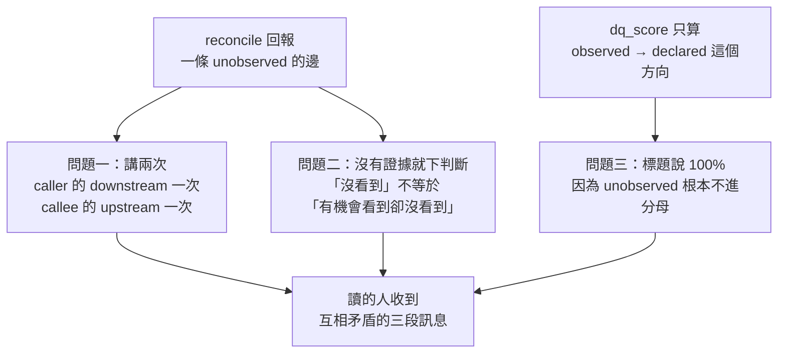
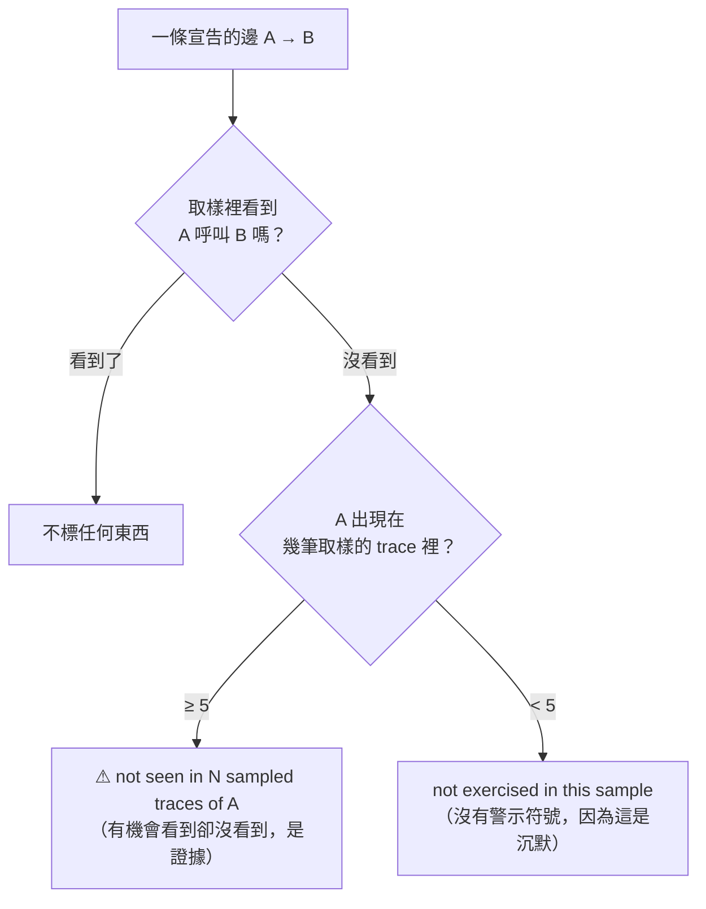

# Day16：圖準了，但太吵

> 一份報告裡最危險的不是錯的數字
> 是一個正確的數字
> 沒講清楚自己回答的是哪個問題

前面把拓撲對帳跑起來、把 schema 對齊接上之後，那個資料品質判定第一次拿到 `proven_good: True`。照理說接下來該往前走，但我把注入給 agent 的那段 context 印出來看的時候，看到這個：

```
Topology data-quality (last reconcile, 30 traces): declared/observed agreement 100%.

### api-gateway
- downstream (dependencies — could be blocking this): order-service,
  payment-service (⚠ declared, not seen in recent traces), user-service

### payment-service
- upstream (callers — degrade if this fails):
  api-gateway (⚠ declared, not seen in recent traces), order-service
```

**標題那行說一致性 100%，往下兩行就有兩個 ⚠。** 而那兩個 ⚠ 講的是同一條邊。

今天處理的就是這件事。程式碼在範例 repo [`OTel_AIOps_Agent`](https://github.com/tedmax100/OTel_AIOps_Agent) 的 [`ironman-2026/day16/`](https://github.com/tedmax100/OTel_AIOps_Agent/tree/main/ironman-2026/day16)，改的是 agent 服務自己的 `reconcile.py` 跟 `context.py`。

## 為什麼一份「正確」的報告會是壞的

先講清楚這不是 bug。那三行每一行單獨看都是對的：對帳確實觀察到的邊全部都有宣告（所以 100%）、`api-gateway → payment-service` 確實沒在取樣裡出現、而那條邊確實同時是 api-gateway 的下游跟 payment-service 的上游。

問題是它們擺在一起之後，讀的人會拿到三個互相打架的訊息。而這裡的「讀的人」是一個模型，它不會停下來問「這個 100% 跟這兩個驚嘆號是不是在講同一件事」，它只會把整段當成事實照單全收。

這是可觀測性裡那個老問題換了一個位置。告警疲勞不是因為告警錯了，是因為**大部分告警是對的但不重要，於是值班的人學會了全部略過**，然後真的那一次也跟著被略過。同一件事發生在注入給 agent 的 context 裡，代價一模一樣：一個大部分時候是雜訊的 ⚠，會讓那個符號整個貶值。

前面查過那條 `api-gateway → payment-service` 的來歷，它是活的，只是那批取樣沒抽到。所以現在這個 ⚠ 有很高的機率根本不是漂移，是取樣的產物。

## 三個問題，各自的成因

拆開來看是三件不同的事。



**問題一**是純粹的呈現。一條邊有兩個端點，而 `_annotate()` 對上游跟下游都套用了，於是同一個事實被講成兩次，讀起來像兩個獨立的問題。

**問題二**比較本質。原本的判斷條件只有一行：這條邊在不在 `unobserved_edges` 裡。但「我沒看到 A 呼叫 B」有兩種完全不同的來源：A 在取樣裡跑了三十次，每次都沒呼叫 B；或者 A 根本沒出現在取樣裡。前者是證據，後者是沉默。而報告把它們寫成同一句話。

**問題三**是前面就量出來的那件事：`dq_score` 算的是「觀察到的邊裡有幾成是宣告過的」，`unobserved` 那個方向不進分母。所以一份宣告了六條邊、只有一條在跑的圖，分數照樣是 100%。這個設計本身沒錯（未宣告的邊是比較危險的那一種），錯的是報告沒有講出這個分數不涵蓋什麼。

## 讓「沒看到」帶著證據

先補證據。`reconcile.py` 在掃 trace 的時候，順手記下每個服務出現在幾筆取樣的 trace 裡：

```python
def services_from_trace(raw: dict) -> set[str]:
    """Every service that appears anywhere in one trace. Used to tell 'this
    caller ran and never made the call' apart from 'this caller never ran'."""
```

這個東西是免費的，同一批 trace 已經抓回來了，只是原本只從裡面挑邊。跑起來長這樣：

```console
unobserved: [('api-gateway', 'payment-service')]
caller_samples: {'webapp': 30, 'api-gateway': 30, 'order-service': 25,
                 'user-service': 17, 'payment-service': 10}
```

api-gateway 出現在三十筆 trace 裡，一次都沒呼叫 payment-service。**這是一句有份量的話，而原本的報告只會說「沒看到」。**

於是 `context.py` 那個標記函式就有東西可以判斷了：

```python
seen = drift.evidence_for(edge[0])
if seen >= _MIN_CALLER_EVIDENCE:
    return f" (⚠ not seen in {seen} sampled traces of {edge[0]})"
return " (not exercised in this sample)"
```

呼叫方被跑過夠多次，才給 ⚠，而且把次數寫進去；不夠的時候退成一句沒有警示符號的描述。門檻現在是 5，這個數字沒有什麼理論根據，就是一個「至少要多看幾眼才算數」的下限。



> 這個門檻應該要跟著取樣總數走才對，抓 30 筆跟抓 300 筆時的「夠多次」不會是同一個數字。我先寫成常數，因為要把它做對得先有取樣涵蓋率，而那個東西前面就欠著了。

## 一條邊只講一次

第二個改動只有一行，把上游那側的標記拿掉：

```python
up = topo.upstream(svc)
if up:
    # Deliberately unannotated: the same edge is already flagged on the
    # caller's own downstream line, and saying it twice reads as two
    # independent problems.
    rendered = ", ".join(up)
```

選擇留在呼叫方那側，是因為**呼叫方才是那條邊的擁有者**。前面設計那份 `signal.yaml` 的時候就是這樣決定的，每個服務只宣告自己打出去的邊。既然宣告的責任在呼叫方，那「這條邊沒被走到」的通知也該出現在呼叫方的區塊裡，這樣看到的人跟能處理的人是同一個。

## 讓分數承認自己漏了什麼

第三個改動是在 DQ 那行後面補一句，只在「分數滿分但有邊沒被走到」的時候出現：

```
declared/observed agreement 100%. That score only grades edges seen in
traffic; 1 declared edge(s) were not exercised in this sample and are
marked below.
```

這句話做的事情是把標題跟底下的標記接起來，而不是讓它們互相打臉。讀到這裡的模型現在知道：100% 是一個單向的分數，另一個方向的東西寫在下面。

## 改完之後

同一座 stack、同一批流量、同一次對帳：

```
Topology data-quality (last reconcile, 30 traces): declared/observed agreement 100%.
That score only grades edges seen in traffic; 1 declared edge(s) were not
exercised in this sample and are marked below.

### api-gateway
- downstream (dependencies — could be blocking this): order-service,
  payment-service (⚠ not seen in 30 sampled traces of api-gateway), user-service

### payment-service
- upstream (callers — degrade if this fails): api-gateway, order-service
```

⚠ 從兩個變一個，而且那一個帶著它的證據。payment-service 那個區塊乾淨了，因為那條邊不歸它管。

差別不在字數，在於**現在每一個符號都還有意義**。前面那版讀完之後，一個合理的反應是「這裡有兩個警告但分數是滿分，大概都可以不用理」；這一版讀完之後，那個 ⚠ 是一句具體的話：api-gateway 跑了三十次，沒有一次走過這條路。

四條新測試釘住這幾個行為，其中兩條是專門盯著退化的：

```python
def test_context_withholds_warning_without_evidence(monkeypatch):
    """The caller barely ran, so its unused edges are silence, not drift."""

def test_context_does_not_repeat_the_edge_on_the_callee(monkeypatch):
    """The same missing edge must be stated once, on the caller's side."""
```

整包 325 條通過。

## 值班的時候差在哪

凌晨三點，agent 跟你說「order-service 在噴錯，而它下游的 payment-service 那條邊有警告」。

如果那個警告是取樣造成的，你會白跑一趟去查 payment，而真正的問題還在原地。更糟的是第二次、第三次也是這樣之後，你會開始跳過所有帶 ⚠ 的段落，然後某一次那個 ⚠ 是真的。**這就是為什麼「多報一點總比漏報好」在有人值班的系統裡是錯的**，多報的成本不是那一次的白工，是把整個警示機制的可信度花掉。

換到 agent 身上更直接。它不會累，但它會照著 context 裡的東西排優先順序。一段充滿低價值警告的 context，會讓它把推理預算花在追不存在的問題上，而它每題只有四次工具呼叫。

## 誰決定什麼東西該被標出來

從平台工程的角度，今天做的事其實是在替產品團隊過濾。

那段 context 是平台團隊產的，讀它的是 agent，而最後為結論負責的是被叫醒的那個人。中間沒有任何一個環節會有人說「這個警告不重要，別理它」，所以**「什麼東西值得被標出來」這個決定，只能在產生它的地方做**。這跟前面那道 CI gate 的判準是同一件事的反面：那次講的是被擋下來的人要能自己修好，這次講的是不該擋的東西就不要擋。

而這裡有一個平台團隊很容易做錯的選擇。把所有查到的東西都端出去，看起來比較「透明」，也比較安全，因為漏掉東西的責任比較大。但那等於把過濾的工作推給下游，而下游是一個沒有上下文的模型跟一個半夜被吵醒的人。**願意把不確定的訊號降級成一句不帶警示符號的描述，是平台團隊在替這兩者承擔一部分判斷責任。**

## 今天沒做的事

那個 `_MIN_CALLER_EVIDENCE = 5` 是拍腦袋的常數，沒有跟取樣總數連動。要做對得先有涵蓋率，那個東西前面就欠著。

沒有處理歷史。一條邊這次沒被走到跟連續三天沒被走到，現在還是同一句話，而後者才是真的該有人去看的。前面提過這件事，今天依然沒做，因為對帳結果只存在記憶體裡，重開就沒了。

沒有動 `undeclared_edges` 那一側的呈現。觀察到但沒宣告的邊現在還是每個沾到的服務各印一次，跟今天修掉的那個重複是同一個形狀，只是它比較少見所以還沒有咬到我。

也沒有量這個改動對 agent 實際輸出的影響。今天全部是看那段注入的文字本身，沒有跑一次完整的 RCA 去比對改前改後的結論差在哪。

## 小結

總結來說，今天沒有讓那張圖變得更準，準確度一個字都沒動，改的全部是怎麼把已經知道的事情講出來。

比較有感的是那個 `caller_samples`。它的資料早就在手上了，同一批 trace 掃過去的時候順手數一下就有，而它把「沒看到」從一句判斷變成一句有證據的話。**我原本以為要降噪就得少講一點，結果實際做出來是多講了一個數字，然後噪音就不見了。** 少的不是資訊，是那個沒有依據的警示符號。

還有一個地方值得記著：那個 100% 從頭到尾沒有錯，它只是回答了一個比讀者以為的更窄的問題。而在報告裡，一個沒有講清楚自己邊界的正確數字，跟一個錯的數字造成的後果差不多。

> 那個 100% 我盯了很久，一直想它到底哪裡不對。
> 它沒有不對，是我問的問題比它答的大 QQ
