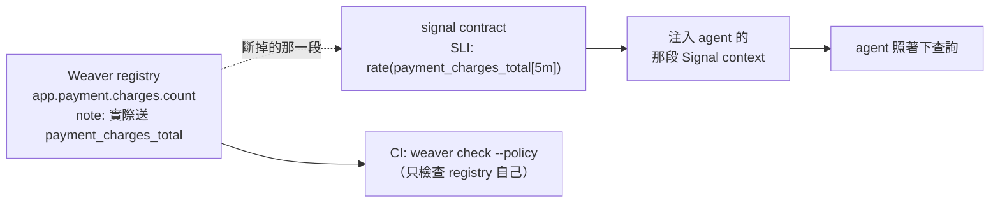
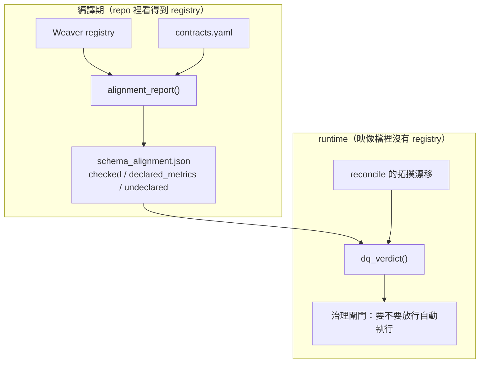

# Day17：兩條平行線接起來

> 一個回傳空集合的檢查
> 可能是在說「沒有問題」
> 也可能是在說「我根本沒讀到」
> 而這兩句話印出來一模一樣

前面讀那個 `signals` 模組的時候，挖出一件挺尷尬的事：`weaver.py` 這支負責把治理成果接進來的模組，**沒有任何東西呼叫它**。手動敲會綠燈，CI 一次都沒跑過。

今天把它接起來。這是這個系列第一次讓兩個階段的程式碼互相呼叫，而接的過程比我想的難，因為第一版接法會把一個「檔案不見了」變成六筆假的違規。

改的是 agent 服務自己的原始碼，重現步驟在範例 repo [`OTel_AIOps_Agent`](https://github.com/tedmax100/OTel_AIOps_Agent) 的 [`ironman-2026/day17/`](https://github.com/tedmax100/OTel_AIOps_Agent/tree/main/ironman-2026/day17)。

## 中間斷掉的是哪一段

先把要接的兩端講清楚。

registry 那端宣告的是「這個 metric 叫什麼」。每個 metric group 用 OTel 慣用的點分名字，然後在 `note` 裡記下程式碼實際送出去的 Prometheus 名字。

Signal Plane 那端是`信號契約`，每個服務宣告自己的 SLI（Service Level Indicator，服務水準指標）該用哪條 metric、正確的 PromQL 怎麼寫。這份契約會被原封不動注入到 agent 的推理裡，前面看過那段輸出。



問題在那條虛線。契約裡那個 `payment_charges_total` 是一段字串，沒有任何東西保證 registry 宣告過它。**registry 改個名字，契約不會有任何反應，而 agent 會拿著一條查不到東西的查詢去問 Prometheus，然後拿回一個成功的空結果。** 第一天那個坑，換一個源頭再發生一次。

比對用的函式其實早就寫好了，`contract.py` 裡那支 `validate_against_weaver`。缺的只是有人去呼叫它。

## 第一版接法，跟它炸掉的方式

最直覺的做法是讓 `dq_verdict()` 直接去讀 registry，比對完再給判定。我寫到一半才想起 `weaver.py` 的 docstring 上寫著一行字：

> DEV/CI-time guard, NOT a runtime dependency: the registry is not shipped in the agent image.

registry 是 repo 裡的東西，agent 的映像檔裡沒有它。所以在 runtime 讀，讀到的永遠是「檔案不存在」。而那個函式是 fail-open 的，讀不到就回一個空集合：

```python
except Exception as e:
    logger.warning("weaver registry not readable (%s): %s", p, e)
    return set()
```

空集合拿去比對會發生什麼事，跑一次就知道：

```console
$ uv run python -c "... validate_against_weaver(c, empty) ..."
   order-service: SLI references 'order_create_duration_seconds' not declared in the Weaver registry
   order-service: SLI references 'orders_total' not declared in the Weaver registry
   payment-service: SLI references 'payment_charge_duration_seconds' not declared in the Weaver registry
   payment-service: SLI references 'payment_charges_total' not declared in the Weaver registry
   user-service: SLI references 'user_auth_checks_total' not declared in the Weaver registry
   user-service: SLI references 'user_lookups_total' not declared in the Weaver registry
```

六筆違規，每一筆都是假的。真相是那個檔案不在，而每一條訊息都在指控某個服務的契約寫錯了。

**一個在自己那層很合理的 fail-open，被上面那層當成資料之後，就變成了 fail-closed。** 空集合對 `weaver_prom_metric_names()` 來說是「我沒有意見」，對 `validate_against_weaver()` 來說是「我宣告了零個 metric，所以你們全錯」。這兩個意思在型別上完全一樣，都是一個 `set()`。

這已經是這幾天第三次遇到同一件事了。對帳報告分不出「圖錯了」跟「沒流量」，服務清單分不出「沒這個服務」跟「Loki 看不到它」，現在是 registry 分不出「沒宣告」跟「我讀不到 registry」。三次的形狀一模一樣：**一個空集合，兩種意思，而型別系統幫不上任何忙。**

## 正確的接法：接產物，不接函式

既然 runtime 讀不到 registry，那就不要在 runtime 讀。這個模組裡本來就有一個現成的模式可以抄：`topology.yaml` 跟 `contracts.yaml` 都不是 agent 自己算出來的，是編譯期由各服務的宣告合成、然後 commit 進版控的產物。

schema 對齊也照這樣做。`weaver.py` 多一個函式，把比對結果寫成一份小小的產物：

```console
$ uv run python -m app.signals.weaver
weaver registry declares 6 Prom metrics; checked 5 contracts
✓ all contract SLIs reference metrics declared in the Weaver registry
  wrote schema_alignment.json
```

```json
{
  "checked": 5,
  "declared_metrics": 6,
  "undeclared": [],
  "note": "5 contracts checked against 6 registry metrics"
}
```

那個 `checked` 欄位就是用來擋前面那個坑的。registry 讀不到的時候，這份產物長這樣：

```json
{ "checked": 0, "declared_metrics": 0, "undeclared": [], "note": "weaver registry not readable; schema alignment unproven" }
```

`undeclared` 是空的，`checked` 是 0。**「我檢查了五份契約，沒有問題」跟「我一份都沒檢查」，現在是兩個不同的值，而不是同一個空清單。**



## 第一次拿到 proven_good

`dq_verdict()` 現在讀那份產物，跟原本的拓撲漂移一起判。跑起來是這樣：

```console
1) 有 artifact、沒跑過 reconcile:
   {'proven_good': False, 'score': None, 'note': 'topology not reconciled against live traces; DQ unproven'}

2) reconcile 跑過之後:
   {'proven_good': True, 'score': 1.0,
    'note': 'topology aligned to live traffic (agreement 1.0, 50 traces, reconciled 0s ago);
             SLIs match the schema registry (6 metrics)'}
```

第二行那個 `proven_good: True` 是這個系列到目前為止第一次出現。前面每一次跑 `dq_verdict()` 拿到的都是 `False`，而且理由都是同一個：沒有人驗過。現在兩個維度都有證據了，一個是 50 筆 trace 對出來的拓撲一致性，一個是 5 份契約對 6 個 registry metric 的名字對齊。

DQ 是 Data Quality。這個判定會被治理層拿去決定要不要放行自動執行，所以它從 `False` 變成 `True` 這件事，實際的意思是**這套系統第一次有資格談自動化**。在那之前它不是不安全，是連「安不安全」這個問題都答不出來。

順序也有講究，schema 排在拓撲前面：

```python
def test_schema_is_checked_before_topology(monkeypatch):
    """A schema violation outranks a missing reconcile: fix the contract first."""
```

理由是這兩種問題的修法不同。拓撲沒對帳是「去跑一下」，契約引用了不存在的 metric 是「這份契約現在就是錯的，跑再多次也不會變對」。先報後者，可以省掉一輪「我跑了對帳但它還是紅的」。

## 這次讓 CI 真的跑

前面查出來的問題是 CI 只跑 `weaver.sh check --policy`，那只檢查 registry 自己內部一致。現在多一步：

```yaml
- name: Check signal contracts against the registry
  working-directory: aiops-agent/service
  run: |
    uv run python -m app.signals.weaver
    git diff --exit-code app/signals/schema_alignment.json
```

重生一次產物，然後比對它跟 commit 進去的那份有沒有差。有差就是紅的。

這一招能成立，是因為那份產物是**決定性**的。我原本在裡面放了一個 `computed_ts`，寫完才發現那樣 `git diff` 每次都會有差異，這道檢查會永遠是紅的，然後三天之內就會有人把它拿掉。所以時間戳拿掉了，什麼時候變的 git 本來就知道。

> 這件事我在前面講 codegen 的時候得出過一模一樣的結論：生成物要 commit 進版控，因為 diff 才是那個會說話的東西。差別是那次的產物給人讀，這次的產物給 `dq_verdict()` 讀。同一個模式用第二次的時候，我才注意到它有一個前提，產物必須是決定性的，不然 diff 這件事整個不成立。

新加的四條測試蓋住 schema 那個維度，其中一條專門盯著那個空集合的坑：

```python
def test_unreadable_registry_is_unproven_not_degraded(monkeypatch):
    """An unreadable registry yields an empty declared-metric set, which would
    make every SLI look undeclared. It must land as 'no evidence' instead."""
```

整包跑起來 322 條通過。

## 值班的時候差在哪

想像 registry 那邊有人把 `payment_charges_total` 改名了，改得很正當，走了完整的 deprecation 流程。但 `contracts.yaml` 裡那條 SLI 沒跟著改。

在今天以前，這件事會這樣展開：CI 全綠，因為 registry 自己內部是一致的；部署上去，agent 照著契約下查詢，Prometheus 回一個成功的空結果；agent 看到空的，說「payment-service 的錯誤率是 0，這個服務很健康」。而它同時還是 `proven_good` 的，因為那個判定只看拓撲。**一個資料品質的判定，對「agent 手上那條查詢已經指向不存在的東西」完全沒有意見。**

今天之後，這件事會在 PR 階段就變紅，訊息直接指名是哪個服務的哪條 SLI 引用了什麼。就算漏掉了，`dq_verdict()` 也會變成 degraded 並帶著那條訊息，治理層就不會放行自動執行。

這條線是這個系列從第一天鋪到現在的那條：**治理做好 → 資料一致 → agent 判斷有依據。** 而今天補的是中間那個箭頭，在那之前它只是一句話。

## 誰負責、誰付成本

從平台工程的角度看，今天這一步的成本分配值得講。

registry 是平台團隊維護的，契約是產品團隊寫的，而這道新的檢查擋的是**兩者之間的不一致**。所以它不該只在某一邊變紅。現在的做法是誰改動誰負責：產品團隊改契約引用了不存在的 metric，PR 就紅；平台團隊改 registry 改到某個服務的 SLI 失效，那個 PR 也會紅，因為產物重生之後 diff 就出來了。

**這裡最重要的設計是那條訊息會指名服務跟 metric 名字。** 一道 gate 如果只說「schema alignment failed」，每一次紅燈都會變成一張給平台團隊的工單。現在它說的是 `payment-service: SLI references 'x_total' not declared in the Weaver registry`，收到的人不用問任何人就知道要去改哪一行。這條判準前面講 CI gate 的時候立過，今天是它的第三次應用。

至於成本，產品團隊這邊實際多了什麼？沒有。契約本來就要寫，只是現在寫錯會被擋下來。平台團隊多了一份要維護的產物跟一道要解釋的檢查，這是真實的成本，而換到的是那條虛線不再是虛線。

## 今天沒做的事

沒有處理 `note` 欄位以外的東西。這道檢查現在只比對 metric 的**名字**，registry 裡那些單位、值域、`requirement_level` 全部沒有被拿來對照契約。一條 SLI 用對了名字但用錯了聚合方式，今天完全驗得過。

沒有反過來檢查。現在只問「契約引用的 metric 有沒有被宣告」，沒有問「registry 宣告的 metric 有沒有人在用」。後者是找出死掉的宣告用的，跟前面那個拓撲對帳的另一個方向是同一種東西。

`weaver.py` 從 registry 撈名字的方式還是靠正規表示式去讀 `note` 裡那句 `Current code metric:`。這是一個慣例，不是一個欄位，有人 `note` 寫得不一樣就撈不到，而且撈不到會安靜地少一個名字。這件事該用 `annotations` 做，前面講機器可讀的意圖時用過那個欄位。

也沒有把產物接進那支回歸腳本。`schema_alignment.json` 被人手動改成一份假的綠燈，現在沒有任何東西會發現。

## 小結

總結來說，今天做的事寫成 diff 大概一百行，但它是這個系列前後兩段第一次真的碰到彼此。在那之前，第一階段那十三天的成果跟第二階段的管線，中間隔著一行沒有人敲的指令。

比較意外的是那個空集合。我原本以為接起來就是加一個 import 的事，結果卡最久的是「registry 讀不到」跟「registry 說你錯了」怎麼分開。這幾天連續三次遇到同一個形狀之後，我大概可以把它寫成一條自己的規則了：**任何一個回傳集合的檢查函式，都要能回答「這個空集合是結論，還是我根本沒查成功」。**

至於 `proven_good` 第一次變成 `True`，說實話沒有想像中興奮，因為它只證明了兩件事被驗過，而那張九宮格上還有格子是空的。

> `proven_good` 第一次變成 True 的時候我截了圖。
> 然後想起那張九宮格上還有一半是空的，就沒發出去 :)
