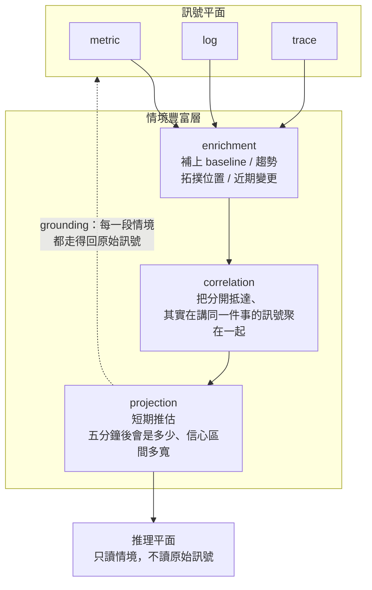
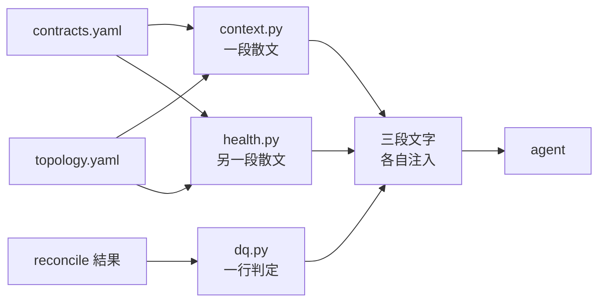

# Day17：訊號跟情境的差別，是一個 JSON 欄位的差別

> 一個裸值加上一個時間戳
> 撐得起「發生了什麼」
> 撐不起「該不該做什麼」

昨天讓依賴健康分析順著拓撲走，也發現五個節點裡只有兩個判得動。那是「圖」的覆蓋率問題。今天往下挖一層，問一個更基本的：**就算每個節點都判得動，那些數字本身憑什麼被信任？**

這是概念日，沒有新的程式碼。但有一段是真的踩到的。

## 一段沒有人打的流量

昨天的事故收拾完之後，flag 關掉、payment 重啟、所有壓力程序停掉，我順手查了一下 payment 的吞吐量，想確認環境真的乾淨了：

```console
$ curl -sG localhost:9090/api/v1/query --data-urlencode \
    'query=sum by (status) (rate(payment_charges_total[2m]))'
{'status': 'error'}       0.0
{'status': 'authorized'}  40.86
```

**每秒四十筆授權成功的付款。** 而這個時候本機沒有任何壓力程序在跑，pod 的日誌裡連一筆 `charge requested` 都沒有。

去看原始的 counter：

```console
$ curl -sG localhost:9090/api/v1/query --data-urlencode 'query=payment_charges_total'
series count: 2          # 只有 status / reason 的組合，跟 replica 數無關
labels: [__name__, deployment_environment, git_repo, git_version, job,
         reason, service_name, service_namespace, service_version, status,
         telemetry_auto_version, telemetry_sdk_language, telemetry_sdk_name,
         telemetry_sdk_version]

$ kubectl -n demo get deploy payment-service -o jsonpath='{.spec.replicas}'
2
```

兩個 replica，而那份 label 裡沒有任何東西可以分辨它們：沒有 pod、沒有 instance、沒有 `service.instance.id`。**兩個各自獨立累加的計數器，寫進同一條時間序列。**

Prometheus 看到的就是一條上上下下跳的線，因為它一下拿到 A pod 的值、一下拿到 B pod 的值。`rate()` 的職責是處理 counter reset，於是每一次交錯它都當成「重啟了」，然後補上它以為漏掉的量。四十筆從來沒發生過的付款就是這樣長出來的。

這句話不用相信我，把那條 counter 的原始樣本點拉出來看就好，一條「只增不減」的 counter 會這樣：

```console
$ curl -sG localhost:9090/api/v1/query_range \
    --data-urlencode 'query=payment_charges_total{status="authorized"}' ...
104  104  119  100  212  304  42  704  1400  2079  2741
               ↑ 掉了        ↑ 掉了
```

一條 counter 不該往下走。每一個往下走的點，`rate()` 都會讀成「這中間重啟過，所以前面累積的量要補回來」，然後在完全沒有流量的情況下憑空生出每秒幾十筆。

這件事重要的不是它是一個 bug。它當然是，而且是遙測管線設定的問題，不是應用程式的問題。重要的是：**那份 JSON 裡沒有任何一個欄位有機會告訴你這件事。**

## 訊號跟情境

[《代理式可靠性工程》（Agentic Reliability Engineering，簡稱 ARE）](https://learning.oreilly.com/library/view/agentic-reliability-engineering/0642572294809/) 這本書的第十章把這個落差講得很清楚。它區分兩個詞：

> *Signals* are facts about the system. *Context* is facts about the system *and the situation*.

`訊號`是關於系統的事實：這個指標現在是這個值、這行 log 在這個時間點被寫出來、這條 trace 的延遲是這麼多。`情境`是關於系統**跟當下處境**的事實：這個指標是這個值，**而且它已經連續上升三十五分鐘，對照的那條基準線本身昨天才移動過**；這行 log 是這一小時裡第七行同類的，**而它來自一個依賴剛剛被 patch 過的服務**。

差別在於情境帶著時間、拓撲、歷史的結構。**光有訊號你只能反應，有情境才能判斷。**

前面那個四十筆假付款正好卡在這條線上。`0.0` 跟 `40.86` 這兩個數字本身是訊號，它們是 Prometheus 誠實計算出來的結果。但要判斷「這個數字能不能用」，需要的東西一個都不在那份回應裡：這條 series 背後有幾個發射源、上一次它的來源集合變過是什麼時候、這個服務二十分鐘前才重啟過。

## 情境豐富層

書裡給這個中間層一個名字：CEL（Context Enrichment Layer，情境豐富層）。它坐在訊號平面跟推理平面中間，職責是把訊號變成情境。



三個職責各自回答一個不同的問題。

`enrichment`（豐富化）回答「這個值算不算異常」。一個訊號進來，補上它的基準線（這個服務在這個時段的正常長什麼樣）、它的趨勢（正在往哪個方向跑、多快）、它的拓撲位置（誰依賴它）、以及它的變更情境（這附近最近部署過什麼）。昨天那個 `impact` 判斷，也就是「呼叫方的歸因失敗量跟三十分鐘前比有沒有漲」，就是最小版本的 enrichment，它做的正是「補上基準線」這件事。

`correlation`（關聯）回答「這些東西是不是同一件事」。分開抵達的訊號被聚成一組，推理平面讀到的是一幅完整的畫面而不是一堆散落的事件。昨天那個平鋪掃描給出的二十二個候選，裡面有十一條在講同一批 402 回應，那就是一份**沒有做 correlation** 的輸出長什麼樣子。

`projection`（推估）回答「接下來會怎樣」。在底下的訊號支撐得起的時候，給出短期的推估值跟信心區間。這是三個裡面最有野心的一個，也是這個系列不會做到的一個。

## 溯源

除了三職責之外，書把另一個性質放在同一層，而且講得比三職責還重：

> Every piece of context the CEL emits is traceable back to the underlying signals that produced it.

`grounding`（溯源）的意思是，CEL 吐出來的每一段情境，都走得回產生它的原始訊號。推理平面提出一個假設的時候，貢獻的情境元素會被附上去，而從那些元素可以回頭找到原始訊號。

書裡對這件事的立場很硬：一個沒有溯源的介入，是事後沒有人有辦法辯護的介入。

而這正是前面那個四十筆假付款真正的教訓。假設有一個 agent 讀到那個數字，說「payment 吞吐量正常」，這句話在當下是無從反駁的，因為**沒有任何路徑可以從那句結論走回去問「你這個數字是從幾個計數器加起來的」**。溯源不是為了追責，是為了讓一個結論可以被檢查。

## 兩種 JSON 的形狀

把上面的東西落到具體的資料形狀上。這是真的從那座 stack 抓下來的聚合遙測：

```json
{
  "status": "success",
  "data": {
    "resultType": "matrix",
    "result": [
      {
        "metric": { "status": "authorized" },
        "values": [
          [1785943222, "1.9540119740520538"],
          [1785943822, "1.8540353391634758"],
          [1785944422, "12.476348438426095"],
          [1785945022, "31.05294953900738"]
        ]
      }
    ]
  }
}
```

這份 JSON 是完全誠實的。它沒有說謊，它只是**只回答了一個問題**：你問的那句 PromQL 在這些時間點算出來是多少。

它沒有回答、而且結構上也沒有地方可以回答的東西：這個值正不正常（沒有基準線）、這個服務該多少才算合格（沒有目標值）、它從哪裡來（沒有發射源的身分，所以那兩個 replica 的問題無處可藏）、後面那兩個十倍的跳動是事故還是假象（沒有可信度）、以及誰會被它影響（沒有拓撲）。

`決策級遙測`（decision-grade telemetry，前面借 ARE 這本書的說法介紹過：為了讓 agent 據以行動而打造的遙測資料，不是為了讓人類盯著看而打造的）要換的就是這個形狀。同一個事實，寫成一個帶著自己上下文的物件：

```json
{
  "signal": "payment-service.error_rate",
  "value": 0.557,
  "unit": "ratio",
  "observed_at": "2026-08-05T15:15:00Z",

  "objective": { "target": "declined_rate < 1%", "breaching": true },
  "baseline": { "window": "30m", "value": 0.002 },
  "trajectory": { "direction": "rising", "since": "2026-08-05T14:52:00Z" },

  "topology": {
    "tier": 1,
    "journey": "checkout",
    "upstream": ["api-gateway", "order-service"],
    "downstream": []
  },
  "impact": [
    { "service": "order-service", "attributed_failures_delta": 0.004,
      "verdict": "flat", "note": "topologically adjacent, not materially impacted" }
  ],

  "trust": {
    "emitters": 2,
    "series_distinguishes_emitters": false,
    "freshness_guarantee_seconds": 60,
    "caveats": ["counter conflated across 2 replicas — rate() unreliable across restarts"]
  },

  "grounding": {
    "promql": "(sum(rate(payment_charges_total{status=\"declined\"}[5m])) or vector(0)) / clamp_min(sum(rate(payment_charges_total[5m])) or vector(0), 1)",
    "logql": "sum by (git_version, reason) (count_over_time({service_name=\"payment-service\"} | event=~\"payment.declined|payment.gateway_error\" [5m]))",
    "exemplar_trace_id": "47c189ff6a548f1b9910ef14f685fefc"
  }
}
```

**先把話講清楚：這個物件現在沒有任何一支程式會吐出來。** 它是這個系列想收斂到的形狀，不是已經有的東西。裡面的值全部是真的（`0.557` 是昨天量到的、那個 `trace_id` 是 Loki 裡真的一行 `payment.declined` 帶著的），但把它們組成一個物件這件事，目前是手工的。

值得注意的是這份 JSON 裡面有多少東西**是前面幾天已經做出來的**。`objective` 來自契約、`topology` 那一段來自拓撲、`impact` 是昨天那個 `attribution` 判斷、`grounding` 裡的那兩句查詢就是契約裡宣告的權威查詢。書裡也是這麼講的：

> The CEL is not a new system the team has to build. It is a layer assembled from primitives the earlier chapters have already installed.

真正還缺的其實只有兩塊：`trust` 那一段（今天那個假流量就是因為沒有它才會沒人發現），跟把這些東西收斂成**一個物件**而不是散在各處。

## 現在長什麼樣子

那「散在各處」目前具體是什麼樣子？這是同一個服務、現在真的跑出來的東西：

```
## Signal context (topology v1.0.0)
### payment-service
- criticality: tier-1 (revenue/edge-critical); journey: checkout (4/4)
- upstream (callers — degrade if this fails): api-gateway, order-service
- downstream (dependencies): none (leaf — not blocked by anything downstream)
- SLI (authoritative — cite these exact queries, don't re-derive):
    error: (sum(rate(payment_charges_total{status="declined"}[5m])) or vector(0)) / ...
           [ratio]  target: declined_rate < 1%
- signal freshness guarantee: ≤60s (older samples are stale)
- caveat: No up{} for application services (remote_write, not scraped); judge
  liveness via rate(payment_charges_total[5m]) > 0.
```

資訊密度其實不低，tier、journey、上下游、權威查詢、目標值、新鮮度，甚至還有兩條 caveat。**但它是一段散文。**

它是寫給一個會讀自然語言的消費者看的，這在對象是 LLM 的時候完全說得通，也是目前這個 repo 刻意的選擇。代價是它沒有欄位、沒有型別、沒有辦法被程式檢查有沒有缺東西，而且它跟依賴健康那一段、跟 DQ（Data Quality，資料品質）那一行，是三段各自獨立生出來的文字。



同一份事實在三個地方各講一次，就是昨天跟前天那兩個問題的來源：重複的 ⚠、以及互相打臉的 100%。**那不是三個各自的 bug，是這個形狀必然會長出來的東西。**

## 誰該負責產生情境

從平台工程的角度，CEL 這個概念真正的主張其實是一句組織上的話：**豐富化不該發生在消費端。**

如果不做這一層，事情不會消失，只是移位，每一個消費者各自去補。值班的人憑經驗知道「payment 剛重啟過，這個數字先別信」；某個 dashboard 的作者手動加了一條基準線；而 agent 什麼都不知道，於是它拿到什麼就信什麼。**同一份判斷被重複做了三次，品質參差，而且沒有一次被記錄下來。**

這跟前面講過的那條判準是同一件事的另一面：一個機制的成本會不會隨消費者數量線性成長。把基準線、目標值、可信度做進資料本身，成本付一次；讓每個消費者自己補，成本乘以消費者數量，而且新來的那個消費者通常就是 agent，也就是最沒有能力補的那一個。

至於誰來付這一次的成本，前面幾天的分工已經給了答案。宣告歸產品團隊：自己的 SLI（Service Level Indicator，服務水準指標）、自己的目標值、自己打出去的邊，只有他們知道。豐富化則必然歸平台團隊，因為基準線、拓撲位置、跨服務的關聯，都要站在看得到全部服務的位置才做得出來。

## 小結

總結來說，今天那個四十筆假付款不是一個很嚴重的 bug，它甚至沒有影響任何使用者。但它示範了一件事：**一份聚合遙測 JSON，在它自己的格式裡沒有任何位置可以承認自己不可靠。**

訊號跟情境的差別，攤開來就是資料形狀的差別。一個裸值加時間戳，跟一個帶著基準線、目標值、拓撲位置、可信度、以及回頭走得回原始查詢的物件。前者只能支撐「發生了什麼」，後者才撐得起「該不該做什麼」。

而 CEL 三職責裡，這個系列做到哪一步、哪一項是空的，明天逐項對照，不打模糊仗。

> 那四十筆假付款是我自己壓測留下來的。
> 環境我以為清乾淨了，圖表比我記得清楚 ^^
