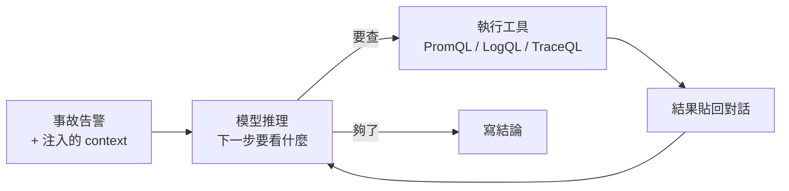
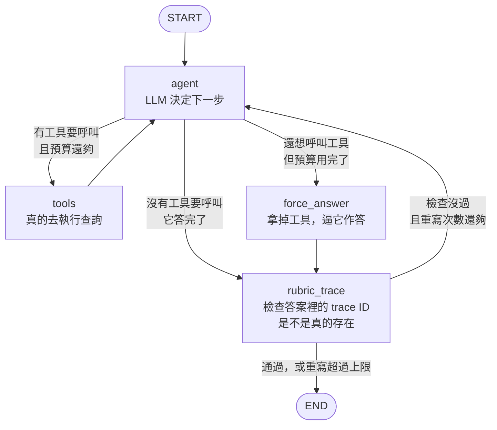

# Day19：從一問一答，到一隻會自己查東西的 agent

> 選一個框架而不是自己寫迴圈
> 換到的往往不是功能
> 是有一天要跟別人解釋的時候
> 講得出來

前面七天都在處理同一件事：讓資料本身帶著足夠的上下文。昨天把 CEL（Context Enrichment Layer，情境豐富層）那四項職責逐項打勾，結論是只做到一項半。從今天開始換一邊看，讀這些資料的那個東西到底怎麼運作。

這是概念日。今天講的東西跟 OTel（OpenTelemetry）沒有關係，講的是 agent 這個詞在這個 repo 裡具體指什麼。因為接下來幾天要拆的 `agent.py`，如果不先講清楚它的骨架，會變成逐行讀一份看不懂的程式碼。

驗證環境：langgraph 1.2.2、langchain-core 1.4.0。

## 一個 LLM 能做的事，跟一個 agent 能做的事

LLM（Large Language Model，大型語言模型）本身的介面很單純：你給它一段文字，它回你一段文字。就這樣。

拿它來做根因分析，你會先撞到一個很硬的牆：**它沒有辦法去查東西。** 你問「payment-service 現在的拒絕率是多少」，它只能根據訓練資料猜，而訓練資料裡沒有你的 Prometheus。它會給你一個看起來很有道理的答案，然後那個答案是編的。

第一個直覺的修法是把資料塞給它。把最近一小時的指標、log、trace 全部倒進 prompt 裡，讓它從裡面找。這個做法在小規模時可以動，但很快就會壞掉，因為你不知道要塞什麼。一次事故可能需要看 payment 的拒絕率，也可能需要看 order 的取消原因，也可能需要看某個 deployment 的重啟次數。全部塞進去就是前面講過的 signal flood，而且 context window 也放不下。

真正的解法是反過來：**不要事先決定要看什麼，讓它自己決定，然後給它去看的能力。**

## 這個迴圈叫 ReAct

具體的做法是把「回一段文字」變成「回一個要做的動作」。

你事先告訴模型有哪些工具可以用，每個工具叫什麼、吃什麼參數、回傳什麼。模型不直接回答問題，而是回一個結構化的東西：我要呼叫 `query_prometheus`，參數是這句 PromQL。你的程式碼真的去執行那次查詢，把結果貼回對話裡，再問一次模型。模型看到結果之後，可能決定再查一次別的，也可能覺得夠了，開始寫結論。

這個模式叫 ReAct，reason 加 act 的合寫：推理、行動、觀察結果，然後再推理。



`tool calling` 是這個迴圈的骨架。它不是模型「會用工具」這種魔法，它只是模型被訓練成能夠輸出一種符合你給的 schema 的結構化請求，而真正去執行的是你的程式碼。這個分工很重要：**模型從頭到尾沒有碰到你的 Prometheus，它只是說出它想查什麼。**

前面幾天做的所有事情，在這個迴圈裡的位置就很清楚了。注入的那些 context 是在 `R` 那個框第一次執行之前就塞進去的，目的是讓模型的第一次推理不要從零開始猜。契約裡宣告的權威查詢就是為了讓它輸出的那句 PromQL 是對的。

## 為什麼不是一個 while 迴圈

看到上面那張圖，很自然的反應是這件事寫成十行程式碼就好：

```python
while True:
    resp = llm.invoke(messages)
    if not resp.tool_calls:
        return resp.content
    for tc in resp.tool_calls:
        messages.append(run_tool(tc))
```

這確實會動，而且很多教學就是這樣寫的。它壞掉的地方不在正常路徑，在所有其他路徑。

**第一個問題是它停不下來。** 上面那個 `while True` 唯一的出口是模型自己決定不再呼叫工具。如果模型不肯停呢？這不是假設，是這個 repo 真的踩過的。`tools_node` 裡有一段註解記著：

```python
# Identical-retry guard: a small model will re-send the exact same broken /
# empty query until the budget runs out (we saw 4x). Short-circuit any call
# whose (name, args) already ran earlier this turn
```

同一句查不到東西的查詢，模型會原封不動再送一次，連送四次。它沒有壞掉，它只是不知道換一個問法。**一個沒有預算上限的迴圈，遇到這種行為就是無限跑下去，而且每一圈都在花錢。**

**第二個問題是狀態。** 那個 `while` 迴圈裡只有 `messages` 一個東西在累積。但實際上需要跨圈傳遞的不只對話：用掉幾次工具呼叫了、這一輪的上限是多少、上一次檢查發現的問題要不要餵回去讓它重寫。這些東西塞進 `messages` 會污染對話，放在迴圈外的區域變數則會讓「這個流程現在的狀態是什麼」散在各處。

**第三個問題是分支。** 真正要做的判斷不只「有沒有工具要呼叫」。預算用完了要不要強制它作答？作答之後要不要檢查它有沒有唬爛？檢查沒過要不要讓它重寫，重寫幾次算數？每多一個判斷，那個 `while` 裡就多一層 `if`，而它們之間的關係只存在於縮排裡。

**第四個問題最晚才發現：那個 `while` 的出口，是模型自己畫的。** 停下來的條件是「它不再呼叫工具」，也就是它覺得自己查完了。同一件事的另一個版本後面還會再遇到一次（換成信心分數當停止條件，那個分數一樣是它自己給的）。一個沒有人在旁邊看的流程，停止條件如果由被評的那一方決定，它就不是一道門。

把這四件事排成一張表，比較看得出「加一層」各自買到了什麼：

| | 誰決定花多少 | 狀態放哪 | 分支怎麼表達 | 誰決定停 | 工具結果算不算數 |
| --- | --- | --- | --- | --- | --- |
| `while True` | 沒有人 | `messages` 裡混著 | 縮排裡的 `if` | 模型 | 都算 |
| LangGraph 的圖 | `budget`，圖強制執行 | `RcaState`，有型別有 reducer | 可以單獨測的路由函式 | 模型 | 都算 |
| 再加上證據層 | 同上 | 同上，多一個每輪重置的 `facts` | 同上 | 確定性規則 | 分六種，只有量到東西的那種算 |

這張表的最後兩欄不是今天做的，它們是後面幾天才長出來的東西。先擺在這裡是因為**前三欄跟後兩欄解的其實是同一個問題**：一個沒有人看著的流程，每一個「要不要繼續」的決定都得有人負責，而那個人不能是模型自己。今天先解掉花費跟路徑，剩下兩欄留給後面。

## LangGraph 的模型

LangGraph 做的事情就是把上面那三件事變成一個明確的結構。核心只有四個概念。

`StateGraph` 定義**狀態的型別**。整個流程共用一份狀態，你先宣告它有哪些欄位。這個 repo 的長這樣：

```python
class RcaState(TypedDict):
    messages: Annotated[list, add_messages]
    tool_calls_used: int          # 這一輪已經用掉幾次工具呼叫
    budget: int                   # 這一輪的上限
    rubric_feedback: str          # 檢查沒過時要餵回去的修正提示
    rubric_revision_count: int    # 這一輪已經重寫幾次
```

`messages` 那個 `Annotated[list, add_messages]` 是 LangGraph 的 reducer 語法，意思是「這個欄位每次更新是**追加**而不是覆蓋」。其他欄位沒有標記，預設就是覆蓋。這個小地方解掉了前面那個「狀態散在各處」的問題：跨圈要傳的東西全部有名字、有型別、有明確的合併規則。

順帶一提，這兩種合併規則剛好對應到兩種生命週期：`messages` 會跨輪累積，同一條對話問第二次時前面的東西都還在；`tool_calls_used` 每輪的輸入都被覆蓋回 0，所以預算是「每一輪」的上限，不是「這條對話一輩子」的上限。

`node` 是一個步驟。它是一個函式，吃當前狀態，回傳要更新的欄位。它可以是一次 LLM 呼叫，也可以是純粹的程式邏輯，兩者在圖裡沒有差別。

`add_edge` 跟 `add_conditional_edges` 決定下一步去哪。前者是固定的（做完 A 一定去 B），後者吃一個路由函式，讓它看著當前狀態決定去哪一個。**分支的條件因此變成一個可以單獨測試的函式，而不是縮排裡的一層 `if`。**

`checkpointer` 讓狀態可以被存下來。每走一步就存一次，於是流程可以中斷、可以從中間接著跑、也可以事後回放。

這個 repo 用的是 `MemorySaver()`，存在記憶體裡。同一條對話的多輪之間狀態會留著，但服務重啟就沒了。要真的做到「昨天那次調查今天接著查」得換成有持久化的 checkpointer，這件事現在沒做。

## 這個 repo 的圖

`agent.py` 裡建圖的那段程式碼是這樣，四個 node：

```python
graph = StateGraph(RcaState)
graph.add_node("agent", agent_node)
graph.add_node("tools", tools_node)
graph.add_node("force_answer", force_answer_node)
graph.add_node("rubric_trace", rubric_trace_node)
graph.add_edge(START, "agent")
graph.add_conditional_edges(
    "agent",
    route_after_agent,
    {"tools": "tools", "force_answer": "force_answer", "rubric_trace": "rubric_trace"},
)
graph.add_edge("tools", "agent")
graph.add_edge("force_answer", "rubric_trace")
graph.add_conditional_edges("rubric_trace", route_after_rubric, {"agent": "agent", END: END})
return graph.compile(checkpointer=MemorySaver())
```

畫出來是這樣：



（這張圖不是我照著程式碼畫的，是把編譯完的 graph 直接吐出來的：`graph.get_graph().draw_mermaid()`，四個 node 跟七條邊都對得起來，只是我把 LangGraph 產的標籤換成中文說明。）

`agent` 那個框往外分三條，判斷的順序是先看「這一次模型有沒有要呼叫工具」，沒有就直接去 `rubric_trace`；有的話才去比預算。所以 `force_answer` 只會發生在「它還想查，但額度沒了」的情況，而不是預算一到就被打斷。

`agent` 跟 `tools` 兩個 node 加上它們中間那條來回，就是前面那個 ReAct 迴圈。另外兩個 node 是為了前面講的那些「其他路徑」而存在的。

`force_answer` 處理預算用完的情況。它做的事情很直接：同一個模型，但**不綁任何工具**，於是它想呼叫也呼叫不了，只能作答。這比在 `while` 裡 `break` 掉好，因為 `break` 會讓你拿到一個沒有結論的空回應。

`rubric_trace` 是答完之後的檢查。它去驗證答案裡引用的 trace ID 是不是真的存在，沒過就把修正提示寫進 `rubric_feedback`，路由回 `agent` 讓它重寫。除了 ReAct 那條來回之外，這是圖裡唯一一條往回走的邊，而且它有次數上限（`_max_rubric_revisions = 1`）：第一次抓到就放它回去重寫，重寫完的答案如果又被抓到一次，就不再給機會，直接結束。也就是這條回頭路一輪最多走一次。

而建圖那段函式的說明寫得很白：

> Explicit StateGraph replacing `create_react_agent`. Same agent↔tools ReAct loop, but with a **hard** tool-call budget: once `tool_calls_used` hits `budget` the graph routes to `force_answer` (LLM with no tools bound) so a headless run can't loop forever.

LangGraph 本身提供了一個現成的 `create_react_agent`，一行就能生出 agent 跟 tools 那個迴圈。這個 repo 沒有用它，換成手寫的圖，理由就是那句 `so a headless run can't loop forever`。**一個沒有人在旁邊看著的流程，需要一個它自己關不掉的上限。**

## 值班的時候差在哪

這些結構聽起來很像工程潔癖，但它們解的是很具體的問題。

半夜三點告警觸發，這隻 agent 被自動叫起來跑。沒有人在看它。如果它卡在一個死迴圈裡，你早上會看到的是一張帳單跟一份沒有結論的報告。如果它把一個不存在的 trace ID 寫進結論，值班的人會拿著那個 ID 去查，查不到，然後開始懷疑整份報告。

`force_answer` 保證前者不會發生，`rubric_trace` 保證後者會被抓到一次。這兩個 node 都不是為了讓 agent 更聰明，是為了讓它**在表現不好的時候，壞得比較安全**。

## 小結

總結來說，agent 這個詞被用得很鬆，什麼東西都可以叫 agent。放在這個 repo 裡它的意思很具體：一個會反覆「推理、呼叫工具、看結果」的迴圈，加上一組讓它在異常路徑上不會失控的護欄。

而選 LangGraph 而不是自己寫迴圈，換到的東西其實是可讀性。那張圖畫出來之後，「什麼情況會走哪條路」是看得見的，不用去讀縮排。這件事在需要跟別人解釋「為什麼 agent 那次會那樣做」的時候特別有用。

明天把這張圖跟實際的決策鏈對起來，看看它從哪一步開始讀前面那六天做出來的 context。

> 「這不就是一個 while 迴圈嗎」——這句話我自己講過。
> 講完之後我回去讀了自己那份縮排七層的 while 迴圈 XD
