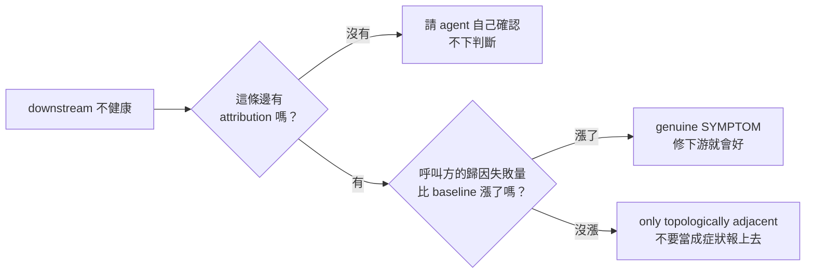

# Day19：順著圖走，然後發現圖上有一半的節點不能判生死

昨天把注入的 context 降噪，⚠ 從兩個變一個而且帶著證據。那件事處理的是「已經知道的東西怎麼講」。今天換一個問題：**當一個服務真的出事了，要從哪裡開始找**。

這是 `health.py` 的職責，Signal Plane 這一段最後一塊、也是唯一一塊會真的去打 API 的。前面幾天做的東西，拓撲、契約、對帳，到這裡才第一次被花掉。

程式碼在範例 repo [`OTel_AIOps_Agent`](https://github.com/tedmax100/OTel_AIOps_Agent) 的 [`ironman-2026/day19/`](https://github.com/tedmax100/OTel_AIOps_Agent/tree/main/ironman-2026/day19)。

## 平鋪掃全部指標，為什麼行不通

先講不用圖會怎樣。

最直覺的異常偵測是這樣：把所有指標拉出來，每一條跟一段時間之前比，變化超過某個幅度就標成異常候選。這個做法的好處是不用維護任何東西：不用宣告拓撲、不用寫契約，新服務上線自動就被涵蓋。它也確實是很多「AI 維運」產品的第一版。

我把這個做法寫成一支八十行的 `flat_scan.py`，而且刻意寫成講道理的版本：只看現在真的有資料的 series、跟一段時間前的自己比而不是跟一個寫死的門檻比、累積型的 counter 一律先過 `rate()`（不然每一條都會「上升」）、`_bucket` 跳過（它跟 `_count`/`_sum` 是同一件事攤在 `le` 上）。

先在**完全沒有事故**的穩定流量下跑一次，baseline 取十分鐘前：

```console
$ python3 flat_scan.py --baseline 10m --min-rel 0.5
metric families: 34  series sampled: 221
anomaly candidates (rel change >= 50%): 20

      inf%  otel_sdk_processor_span_queue_size{service_name=payment-service,...}   0 -> 12
      inf%  otel_sdk_processor_log_queue_size{service_name=order-service,...}      0 -> 3
   1277.8%  otel_sdk_processor_span_queue_size{service_name=webapp,...}            9 -> 124
   1210.0%  otel_sdk_processor_span_queue_size{service_name=api-gateway,...}      10 -> 131
    730.8%  otel_sdk_processor_span_queue_size{service_name=order-service,...}    13 -> 108
    ...
```

**二十個異常候選，而這座 stack 一切正常。** 排在最前面的全部是 OTel（OpenTelemetry）SDK 自己的 batch processor 佇列長度。那個東西本來就會隨著送出的時機起起伏伏，跳一個數量級是它的日常。

很自然的下一個念頭是把門檻調高。同一批資料掃四次：

```console
min-rel 0.5 -> anomaly candidates (rel change >= 50%): 20
min-rel 1.0 -> anomaly candidates (rel change >= 100%): 18
min-rel 2.0 -> anomaly candidates (rel change >= 200%): 18
min-rel 5.0 -> anomaly candidates (rel change >= 500%): 8
```

**門檻拉十倍，誤報只從二十個掉到八個。** 這座 stack 從頭到尾沒有任何事故，所以這八個也全部是誤報。它們留下來是因為它們的 baseline 是零，相對變化算出來是 `inf%`，多高的門檻都擋不住。而這中間被濾掉的十二個，跟留下來的八個，在這個做法眼裡沒有任何本質差別。

問題不在門檻設在哪裡，在**排序的依據**。這一輪排在最前面的是 user-service `/authcheck` 的 503 跟 SDK 那幾條佇列長度，前者是 demo 裡本來就有的少量認證失敗，後者是那個東西的日常起伏。**這個做法從頭到尾不知道哪一條指標代表「這個服務還活著」，所以它沒有辦法把重要的排前面，只能把變化大的排前面。**

## 換成順著圖走

Signal Plane 的做法是反過來的：不從指標出發，從**被調查的那個服務**出發，只走它的鄰居。


差別不只在數量。平鋪掃描那一支最後給你的是一份排序過的清單，**它沒有辦法告訴你這些東西之間的關係**；順著圖走那一支最後給你的是一句話：這個服務是根因，還是別人的症狀。

判斷規則本身很短，寫在 `health.py` 的模組說明裡：

> if a **downstream dependency** is unhealthy, the service under investigation is probably a *symptom* — investigate the dependency first. If all dependencies are healthy, the fault is likely local.

`downstream`（下游）在這裡是「我呼叫的人」，`upstream`（上游）是「呼叫我的人」。這個方向感很容易搞反，而搞反的代價是整個歸因倒過來。

它需要三個前面幾天的產出：`topology.yaml` 給邊、`contracts.yaml` 給每個服務的權威 SLI（Service Level Indicator，服務水準指標，也就是「用哪一句 PromQL 判斷這個服務好不好」）、還有一個叫 `attribution` 的欄位，那是 s4 自己要用的東西，等一下會講。

## 製造一次真的事故

要驗證這件事就得有真的壞掉的東西。demo 環境裡 payment-service 有一個 feature flag `payment_use_new_validator`，打開之後金額是奇數分的請求會被拒絕：

```bash
kubectl -n demo patch cm payment-flags --type merge \
  -p '{"data":{"flags.json":"{\"payment_use_new_validator\": true}\n"}}'
kubectl -n demo rollout restart deploy payment-service
```

這裡有個踩過的坑：**flag 是啟動時讀進記憶體的，改完 ConfigMap 不 restart 完全沒有效果**，而且沒有任何錯誤訊息告訴你這件事。

第二個坑更有意思。order-service 的商品價格是 `100 * i`，乘上數量之後永遠是偶數分，所以**光是打開 flag、照原本的流量跑，一筆都不會被拒絕**。要看到事故得直接對 payment 打奇數分的請求：

```bash
curl -X POST localhost:8001/charge -H 'content-type: application/json' \
  -d '{"order_id":"o-1","user_id":"u-1","amount_cents":101}'   # → 402
```

這個限制等一下會變成今天最有價值的一段實測，先記著：**payment 壞了，但 order 走的那條路完全沒被影響到。**

幾分鐘後指標追上來：

```console
$ curl -sG localhost:9090/api/v1/query --data-urlencode \
    'query=sum by (status) (rate(payment_charges_total[5m]))'
{'status': 'error'}       0.0167
{'status': 'authorized'}  1.8457
{'status': 'declined'}    2.1975
```

declined 佔了 54%，而契約裡宣告的目標是 `declined_rate < 1%`。

## 兩種做法在同一場事故上的表現

先看平鋪掃描：

```console
$ python3 flat_scan.py --baseline 30m --min-rel 0.5
metric families: 34  series sampled: 230
anomaly candidates (rel change >= 50%): 22

      inf%  payment_charges_total{reason=new_validator,status=declined,...}          0 -> 2.401
      inf%  payment_charge_duration_seconds_count{status=declined,...}               0 -> 2.401
      inf%  payment_charge_duration_seconds_sum{status=declined,...}                 0 -> 0.001003
      inf%  http_server_response_size_bytes_count{http_status_code=402,...}          0 -> 2.399
      inf%  http_server_request_size_bytes_count{http_status_code=402,...}           0 -> 2.399
      inf%  http_server_duration_milliseconds_count{http_status_code=402,...}        0 -> 2.399
      ...（其餘 402 相關的 sum / size 各一條，以及 SDK 佇列那幾條）
```

事故發生了，候選數從 20 變成 22。**多兩個。**

真正的訊號當然在裡面（第一行就是），但它跟另外十條講同一件事的 series 並排。同一批 402 回應在 duration、request size、response size 三個 family 的 `_sum` 跟 `_count` 各留一條，全部都是 `inf%`，全部排在最前面。而平常就在那裡的二十個誤報一個都沒有走。

換順著圖走，直接問 payment-service：

```
## Dependency health (live) — payment-service
Each service's SLI, read just now, to attribute root cause to the right node:
- this service payment-service: error 55.7% — UNHEALTHY (breaches objective declined_rate < 1%)
- upstream order-service: error 0.0% — healthy
→ payment-service is itself breaching its error SLO and it has no downstream
  dependencies to inherit a fault from — it is the LIKELY ROOT CAUSE, not a
  symptom. Do NOT dismiss this as normal; correlate with git_version
  (sum by git_version,reason) to find which deploy introduced it.
```

兩行資料、一行結論，而且結論不只說「payment 壞了」，它說 payment **是根因不是症狀**，理由是它沒有下游可以繼承錯誤，並且直接給下一步該打哪一句查詢。

（那個 `55.7%` 這篇文章寫完之後被我發現是不準的，差多少、為什麼，寫在後面「這些百分比不能當真」那一段。結論不受影響，但數字本身要打折看。）

## 相鄰不等於受影響

再問 order-service，這裡才是 s4 真正花力氣的地方：

```
## Dependency health (live) — order-service
- this service order-service: error 0.0% — healthy
- downstream payment-service: error 55.7% — UNHEALTHY (breaches objective declined_rate < 1%)
- downstream user-service: throughput 1.5 rps (liveness only; no error SLI)
- impact of payment-service on order-service: failures attributed to it 0.0167/s
  (baseline 0.0125/s, Δ+0.00417/s) — flat (no material rise; baseline-level)
→ payment-service is unhealthy, but order-service's own failures attributed to it
  did NOT rise vs baseline (Δ≈0, see impact line) — it is NOT materially impacted
  by this incident, only topologically adjacent. Fix payment-service as its own
  problem; do not report order-service as a symptom of it.
```

那句 `only topologically adjacent`（只是拓撲上相鄰）就是前面留著的伏筆。order-service 確實呼叫 payment-service，payment-service 確實正在噴 55% 的拒絕率，光看圖任何人都會說 order 是受害者。但它不是，因為它送過去的金額全部是偶數分，那個壞掉的驗證器根本碰不到它。

能講出這句話是因為 `topology.yaml` 的邊上多帶了一個欄位：

```yaml
- caller: order-service
  callee: payment-service
  attribution: sum(rate(orders_total{reason=~"payment|payment_upstream"}[5m]))
```

`attribution` 是「呼叫方自己身上、可以歸因到這個被呼叫方的失敗量」。s4 拿它跟一段時間前的自己比，漲了就是真的症狀，沒漲就只是相鄰。



`flat` 那一支之所以重要，是因為它是**唯一一條會主動阻止 agent 把一個健康的服務寫進事故報告的路徑**。拓撲圖天生鼓勵過度歸因，圖上連著就看起來有關係，而這條邊上的那一句 PromQL 是唯一能反駁它的證據。

## 然後 api-gateway 出事了

跑到這裡都很順。接著我問 api-gateway，因為它在圖上正好夾在 webapp 跟三個後端之間，是最容易被誤判的位置：

```
## Dependency health (live) — api-gateway
- downstream order-service: error 0.0% — healthy
- downstream payment-service: error 57.5% — UNHEALTHY (breaches objective declined_rate < 1%)
- downstream user-service: throughput 1.5 rps (liveness only; no error SLI)
→ A downstream dependency is unhealthy (payment-service), but the service(s)
  under investigation show HEALTHY SLIs themselves. ...
```

**api-gateway 沒有 SLI。** 它的契約裡一條都沒有。那是它自己宣告的，`exclusions` 寫得清清楚楚「No custom application metrics」，錯誤要從 Loki 的 `event=http.request_failed` 看。

所以上面那段輸出裡，`this service api-gateway` 那一行從頭到尾沒有出現過，因為 `_health_sli()` 回 `None`，而 `_evaluate()` 看到 `None` 就直接把這個服務丟掉：

```python
async def _evaluate(svc: str, relation: str) -> NeighborHealth | None:
    sli = _health_sli(svc)
    if sli is None:
        return None            # ← 靜靜消失
```

然後結論那一行照樣宣告 `the service(s) under investigation show HEALTHY SLIs themselves`。

**它從一個「查不到」推導出了一個「沒問題」。**

這是這個系列第四次遇到同一個形狀。對帳分不出「圖錯了」跟「沒流量」、服務清單分不出「沒這個服務」跟「Loki 看不到」、schema 檢查分不出「沒宣告」跟「讀不到 registry」，現在是「這個服務健康」跟「這個服務我沒辦法判斷」。前面收斂出來的那條規則，任何回傳集合的檢查函式都要能回答「這個空集合是結論還是我根本沒查成功」，在這裡有一個更難察覺的變形：**這次消失的不是集合，是集合裡的一個元素，而剩下的元素看起來一切正常。**

順手量一下這個洞有多大。拓撲上五個節點：

| 服務 | 拿來判生死的 SLI | 走得到嗎 |
| --- | --- | --- |
| payment-service | `error`：declined_rate | 可以判 |
| order-service | `error`：orders error rate | 可以判 |
| user-service | `throughput`：lookups rps | 只能判死活，不能判好壞 |
| api-gateway | 無 | 完全看不到 |
| webapp | 無 | 完全看不到 |

**五個節點，只有兩個有 error SLI。** 而 webapp 更慘。它唯一的下游是 api-gateway，兩個都沒有 SLI，所以 `evaluated` 是空的，整個函式回 `None`，agent 那一側連一個字都收不到：

```python
if not evaluated:
    return None
```

問 webapp 的時候，這段「順著圖走的依賴健康分析」是完全不存在的。而它是使用者第一個碰到的服務。

## 改法：把走不到的地方講出來

修法很短，重點是**沒有一個地方去猜那些節點的狀態**，只是把「我判斷不了」變成一句話。

`_evaluate()` 不再丟掉沒有 SLI 的服務，改成回一個新的 verdict：

```python
if sli is None:
    # No SLI declared for this service — that is a gap in the contract, not
    # a clean bill of health. Say so on its own line instead of dropping the
    # service, so no downstream sentence can read the silence as "healthy".
    return NeighborHealth(..., verdict="unjudgeable")
```

然後在結論那一段收集兩份清單，判不了的自己跟判不了的下游，每一句宣告都要先過這兩份清單：

```python
_blind = ("unjudgeable", "unavailable", "unknown")
blind_self = [h.service for h in evaluated if h.relation == "self" and h.verdict in _blind]
blind_deps = [h.service for h in evaluated if h.relation == "downstream" and h.verdict in _blind]
```

`unknown` 也在裡面，那是 user-service 那種只有 throughput 的情況。原本的文案在三個地方會踩到這件事：說自己健康（`show HEALTHY SLIs themselves`）、說下游健康（`its downstream dependencies are healthy`）、說全體沒事（`Neither the service(s) ... show an unhealthy SLI`）。三句話都是在講一件它沒有量過的事。

改完之後，同一座 stack、同一場事故：

```
## Dependency health (live) — api-gateway
- this service api-gateway: no error SLI declared — CANNOT be judged from metrics
  (a missing declaration, not a healthy verdict; judge it from its logs)
- downstream order-service: error 0.0% — healthy
- downstream payment-service: error 61.2% — UNHEALTHY (breaches objective declined_rate < 1%)
- downstream user-service: throughput 1.2 rps (liveness only; no error SLI)
- upstream webapp: no error SLI declared — CANNOT be judged from metrics
  (a missing declaration, not a healthy verdict; judge it from its logs)
→ A downstream dependency is unhealthy (payment-service), but the service(s) under
  investigation could NOT be judged from metrics. ... NOTE: api-gateway has no error
  SLI of its own, so this verdict says nothing about it — judge it from its logs
  before ruling it out. NOTE: 1 downstream dependency/dependencies (user-service)
  could NOT be judged (no error SLI), so a fault inherited from them is not ruled out.
```

webapp 那一段也從「什麼都沒有」變成兩行誠實的話：

```
## Dependency health (live) — webapp
- this service webapp: no error SLI declared — CANNOT be judged from metrics ...
- downstream api-gateway: no error SLI declared — CANNOT be judged from metrics ...
→ No unhealthy SLI among the services this walk could judge. NOTE: webapp has no
  error SLI of its own ... NOTE: 1 downstream dependency/dependencies (api-gateway)
  could NOT be judged ...
```

注意最後那句從 `Neither the service(s) ... show an unhealthy SLI` 變成 `No unhealthy SLI among the services this walk could judge`。差別是後者說清楚了這句話的適用範圍。這跟昨天在 DQ 那一行補的「這個分數不涵蓋什麼」是同一個修法，只是換了一個模組。

兩條新測試專門盯著退化，一條盯服務不再被靜靜丟掉，一條盯根因結論不會順手把判不了的下游一起宣告成健康：

```python
async def test_service_without_sli_is_stated_not_dropped(monkeypatch):
    """webapp and its only dependency both lack an SLI. The walk used to return
    nothing at all; it must now say that it could not judge either of them."""

async def test_root_cause_verdict_does_not_clear_unjudgeable_deps(monkeypatch):
    """order breaching, payment healthy, user-service throughput-only. Calling
    order the root cause is fine; claiming its dependencies are healthy is not."""
```

另外三條既有測試的斷言被改掉了，因為它們原本釘的就是舊的錯誤行為（`assert "HEALTHY SLIs themselves" in block`）。整包 327 條通過。

## 值班的時候差在哪

凌晨三點被叫起來，兩份東西攤在你面前。

一份是二十二個異常候選，第一行是 payment 的拒絕率，後面十條在用不同的單位重講同一件事，再後面是每天都在跳的 SDK 佇列長度。你要自己從裡面認出哪一條是因、哪一條是果，而你剛睡醒。

另一份是五行字，最後一行告訴你 payment 是根因、order 只是相鄰、api-gateway 判斷不了要去看它的 log。

**第二份最大的價值不是它比較短，是它承認了自己看不到什麼。** 第一份也「看不到」api-gateway 有沒有事，它甚至沒有這個概念，只是掃到什麼算什麼，但它不會告訴你這件事，你得自己知道那個服務沒有錯誤指標。

而修好之前的第二份是三者裡最糟的：它短、它有結論、然後它說了一句沒有根據的 healthy。**一個看起來像結論的猜測，比一份雜訊還危險，因為雜訊至少不會被相信。**

## 誰該有 SLI，誰決定

從平台工程的角度，今天暴露出來的東西其實不是 `health.py` 的 bug，是一個宣告覆蓋率的問題：五個服務裡有兩個沒宣告任何 error SLI。

而那兩個不是隨便哪兩個，是 webapp 跟 api-gateway，**整條 checkout 路徑上最外面的兩層**。它們的共同點也很有代表性：兩個都沒有自己的商業邏輯，只是轉發，所以「沒有自訂指標」在寫的當下完全合理，甚至是對的架構決定。它們的契約裡老老實實寫著錯誤要去 Loki 看。

問題是那個決定的後果落在別的地方。寫契約的人做的是「我要不要為這個服務加一個 error counter」的判斷；付出代價的是三個月後半夜被叫醒、拿到一段沒有提到 api-gateway 的依賴分析的人。**這兩件事中間沒有任何一個環節會把後果回饋給前者**，除非平台團隊主動去量。

所以今天真正該留下來的東西不是那幾行文案，是一個可以定期量的數字：**拓撲上有幾個節點是這個分析走得到的**。這跟前面講過的能力覆蓋率是同一種東西，不是合規率、不是「有沒有照規定填」，而是「這份宣告目前能支撐多少決策」。五分之二會慢慢變成五分之四，而它變好的每一步都對得上某一個服務團隊的某一次補宣告。

至於要不要強制每個服務都有 error SLI，答案是不要。api-gateway 的判斷是對的，硬逼它生一個 error counter 只會多一個沒人維護的指標。該做的是讓「這個服務只能從 log 判斷」變成一句被宣告出來、會被下游讀到的話，而不是一個要靠讀原始碼才知道的事實。

## 這些百分比不能當真

這篇寫完、環境收拾完之後，我順手查了一下 payment 的吞吐量，想確認壓力程序真的都停了：

```console
$ curl -sG localhost:9090/api/v1/query --data-urlencode \
    'query=sum by (status) (rate(payment_charges_total[2m]))'
{'status': 'authorized'}  40.86
```

每秒四十筆成功付款，而那個時候本機沒有任何東西在打它，pod 日誌裡連一筆 `charge requested` 都沒有。

原因是 payment 跑兩個 replica，但它的 metric 只有一條 series：

```console
$ curl -sG localhost:9090/api/v1/query --data-urlencode 'query=payment_charges_total'
series count: 2      # 只有 status / reason 的組合
labels: [__name__, deployment_environment, git_repo, git_version, job, reason,
         service_name, service_namespace, service_version, status, telemetry_*]

$ kubectl -n demo get deploy payment-service -o jsonpath='{.spec.replicas}'
2
```

那份 label 裡沒有 pod、沒有 instance、沒有 `service.instance.id`，兩個各自累加的計數器就這樣寫進同一條線。Prometheus 看到的是一條忽高忽低的曲線，`rate()` 把每一次交錯都當成 counter reset，然後補上它以為漏掉的量。

所以上面那些 `55.7%`、`57.5%`、`61.2%` 是不準的。拿 Loki 的事件計數當基準對一次，log 是逐行的，不受計數器合併影響：

```bash
# 同一個 5 分鐘視窗，兩邊各問一次
curl -sG localhost:3100/loki/api/v1/query --data-urlencode \
  'query=sum(count_over_time({service_name="payment-service"} | event="payment.declined" [5m]))' \
  -d "time=${TS}000000000"
```

| 時間 (UTC) | Loki 事件計數算出來的拒絕率 | 指標算出來的 |
| --- | --- | --- |
| 15:25 | 77.2% | 60.2% |
| 15:30 | 76.9% | 62.6% |
| 15:35 | 36.5% | 80.2% |

差 15 到 44 個百分點，而且 15:35 那一列方向是反的：實際上拒絕率正在掉下來，指標說它衝上去。吞吐量也一樣，同一個視窗 Loki 數到 2429 筆請求（8.1 rps），指標報 4.98 rps。

結論本身站得住。1% 的目標值被 36% 跟 77% 打穿的程度是一樣的，`payment-service` 是根因、`order-service` 只是相鄰，這兩件事不會因為小數點後一位而翻案。要打折看的是那幾個數字本身。

但這件事真正尷尬的地方在別的地方。**那個順著圖走的分析讀到 `55.7%` 的時候，沒有任何辦法懷疑它**。它拿到的是一個裸的浮點數，而「這條 series 背後有兩個發射源」這個資訊，在它讀到的那份 JSON 裡根本沒有位置可以存在。今天整篇在講的是圖上有節點走不到，這裡則是走得到的那些節點，回報的數字本身也帶著一個沒有人會發現的洞。

> 這個坑我到現在還沒補。要補得讓 collector 保留 `service.instance.id`，而那會讓每個服務的 series 數量乘上 replica 數，是一個要先想清楚成本的決定。

## 今天沒做的事

`unjudgeable` 只是把洞講出來，沒有補洞。api-gateway 的契約裡明明白白寫著錯誤在 `event=http.request_failed`，而 `health.py` 完全沒有去打 Loki 的能力，它只會跑 PromQL。要讓這個分析真的走完整張圖，得讓 SLI 可以是一句 LogQL，這件事留給後面。

user-service 那個 `throughput ... (liveness only)` 也還是半殘的。throughput 掉到零其實是很強的訊號，但現在的程式碼一律回 `unknown`，理由是「零可能只是沒流量」。這跟前面對帳那邊「沒觀察到不等於不存在」是同一個問題，而那邊已經有解法了（用呼叫方的樣本數當證據）。這裡沒有接上去。

`rising` 那一支這次沒有在真環境跑出來。demo 的價格全是偶數分，order 走的路碰不到壞掉的驗證器，所以我拿到的一直是 `flat`。那一支目前只有單元測試蓋著，這篇裡面關於它的敘述是照程式碼講的，不是照實測講的。

也沒有量這個改動對 agent 最終結論的影響。今天全部是在看注入的文字本身，跟昨天一樣。這件事欠第二次了。

## 小結

順著圖走贏平鋪掃描的地方，不是它比較準，兩邊都看到 payment 的拒絕率漲了。是**它知道自己在看什麼，所以它有辦法說出「這兩個服務之間的關係是什麼」**，而平鋪掃描永遠只能給你一份排序過的清單。

但今天更值得記著的是後半段。順著圖走的前提是圖上每個節點都能被判生死，而這個前提在真實環境裡不成立。我這個只有五個服務、而且是自己設計的 demo，就已經有兩個節點走不到。原本的程式碼碰到走不到的節點的處理方式是不講，而不講在一份看起來像結論的報告裡，會被讀成「沒問題」。

昨天那句話今天換了個場景又成立一次：**一個沒有講清楚自己邊界的正確數字，跟一個錯的數字造成的後果差不多。** 今天的版本是：一個沒有講清楚自己走不到哪裡的分析，跟一個亂猜的分析造成的後果差不多。
