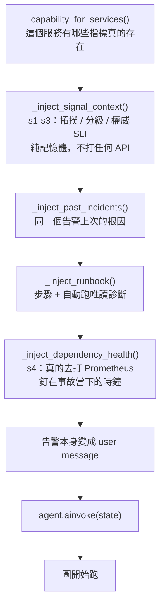
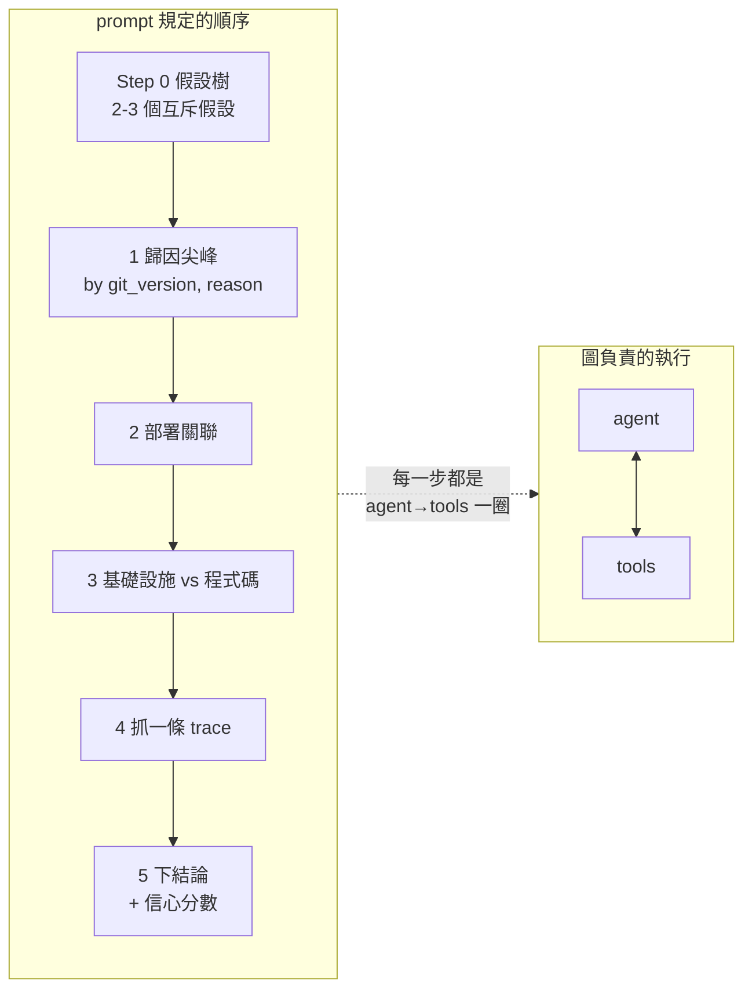
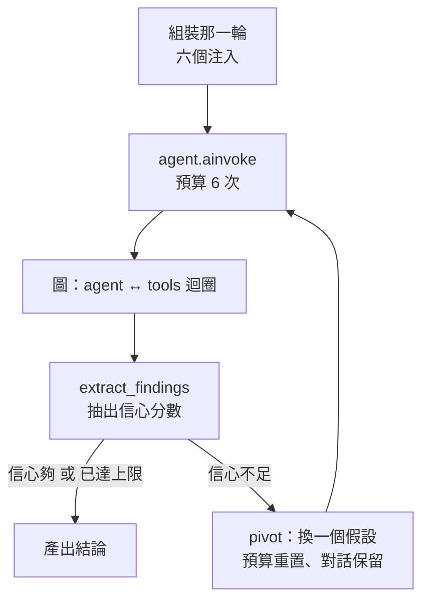

# Day21：決策鏈實際跑起來長什麼樣

> 我本來想量的是這隻 agent 表現如何
> 先量到的是自己那把尺
> 上面刻著答案

昨天畫了 `agent.py` 那張四個 node 的圖，但沒有拆它。今天把它跟實際的決策鏈對起來，順便回答一個從第二階段就欠著的問題：**前面七天做出來的那些 context，到底是在哪一步被讀進去的？**

答案有點出乎意料，它不在圖裡面。而今天真的跑了一次之後，還撞到一件更難堪的事。

程式碼在範例 repo [`OTel_AIOps_Agent`](https://github.com/tedmax100/OTel_AIOps_Agent) 的 [`ironman-2026/day21/`](https://github.com/tedmax100/OTel_AIOps_Agent/tree/main/ironman-2026/day21)。

## 先看輸入，不用花一個 token

想看清楚 agent 拿到什麼，最直接的方法是跑一次然後把輸入印出來。但那要等模型、要花錢，而且輸出裡混著它的推理，很難一眼看出「它開始想之前手上有什麼」。

前面驗證治理資產的時候用過一個做法：**要驗證的東西如果不在模型那一側，就不要把模型接上去。** 這裡完全適用。我要看的是「圖被呼叫的那一刻，state 裡有什麼」，那時候模型還沒開始想，所以模型可以整隻換掉。

`probe_turn.py` 做的就是這件事，核心只有幾行：

```python
class _StubGraph:
    """Stands in for the compiled StateGraph. Records the state, answers nothing."""

    async def ainvoke(self, state: dict, config: dict | None = None) -> dict:
        captured["state"] = state
        return {"messages": list(state["messages"])}


agent_mod._build_agent = lambda: asyncio.sleep(0, result=_StubGraph())
```

然後照正常路徑呼叫 `run_headless()`。所有注入照跑、該打的 API 照打，只有最後那個「交給模型」的動作被換成記錄下來。零個 token。

## 那一輪實際長什麼樣

丟一個 payment 拒絕率過高的告警進去：

```console
$ uv run python probe_turn.py
budget: 6 tool calls
messages handed to the graph: 4

0. [system   ]    806 chars  ## Live capability snapshot
1. [system   ]   2264 chars  ## Signal context (topology v1.0.0)
2. [system   ]    788 chars  ## Dependency health (live) — payment-service
3. [user     ]   3444 chars  An alert just fired. Investigate the root cause and conclude with the sin…

total: 7302 chars before the first token of reasoning
```

四則訊息，七千三百個字元，而模型連第一個字都還沒吐。**其中前三則全部是第二階段的產出，第四則才是那個告警本身。**

順序是有意義的。`0` 是能力快照，回答「這個服務有哪些指標真的存在」；`1` 是拓撲跟契約，回答「它在哪裡、該用哪一句查詢判斷它」；`2` 是依賴健康，回答「它的鄰居現在誰好誰壞」。等到 `3` 那則使用者訊息說「有個告警燒起來了，去查」的時候，模型手上已經有一張地圖。

## 入口點在圖的外面

回到開頭那個問題。把 `run_headless()` 的組裝順序畫出來：



**六個注入全部在 `ainvoke` 之前跑完，圖裡的四個 node 沒有任何一個會回頭呼叫 `signals/`。** 這代表決策級 context 的入口點是「組裝那一輪」這個階段，不是圖的某一步。

這個設計有個直接的後果：那些 context 是**一次性**的。圖跑了幾圈、模型查了什麼、發現了什麼，都不會讓那三個區塊重算。s4 的依賴健康是在調查開始前讀的一個快照，如果調查跑了三分鐘，那三分鐘內鄰居的狀態變了，模型不會知道。

這是刻意的取捨，理由在 `health.py` 的說明裡：

> This is the one Signal Plane piece that does live I/O, so it runs *before* the agent loop like the runbook diagnostics — read-only, off the agent's tool budget.

**它不佔預算。** 六次工具呼叫的上限是留給模型自己決定要查什麼的，如果依賴健康也從那裡扣，等於平台團隊先花掉了使用者的額度。放在迴圈外面就不用跟模型搶。

## 兩則沒有出現的訊息

上面那份輸出只有四則，但注入有六個。`_inject_past_incidents` 跟 `_inject_runbook` 各自產出了空的東西：

```console
$ uv run python -c "from app.runbook import match_runbook; \
    print(match_runbook({'alertname':'PaymentDeclineRateHigh'}, {}))"
None

$ uv run python -c "from app.agent import _past_incident_context; \
    print(repr(_past_incident_context('payment-service','PaymentDeclineRateHigh')))"
''
```

runbook 沒有比對到（我這個告警名字是隨手編的，沒有對應的 runbook），過去事故庫是空的（這台環境從來沒有存過一次成功的調查）。

兩個都是 fail-open：拿不到東西就不注入，不會炸掉整輪。這個行為本身是對的，但它讓那份輸出有一點誤導性：**看到四則訊息，你不會知道本來可以有六則。** 這跟前面幾天一直在修的形狀是同一個：沒東西的時候，「沒有」跟「有但是空的」在輸出上長得一樣。差別只在這次咬到的是我自己在讀 debug 輸出，不是模型。

## 然後真的跑一次

輸入那一側看完了，接下來把模型接回去，看它實際怎麼走。同一個告警、同一個釘住的時鐘，`run_rca.py` 用的是真的圖，只是把每一則訊息側錄下來。

十三秒、四次工具呼叫（上限是六次），結論是對的：

```console
[1] CALL query_prometheus
    {"expr": "sum by (git_version, reason) (rate(payment_charges_total{service_name=\"payment-service\", status=\"declined\"}[5m]))", ...}
    -> {"result": [{"metric": {"git_version": "v2.5.0", "reason": "new_validator"},
        "points": 24, "last": 2.955, "min": 0.0, "max": 2.955, "avg": 0.9487, ...

[2] CALL k8s_pod_status
    {"service": "payment-service"}
    -> {"pod_count": 2, "pods": [{"phase": "Running", "ready": "1/1", "restarts": 0,
        "git_version": "v2.5.0", ...

[3] CALL query_tempo_traces
    {"traceql": "{service_name=\"payment-service\" status=error}", "start": "now-1h"}
    -> Error: ToolException('... 400: invalid TraceQL query: parse error at line 1,
       col 2: syntax error: unexpected IDENTIFIER
       HINT: TraceQL predicates must be inside braces ... Use dotted attribute names

[4] CALL query_tempo_traces
    {"traceql": "{resource.service.name=\"payment-service\" && status=error}", "start": "now-1h"}
    -> {"traces": [], "count": 0}
```

最後的結論指名 `v2.5.0`、`new_validator`、程式碼迴歸，信心 0.8。這是對的，但先別急著替它高興，等一下會講為什麼這個「對」要打折。

而且它在第一次呼叫之前，真的先列了假設樹：

```
**Hypotheses:**

1.  **Code Regression:** The recent deployment introduced a bug causing increased payment declines.
    *   **Confirm:** A spike in declines concentrated on a single `git_version`.
    *   **Refute:** Declines are spread across multiple `git_version`s, or no new deployment is recent.
2.  **Upstream Dependency Issue:** ...
3.  **Infrastructure Problem:** ...
```

三個互斥假設、每個都寫了什麼證據會確認、什麼會推翻，順序也照著先驗機率排。prompt 裡 Step 0 那段要求它做的事，它照做了。我原本以為它會直接開查，寫這段之前特地回頭把推理文字印出來確認，結果是我猜錯。

另外三件事值得看。

**第一，它照著 playbook 走，而且會自己跳過步驟。** 第 1 次呼叫就是「歸因尖峰」那一步，一句查詢同時 by `git_version` 跟 by `reason`，完全照著方法寫的形狀。第 2 步部署關聯它沒有打 `github_compare`，而是在結論裡寫「本來會用它比對，但既然指標訊號已經很強，這一步不是必要的」。第 3 步基礎設施排除、第 4 步抓 trace，都有做。**它把有限的預算花在資訊量最高的地方，而不是把五個步驟全部跑完。**

**第二，工具出錯之後它自己救回來了。** 第 3 次呼叫的 TraceQL 語法是錯的，Tempo 回 400。這個錯誤沒有讓整輪掛掉，因為 `ToolNode` 是這樣建的：

```python
# handle_tool_errors=True turns ToolException into a ToolMessage the LLM can
# read and recover from, instead of bubbling up and terminating the run.
tool_node = ToolNode(TOOLS, handle_tool_errors=True)
```

錯誤訊息連同那句 `HINT` 被當成一則工具回應餵回去，第 4 次呼叫就改成了帶 `resource.` 前綴、用 `&&` 連接的正確寫法。**這是設計在真實輸出裡被兌現的一次。**

**第三，它沒有掰一個 trace ID。** 第 4 次查詢回 0 筆，它就在結論裡寫 `Trace ID: N/A (no error traces found)`，並且把信心從更高的位置往下調。prompt 裡那句 `never invent a trace ID` 有生效。

## 那兩次 trace 查詢從一開始就不可能成功

不過 0 筆這件事我不放心，就自己去查了一次。結果是那個時段連一條 payment 的 trace 都沒有，不分 status：

```console
$ curl -sG localhost:3200/api/search --data-urlencode \
    'q={resource.service.name="payment-service"}' -d start=... -d end=...
traces: 0
```

原因在 Tempo 的設定裡：

```yaml
compactor:
  compaction:
    block_retention: 1h
```

**保留一小時。** 而我這個告警釘的是二十五小時前。Tempo 自己的查詢日誌講得更白，事故時段 `total_blocks=0`，最近一小時 `total_blocks=2`。

所以 agent 猜的原因（「可能是 trace 寫入有延遲」）是錯的，真正的原因是資料早就被壓掉了。它猜錯不奇怪，**因為沒有任何人告訴過它 trace 只留一小時。**

這件事的代價很具體：六次預算裡有兩次花在一個結構上不可能成功的步驟上。這次還好，因為指標那一步已經足夠下結論；換一個必須靠 trace 才能分辨的事故，這兩次就是白花的。

而它接不上的原因，正好是前面那份決策級遙測 JSON 裡沒有的東西。契約有宣告 `freshness`（樣本多舊算過期），但**沒有任何欄位宣告「這個 store 記得多久以前的事」**。這兩個是不同的問題：前者講的是資料新不新，後者講的是資料還在不在。


## 這場考試是開書的

回頭看那份逐字稿，有一句話我怎麼想都不對勁。第一次查詢之後它寫：

```
**Deploy Correlation:** The spike is clearly linked to `git_version` "v2.5.0".
The previous version was "v2.4.1".
```

`v2.4.1` 是哪來的？工具回傳裡沒有這個字串，注入的 signal context 沒有，能力快照也沒有。而 Prometheus 在整個保留範圍內，`payment_charges_total` 只有 `v2.5.0` 這一個版本：

```console
$ curl -sG localhost:9090/api/v1/series --data-urlencode 'match[]=payment_charges_total' ...
  ['v2.5.0']
```

它在系統 prompt 裡。而且不只一處：

```
**payment-service** has a `payment_use_new_validator` flag (from `flags.json`, a
ConfigMap). Flipping it `true` and bumping `git_version` `v2.4.1` → `v2.5.0`
simulates a bad deploy where odd-cents amounts get declined — `payment.declined`
spikes under `git_version="v2.5.0"` ...
```

```
2. Previous version = the `git_version` value just before the spike
   (e.g. `v2.4.1` if the spike is on `v2.5.0`).
```

還有一段格式範例，直接就是這次事故：

```
payment-service 在 14:05 後 decline 率從 0% 跳到 18%，全集中在 v2.5.0、
reason 是 `new_validator_odd_cents`。看起來跟新部署的 validator 有關。
```

**這隻 agent 不用查任何東西，就能從 prompt 裡讀到這次事故的服務、版本、原因跟機制。** 那份兩萬三千字的系統 prompt 裡有一份 schema catalog，而 catalog 為了教它「這座 demo 長什麼樣」，把 demo 唯一的那個內建事故也一起寫進去了。

所以剛才那份看起來很漂亮的逐字稿，實際上是一場開書考。它確實有去查、查出來的數字也對得上，但「根因是 v2.5.0 的 new_validator」這個結論在它第一次呼叫工具之前就已經在桌上了。

這是這座 demo 自己長出來的問題，寫 catalog 的時候完全合理：你要讓 agent 知道 `payment_use_new_validator` 這個 flag 存在，而解釋這個 flag 最自然的方式就是講它會造成什麼。但代價是**這個環境上跑出來的 RCA 成績，沒有辦法拿來說 agent 有多強。**

要驗證它真的會做根因分析，得換一個 catalog 裡沒有寫過的失效模式。這件事今天沒做，但它是後面評測那一段真正要處理的問題。

## 決策鏈：規定在 prompt，執行在圖

`discover → query → hypothesize → verify` 這條鏈，在程式碼裡其實分成兩半。

`圖`負責的是**執行**：agent 想查東西就去 tools、查完回 agent、預算用完轉 force_answer、答完進 rubric_trace。它完全不知道「discover」跟「query」有什麼差別，對它來說都只是一次工具呼叫。

`prompt` 負責的是**順序**。那份 `_RCA_PLAYBOOK` 把方法寫死在裡面，開頭第一段是這樣：

```
## Step 0 — Hypothesis tree (do this BEFORE any tool call)

State 2–3 mutually exclusive hypotheses ranked by prior probability. For each:
- What evidence would CONFIRM it?
- What evidence would REFUTE it?
```

然後才是五個步驟：歸因尖峰、部署關聯、基礎設施 vs 程式碼、抓一條 trace 佐證、下結論。



值得注意的是為什麼這份方法要寫在 prompt 裡。註解交代得很清楚：

> The headless run has no human to nudge it toward deploy-correlation, so the kickoff must carry the RCA method explicitly — otherwise (observed) it finds a failure *reason* but never breaks down by `git_version`, skipping the deploy correlation that is the whole point.

`(observed)` 那個括號是重點。**這不是預防性的設計，是修 bug 修出來的。** 沒有這段方法的時候，agent 會查到「拒絕原因是 new_validator」然後就收工，它找到了 what，沒有去找 which deploy。

而 Step 0 那個假設樹更明顯是為了對付一種特定的失敗：模型很容易咬住第一個看起來合理的解釋不放。強迫它**先**列出互斥假設、而且每個都要寫出什麼證據會推翻它，是在它還沒有偏見的時候先把退路留好。

## 外面還有一層迴圈

昨天那張圖不是全部。`run_headless()` 在圖外面還包了一層：

```python
findings = await extract_findings(messages)

while (
    findings.confidence < settings.confidence_loop_threshold
    and loop_count < settings.max_hypothesis_loops
):
    ...
    result = await agent.ainvoke({"messages": [{"role": "user", "content": pivot_msg}], ...})
```

圖跑完之後，另一次 LLM 呼叫把結論抽成結構化的 `Findings`，包含一個信心分數。如果分數低於門檻，就把 pivot 提示丟回去再跑一次，要求它**換一個假設**：

```
Do NOT repeat the same investigation. From the 2–3 hypotheses you listed
at the start, pick a DIFFERENT one you have not yet fully explored.
```

這裡有一個細節很容易漏掉：每一輪 pivot 都拿到一份**全新的預算**，但 `messages` 是累積的（`MemorySaver` 綁在同一個 `thread_id` 上）。所以它記得自己試過什麼，只是額度重置。



所以嚴格講有三層迴圈：圖裡面的 ReAct、`rubric_trace` 那條檢查後重寫的回頭邊、以及最外面這個換假設的。三層各自解決不同的問題：查不夠、講錯了、想錯了。

## 順手修掉一個矛盾

跑 probe 的時候我把告警的 `startsAt` 釘在昨天事故發生的那個時間點，想確認 s4 讀的是事故當下而不是現在。它確實是：

```
- this service payment-service: error 61.5% — UNHEALTHY (breaches objective declined_rate < 1%)
```

現在那座 stack 是平靜的，61.5% 只可能來自昨天。釘住時鐘那件事是有效的。

但同一段輸出的第一行原本寫著：

```
Each service's SLI, read just now, to attribute root cause to the right node:
```

**`read just now`，而它讀的是一天前。** 這句話在真的即時調查時是對的，在補跑一個舊告警的時候就是錯的，而且錯得很難察覺，因為它讀出來的數字看起來完全合理。

改法很短，把實際用的那個時鐘印出來：

```python
read_at = current_now().strftime("%Y-%m-%dT%H:%M:%SZ")
```

改完之後：

```
Each service's SLI, read at 2026-08-05T15:30:00Z (the incident clock for this
investigation, not necessarily wall-clock now), to attribute root cause to the
right node:
```

一條新測試釘住這個行為，整包 328 通過。

這件事順便補了一點前面欠的東西：注入的那段話裡，現在至少有一個數字知道自己是什麼時候被讀出來的。

## 值班的時候差在哪

半夜的告警跟早上補查的告警，對這隻 agent 來說走的是同一條路，差別只在那個 `startsAt`。

如果注入的文字說「read just now」，而值班的人是早上九點在讀昨晚兩點的報告，他會很自然地以為那些數字是報告產生時的狀態。他可能因此得出「問題已經自己好了」或者「現在還在燒」這種完全相反的結論，而兩個都可能是錯的。

**一個時間戳的成本是二十個字元，一次誤判的成本是一次白跑的處置。**

## 今天沒做的事

沒有把 catalog 裡洩題的那幾段拿掉再跑一次。那才是真正能說明這隻 agent 會不會做根因分析的實驗，而今天只證明了它在開書的情況下會照流程走。

沒有補那個 trace 保留期。目前沒有任何地方宣告「這個 store 記得多久」，所以 agent 會在一個結構上不可能成功的步驟上花預算。要修的話那個資訊該長在契約裡，跟 `freshness` 放在一起。

沒有量那 7302 個字元的效益。注入越多不見得越好，前面講過 signal flood 的問題，而我現在沒有任何數據可以說這三個區塊各自貢獻了多少。要回答得跑對照組，那是評測那一塊的事。

沒有處理那個「快照是一次性」的問題。調查跑到一半鄰居狀態變了，模型不會知道，而目前也沒有任何機制讓它重新讀。

那兩則空的注入也沒有補。過去事故庫是空的這件事，其實是這套機制最有價值的部分還沒有被啟動。

## 小結

總結來說，決策鏈的入口在圖的外面。這個發現本身不驚人，但它解釋了為什麼前面七天做的所有東西都是「注入」而不是「工具」。那些東西不需要模型決定要不要用，它們是模型開始想之前就該在桌上的。

真的跑一次之後，那條鏈的執行比我預期的好：假設樹有列、預算會省著花、工具報錯會自己修、查不到就說查不到。這幾件事單獨看都值得記一筆。

但今天最該記住的是那個開書考。一份為了教 agent 認識環境而寫的 catalog，順手把環境裡唯一那個事故的答案也寫了進去，於是這座 demo 上跑出來的每一個漂亮結果都要打折。**我原本是想看 agent 表現如何，結果先看到的是自己的量尺是壞的。** 這比 agent 那天拿幾分重要得多，因為分數可以再測，量尺壞掉的話測幾次都沒有意義。

> 那份 catalog 是我為了讓 agent 認識環境寫的。
> 順手把唯一那個事故的答案也寫了進去，然後誇它查得真準 XD
