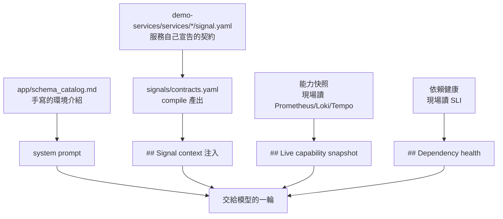
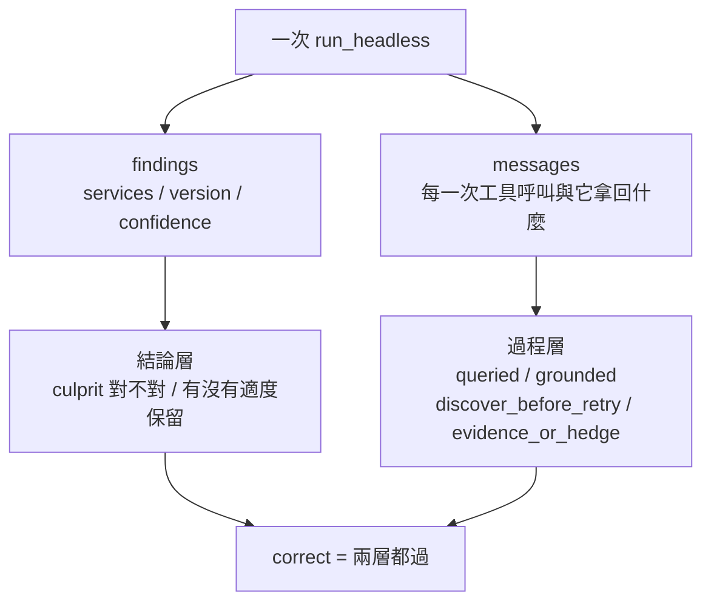
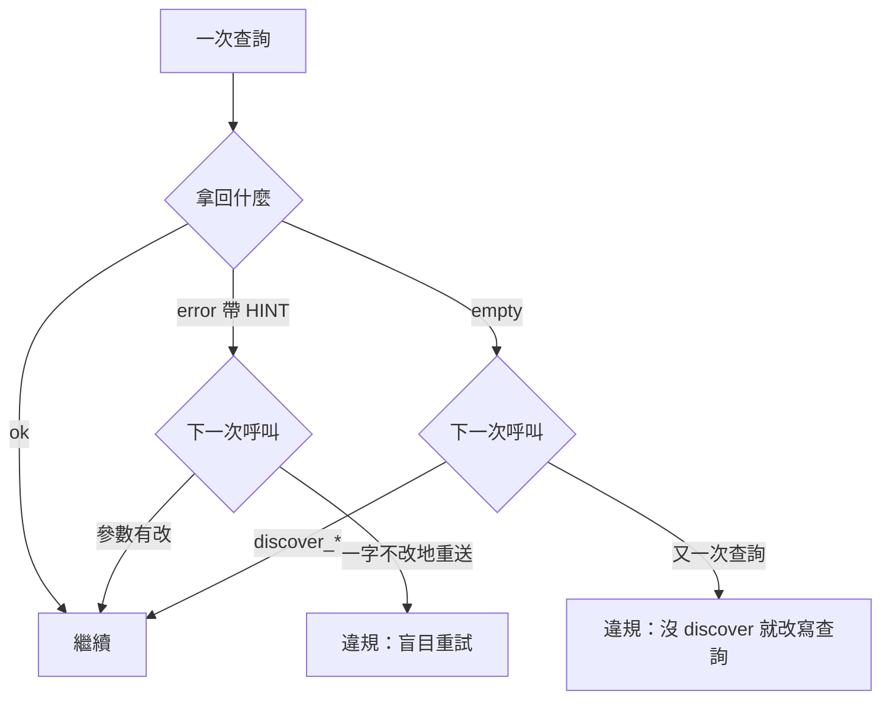

> 一份漂亮的結論
> 跟一場漂亮的調查
> 在報告上長得一模一樣

昨天那場 RCA 跑得很好看，四次工具呼叫、假設樹有列、工具報錯自己救回來，最後結論指名 `v2.5.0` 的 `new_validator`。然後我在系統 prompt 裡找到了同一句話。那天的收尾是一句欠帳：**在拿掉洩題之前，這座 demo 上的任何分數都不算數。**

今天先還這筆帳，再做本來就排好的事：把踩過的坑寫成 fixture。

程式碼在範例 repo [`OTel_AIOps_Agent`](https://github.com/tedmax100/OTel_AIOps_Agent) 的 [`ironman-2026/day22/`](https://github.com/tedmax100/OTel_AIOps_Agent/tree/main/ironman-2026/day22)。

## 洩題是資產，不是字串

先把問題講清楚一點。所謂洩題不是「prompt 裡出現了 `v2.5.0`」，而是「模型不必查任何東西，就能寫出這次事故的服務、版本、機制」。判準是**這件事該由誰付出代價才知道**：告警本身就寫了服務名字，那不算洩題；Loki 的 selector 鍵是 `service_name` 不是 `service`，那是環境的形狀，寫給它是合理的介面文件；但「翻 `payment_use_new_validator` 這個 flag 再把版本從 `v2.4.1` 推到 `v2.5.0`，odd-cents 的付款就會被拒」，這是答案。

所以第一件事不是動手改檔案，是先量。前面驗證治理資產那天的做法在這裡剛好可以整套搬過來：**要驗證的東西不在模型那一側，就不要把模型接上去。** 我要看的是「交給模型的那堆字裡有沒有答案」，那是一個字串比對，跟模型會怎麼想完全無關。

`leakcheck.py` 就是這樣寫的。它沿用昨天那支 probe 的樁，把圖換成只記錄的假貨，照正常路徑跑一次 `run_headless()`，然後把系統 prompt 加上每一則注入訊息都掃過一次：

```python
ANSWER_TOKENS: list[tuple[str, str]] = [
    ("culprit version", r"v2\.5\.0"),
    ("previous version", r"v2\.4\.1"),
    ("the flag that ships it", r"payment_use_new_validator"),
    ("failure mechanism", r"odd[- _]?cents?"),
    ("decline reason value", r"new_validator(_odd_cents)?"),
]
```

零個 token，而且有洩題就 exit 1，可以直接掛在 CI 上跟其他「還擋不擋得住」的斷言排在一起。

## 掃出來的第二處，才是我沒想到的

清理前跑一次：

```console
$ uv run python ../../otel-aiops-agent/ironman-2026/day22/leakcheck.py --show
scanned 5 block(s), 29854 chars

[LEAK] system prompt (schema catalog)
         culprit version: 'v2.5.0'
           | payment-service 在 14:05 後 decline 率從 0% 跳到 18%，全集中在 v2.5.0、
         previous version: 'v2.4.1'
           | | payment-service | charges. Has the `payment_use_new_validator` flag | … | v2.4.1 |
         the flag that ships it: 'payment_use_new_validator'
         failure mechanism: 'odd_cents'
         decline reason value: 'new_validator_odd_cents'
[ok  ] injected #0: ## Live capability snapshot
[LEAK] injected #1: ## Signal context (topology v1.0.0)
         decline reason value: 'new_validator'
           | - caveat: … to find which deploy/reason drives it (e.g. the new_validator flag shipping in a release).
[ok  ] injected #2: ## Dependency health (live) — payment-service
[ok  ] injected #3: An alert just fired. Investigate the root cause and conclude

6 leak(s) across 2 block(s): culprit version, decline reason value, failure mechanism, previous version, the flag that ships it
```

catalog 那一處昨天就抓到了。真正讓我坐直的是第二處：**`## Signal context` 這一則也在洩題**，而它是第二階段整整八天做出來的東西，是我自己覺得最乾淨的那一層。

追回去看，那句話長在 payment-service 自己的 `signal.yaml` 裡：

```yaml
exclusions:
  - "A declined-rate spike ABOVE the objective is an incident, not normal business —
     … 找出哪個 deploy/reason 造成的（e.g. the new_validator flag shipping in a release）。"
```

寫這行的當下我在做的是好事：契約由服務團隊自己維護，把「不要把拒絕當成正常業務」這個領域知識寫進去，正是那一階段一直在講的所有權。但那個 `e.g.` 順手把答案帶了進去，然後被 `compile` 編進 `contracts.yaml`，再被注入到每一次 payment 的調查裡。



看這張圖會發現一件事：`Live capability snapshot` 跟 `Dependency health` 這兩塊從來沒洩過題，因為它們的內容是**現場查出來的**。會洩題的兩塊，剛好都是人手寫的。手寫的東西會夾帶作者知道的事，而作者知道答案。

> 我原本以為洩題是「catalog 寫太多」的問題，掃完才知道它是「有人手寫」的問題。任何一層只要允許人寫自由文字，就有機會把答案寫進去，差別只在你有沒有一支程式在掃 :(

清理的方式是把機制留下、把答案拿掉。flag 那一節現在只講「服務從 ConfigMap 讀 flag，所以行為可以不換 image 就改變，因此 flag 是一個合理的假設」，至於哪個 flag、翻了會怎樣，請它自己去讀 code diff 或 ConfigMap。契約那句 `e.g.` 直接刪掉，重跑一次 `python -m app.signals.compile`。順手還改了一個更尷尬的：**系統 prompt 裡那段「回答格式範例」，整段就是這次事故的結論**，連 `reason 是 new_validator_odd_cents` 都寫進去了。

清理後：

```console
[ok  ] system prompt (schema catalog)
[ok  ] injected #0: ## Live capability snapshot
[ok  ] injected #1: ## Signal context (topology v1.0.0)
[ok  ] injected #2: ## Dependency health (live) — payment-service
[ok  ] injected #3: An alert just fired. Investigate the root cause and conclude

no answer tokens in anything handed to the model.
```

## 那麼，分數掉了嗎

這才是要驗的事。`ab_run.py` 拿同一個告警跑兩次，A 邊吃清理前那兩份檔案的原樣快照（所以重現的是昨天那個環境，不是一個近似），B 邊吃清乾淨的版本。

跑之前得先讓資料裡真的有事故。`stage_incident.sh` 做三段：先跑八分鐘 `v2.4.1` 的健康流量，翻 flag、把版本推到 `v2.5.0`，再打十四分鐘的 odd-cents 付款。整段刻意壓在一小時內，因為 Tempo 的 `block_retention` 是 1h，昨天那個「兩次 trace 查詢從一開始就不可能成功」就是這麼來的。

```console
$ uv run python ../../otel-aiops-agent/ironman-2026/day22/ab_run.py
alert startsAt = 2026-08-06T13:21:10Z

========================================================================
A: leaky prompt  (prompt contains the answer: True)
========================================================================
tool calls (5):
  - query_prometheus       [ok   ] sum by (git_version, reason) (rate(payment_charges_total{service_name=
  - github_compare         [ok   ] v2.4.1
  - k8s_pod_status         [ok   ] payment-service
  - github_compare         [ok   ] v2.4.1
  - query_tempo_traces     [error] service.name="payment-service" && status="error"

services: ['payment-service']   version: v2.5.0   conf: 0.70

========================================================================
B: cleaned prompt  (prompt contains the answer: False)
========================================================================
tool calls (4):
  - query_prometheus       [ok   ] sum by (git_version, reason) (rate(payment_charges_total{service_name=
  - query_tempo_traces     [error] {service_name="payment-service" && status="error"}
  - query_loki_logs        [ok   ] {service_name="payment-service"} | event=~"payment.declined|payment.ga
  - k8s_events             [ok   ] payment-service

services: ['payment-service']   version: v2.5.0   conf: 0.70
```

**沒掉。** B 邊一樣指到 `payment-service` 跟 `v2.5.0`，信心一樣 0.70，而且它是從那句 `sum by (git_version, reason)` 的結果裡讀到版本的，不是從 prompt 裡背出來的。

我承認我本來有點期待看到一場崩盤，那樣文章比較好寫 XD 但這個結果其實更有意思：**在拿掉洩題之前，我沒有辦法區分「它查得出來」跟「它背得出來」；拿掉之後才知道是前者。** 洩題真正的代價不是分數虛高，是它讓分數不帶任何資訊，好的壞的都一樣。

還有一個細節值得看。A 邊呼叫了兩次 `github_compare`，兩次的 base 都是 `v2.4.1`，因為它從 prompt 就知道要比哪一對；B 邊沒有走部署關聯，改去 Loki 撈事件把 reason 補上。同樣是對的結論，兩邊的路徑不一樣，而只看結論的評分完全看不到這件事。

## 只看結論的評分，抓不到 Day1 那個 agent

順著這件事，接下來就是本來排好的工作：把 Day1 那個只拿 4.5/9 的 agent 犯的錯，寫成回歸案例。

那個 agent 的失敗長這樣：它腦袋裡有一份寫死的 schema，於是查 `{service="user-service"} | level="ERROR"`。selector 鍵錯了（要 `service_name`），而且這些服務根本沒有 ERROR 這個 level。查回來是空的，它換個寫法再查，還是空的，第三次還是空的，然後**它用三個空結果寫出了一段有數字的結論。**

問題來了：如果今天的 fixture 只看「它有沒有指對服務」，這種 agent 完全可能過關。事故確實在 payment-service，而告警上面就寫著 payment-service。**答案對，不代表它是查出來的。**

所以 fixture 這一天長出第二層：除了判結論，也判逐字稿。



要讀逐字稿得先拿得到它。`run_headless()` 原本只回結論，這天多回一個 `messages`：webhook 那條路徑用不到，evaluation 需要它。`app/eval/process.py` 把那串訊息攤平成「一次呼叫配一個結果」，然後判四件事：

| 檢查 | 它在問什麼 | 對應哪個坑 |
| --- | --- | --- |
| `queried` | 至少 N 次呼叫真的拿回東西 | 沒查就答 |
| `grounded` | 結論裡每個 trace ID 都在某次工具回應裡出現過 | 憑空生出來的 ID |
| `discover_before_retry` | 查回空的之後，下一步是 discover 而不是換句話再查一次 | Day1 那三次空查詢 |
| `evidence_or_hedge` | 全部都空的時候，信心必須壓低 | 拿三個空結果寫結論 |

四條全是機械判斷，沒有一條需要 LLM。而且判斷的材料是工具回應本身，所以它跟模型換哪一版無關。

> 這裡有一個順序上的講究：`grounded` 這條在 agent 內部其實已經有一個 rubric 在守了（那個真的去 Tempo 驗 ID 存不存在的檢查）。但守門的人自己也會壞，evaluation 這一層再獨立驗一次，才知道守門的人還在不在崗位上。

## 我的第一版檢查判錯了，而且錯得很像對的

`discover_before_retry` 我第一版寫得很直白：只要一次查詢回空或報錯，下一次還是查詢工具就算違規。跑完 eval 抓到兩筆，長這樣：

```
x user-service-no-incident seed1 — discover_before_retry:
    query_tempo_traces came back error, retried query_prometheus without discovering
```

看起來抓得很準，但我去讀了逐字稿之後發現這是誤判。那次 Tempo 是**語法錯誤**，而工具的錯誤訊息裡本來就附了 `HINT` 告訴它該怎麼改；agent 照 HINT 改完再查，是正確行為，不是盲目重試。我這條規則等於在懲罰一個做對的動作。

**空結果跟錯誤是兩件事。** 錯誤是「你這句話文法不對」，工具已經把修法寫給你了；空結果是「你這句話文法對，但你假設的那些名字可能不存在」，這時候除了 discover 沒有別的路能知道哪些名字是真的。改完之後的規則是：回空就一定要先 discover，報錯則只有「一字不改地再送一次」才算違規。



這件事本身就是那條方法論的示範：**你要驗證的不是它會不會通過，是它會不會在該紅的時候紅、以及不該紅的時候不要紅。** 所以每條檢查都配了兩個逐字稿，一個該綠、一個該紅，寫在 `tests/test_eval_process.py` 裡，十五個測試、跑一次 0.03 秒、零 LLM 呼叫。

## 兩套 bench 的帳

這裡要處理一個從 Day1 一路看過來的人一定會撞到的問題：**這系列其實有兩套評測，而它們不是同一個東西。**

| | Day1 的九題 bench | `app/eval` 的 harness |
| --- | --- | --- |
| 受測物 | 一隻寫死 schema、四次預算的 baseline agent | 現在這隻 agent 的 `run_headless`，跟告警 webhook 走同一條路 |
| 輸入 | 九個自然語言問題 | Grafana 告警 payload |
| 真值 | 評分當下去 stack 現算 | fixture 宣告的 culprit（服務 ＋ 版本） |
| 判準 | number / contains / queried / grounded 四種檢查 | 結論層 ＋ 過程層 |
| 產出 | 一張 9 題的分數表 | pass@k 與跟 baseline 的回歸差異 |

兩邊都保留，理由是它們回答的問題不同。九題 bench 問的是「這隻 agent 對一組固定問題的作答能力」，harness 問的是「這條真的會在半夜被叫醒的路徑，還會不會犯以前犯過的錯」。把前者塞進後者，等於要求每個 fixture 都準備一份自然語言問題跟一句真值查詢，那是另一套工程；把後者塞進前者，則會失去「跟 production 走同一條 code path」這個最重要的性質。

有橋接的是判準。`queried` 跟 `grounded` 這兩條原本是 Day1 grader 裡的檢查，這天原封不動搬進 `process.py`，因為它們問的事情在兩個世界裡是同一件：你有沒有真的去看，以及你講的東西是不是查得到的。**同一個標準在兩套 bench 上是同一個實作，這樣分數才有可比性。**

## 真的跑一次

三個 fixture、每個兩顆種子：

```console
$ uv run python -m app.eval run -n 2
aiops-agent eval — 3 fixture(s), 6 run(s), overall correct 50%

  fixture                        correct   service   version   conf  err
  ----------------------------------------------------------------------
  payment-decline-service        100% (2/2)    100%     100%   0.75    0
  user-service-no-incident        50% (1/2)    100%    n/a   0.60    0
  order-service-discover-before-query     0% (0/2)     50%    n/a   0.65    0

  failed process checks (the answer may still read fine):
    x user-service-no-incident seed1 — discover_before_retry:
        query_tempo_traces errored and was re-sent unchanged
    x order-service-discover-before-query seed0 — discover_before_retry:
        query_prometheus came back empty, retried query_prometheus without discovering
    x order-service-discover-before-query seed1 — discover_before_retry:
        query_prometheus came back empty, retried query_loki_logs without discovering
```

事故那一題在拿掉洩題之後兩次都對，版本也都對。另外兩題不行，而失敗的形狀正好是這一天想抓的。

新加的那個 fixture（`order-service-discover-before-query`）兩次都失敗，兩次都是同一個動作：**一句查詢回空的，然後它換一句查詢，沒有先去問名字。** seed0 是在 Prometheus 裡連著換，seed1 是換到 Loki 去換，但性質一樣。Day1 那隻 baseline agent 犯的錯，今天這隻換了模型、換了工具、加了 discovery 工具之後，還是會犯。**如果我只看結論那一層，這件事我永遠不會知道**，因為它最後給的答案讀起來完全合理。

另一題 `user-service-no-incident` 是那個沒有事故的負向案例，一次過一次沒過，沒過的那次把同一句 Tempo 查詢一字不改地送了兩遍。

值班的時候這兩種行為的代價不一樣。空查詢換句話再查，最直接的代價是預算：六次呼叫用掉三次在問一個不存在的欄位，剩下三次要撐完整個 RCA。但更危險的是它接下來要說什麼。手上三個空結果的 agent，如果沒有一條規則逼它承認「我沒查到」，它就會用它僅有的材料——也就是告警本身跟它腦內的先驗——寫出一段有數字的結論。凌晨三點，人本來就不清醒，一段自信、有數字、格式正確的分析，很難不信。**而讓人拿著錯的方向去重啟一個沒事的服務，比什麼都不給還糟。**

## 今天沒做的事

- **`baseline.json` 還是舊的。** 這次的數字沒有寫進基準，因為我這座 stack 的資料是剛種進去的，跟之後任何一次都不會一樣。要讓回歸有意義，基準得從一個可重現的環境跑出來，那件事留給後面。
- **只有兩顆種子。** 一個 fixture 跑兩次講不了穩定度，`0%` 跟 `50%` 這兩個數字要當成訊號、不能當成測量值。
- **process 檢查只有四條。** 假設樹有沒有真的列、有沒有做過反證嘗試，這些昨天在逐字稿裡看得到的東西，目前一條都沒有被機械化。
- **洩題掃描還沒進 CI。** `leakcheck.py` 已經是 exit 1 的形狀了，但沒有人在 PR 上跑它。也就是說今天清乾淨的 catalog，下一個為了幫 agent 一把而多寫兩句的人，隨時可以再把答案寫回去。

## 小結

總結來說，今天真正的產出不是那三個 fixture，是「分數開始有資訊」這件事。昨天那場 RCA 一樣是對的、今天 A/B 兩邊也都對，但只有在確定 prompt 裡沒有答案之後，這個「對」才代表它查得出來。順帶把 Day1 那個坑寫成了機器讀得到的形狀：以前講「這隻 agent 沒有先 discover」是一句讀完逐字稿才能下的評語，現在它是報表上一行會自己跳出來的字，而且 Day1 那個錯，今天這隻 agent 還在犯。

> 第一版的檢查我寫得很嚴，抓到兩筆違規的時候還有點得意。
> 去讀逐字稿才發現兩筆都是誤判，agent 那兩次做得比我這條規則對 QQ
