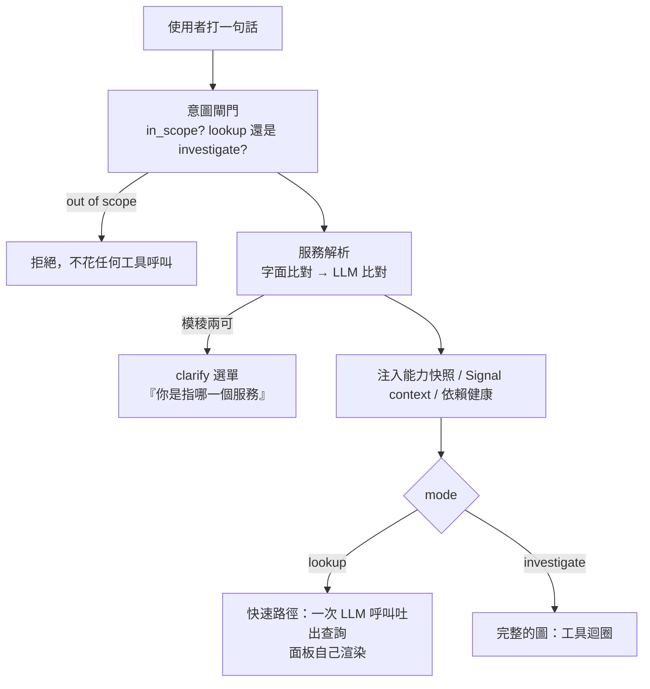

# Day24：從使用者那一側看回來，四個角度各量一次

> 前面二十三天我一直在驗證那條沒有人在看的路徑
> 而真正會被用的那一條
> 缺假設樹、缺信心分數、缺一顆按鈕
> 還缺一張帳單
> 而我自己去用的時候
> 拿到一個答得很漂亮的錯答案

昨天把整條鏈從上線檢查跑到「這次考幾分」。今天換一個方向：**不看 agent 做了什麼，看使用者最後拿到了什麼。**

這件事量下去分成三段，剛好是同一個回答的三個層次：它從哪個門進來的（入口）、它輸出的東西能不能被操作（格式）、以及這一次回答花了多少（帳單）。三段各自都踩到東西，而且踩的形狀很像。後來還多了第四段，因為我把這個介面當使用者用的時候，自己撞到一個它答得很漂亮、但其實是錯的回答。

程式碼在範例 repo [`OTel_AIOps_Agent`](https://github.com/tedmax100/OTel_AIOps_Agent) 的 [`ironman-2026/day24/`](https://github.com/tedmax100/OTel_AIOps_Agent/tree/main/ironman-2026/day24)。

## 一、入口：同一隻 agent，兩個門進來拿到不一樣的東西

先講一件很尷尬的事：**從 Day20 到昨天，每一次驗證都是從告警那頭進去的。** `/webhook/alert`、`run_headless()`、eval harness，全部都是。

但這整套東西最後要用的樣子，是一個人在 Grafana 的輸入框打一句「payment 的拒絕率為什麼變高了」。那條路我一次都沒有量過。

先講清楚那條路的形狀，因為它跟告警那條差很多：



意圖閘門做兩件事。第一是**擋掉不相干的問題**，而且是 fail-closed：分類器自己壞掉的時候一律拒絕，而不是當成沒問題放行，因為「分類失敗就放行」等於給了一條繞過這道門的路。第二是分模式：

```console
$ uv run python chat_probe.py
payment-service 的拒絕率為什麼變高了   in_scope=True  mode=investigate  services=['payment-service']
order-service 的 p95 latency          in_scope=True  mode=lookup       services=['order-service']
近10筆 payment 的錯誤 log              in_scope=True  mode=lookup       services=['payment-service']
幫我寫一個 python 快排                 in_scope=False mode=investigate  services=[]
哪個服務最近最不健康                    in_scope=True  mode=investigate  services=[]
```

`lookup` 那兩題不需要走完整的工具迴圈（想一下、查一次、看結果再想下一步的那種）。使用者要的是**看到那張圖**，agent 的工作只是把中文翻成一句 PromQL/LogQL，剩下的交給面板去跑。一次 LLM 呼叫、零工具呼叫。這個分流不是為了省錢，是因為「顯示一個指標」跟「查出根因」在互動上根本是兩件事。

然後我把兩條路的清單並排：

| | 人打字（改之前） | 告警 webhook |
| --- | --- | --- |
| 意圖閘門 / 服務解析 / clarify 選單 | ✅ | — |
| 能力快照、Signal context、依賴健康 | ✅ | ✅ |
| **RCA（root cause analysis，根因分析）playbook：假設樹＋五步＋信心規則** | ❌ | ✅ |
| **findings：結論／信心／suspected_version** | ❌ | ✅ |
| 過去事故注入 | ❌ | ✅ |
| **investigation 紀錄 ＋ `trace_id`** | ❌ | ✅ |
| trace ID 幻覺守門 | ✅ | ✅ |
| 面板、alert 提案卡 | ✅ | — |

中間那四列就是這二十三天的成果裡，**只長在告警那一側的部分**。

白話講：你在 Grafana 問「payment 為什麼一直被拒」，拿到的是一段有面板的回答，但沒有假設樹、沒有信心分數、事後在 investigation 列表裡找不到這次對話，也沒有一條 trace 可以回頭看它怎麼想的。

這不是設計取捨，是我沒發現。`_RCA_PLAYBOOK` 這個常數只被 `_alert_to_prompt()` 用到，而那個函式只有 webhook 會呼叫。**同一個圖、同一組工具、同一份 catalog，只有 kickoff 那段話不一樣，出來的東西就差這麼多。**

補起來只有三件事。一是 investigate 模式也注入同一份 playbook。二是回合結束後跑一次結構化抽取，把 findings 用一個新事件送到前端，同時存一列 investigation（`source: chat`，帶著 Day25 那個 `trace_id`）。三是過去事故的查詢原本要 service ＋ alertname 兩個條件都給，現在 alertname 可以不給，因為聊天問句根本沒有 alertname，而「上次有人查這個服務，結論是什麼」本來就是一個同事會記得的事。

```console
$ uv run python chat_turn.py "payment-service 的拒絕率為什麼變高了"
tool_start query_prometheus {'expr': 'sum by (git_version, reason) (rate(payment_charges_total{status="declined"}…
findings   confidence=0.7 services=['payment-service'] version=v2.5.0
           The decline rate for payment-service has increased due to a spike in declines with the
           reason "new_validator"…

stored row: fp=day26-demo source=chat confidence=0.7 trace_id=10d35edee3e4a743d43395ee6b55f5c8
```

接的過程踩到兩個坑，而且是同一個形狀。

**第一版我把 playbook 直接接在使用者訊息後面**，結果中文問題拿回來一半英文的回答：一大塊英文指令黏在問句尾巴，模型就順著換語言了。改成獨立的 system message，並在最後一行重申「用使用者的語言回答」。放最後是因為近因效應（recency，越靠後的指令模型越容易照做），而這條規則正好是它最先忘的那條。

**第二版它把整棵假設樹印在回答裡。** 告警那條路沒人看無所謂，聊天這條路使用者得先捲過三層標題才看得到答案。所以指令要明說：想歸想，不要印出來，最後只留一行信心分數跟「還不能排除什麼」。

兩個坑講的是同一件事：**同一段指令，對著沒人看的批次流程跟對著一個正在等答案的人，寫法是不一樣的。**

> 另外一個沒有解決的東西：那一輪它給的信心是 0.7，但同一個問題我跑過一次拿到 1.0，而那次它在答案裡自己寫「Contradictory evidence: None found」。它根本沒去找反證，卻給了滿分，而 playbook 裡明明寫了「沒做反證嘗試 → 信心 ≤ 0.5」。這個數字準不準，是下一個系列的第一個題目 :(

## 二、格式：一個內容完全正確、格式完全沒用的回答

入口補好了，接著是答案的另一半：**它輸出的東西怎麼變成使用者真的能操作的介面。**

在 Grafana 裡，agent 的回答不是純文字。回答裡的 fenced block 會被 plugin 換成活的面板，`alert` 提案會變成一張有「Create alert」按鈕的卡。這是一份契約，而契約有兩端：prompt 那邊負責寫對，parser 那邊負責認得出來。兩端都斷過一次。

```mermaid
flowchart LR
    A["agent 的回答<br/>散文 + fenced blocks"] --> P["splitQueryBlocks<br/>（plugin）"]
    P --> M1["```promql<br/>活的時序圖"]
    P --> M2["```logql 10<br/>活的 logs 面板"]
    P --> M3["```traceql 3<br/>活的 traces 表"]
    P --> M4["```alert<br/>提案卡 + Create alert 按鈕"]
    P --> M5["其他<br/>純文字"]
```

這個設計有一個好處值得講：**面板不是把 agent 查到的資料畫出來，是把它用的查詢再跑一次。** 所以使用者看到的數字跟 agent 引用的數字來自同一句查詢，但由 Grafana 自己去取，時間範圍還能自己拉。agent 的角色是「把中文翻成查詢」，不是「當一個資料中轉站」。Day22 那個把 72 KB 壓成 5 KB 的摘要，也是靠這件事才敢做：模型手上那份被壓過的數字只是拿來推理的，畫給人看的那份是面板自己去查的。

**斷點一，使用者不可能弄錯的東西。** 「幫我設一個告警」最後會打到 `/alerts/provision`。第一次真的按下去：

```console
$ curl -X POST localhost:8091/alerts/provision -d '{"title":"payment decline rate high", …}'
{"detail":"grafana rejected the rule: {\"message\":\"invalid alert rule: folder does not exist\"}"}
```

Grafana 講得沒錯，那個 folder 真的不存在。但**那個 folder 是 `AlertSpec` 的預設值 `aiops` 選的，使用者從頭到尾沒看過這個欄位。** 他做的事情只有按一顆按鈕，然後拿到一句「folder 不存在」。這跟 Day12 那條判準是同一件事：一個機制如果失敗之後還要人去補一個他根本沒參與的前置條件，那個成本就是設計者推給使用者的。改成送規則之前先確認 folder，沒有就建（409 也當成功，那代表別人剛好同時建了）：

```console
$ curl -X POST localhost:8091/alerts/provision -d '…'
{"ok":true,"uid":"bfudlf17fvw8wb","title":"payment decline rate high"}
```

**斷點二，模型照著自己的習慣寫。** 接著我用正常的方式問一次「幫我對 payment-service 的拒絕率設一個告警，超過 5% 就通知」：

```console
```yaml
alert: PaymentDeclinedRateHigh
expr: sum(rate(payment_charges_total{…,status="declined"}[5m])) / sum(rate(…)) > 0.05
for: 5m
labels:
  severity: warning
```
```

這是一份**完全正確的 Prometheus 告警規則**，也完全沒有用。plugin 認的是 ```` ```alert ```` 的 JSON，看到 `yaml` 就當純文字印出來，那顆按鈕不會出現。原因不難猜：訓練資料裡「告警規則」長得就是 Prometheus YAML 那個樣子，而我的契約寫在系統 prompt 中段的一個小節裡。**模型不是不聽話，是它有一個更強的先驗。**

第一次修法是在 prompt 裡明寫禁止項，而不只是說明正確格式。再問一次，JSON 對了，**內容一字不差，fence 還是 ```` ```json ````**，卡片依然不會出現。所以第二步是改接收方：```` ```json ```` 只要驗得成 AlertSpec 就當成提案，驗不成照樣當程式碼區塊。

> 這件事講起來像 Postel's law（送出要嚴謹、接收要寬容），但我想強調的是另一半：**只靠 prompt 的契約是機率性的。** 它會在你沒改任何東西的情況下，因為換一個問法、換一個模型版本就不成立。所以凡是「模型必須輸出某個特定格式」的地方，接收端都要有 plan B，而且要有測試。

還有一個我改的時候才注意到的：這個解析在 repo 裡有兩份，一份在 plugin 的 TypeScript，一份在服務端的 Python，兩份的 regex 各寫各的。這就是 Day22 那個「同一個概念散成兩份」的形狀又出現一次，差別是這次跨語言，沒辦法用 import 收斂。能做的只有讓其中一份有測試，而且在另一份旁邊寫清楚它是誰的鏡像。

## 三、帳單：一次「調查」其實是五次模型呼叫

第三段是把同一次回答攤平來看。Day25 確認了 agent 的推理過程一直有被 trace，前面那一段又把「從結論走回那條 trace」的欄位補上，所以現在可以問一個以前只能猜的問題：**那七秒裡到底發生了什麼，以及它多少錢。**

`/traces/{id}` 把 Tempo 的 OTLP-JSON 轉成一棵節點樹，`trace_tree.py` 把同一份東西印在終端機上：

```console
trace 10d35edee3e4a743d43395ee6b55f5c8
  55 spans, 5 LLM call(s), 1 tool call(s), 18070 tokens, $0.001964
  models: ['gemini-2.5-flash-lite']

[http    ] POST /chat                                             7064ms
  [business] AIOps_Intent_Gate                                      1400ms
    [llm     ] ChatGoogleGenerativeAI.chat                            1397ms in=684 out=69 $9.6e-05
    [business] invoke_agent LangGraph                                 3094ms
      [business] LangGraph                                              3093ms
        [business] agent                                                  1491ms
          [llm     ] ChatGoogleGenerativeAI.chat                            1488ms in=10039 out=115 $0.00105
        [business] tools                                                    39ms
          [tool    ] query_prometheus                                        37ms
        [business] agent                                                  1553ms
          [llm     ] ChatGoogleGenerativeAI.chat                            1549ms in=4050 out=123 $0.000454
        [business] rubric_trace                                             4ms
    [business] AIOps_Findings_Extractor                               1445ms
      [llm     ] ChatGoogleGenerativeAI.chat                            1442ms in=2408 out=156 $0.000303
    [business] AIOps_FollowUp_Suggester                                904ms
      [llm     ] ChatGoogleGenerativeAI.chat                             902ms in=366 out=60 $6.1e-05
```

這張圖回答了四個我以前只能用猜的問題。

**一，「一次調查」其實是五次模型呼叫。** 只有中間兩次在推理，其他三次分別是意圖閘門、結論抽取（就是前面那段補的）、後續問題建議。使用者感覺是「問了一個問題」，帳單上是五筆。

**二，錢花在輸入，不是輸出。** 第一次推理輸入 10,039 個 token、輸出 115 個，而它就佔了整趟 53% 的成本。那一萬個 token 就是 Day20 量到的那七千多字元 context 加上系統 prompt。**這系列前面十九天做的所有 context 工程，成本都壓在這一格上。**

**三，慢的是想，不是查。** `tools` 那一層只花 39 毫秒，模型每次思考一秒半。我原本一直以為要優化的是查詢，看到這棵樹才知道優化查詢等於在七秒裡搶那 39 毫秒。

**四，前面補的那個信心分數不是免費的。** `AIOps_Findings_Extractor` 是 $0.000303，大約 15%。我在第一段寫的時候只寫「多一次 LLM 呼叫」，現在它有數字了。

> 順帶一提，這棵樹會這麼完整，是因為 `opentelemetry-instrumentation-langchain` 照著 gen_ai 語意慣例產 span，而我一行 instrumentation 都沒寫。這是這系列最直接的一次「遵守慣例的回報」：別人做的工具直接看懂你的東西。

那個 `$0.001964` 是怎麼來的？一張寫死在 `traces.py` 裡的價格表，我手打的，從來沒有跟帳單對過。這個形狀在這系列出現過太多次了：Day18 那個過期的 `git_version` 宣告、Day14 那張沒人對過的拓撲圖、Day14 那個沒講清楚邊界的 100%。**一份沒有人對帳的宣告，會在沒有人發現的情況下慢慢變成謊話。** 而成本數字特別危險，因為它會被拿去做決策（「這個功能太貴，關掉」）。

所以今天做的不是去把價格對準（我沒有那份帳單），是讓這個數字帶著它的來歷一起走：

```console
  55 spans, 5 LLM call(s), 1 tool call(s), 18070 tokens, $0.001964
  cost basis: 2026-08-06, hand-entered from the public price list, never reconciled against billing
```

**我沒辦法讓它變準，但我可以讓它不假裝自己很準。**

那條 trace 有 55 個 span，其中十幾個是 httpx 打 Prometheus/Loki/Tempo 的 client span。它們是真的，但如果全部印出來，「它怎麼想」會被埋在一堆 `GET` 裡面，所以預設濾掉，`--all` 才全印。這也是這系列反覆講的那條線：資料完整跟資料可讀是兩個目標，而報告要服務的是後者。

## 四、一句不會報錯的錯查詢

前面三段都是我自己去量出來的。第四段不是，它是我把這個介面當使用者用的時候撞到的，而且我一開始沒看出那是錯的。

在輸入框打「每個服務的 RED 指標」，它先呼叫了五次 `discover_metrics`（五個服務各一次），然後給了三句查詢：

```promql
sum by (service) (rate(http_server_duration_milliseconds_count[5m]))
```

三句全部用 `service` 分組，而這座環境的標籤是 `service_name`。**注意這不是空結果、也不是報錯**：

```console
sum by (service) (...)       → {"metric":{},"value":"18.0"}   一條沒有任何 label 的線
sum by (service_name) (...)  → 6 series
```

Prometheus 很開心地把六個服務加總成一條匿名的線。所以面板畫得出東西、數字也真的是流量總和，一個錯的標籤在畫面上不長得像錯的標籤，**它長得像一個總計**。Day22 那天我花了整段在講「空結果不會在回答裡留下疤痕」，這個比空結果更難察覺一階。

追下去有三層，而每一層都「正確地」做了自己的事。

**第一層，工具把答案濾掉了。** 我進去直接呼叫那支 discovery：

```console
discover_metrics("payment-service")
→ {"name": "http_server_duration_milliseconds", "type": "histogram",
   "labels": ["http_method", "http_status_code"]}
```

`service_name` 不在裡面。原因是 `_COMMON_LABELS` 這份清單，當初的用意是「每個 metric 都有的標籤不用重複列，省 token」，而它剛好把身分那一個濾掉了。**模型問了「這個服務有哪些標籤可以用」，回答把最該用的那個刪掉了。** 一個回答了錯誤問題的 discovery，比沒有 discovery 更糟，因為它讓模型覺得自己已經查過了。

省 token 那個理由到今天還是成立的，錯的是「省」的方式：不該重複的是每個 metric 都列一遍，不是整組不講。所以改成整份回應報一次：

```console
discover_metrics("payment-service")
→ identity_labels: [deployment_environment, git_repo, git_version, job,
                    service_name, service_namespace, service_version]
   metrics: [{"name": "payment_charges_total", "type": "counter",
              "labels": ["reason", "status"]}, …]
```

**第二層，prompt 裡其實寫了，但只寫在 Loki 那一節。** catalog 上白紙黑字寫著 `service_name (NOT service)`，也附了一句 `sum by (service_name, le)` 的範例。所以它不是不知道，是那句否定句的作用域寫在 Loki 底下，而它在 PromQL 上翻車。**先驗打贏了一份它讀過的文件**，而 `service` 是 Prometheus 世界最常見的寫法。

**第三層，registry 那份詞彙表沒有人送進來。** 前面編出來的 `label_vocabulary.yaml` 一直躺在那裡，而它正好是能回答這個問題的東西。這一層跟上一層修的不是同一件事：工具講的是「這座 store 現在真的有什麼」，詞彙表講的是「這些名字當初是誰宣告的、為什麼長這樣」。前者會跟著環境跑掉，後者是治理那一側的意圖，兩個都要在桌上。

所以第三層的修法是：把那份詞彙表算進這一輪的注入，而且是無條件注入。Signal context 那些要先解析出服務才會進來，但「每個服務的 RED」這種問題剛好解析不到單一服務，**最需要標籤名字的那一句，正好是拿到最少上下文的那一句**。

```
## Label vocabulary (compiled from the Weaver registry)
On every metric, log line and span:
- `service_name` (declared as `service.name`)
- `git_version` (declared as `service.version`)
…
Per-metric labels (in addition to the above):
- `payment_charges_total` (counter): `status`, `reason`
```

同一句問題再問一次，問題、資料、預算、模型都沒動：

```promql
sum by (service_name) (rate(http_server_duration_milliseconds_count[5m]))
histogram_quantile(0.95, sum by (service_name, le) (rate(...)))
```

六條 series 全部回來了。而它還多做了一件我沒教的：拿 `orders_total{status="error"}` 補了業務層的失敗率，那個 `status` 就是詞彙表裡列的 per-metric 標籤。

**這是這系列第一次能單獨證明一項治理資產改變了 agent 的行為。** 前面講治理的那十幾天，能講的一直是「治理讓資料可信」，中間隔著好幾層；這次的變因只有一個，而它改掉的是一句具體的查詢。

> 順帶一提，那個詞彙表我只給了標籤的名字，沒有給值域。registry 裡 `app.fail_reason` 的 enum 成員包含這座 demo 事故的原因，注入值域等於把前面花一整天拿掉的洩題原封不動放回去。判準跟那天一樣：**標籤名字是環境的形狀，可以給；標籤值域常常就是結論本身。** 掃描器重跑是綠的。

## 四段的共通點

寫完才發現這四段的骨架一樣：**每一段都是「東西早就在那裡了，只是沒有人從使用者那一側看回來一次」。**

playbook 一直都在，只是掛在一個只有 webhook 會呼叫的函式上。提案卡的渲染一直都在，只是模型有它自己的先驗，而接收端只認一個字串。那棵 trace 一直都在被產出來，只是沒有人把它讀出來排成一棵樹。而那份從 registry 編出來的標籤詞彙表，也一直都在，只是沒有人把它放到桌上。

四件事沒有一件是「功能沒做」，全部是**接縫沒有人走過一遍**。

## 對值班的人來說差在哪

三段各有各的時機，剛好對應事故的三個階段。

**事故當下，價值在面板。** 一段文字說「拒絕率從 1% 跳到 15%」，你會想確認：是哪個時間點跳的、現在還在跳嗎、是不是只有某一版。這三個問題如果要回頭再問 agent 三次，那這個工具就只是一個比較會講話的查詢器。面板是活的，你可以直接把時間軸拉開、把 legend 點掉一半，**這些都不用再花一次 LLM 呼叫，也不用相信 agent 有沒有算對。** 而那顆「Create alert」按鈕守的是另一件事：agent 只能提案，寫進 Grafana 那一步永遠是人按的，跟 Day23 那個「乾跑算出範圍、但不執行」是同一個立場。

**事故之後，價值在那條 trace 跟那列紀錄。** 以前一段講得不錯的分析，關掉分頁就沒了，隔天有人問「昨天那個誰查的、結論是什麼」，答案是去翻 Slack。現在那次對話會出現在 investigation 列表裡，帶著信心分數、可以被標記正確或錯誤（那個標記會餵給校準），而且有一個連結可以打開它當時的推理過程。**可以被檢討的東西才會被改進，不能被檢討的東西只會被關掉。**

**再之後，價值在那張帳單。** 當有人問「這個 agent 一個月要多少錢」，答案不再是「呃，我估算一下」，而是一條可以按服務、按告警名稱切開的 trace 資料。而且它跟延遲、跟工具呼叫次數長在同一條 trace 上，所以「省錢」跟「變笨」之間的取捨是看得見的。

至於 `lookup` 那條路刻意什麼都不留，因為「給我看 p95」本來就不是一次調查，硬要記錄只會把列表洗掉。

## 今天沒做的事

- **chat 不會產生 remediation 提案。** 提案來自 runbook 的 remediation 區塊，而 runbook 的 trigger 是告警形狀的（要 alertname）。一句問話要怎麼比對到 runbook，我還沒想清楚，硬比會在「payment 的延遲如何」這種問題上比到 decline 的 runbook。
- **信心分數還是模型自己講的。** 上面那個 1.0 就是證據。
- **沒有量 chat 這條路的分數。** eval fixture 現在全部是告警形狀的。
- **面板的 datasource uid 是寫死的**（`prometheus` / `loki` / `tempo`），換一座 Grafana 就會全部畫不出來，而且錯誤訊息只會說找不到資料源。
- **提案卡沒有預覽。** 按下去之前看不到這條規則在過去 24 小時會不會一直在燒，而那是最該先看的東西。
- **兩份 parser 還是兩份。**
- **聊天那條路的工具預算從 4 調到 10。** 「每個服務的 RED」是五個服務乘三個維度，四次不夠它把 discovery 做完，於是回合在 `force_answer` 結束、模型寫出沒驗證過的查詢。調大是對的，但它同時也讓每一輪更慢更貴，而我沒有量過「幾次才夠」，只是把它調到不會卡住。
- **詞彙表沒有對帳。** 它是從 registry 編出來的，而 registry 說的名字跟三個 store 裡真的存在的名字對不對得上，今天沒有量，這跟前面那個拓撲宣告是同一種帳。
- **價格表沒有對帳，成本也沒有進指標。** 它現在只存在於個別 trace 裡，沒有一條「每天花多少」的 metric，也就沒辦法設告警。
- **span 取樣是全開的。** 每個模型 span 都帶著完整 prompt，高頻使用下 Tempo 的量會很可觀，而 Day20 那個一小時保留期同時也代表「昨天的推理過程今天已經沒了」。

## 小結

總結來說，今天做的事情都不難，難的是發現要做。前面二十三天我一直在驗證那條沒有人看的路徑，而真正會被用的那一條，缺了假設樹、缺了一顆按鈕、也沒有人知道它多少錢。這三個缺口沒有一個是設計上的取捨，全部是「兩條路徑看起來都是同一隻 agent」造成的錯覺。

比較實際的收穫有兩個。一個是那三個數字：一次調查是五次模型呼叫、錢有一半花在第一次推理的輸入、查詢只佔七秒裡的 39 毫秒。這三件事我在前面二十幾天裡，每一件都猜錯過。而那個成本數字最後沒有變準，只是變得誠實，這在決策場合裡比一個看起來很精確的數字有用。

另一個是第四段那句查詢。前面講治理的那十幾天，我能講的一直是「治理讓資料可信」，中間隔著好幾層因果；今天那個 A/B 是同一句問題、同一批資料、同一個預算，只有 registry 的宣告有沒有走到模型面前，查詢就從一條匿名的總和線變成六條真的 series。**一份宣告要能改變行為，得先有人把它端到桌上**，而這件事在這個系統裡到今天才第一次發生。

> 這系列到現在，我大概有一半的發現都來自「把兩個東西並排列成一張表」。
> 不是什麼高明的方法，但它逼你把「我以為一樣」寫成兩欄 XD
