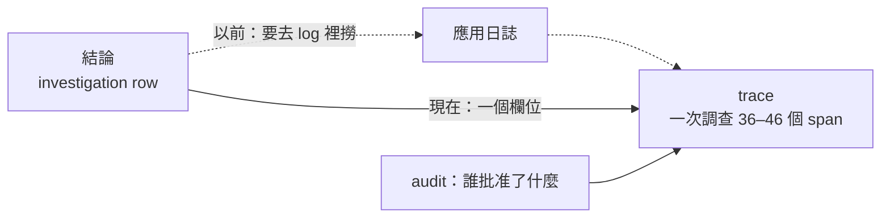
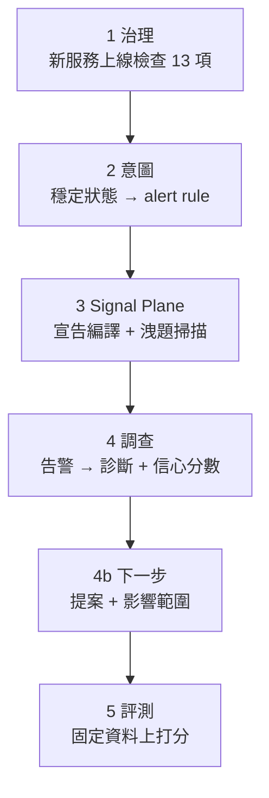
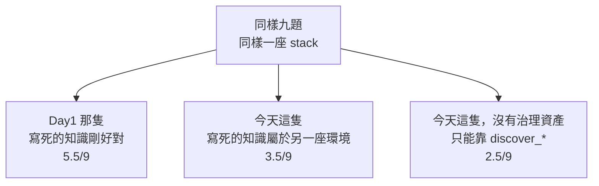

# Day25：整條鏈跑一次，然後用第一天那組題目算總帳

> 每一段單獨跑都是綠的
> 這句話跟「整條鏈是通的」
> 中間隔著一次真的把它們接起來

前面二十四天，每一天都在自己那一段裡驗證自己那一段。今天要把它們接起來跑一次：一個新服務的上線檢查 → 意圖編成告警規則 → 服務自己的宣告編成拓撲 → 一個告警進去，診斷跟下一步建議出來 → 同一隻 agent 對著固定資料被打分。

而在接之前先補一個缺口，因為那條鏈少了它就少一段：從一份結論走回它的推理過程。今天這兩件事各讓我犯了一次同樣的錯，所以放在一起講。

程式碼在範例 repo [`OTel_AIOps_Agent`](https://github.com/tedmax100/OTel_AIOps_Agent) 的 [`ironman-2026/day25/`](https://github.com/tedmax100/OTel_AIOps_Agent/tree/main/ironman-2026/day25)。

## 先問清楚「回放」到底要回答什麼

我大綱裡本來寫好的結論是：`audit.record` 在執行那一側被呼叫了 24 次，寫入類動作每一步都有紀錄，但 `agent.py` 一次都沒有呼叫它，所以「要改叢集」可回放、「怎麼推理出這個結論」不可回放。grep 一次就能得到這個結論，而且它讀起來很有力。**問題是它是錯的。**

寫之前我先把「可回放」拆成六個具體問題，因為這個詞太模糊，模糊的詞很容易讓人用一個模糊的答案打發過去：

1. 它的結論是什麼
2. 它有多少信心
3. 它呼叫了哪些工具、順序是什麼
4. 每一句查詢實際上問了什麼
5. 它做決定之前，模型看到的是什麼
6. 這次調查花了多少 token

前兩題是「結果」，後四題是「過程」。系統裡有三個地方在記東西：investigation 那張表、audit log、以及 agent 自己身為一個被 instrument 的服務所產生的 trace。所以就一個一個問。

## 然後我發現我這幾天的實驗全部沒有 trace

`replay_probe.py` 寫好第一次跑，Tempo 裡什麼都沒有，於是我差點就要收工寫「果然沒有」。

還好停下來想了一下：**這幾天所有的探測腳本，都是我在 host 上直接呼叫 `run_headless()` 的。** 那條路徑沒有經過 `opentelemetry-instrument`，SDK 根本沒有啟動，當然一個 span 也不會產生。叢集裡那個 agent 才是被 instrument 的那一個，而它這幾天沒有被我驅動過任何一次真的調查。

所以要問「決策有沒有被 trace」，得從被 instrument 的服務走進去：

```bash
kubectl -n demo port-forward svc/aiops-agent 8090:8000
curl -X POST localhost:8090/webhook/alert -H 'x-webhook-secret: <secret>' -d '{"alerts":[…]}'
```

日誌立刻就不一樣了，每一行都掛著同一個 trace id：

```console
[trace_id=fe6b426e8e7a63d37d61d4fcc4b07722 span_id=d52c49561f874a4e resource.service.name=aiops-agent]
  - HTTP Request: GET http://prometheus.demo.svc:9090/api/v1/query?query=sum+by+%28git_version…
[trace_id=fe6b426e8e7a63d37d61d4fcc4b07722 …] - rubric: trace ID hallucination detected —
  missing in Tempo: ['4b2a9c8d7e6f5a4b3c2d1e0f9a8b7c6d']
[trace_id=fe6b426e8e7a63d37d61d4fcc4b07722 …] - headless RCA done conf=0.95
```

順帶一提，中間那行是前幾天那個守門在正式路徑上抓到一次真的幻覺，而且是它自己編了一個漂亮的 32 位十六進位。它被擋下來、被要求重查，然後那次調查的結論最後是對的。**兩天前寫的東西在完全沒有預期的情況下上場，這種時刻蠻爽的 :)**

## trace 裡面比我以為的完整得多

把那條 trace 從 Tempo 撈出來：

```console
spans in Tempo for that trace: 46
  by instrumentation: {'fastapi': 4, 'httpx': 12, 'langchain': 30}
   6 ChatGoogleGenerativeAI.chat
   5 execute_task agent
   5 execute_task route_after_agent
   3 execute_task tools
   2 invoke_agent LangGraph
   2 execute_tool query_tempo_traces
   1 execute_tool query_prometheus
```

`opentelemetry-instrumentation-langchain` 把 LangGraph 的每一個 node、每一次工具呼叫、每一次模型呼叫都變成了 span。三十個 span 裡有 `execute_task agent`（模型在想）、`execute_task route_after_agent`（前面畫過的那個條件分支真的走了哪一邊）、`execute_tool ...`（每一次查詢）。前面介紹 agent 迴圈時畫的那張四個 node 的圖，在這裡變成一條可以逐格播放的實際錄影。

打開一個工具 span 看屬性：

```console
execute_tool query_prometheus
    gen_ai.operation.name      = execute_tool
    gen_ai.tool.name           = query_prometheus
    gen_ai.tool.call.arguments = {"input_str": "{'expr': 'sum by (git_version, reason) (rate(…
    gen_ai.tool.call.result    = {"output": {"resultType": "vector", "result": [{"metric":
                                 {"git_version": "v2.5.0", "reason": "new_validator"}…
    gen_ai.task.status         = success
```

模型那一種更完整，`gen_ai.system_instructions`（整份系統 prompt）、`gen_ai.input.messages`（它看到的每一則訊息）、`gen_ai.usage.input_tokens` / `output_tokens` 全都在，還有 LangGraph 自己的 `langgraph_node`、`langgraph_step`。也就是說，那六個問題裡的後四題，答案一直都在 Tempo 裡躺著。

> 這裡有一件事值得記：這些 span 是**別人寫的 instrumentation 幫我產生的**，我沒有為此寫過任何一行程式碼。這正是這系列一直在講的那條因果鏈的另一端：遵守 semantic convention 的好處，是別人做的工具可以直接看懂你的東西。gen_ai 這組慣例還在演進，但它現在已經足夠讓一次 agent 調查被完整重播。

## 那到底缺什麼

缺的東西很小，小到有點好笑：沒有任何欄位把「這個結論」連到「那條 trace」。

investigation 那張表記了 `fp`（fingerprint，Grafana 給同一個告警的識別碼）、時間、結論、信心、governance 決策，但沒有 trace id。audit log 記了誰在什麼時候提了什麼動作，也沒有 trace id。所以要從一份結論走到它的推理過程，唯一的路是去日誌裡用時間或 fp 撈，撈到那行 `trace_id=...`，再貼進 Grafana。



改法是兩個地方各加一行：記錄調查的時候問一次「我現在在哪條 trace 裡」，寫進去；每一筆 audit 進來的時候做同樣的事。它回 `None` 的情況也要處理好，因為那正是我一開始撞到的那種：在 host 上跑、沒有 instrumentation、沒有 trace。拿不到就不寫，不要拋例外，也不要寫一個假的。

接上之後，同一支探測腳本的輸出：

```console
latest investigation: fp=383238a67e692abb ts=2026-08-06T14:12:07Z
  conclusion : High payment decline rate caused by a code regression in version v2.5.0…
  confidence : 0.9
  trace_id   : f1f393acce6a9cdb26d91a1565d4abe0

question                                 where it lives     answerable
--------------------------------------------------------------------------
what did it conclude                     investigation row  yes
how confident was it                     investigation row  yes
which tools did it call, in what order   trace              yes
what exactly did each query ask          trace              yes
what did the model see before it decided trace              yes
how many tokens did it cost              trace              yes

tokens on this investigation: 26123

the tool calls, in order (from the trace alone):
  - query_prometheus: {'expr': 'sum by (git_version, reason) (rate(payment_charges_total…
  - k8s_deployment_status: {'service': 'payment-service'}
  - query_prometheus: {'expr': 'sum by (git_version, reason) (rate(payment_charges_total…
  - query_tempo_traces: {'traceql': '{resource.service.name="payment-service" && status=error}'}
```

> 26,123 個 token 一次調查。這個數字以前也是查不到的，現在它跟推理過程長在同一條 trace 上。真的要上生產環境的話，這個欄位可以直接接成一張「每次告警花多少錢」的儀表板，而且它跟成本中心的關聯是天然的，因為 span 上有 service name ^^

## 接起來：先講順序，因為順序不是我排的

缺口補完，可以接了。



前四段跑在活的 k3d 叢集上，最後一段（評測）會啟動一份預先建好的 stack image，裡面是一組不會再變的資料。這兩件事不能同時發生：那個 image 自己要佔 9090／3100／3200，而前面幾段的 port-forward 佔的正好也是這三個埠。所以 `e2e.sh` 的最後一段做的第一件事，是把前面的 port-forward 全部關掉。這不是設計，是現實逼出來的順序，而它剛好也是對的順序：先在真的環境裡看它會不會動，再到固定資料上量它有多準。

```console
── 1. governance: shipping-v1 onboarding checklist ──
13/13 通過

── 2. intent: steady state -> alert rules ──
  - alert: checkout-success-rate
    expr: sum(rate(orders_attempts_total{app_outcome=~"authorized"}[30m]))
          / sum(rate(orders_attempts_total[30m]))

── 3. signal plane: compile + leak check ──
compiled 5 fragments → topology.yaml (5 nodes, 6 edges, journeys=['checkout'])
                     + contracts.yaml (5 contracts)
runbook payment-bad-deploy matched alertname 'PaymentDeclineRateHigh' only after
  normalization (trigger says 'payment-decline-rate-high') — align the alert rule
  or the runbook trigger
no answer tokens in anything handed to the model.

── 4. investigation: alert -> diagnosis ──
{"accepted":["383238a67e692abb"],"skipped":[]}
conclusion : Code regression in payment-service v2.5.0 introduced a spike in decline
             rate due to the new_validator reason.
confidence : 0.7
trace_id   : abb6fac796db47d684ed5238a5e37b36
next step  : k8s.rollout_undo -> propose

── 4b. next step: the proposal and its footprint ──
action    : k8s.rollout_undo (proposed)
footprint : 2 pod(s), revision 25->24, policy_ok=True
policy    : within policy (affected 2 pod(s), ns demo)

── 5. evaluation: scored against fixed data ──
  payment-decline-service              100% (1/1)   100%   100%   0.90
  user-service-no-incident               0% (0/1)   100%   n/a    0.10
  order-service-discover-before-query    0% (0/1)     0%   n/a    0.60

── end to end ──
6 ok, 0 failed
```

有幾行是這幾天的東西第一次在同一條鏈上一起出現。第三段那句 warning 是前幾天加的：告警名字跟 runbook 的 trigger 拼法不同，比對還是成功了，但它吵了一聲，而那正是這條鏈以前安靜斷掉的地方。第四段的 `trace_id` 是今天上半段補的那個欄位，第 4b 段的 `footprint` 則讓提案跟它的大小終於長在同一行上。

還有第三段最後那句「no answer tokens」，那是洩題掃描的輸出，用來確認交給模型的東西裡沒有答案。**它排在評測前面，是因為在它綠掉之前，第五段那些數字沒有意義。**

## 三個紅燈，沒有一個是主功能壞掉

上面那個 6 ok 是修完的樣子。第一次跑出來是 3 ok / 3 failed，而三個失敗長得完全不一樣。

**第一個是我自己的手藝。** 第 4、4b 兩段是 SyntaxError：我把 JSON 解析寫成 bash 函式裡的 `python3 -c` 字串，跳脫字元疊了三層。修法是把它拆成一支 `report.py`。沒什麼好講的，但它佔掉的時間比後面兩個加起來還多 XD

**第二個是檢查本身錯了。** 第三段的洩題掃描報了兩個 leak：

```
[LEAK] injected #2: ## Runbook diagnostics auto-run: payment-bad-deploy
         culprit version: 'v2.5.0'
           | - result: {"service": "payment-service", …, "git_version": "v2.5.0", "revision": "25", …
```

那個 `v2.5.0` 不是誰寫進 prompt 的，是 runbook 的唯讀診斷當場去叢集查出來的。事故是真的，服務真的跑在 v2.5.0 上，而那支掃描器只認字串，分不出「人寫下的答案」跟「機器量到的事實」。

這件事的意思是：這個檢查只有在事故沒發生的時候才會綠。而它的用途正好是在有事故的環境上驗證量尺，所以它會在最該用的時候變紅。一個在系統正常運作時會亮紅燈的檢查，等於教所有人忽略它。修法是把注入分成兩類：人寫的（schema catalog、契約、runbook 散文）要掃，量出來的（診斷結果、依賴健康、能力快照）標成 `read` 不判：

```console
[ok  ] system prompt (schema catalog)
[ok  ] injected #1: ## Runbook: payment-bad-deploy — payment-service decline-rat
[read] injected #2: ## Runbook diagnostics auto-run: payment-bad-deploy
[read] injected #3: ## Dependency health (live) — payment-service
[ok  ] injected #4: An alert just fired. Investigate the root cause and conclude
```

**第三個是一句話騙了我十分鐘。** 評測那段的 log 洗出一整排：

```
headless: capability snapshot failed for user-service: 2 validation errors for SystemMessage
  content.str Input should be a valid string [input_value=None]
```

我以為 pydantic 出了什麼相容性問題，追進去才發現：`capability_for_services()` 在那個服務沒有任何即時資料的時候，照設計回 `None`，然後 `SystemMessage(content=None)` 才炸掉、被外層 except 抓住、印成 failed。

真相是「這個服務在這份資料裡沒有東西可以列」，一句正常的事實，被寫成一行看起來像 bug 的錯誤。這跟前面那個 Loki 空結果、那個 singleton 拒絕理由是同一種病：**訊息描述的是它撞到的技術現象，不是它遇到的實際情況。**

## 固定資料上的分數，跟活叢集上的不一樣

第五段有一件事要誠實講。同樣三個 fixture：

| fixture | 活的 k3d | 固定 stack image |
| --- | --- | --- |
| payment-decline-service | 2/2 | 1/1 |
| user-service-no-incident | 1/2 | 0/1 |
| order-service-discover-before-query | 2/2 | 0/1 |

那個 stack image 裡沒有 Kubernetes API，所以 k8s 工具全部退化成 unavailable；它的資料也是生成器烘出來的，`order-service` 那些業務指標的形狀跟活叢集不一樣，agent 一路查回空的。

所以這兩個環境量到的不是同一件事。固定資料量的是「同一份輸入下，agent 的行為穩不穩」，活叢集量的是「在會動的真實系統上它撐不撐得住」。我原本以為固定資料是活叢集的嚴格替代品，跑完才知道兩邊都需要。而 fixture 是跟著它被寫出來的環境長的：那兩個 fixture 是對著活叢集寫的，搬到固定資料上，它們量的東西悄悄變了。

> 這件事在真實團隊裡的版本是「在 staging 綠得很漂亮」。差別只在我這裡兩邊都是自己寫的，所以沒有人可以怪 XD

還有一段沒有接上：第四段那些新東西（`trace_id`、提案的 footprint），跑的是我在 host 上起的那份服務，因為叢集裡那個 agent 跑的是舊 image。這條鏈今天是通的，但它通的是「我這台機器上的程式碼」。要讓叢集裡那份也一樣，得重新 build image、推進 k3d、重新部署，而那就是那條從程式碼到跑著的系統之間、永遠會被低估的距離。

## 跑得完不等於做得對，所以回頭算總帳

整條鏈接起來跑得完，是一個很低的標準。這一段走到這裡，講了治理、schema、拓撲、契約、agent、守門、評測，還把人打字那一側補起來。如果這些真的有用，就應該在一張分數表上看得到。

第一天留下的東西一直都在：九題自然語言的根因分析問題、一支不接 LLM 的評分器、真值在打分當下去 stack 現算。今天把同一組題目再考一次。

## 為了讓這個比較成立

比之前得先把兩件事釘住，不然數字沒有意義。

**同一份資料。** 那九題是對著 Day1 那座產生器 stack 寫的，它的指標叫 `http_requests_total`，label 是 `job`。這系列後面用的 demo-services 叢集完全不是這個 schema。所以今天兩隻 agent 都跑在同一個容器上，就是 Day1 那個 image。

**同一支評分器。** `bench/grade.py` 從 `day01/` 直接 import，一個字都沒改，真值一樣在打分當下去 stack 現算。

然後跑三輪：Day1 那隻、今天這隻、以及今天這隻但把治理資產拿掉。

## 數字

同一小時、同一座 stack、每題跑一次：

| | 總分 | metrics | logs | traces |
| --- | --- | --- | --- | --- |
| Day1 那隻（寫死 schema、4 次預算） | **5.5/9** | 1.5 | 1.0 | 3.0 |
| 今天這隻（三次） | **3.5 / 2.5 / 3.5** | 1.0 / 1.0 / 0.5 | 1.0 / 0.0 / 0.0 | 1.5 / 1.5 / 3.0 |
| 今天這隻，拿掉治理資產 | **2.5/9** | 0.5 | 1.0 | 1.0 |

第一行就先打了我一巴掌：Day1 當時記錄的是 4.5/9，同一隻 agent、同一組題目，今天跑出 5.5/9。第二行更清楚，同一份程式碼、同一座 stack、連著跑三次，總分在 2.5 到 3.5 之間跳，logs 那一欄從 1.0 掉到 0.0 然後就留在 0.0。

**LLM 的變異就是這麼大**，所以這裡所有數字都只能當訊號，不能當測量值。這其實是 Day22 那句「一個 fixture 跑兩次講不了穩定度」的另一個版本，而我到最後一天，還是只有一顆種子可以給。

不過在這個雜訊之下，那個排序是穩的：**二十四天之後，今天這隻在這座 stack 上比 Day1 那隻還差。**

## 為什麼

報告裡看得很清楚：

```console
promql-highest-backend-error-ratio  FAIL
  answer: I couldn't find a metric named `http_server_requests_total`.
          Please check the metric name and try again.

traceql-error-chain-orders          PARTIAL
  call: query_tempo_traces {'traceql': '{http.request.method="POST" && …}'}
        -> 400 invalid TraceQL query: unknown identifier: http
  call: query_tempo_traces {'traceql': '{span.http.request.method="POST" && …}'}
```

它去查 `http_server_requests_total`、用 `service_name` 當 label、用 `span.http.request.method` 這種 OTel 語意慣例的屬性名。這些在 demo-services 那座叢集上全部是對的，**在這座 stack 上全部是錯的**。

也就是說，今天這隻 agent 犯的錯，跟 Day1 那隻犯的錯是同一種：**帶著一份寫死的環境知識，自信地查了不存在的東西。** 差別只在 Day1 那隻的寫死知識剛好對應這座 stack（它就是為了這座 stack 寫的），而今天這隻的寫死知識是我這一路做出來的 schema catalog 跟 Signal Plane 契約，對應的是另一座環境。

我第一天在 Day1 罵的那個反面教材，今天是我自己。

有一個地方倒是看得出這幾天的東西有在工作。Day23 那個「空結果自己解釋」的提示，真的出現在它的回答裡：

```console
promql-highest-backend-error-ratio  FAIL
  answer: I'm sorry, I encountered an error when running the query. There were no results,
          and the following hint was returned: "Call discover_metrics(service)…"
```

工具告訴它「這個名字不存在，去 discover」，它把這句話原封不動講給使用者聽，然後就停在那裡。**提示送到了，但它沒有照著做。** 這比它默默重寫一次查詢好一點（至少使用者知道發生什麼事），但離「自己修好」還有一段距離。

## 那把治理拿掉呢

這是我今天做的第三輪，也是唯一能救回一點顏面的一輪：把 schema catalog 換成一段「什麼都不宣稱、請自己 discover」的中性文字，signal context 整段不注入，其他都不動。

結果是 **2.5/9，比帶著錯的治理資產還差一分。**

所以結論不是「治理沒用」，而是更精確的一句：**治理是環境的函數。** 對的環境上它是資產，錯的環境上它是負債，而完全沒有比帶錯的還糟：就算內容是錯的，那份 catalog 至少還教會它「查詢要先想清楚 label 是什麼」這件事的形狀。



這張圖是我這一路做出來的東西裡，最不想承認、但也最有用的一個結論。

## 那今天這隻到底好在哪

上面那組數字量的是「換一座陌生環境」。在它自己的環境上，Day25 那條端到端的鏈給的是另一個答案：

```console
conclusion : Code regression in payment-service v2.5.0 introduced a spike in
             decline rate due to the new_validator reason.
confidence : 0.7
trace_id   : abb6fac796db47d684ed5238a5e37b36
next step  : k8s.rollout_undo -> propose
footprint  : 2 pod(s), revision 25->24, policy_ok=True
```

而且這是在 Day22 把洩題拿掉之後跑的，evaluation 上 payment 那題兩顆種子都對、版本也對。

把兩邊放在一起，這一路真正換到的東西可以講得很具體，而且沒有一項是「分數變高」：

- **答案裡的每一個東西都有地方可以查證。** trace ID 會被守門去 Tempo 對（Day23）、數字要有非空的查詢結果撐著（Day22）、推理過程有一條 trace 可以逐格看（Day25）。
- **「下一步」會連它的大小一起講。** 回滾兩個 pod、revision 25→24、在 policy 範圍內（Day24）。
- **失敗會講話。** 空結果會說哪個 label 不存在（Day23）、alertname 拼法不同會吵一聲（Day24）、prompt 裡有答案會 exit 1（Day22）。
- **表現不好可以歸因。** 以前只能說「它今天怪怪的」，現在可以說「它查回空的之後沒有 discover 就換句話再問」，而那是報表上會自己跳出來的一行（Day22）。

這四項的共同點是：**它們都不是讓 agent 更聰明，是讓它更容易被檢查。**

## 對誰有價值

如果只能講一件事：**新服務要接上這套東西，從「讀十幾篇文件然後問人」變成「跑一支腳本，它會告訴你缺哪一項、下一步做什麼」**（Day12 那 13 項檢查）。平台團隊推得動的東西，通常不是最正確的那個，是成本最低的那個。

第二件事是給值班的人的。凌晨三點那個場景，這一路做的所有事情最後都落在同一句話上：**你不需要相信它，你可以查它。** 一個能被檢討的 agent 可以慢慢變好，一個查不出原因的 agent 只會在第二次出錯之後被關掉。

第三件事是給我自己的。這系列有一半的內容是我踩到的坑：`-r .` 的假綠燈、policy 只比名字前綴、洩題寫在 catalog 裡、守門看不到一到三成的 trace ID、影響範圍在人同意之後才算、以及今天這個。**把坑寫出來的成本是難堪，收益是它不會再吃我一次。**

## 還缺什麼

分兩類。第一類是能補只是還沒補的，全部來自前面每一天的「今天沒做的事」：

- `regress.sh`、`leakcheck.py`、`e2e.sh` 都沒進 CI，所以它們現在都是「我記得跑」的東西
- `eval/fixtures.yaml` 只有三個 case，而且其中兩個換到固定資料上就失效（Day25）
- `baseline.json` 還是舊的，回歸目前沒有基準可比
- Tempo 只留一小時，超過一小時的事故，第四步抓 trace 結構上必失敗（Day21），而昨天的推理過程今天也已經沒了（Day25）
- 提案的範圍存進去了，但 plugin 還沒把它畫在卡片上（Day24）
- judge 的判決沒有進評測，「judge 準不準」還是手動跑一批案例（Day23）
- 只有兩種動作有乾跑，沒有乾跑的動作會直接跳過那道門（Day24）
- 叢集裡的 image 比程式碼舊（Day25）

第二類是結構性的，要下一個系列才處理：

- **信心分數還沒有被校準。** 0.7 這個數字現在只是模型自己講的，沒有人回頭統計「它說 0.7 的時候實際上對幾成」。`calibration.py` 已經在 repo 裡了。
- **授權層級沒有真的分級。** `governance.py` 會依信心跟校準決定 AUTO / PROPOSE / ESCALATE，但 `actions_enabled` 一直是關的，所以那條路徑從來沒有被走過（Day23 那個安靜的洞就是這個）。
- **回饋迴圈沒有閉合。** 過去事故庫從 Day21 到今天都是空的，agent 每次調查都像第一次。

上面這三件事對應到的四支檔案（`governance.py`／`calibration.py`／`breaker.py`／`action_requests.py`）其實都已經在 repo 裡躺著，我刻意沒有展開它們，因為要先把校準跟授權層級講清楚，這些程式碼才有意義。

## 小結

總結來說，今天做了兩件本來是分開的事：把六段接起來跑一次，然後用第一天那把尺量今天這隻 agent。

第一件事的價值不在它跑得完，在那三個紅燈——沒有一個是主功能壞掉，全部是「寫好了但沒有在跑」或「跑了但沒有人讀」。第二件事的價值更彆扭一點：分數退步了，而退步的原因不是 agent 變笨，是我做的治理資產屬於另一座環境。

一把尺量出一個比較低的分數，然後我們有辦法解釋它為什麼低，這比一個變高的分數有用。

> 這一整段最常出現的句型是「它其實有做，只是沒有人在讀」。
> 寫到後來我開始懷疑，這系列真正的主題根本不是 agent，是**沒有人在讀** QQ
