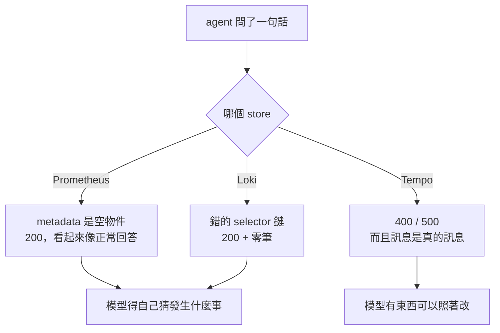

> 三個 store 都會拒絕你
> 只是有兩個拒絕得很有禮貌
> 禮貌到你以為它答應了

昨天新加的那個 fixture 兩次都失敗，兩次都是同一個動作：一句查詢回空的，然後它換一句查詢再問一次。當時我把這件事記在 agent 頭上，說它沒有先 discover。今天回頭看工具那一側，發現這個帳算得有點快：**那個空結果本身，什麼也沒告訴它。**

今天的主角是 `app/tools/query.py`，agent 直接打 Prometheus / Loki / Tempo 原生 HTTP API 的那 539 行。

程式碼在範例 repo [`OTel_AIOps_Agent`](https://github.com/tedmax100/OTel_AIOps_Agent) 的 [`ironman-2026/day25/`](https://github.com/tedmax100/OTel_AIOps_Agent/tree/main/ironman-2026/day25)。

## 先量，不要相信自己寫過的註解

`query.py` 的 docstring 開頭列了一份「對著 live stack 探過」的怪癖清單，是我當初一邊撞一邊記的。今天要動這個檔案，第一件事是把那份清單重跑一次，因為版本會變、行為會變，而**一份沒有人重跑過的怪癖清單，跟一份猜出來的沒有差別**。

`probe_apis.py` 就是那份清單的可執行版本：每個怪癖給兩個呼叫，天真的那個跟會動的那個並排。不經過 agent、不花 token，因為這些是 store 的性質，跟模型怎麼想無關。

```console
$ uv run python ../../otel-aiops-agent/ironman-2026/day25/probe_apis.py

Prometheus — 'what metrics does this service have?'
GET /api/v1/metadata           -> 200 {"status":"success","data":{}}
GET /api/v1/targets            -> 200 {"status":"success","data":{"activeTargets":[],…}}
GET /api/v1/series?match[]=…   -> 200, 25 distinct metric name(s)

Loki — the selector key
{service="payment-service"}              -> 200, 0 stream(s)
{service_name="payment-service"}         -> 200, 5 stream(s)

Tempo — three ways to get it wrong, all of them loud
start/end in nanoseconds   -> 400 invalid start: strconv.ParseInt: parsing "1786019415980873984": value out of range
Loki's label name          -> 400 invalid TraceQL query: parse error at line 1, col 2: syntax error: unexpected IDENTIFIER
status as a string         -> 500 binary operations must operate on the same type: status = `error`
the one that works         -> 200, 20 trace(s)
```

先講一個我自己寫錯的地方。docstring 裡寫「Loki 的 `start`/`end` 不給奈秒會靜默回空」，這一版的 Loki（3.2.0）兩種單位都收，同一個窗回同一組欄位。那句話在我寫下它的當下大概是對的，現在不是了，所以今天順手改掉。**會過期的不只是連結，還有你對工具行為的記憶。**

真正該記在清單上的是另一條：selector 鍵寫成 `service` 的時候，Loki 回 200，回零筆，沒有任何一個欄位在說「這個標籤我沒有索引」。

## 兩種靜默、一種吵鬧

把上面那三段排在一起會看到一個形狀：



Prometheus 的 `/api/v1/metadata` 在 OTel remote-write 之下永遠是 `{}`，`/api/v1/targets` 也是空的（因為沒有人在 scrape，資料是被推進來的）。這兩個端點正是「這個服務有哪些指標」最直覺的問法，而它們的回答是一個語法完全正確的空物件。要拿到真的答案得繞去 `/api/v1/series?match[]=...`，那才是 `discover_metrics` 在做的事，25 個指標名字是這樣來的。

Loki 那個更兇一點，因為 `{service="payment-service"}` 是一句**完全合法**的 LogQL，它只是永遠不會匹配到東西。Day1 那隻 agent 就死在這裡，昨天那個 fixture 也是。

Tempo 三種寫法全部大聲拒絕，連時間單位給錯都會回一個 `value out of range`。三個 store 裡它最不客氣，但**對一個要自己修正的 agent 來說，會吵的那個才是最好的介面**。

> 這件事在人身上也一樣。一個查不到東西就回空表格的 dashboard，跟一個明講「你這個 label 不存在」的錯誤訊息，值班的時候後者省下來的時間不是幾分鐘的等級。只是我們平常太習慣前者了 XD

## 那就讓空結果自己解釋

治理那一段講過一句話：**一道 gate 擋下來之後如果還要平台團隊親自去解釋，它的維護成本會隨團隊數線性成長。** 工具是同一個道理，只是對面那個「使用者」是模型。一個回空的工具如果不說明為什麼空，代價就是模型多花一次呼叫去猜，而預算只有六次。

所以 `query.py` 這天多了兩個小函式，只在結果是空的時候才跑：

- Prometheus：把 expression 裡用到的指標名字抓出來，跟 `/api/v1/label/__name__/values` 對一次。名字根本不存在，就直說；名字存在，那問題在 matcher 或時間窗，也直說。
- Loki：把 selector 裡的鍵抓出來，跟 `/loki/api/v1/labels` 對一次，指名哪個鍵不是可索引標籤，並把可索引的那五個列出來。

```console
{'resultType': 'matrix_summary', 'result': [],
 'note': 'No such metric in Prometheus: payment_declines_total.',
 'hint': 'Call discover_metrics(service) for the names this service really emits — '
         'rewording this query will return empty again.'}

{'resultType': 'streams', 'result': [],
 'note': 'Not an indexable stream label: service. Indexable labels here: '
         'deployment_environment, git_repo, git_version, service_name, service_namespace.',
 'hint': 'Everything else (event, trace_id, business fields) is structured metadata — '
         'filter it AFTER the selector with `| field="..."`. discover_log_fields(service) …'}
```

兩條都 fail-open。多打的那一次 metadata 查詢如果失敗，空結果就照原樣回去，不會因為補不到一句提示而讓整個工具呼叫炸掉。**提示是加值，不是前提。**

順帶一提，那句 `hint` 裡明講「rewording this query will return empty again」是刻意的。昨天那兩次失敗都是換句話再問，所以這句話直接對著那個行為講。

## 改防呆的時候，才看到空結果其實不空

寫測試的時候我把那個 Loki 空回應整包印出來，發現它有將近三千個字元。裡面沒有半行 log，全部是 `stats`：快取命中數、下載的 chunk bytes、各層的耗時，而且因為什麼都沒查到，數字全是 0。

```
with stats: 2892 B   |   without: 39 B
```

**一則「我什麼都沒找到」的回答，用了 2,892 個字元。** 這包東西是給 Grafana 畫查詢統計用的，對 agent 來說是純雜訊，但它會照樣進到對話裡、照樣算 token、照樣稀釋掉旁邊那些真的有訊息的字。丟掉之後剩 39 B，補上 `note` 跟 `hint` 之後 404 B，而這 404 B 每個字都在講事情。

這種東西不會有人抱怨，因為它不會壞。它只是讓每一輪對話都胖一點，然後在某一次長調查裡把有用的上下文擠掉。

## 錯誤訊息要指名要改哪個字

Tempo 那一側的問題不是不吭聲，是它的訊息是寫給已經懂 TraceQL 的人看的。`unexpected IDENTIFIER` 沒有告訴你 `service_name` 在這裡該寫成 `resource.service.name`；`binary operations must operate on the same type` 沒有告訴你把 `error` 的引號拿掉。

而這兩個錯，都是昨天 A/B 那兩份逐字稿裡真的出現過的。模型腦袋裡「服務的標籤叫什麼」只有一份，跨三個 store 共用，所以它在 Tempo 裡寫了 Loki 的名字。

所以今天把 `_tempo_query_hint` 從一段固定文字改成會讀查詢內容的東西：

```python
_TEMPO_RENAMES = {
    "service_name": "resource.service.name",
    "service": "resource.service.name",
    "git_version": "resource.service.version",
    "http_route": "span.http.route",
    "http_status_code": "span.http.status_code",
}
```

```console
returned 400: parse error at line 1, col 2: unexpected IDENTIFIER
HINT: TraceQL predicates go inside braces, … attribute names are dotted and scoped …
This query uses the name it has in Prometheus/Loki, not in Tempo:
  `service_name` -> `resource.service.name`.
`status` is an intrinsic enum, not a string: write `status=error` (no quotes).
```

改的過程還撿到一個純粹的 bug。舊的守衛是「訊息裡要有 `400` 或 `parse` 才給提示」，而 `status="error"` 那個錯誤回的是 **500**，訊息裡也沒有 `parse` 這個字。也就是說最常見的那個寫法錯誤，一直是整段跳過提示直接丟回去的 :(

## 那分數呢

把改動放上去之後，昨天 0/2 的那個 fixture 兩次都過了：

```console
$ uv run python -m app.eval run -n 2 --only order-service-discover-before-query
  order-service-discover-before-query   100% (2/2)    100%    n/a   0.70    0
```

看起來很好，但我去把逐字稿抓出來看了一次：

```console
0. query_prometheus [ok]  sum by (git_version, reason) (rate(orders_total{...}[5m]))
1. github_compare [ok]
2. k8s_pod_status [ok]  order-service
3. query_tempo_traces [error]  { resource.service.name = "order-service" status = "error" }
```

四次呼叫沒有任何一次拿到空結果，所以今天寫的那兩段提示**一次都沒有觸發**。分數會變好，比較可能是因為這次跑的時候 order-service 有活的流量、昨天那個時段沒有。

所以正確的講法是：這個 fixture 今天是綠的，但**它綠的原因不是我今天做的事**。要證明因果，得讓兩次跑的資料條件一樣，而這件事現在做不到，因為 fixture 的時鐘是 `now`，而 `now` 的資料每分鐘都在變。這是評測本身的缺口，不是 agent 的。

> 我本來已經在腦袋裡寫好一段「工具講清楚之後，agent 就會做對」的漂亮結論了。抓逐字稿只是想補一張圖，結果補出一個反例 QQ

## 對值班的人來說差在哪

這幾個改動聽起來都很小，一句 note、一段 hint、丟掉一包 stats。但把它們放回半夜三點那個場景就不小。

agent 手上只有六次工具呼叫。一次空查詢如果沒有人解釋，它最好的情況是花第二次去 discover，最壞的情況是連著三次都在換句話問同一個不存在的名字，然後拿著三個空結果去寫結論。**而那個結論會長得跟一份查得很認真的結論一模一樣**，因為空結果不會在回答裡留下疤痕。

現在至少那句「你這個標籤不是可索引標籤，可索引的是這五個」會進到對話裡。它不保證模型會照做，但**它把「模型猜錯了」跟「沒有人告訴過它」這兩件事分開了**，而這條界線就是昨天那個評測想量的東西。

## 今天沒做的事

- **byte cap 的三個常數沒有被驗證過。** Loki 8 KB、Tempo 8 KB、Prometheus 16 KB 是當初拍的，今天量到一次 72 KB 壓成 5 KB，但「壓多少才不影響判斷」沒有實驗。
- **`_summarize_series_result` 會丟掉尖峰的形狀。** 它保留 last/min/max/avg 加最多八個取樣點，序列夠平的時候連取樣點都不留。一個持續五分鐘的尖峰在 6 小時的窗裡會不會被抹掉，我沒有測。
- **空結果的提示只做了 Prometheus 跟 Loki。** Tempo 的空結果（查得到語法、查不到 trace）目前還是裸的，而昨天已經知道那常常是保留期到了，不是真的沒有。
- **沒辦法證明今天的改動有沒有用。** fixture 的時鐘是 `now`，兩次跑的資料不一樣。要做 A/B 得先有一份不會動的資料。

## 小結

總結來說，今天大部分時間花在讀三個 store 的臉色，而不是寫程式。Prometheus 跟 Loki 會用一個語法正確的空回答打發你，Tempo 會直接罵人但罵的是行話，三種都不是能直接拿來行動的東西，得由工具那一層翻譯過。真正的收穫是把「模型猜錯」跟「沒人告訴它」分開了：以前這兩種失敗在報表上長得一樣，現在前者還是 agent 的問題，後者是我的問題。至於今天的改動到底讓分數變好了沒有，老實說量不出來，因為我的 fixture 還吃著會流動的資料。

> 「工具講清楚，agent 就會做對」這句話我今天差點就寫進小結了。
> 幸好多跑了一次逐字稿。
