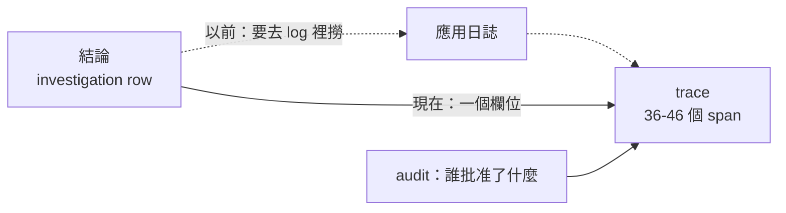
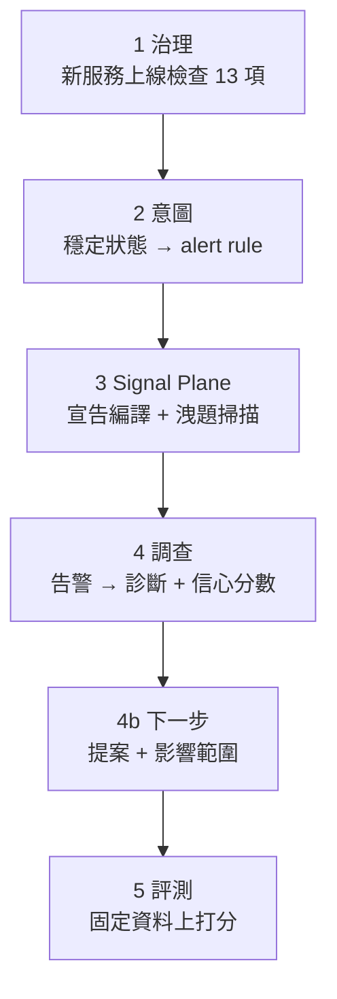

# Day25：從結論走回推理過程，然後把六段接起來跑一次

> 每一段單獨跑都是綠的
> 這句話跟「整條鏈是通的」
> 中間隔著一次真的把它們接起來

前面二十四天，每一天都在自己那一段裡驗證自己那一段。今天要把它們接起來跑一次：一個新服務的上線檢查 → 意圖編成告警規則 → 服務自己的宣告編成拓撲 → 一個告警進去，診斷跟下一步建議出來 → 同一隻 agent 對著固定資料被打分。

而在接之前先補一個缺口，因為那條鏈少了它就少一段：從一份結論走回它的推理過程。今天這兩件事各讓我犯了一次同樣的錯，所以放在一起講。

程式碼在範例 repo [`OTel_AIOps_Agent`](https://github.com/tedmax100/OTel_AIOps_Agent) 的 [`ironman-2026/day25/`](https://github.com/tedmax100/OTel_AIOps_Agent/tree/main/ironman-2026/day25)。

## 先問清楚「回放」到底要回答什麼

我大綱裡本來寫好的結論是：`audit.record` 在執行那一側被呼叫了 24 次，寫入類動作每一步都有紀錄，但 `agent.py` 一次都沒有呼叫它，所以「要改叢集」可回放、「怎麼推理出這個結論」不可回放。grep 一次就能得到這個結論，而且它讀起來很有力。**問題是它是錯的。**

寫之前我先把「可回放」拆成六個具體問題，因為這個詞太模糊，模糊的詞很容易讓人用一個模糊的答案打發過去：

1. 它的結論是什麼
2. 它有多少信心
3. 它呼叫了哪些工具、順序是什麼
4. 每一句查詢實際上問了什麼
5. 它做決定之前，模型看到的是什麼
6. 這次調查花了多少 token

前兩題是「結果」，後四題是「過程」。系統裡有三個地方在記東西：investigation 那張表、audit log、以及 agent 自己身為一個被 instrument 的服務所產生的 trace。所以就一個一個問。

## 然後我發現我這幾天的實驗全部沒有 trace

`replay_probe.py` 寫好第一次跑，Tempo 裡什麼都沒有，於是我差點就要收工寫「果然沒有」。

還好停下來想了一下：**這幾天所有的探測腳本，都是我在 host 上直接呼叫 `run_headless()` 的。** 那條路徑沒有經過 `opentelemetry-instrument`，SDK 根本沒有啟動，當然一個 span 也不會產生。叢集裡那個 agent 才是被 instrument 的那一個，而它這幾天沒有被我驅動過任何一次真的調查。

所以要問「決策有沒有被 trace」，得從被 instrument 的服務走進去：

```bash
kubectl -n demo port-forward svc/aiops-agent 8090:8000
curl -X POST localhost:8090/webhook/alert -H 'x-webhook-secret: <secret>' -d '{"alerts":[…]}'
```

日誌立刻就不一樣了，每一行都掛著同一個 trace id：

```console
[trace_id=fe6b426e8e7a63d37d61d4fcc4b07722 span_id=d52c49561f874a4e resource.service.name=aiops-agent]
  - HTTP Request: GET http://prometheus.demo.svc:9090/api/v1/query?query=sum+by+%28git_version…
[trace_id=fe6b426e8e7a63d37d61d4fcc4b07722 …] - rubric: trace ID hallucination detected —
  missing in Tempo: ['4b2a9c8d7e6f5a4b3c2d1e0f9a8b7c6d']
[trace_id=fe6b426e8e7a63d37d61d4fcc4b07722 …] - headless RCA done conf=0.95
```

順帶一提，中間那行是前幾天那個守門在正式路徑上抓到一次真的幻覺，而且是它自己編了一個漂亮的 32 位十六進位。它被擋下來、被要求重查，然後那次調查的結論最後是對的。**兩天前寫的東西在完全沒有預期的情況下上場，這種時刻蠻爽的 :)**

## trace 裡面比我以為的完整得多

把那條 trace 從 Tempo 撈出來：

```console
spans in Tempo for that trace: 46
  by instrumentation: {'fastapi': 4, 'httpx': 12, 'langchain': 30}
   6 ChatGoogleGenerativeAI.chat
   5 execute_task agent
   5 execute_task route_after_agent
   3 execute_task tools
   2 invoke_agent LangGraph
   2 execute_tool query_tempo_traces
   1 execute_tool query_prometheus
```

`opentelemetry-instrumentation-langchain` 把 LangGraph 的每一個 node、每一次工具呼叫、每一次模型呼叫都變成了 span。三十個 span 裡有 `execute_task agent`（模型在想）、`execute_task route_after_agent`（前面畫過的那個條件分支真的走了哪一邊）、`execute_tool ...`（每一次查詢）。前面畫的那張四個 node 的圖，在這裡是一條可以逐格播放的實際錄影。

打開一個工具 span 看屬性：

```console
execute_tool query_prometheus
    gen_ai.operation.name      = execute_tool
    gen_ai.tool.name           = query_prometheus
    gen_ai.tool.call.arguments = {"input_str": "{'expr': 'sum by (git_version, reason) (rate(…
    gen_ai.tool.call.result    = {"output": {"resultType": "vector", "result": [{"metric":
                                 {"git_version": "v2.5.0", "reason": "new_validator"}…
    gen_ai.task.status         = success
```

模型那一種更完整，`gen_ai.system_instructions`（整份系統 prompt）、`gen_ai.input.messages`（它看到的每一則訊息）、`gen_ai.usage.input_tokens` / `output_tokens` 全都在，還有 LangGraph 自己的 `langgraph_node`、`langgraph_step`。也就是說，那六個問題裡的後四題，答案一直都在 Tempo 裡躺著。

> 這裡有一件事值得記：這些 span 是**別人寫的 instrumentation 幫我產生的**，我沒有為此寫過任何一行程式碼。這正是這系列一直在講的那條因果鏈的另一端：遵守 semantic convention 的好處，是別人做的工具可以直接看懂你的東西。gen_ai 這組慣例還在演進，但它現在已經足夠讓一次 agent 調查被完整重播。

## 那到底缺什麼

缺的東西很小，小到有點好笑：沒有任何欄位把「這個結論」連到「那條 trace」。

investigation 那張表記了 fp、時間、結論、信心、governance 決策，但沒有 trace id。audit log 記了誰在什麼時候提了什麼動作，也沒有 trace id。所以要從一份結論走到它的推理過程，唯一的路是去日誌裡用時間或 fp 撈，撈到那行 `trace_id=...`，再貼進 Grafana。



改法是兩個地方各加一行：記錄調查的時候問一次「我現在在哪條 trace 裡」，寫進去；每一筆 audit 進來的時候做同樣的事。它回 `None` 的情況也要處理好，因為那正是我一開始撞到的那種：在 host 上跑、沒有 instrumentation、沒有 trace。拿不到就不寫，不要拋例外，也不要寫一個假的。

接上之後，同一支探測腳本的輸出：

```console
latest investigation: fp=383238a67e692abb ts=2026-08-06T14:12:07Z
  conclusion : High payment decline rate caused by a code regression in version v2.5.0…
  confidence : 0.9
  trace_id   : f1f393acce6a9cdb26d91a1565d4abe0

question                                 where it lives     answerable
--------------------------------------------------------------------------
what did it conclude                     investigation row  yes
how confident was it                     investigation row  yes
which tools did it call, in what order   trace              yes
what exactly did each query ask          trace              yes
what did the model see before it decided trace              yes
how many tokens did it cost              trace              yes

tokens on this investigation: 26123

the tool calls, in order (from the trace alone):
  - query_prometheus: {'expr': 'sum by (git_version, reason) (rate(payment_charges_total…
  - k8s_deployment_status: {'service': 'payment-service'}
  - query_prometheus: {'expr': 'sum by (git_version, reason) (rate(payment_charges_total…
  - query_tempo_traces: {'traceql': '{resource.service.name="payment-service" && status=error}'}
```

> 26,123 個 token 一次調查。這個數字以前也是查不到的，現在它跟推理過程長在同一條 trace 上。真的要上生產環境的話，這個欄位可以直接接成一張「每次告警花多少錢」的儀表板，而且它跟成本中心的關聯是天然的，因為 span 上有 service name ^^

## 接起來：先講順序，因為順序不是我排的

缺口補完，可以接了。



前四段跑在活的 k3d 叢集上，最後一段會啟動預先建好的 stack image。這兩件事不能同時發生，因為那個 image 自己要佔 9090／3100／3200，正好是前面幾段 port-forward 用的埠。所以 `e2e.sh` 的最後一段做的第一件事是把 port-forward 關掉。這不是設計，是現實逼出來的順序，而它剛好也是對的順序：先在真的環境裡看它會不會動，再到固定資料上量它有多準。

```console
── 1. governance: shipping-v1 onboarding checklist ──
13/13 通過

── 2. intent: steady state -> alert rules ──
  - alert: checkout-success-rate
    expr: sum(rate(orders_attempts_total{app_outcome=~"authorized"}[30m]))
          / sum(rate(orders_attempts_total[30m]))

── 3. signal plane: compile + leak check ──
compiled 5 fragments → topology.yaml (5 nodes, 6 edges, journeys=['checkout'])
                     + contracts.yaml (5 contracts)
runbook payment-bad-deploy matched alertname 'PaymentDeclineRateHigh' only after
  normalization (trigger says 'payment-decline-rate-high') — align the alert rule
  or the runbook trigger
no answer tokens in anything handed to the model.

── 4. investigation: alert -> diagnosis ──
{"accepted":["383238a67e692abb"],"skipped":[]}
conclusion : Code regression in payment-service v2.5.0 introduced a spike in decline
             rate due to the new_validator reason.
confidence : 0.7
trace_id   : abb6fac796db47d684ed5238a5e37b36
next step  : k8s.rollout_undo -> propose

── 4b. next step: the proposal and its footprint ──
action    : k8s.rollout_undo (proposed)
footprint : 2 pod(s), revision 25->24, policy_ok=True
policy    : within policy (affected 2 pod(s), ns demo)

── 5. evaluation: scored against fixed data ──
  payment-decline-service              100% (1/1)   100%   100%   0.90
  user-service-no-incident               0% (0/1)   100%   n/a    0.10
  order-service-discover-before-query    0% (0/1)     0%   n/a    0.60

── end to end ──
6 ok, 0 failed
```

有幾行是這幾天的東西第一次在同一條鏈上一起出現。第三段那句 warning 是前幾天加的：告警名字跟 runbook 的 trigger 拼法不同，比對還是成功了，但它吵了一聲，而那正是這條鏈以前斷掉的地方。第四段的 `trace_id` 是今天上半段加的那個欄位，第 4b 段的 `footprint` 讓提案跟它的大小終於在同一行上。而第三段那句「no answer tokens」是洩題掃描：在打分之前先確認 prompt 裡沒有答案，**它排在評測前面，是因為在它綠掉之前，第五段那些數字沒有意義。**

## 三個紅燈，沒有一個是主功能壞掉

上面那個 6 ok 是修完的樣子。第一次跑出來是 3 ok / 3 failed，而三個失敗長得完全不一樣。

**第一個是我自己的手藝。** 第 4、4b 兩段是 SyntaxError：我把 JSON 解析寫成 bash 函式裡的 `python3 -c` 字串，跳脫字元疊了三層。修法是把它拆成一支 `report.py`。沒什麼好講的，但它佔掉的時間比後面兩個加起來還多 XD

**第二個是檢查本身錯了。** 第三段的洩題掃描報了兩個 leak：

```
[LEAK] injected #2: ## Runbook diagnostics auto-run: payment-bad-deploy
         culprit version: 'v2.5.0'
           | - result: {"service": "payment-service", …, "git_version": "v2.5.0", "revision": "25", …
```

那個 `v2.5.0` 不是誰寫進 prompt 的，是 runbook 的唯讀診斷當場去叢集查出來的。事故是真的，服務真的跑在 v2.5.0 上，而那支掃描器只認字串，分不出「人寫下的答案」跟「機器量到的事實」。

這件事的意思是：這個檢查只有在事故沒發生的時候才會綠。而它的用途正好是在有事故的環境上驗證量尺，所以它會在最該用的時候變紅。一個在系統正常運作時會亮紅燈的檢查，等於教所有人忽略它。修法是把注入分成兩類：人寫的（schema catalog、契約、runbook 散文）要掃，量出來的（診斷結果、依賴健康、能力快照）標成 `read` 不判：

```console
[ok  ] system prompt (schema catalog)
[ok  ] injected #1: ## Runbook: payment-bad-deploy — payment-service decline-rat
[read] injected #2: ## Runbook diagnostics auto-run: payment-bad-deploy
[read] injected #3: ## Dependency health (live) — payment-service
[ok  ] injected #4: An alert just fired. Investigate the root cause and conclude
```

**第三個是一句話騙了我十分鐘。** 評測那段的 log 洗出一整排：

```
headless: capability snapshot failed for user-service: 2 validation errors for SystemMessage
  content.str Input should be a valid string [input_value=None]
```

我以為 pydantic 出了什麼相容性問題，追進去才發現：`capability_for_services()` 在那個服務沒有任何即時資料的時候，照設計回 `None`，然後 `SystemMessage(content=None)` 才炸掉、被外層 except 抓住、印成 failed。

真相是「這個服務在這份資料裡沒有東西可以列」，一句正常的事實，被寫成一行看起來像 bug 的錯誤。這跟前面那個 Loki 空結果、那個 singleton 拒絕理由是同一種病：**訊息描述的是它撞到的技術現象，不是它遇到的實際情況。**

## 固定資料上的分數，跟活叢集上的不一樣

第五段有一件事要誠實講。同樣三個 fixture：

| fixture | 活的 k3d | 固定 stack image |
| --- | --- | --- |
| payment-decline-service | 2/2 | 1/1 |
| user-service-no-incident | 1/2 | 0/1 |
| order-service-discover-before-query | 2/2 | 0/1 |

那個 stack image 裡沒有 Kubernetes API，所以 k8s 工具全部退化成 unavailable；它的資料也是生成器烘出來的，`order-service` 那些業務指標的形狀跟活叢集不一樣，agent 一路查回空的。

所以這兩個環境量到的不是同一件事。固定資料量的是「同一份輸入下，agent 的行為穩不穩」，活叢集量的是「在會動的真實系統上它撐不撐得住」。我原本以為固定資料是活叢集的嚴格替代品，跑完才知道兩邊都需要。而 fixture 是跟著它被寫出來的環境長的：那兩個 fixture 是對著活叢集寫的，搬到固定資料上，它們量的東西悄悄變了。

> 這件事在真實團隊裡的版本是「在 staging 綠得很漂亮」。差別只在我這裡兩邊都是自己寫的，所以沒有人可以怪 XD

還有一段沒有接上：第四段那些新東西（`trace_id`、提案的 footprint），跑的是我在 host 上起的那份服務，因為叢集裡那個 agent 跑的是舊 image。這條鏈今天是通的，但它通的是「我這台機器上的程式碼」。要讓叢集裡那份也一樣，得重新 build image、推進 k3d、重新部署，而那就是那條從程式碼到跑著的系統之間、永遠會被低估的距離。

## 對值班的人來說差在哪

事後檢討會上最常出現的一句話是「它為什麼會這樣判斷」。沒有那個 trace 欄位的時候，這句話的成本是：先在 investigation 列表找到那次調查，抄下 fp 跟時間，去 Loki 撈那段時間的 agent 日誌，找到 trace id，貼進 Grafana，然後才開始看。這中間任何一步斷掉（日誌輪替、時間對不上、fp 不知道去哪找），這個問題就變成無解，而無解的下場通常是「那就不要相信它了」。有那個欄位之後，這句話的成本是一個連結。**而這個差別會決定一件事：出事之後，這個 agent 是被檢討，還是被移除。**

把六段拼起來之後，這條鏈能替值班的人回答的問題是這樣一串：告警燒起來 → 三十秒後有一個結論跟一個信心分數 → 旁邊有一個「下一步做什麼」的提案，寫著它會換掉兩個 pod、從 revision 25 回到 24、在 policy 範圍內 → 而如果你不信，有一個 trace id 可以打開看它是怎麼想的 → 而如果你想知道它平常準不準，有一組 fixture 的分數可以看。沒有任何一段是「相信它」，每一段都給了一個可以自己去查的東西，這是這系列從第一天那個憑空生出 814 的 agent 走到今天，唯一真正想換到的東西。

反過來說也有代價要誠實講：那條 trace 裡有完整的系統 prompt 跟每一則訊息。前面撞過一次類似的事（live-check 吃到自己 coding agent 的遙測，裡面有 PII）。推理過程可回放，等於推理過程可外洩，這件事在真的環境裡要先想清楚保存期限跟誰能看。

## 今天沒做的事

- **plugin 還沒把那個連結畫出來。** 欄位存進去了，但 investigation 列表上還沒有一個「看它怎麼想的」按鈕。
- **Tempo 只留一小時。** 這是前面就記過的帳，而它在這裡的意思是：昨天那次調查的推理過程，今天已經沒了。要留住得改保留期，或把 span 另外落地。
- **叢集裡的 image 是舊的。** 這條鏈今天證明的是程式碼，不是部署。
- **`agent.py` 還是一次都沒有呼叫 `audit.record`。** 我原本以為這是問題，現在覺得未必：推理過程有 trace，而 audit 是給「誰動了叢集」用的。但兩者的職責分界目前只寫在我腦子裡，沒有寫在程式碼裡。
- **第五段只有一顆種子。** 為了讓整條鏈在一次 demo 裡跑完，`-n 1`，所以那三個數字只能當訊號。
- **固定資料上的兩個 fixture 還是紅的**，而且紅的原因是資料形狀不同，不是 agent 變差。
- **這支 `e2e.sh` 沒有進 CI。** 它現在是「我手動跑一次」的東西，而依賴鏈這麼長的腳本，沒有人定期跑它就會壞在下一次。
- **沒有量 instrumentation 的開銷。** 36 到 46 個 span、每個模型 span 都帶著完整 prompt，這在高頻告警下的體積跟成本我沒有量。

## 小結

總結來說，今天最有價值的兩個資訊都是「我差點沒去量」的東西。上半段那個 grep 的結論看起來很有力，而且我第一次跑探測拿到空結果的時候，它還被「證實」了一次；下半段第一次跑出來的 3 ok / 3 failed，三個紅燈裡一個是我的手藝、一個是檢查器自己的判準錯了、一個是錯誤訊息在說謊，沒有一個是主要功能壞掉，但它們單獨跑的時候全部都是綠的。

兩件事其實是同一件：**推論很便宜，而它最會配合你已經想好的結論。** 每一段都通不代表接起來也通，程式碼裡沒有那個呼叫不代表那件事沒有被記錄，這兩句都只能用一次真的跑來證明。

> 這系列寫到現在，我最常犯的錯不是查錯資料，是先想好結論再去找證據，而空結果最會配合這種人 QQ
> 另外這條鏈跑通之後我才發現，這幾天所有的驗證都是從告警那頭進去的。人在 Grafana 打字的那一頭，其實還缺了一段 :(
