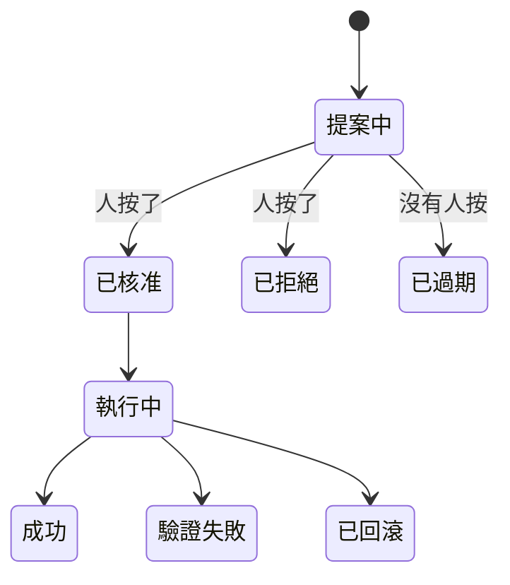

# Day26：建議之後呢，四個平面跟一條沒有人走完過的光譜

> 一個沒有人按過的開關
> 跟一個不存在的開關
> 平常看起來完全一樣
> 只有在事故當下才分得出來

昨天用第一天那組題目重算了一次總分，把前面那條「治理 → 資料 → 判斷」的鏈收乾淨了。收尾的時候剩下三句話沒有處理：信心分數沒有被校準過、授權層級一次都沒走完、人介入之後的回饋沒有回到系統裡。接下來這段就是去處理那三句。

今天不動手。沒有指令、沒有輸出、也沒有程式碼連結。要花一整天講結構，是因為後面每一天都是在填同一張圖裡的某一格，那張圖如果不先畫出來，接下來就會變成邊做邊定義新名詞。

還有一件事得先講，因為它會改變你讀後面這幾天的方式：**從今天開始，這系列的讀者換人了。**

前面那二十幾天我是站在平台團隊的位置寫的。每一天要回答的問題都是同一組：這個 registry 誰維護、產品團隊接上來要付多少成本、一道 gate 擋下來之後對方能不能自己修好。治理做得好不好，判準是「對的事情有沒有比錯的事情好做」。

接下來這幾天那組問題會退到背景，換上另一組。這個 0.9 憑什麼算數、按下去會動到幾個 pod、如果錯了怎麼收、事故到底結束了沒。這些不是平台介面的問題，是**半夜三點被叫起來的那個人**的問題。同一套系統，換一個位置看。

我把接縫寫出來，是因為它不寫出來就只是語氣變了，讀者會覺得這系列後面「怎麼不太一樣」。而這兩組問題最後會在最後一天接回同一句話：卡住這套系統的東西，多半不在模型那一格。

架構語言的來源是 [《代理式可靠性工程》（Agentic Reliability Engineering，簡稱 ARE）](https://tedmax100.github.io/agentic-reliability-engineering-zh-tw/) 的[第六章：代理式可靠性架構](https://tedmax100.github.io/agentic-reliability-engineering-zh-tw/ch06.html)。前面我只零星借過它幾個詞（`決策級遙測`、`silent decay`），沒有整套搬進來，因為那時候用不到。現在用得到了。

## 四個平面，跟「平面」這個詞為什麼不是「層」

ARE 把一套代理式可靠性系統拆成四個`平面`（plane）：訊號平面（Signal Plane）、推理平面（Reasoning Plane）、執行平面（Execution Plane）、治理平面（Governance Plane）。

用「平面」而不是「層」是刻意的。層意味著上層吃下層、失效會往上傳染，腦子裡的模型是一疊相依關係；平面意味著`正交`，每個平面各自運作、只透過明確的介面相交，一個平面壞掉不應該自動汙染另外三個。書裡把這件事寫成四句話：壞掉的訊號不該直接觸發執行，推理錯誤不該繞過治理，執行失敗不該汙染意圖，治理規則改動不該逼你重寫自動化。

每個平面的職責一句話講得完，但更有用的是它「絕對不做」什麼：

| 平面 | 負責 | 絕對不做 |
| --- | --- | --- |
| 訊號 | 讓真相可被觀測：收集、正規化、補上擁有者與拓撲情境 | 不判斷什麼重要、不推論因果、不觸發行動 |
| 推理 | 把結構化的真相變成有邊界的判斷：假設、比較、算信心 | 不執行。它的輸出永遠是提案，不是命令 |
| 執行 | 照著被核准的決定改變系統，然後把結果送回訊號平面 | 不決定要做什麼、不推論替代方案、不覆寫治理 |
| 治理 | 在 runtime 判斷「這個行動現在准不准」 | 不推論狀態。狀態是推理平面的事，它只管`權限` |

其實這張表最有用的用法不是拿來背，是拿來當體檢表，照一次自己手上的系統，看有沒有不小心把兩個平面壓成一格。監控系統直接觸發修復腳本，那是訊號跟執行被壓在一起，架構裡根本沒有留下推理的位置。自動化腳本裡自己寫著 policy 判斷，那是執行跟治理被壓在一起，policy 會在腳本被改動的當下同時變得看不見也管不住。最危險的是又決定又執行的 AI 系統，因為那個壓縮拿掉的正是讓自主性有邊界的那道檢查。

> 舉個現實案例，我看過一套「自動擴容」跑了兩年沒人動過，某天上游改了 metric 名字，它安安靜靜地照著空查詢的結果算出「不需要擴容」。訊號壞了，但因為訊號跟執行中間沒有第三個東西在看，這件事一直到有人被叫起來才被發現。

## 平面之間傳的是什麼：三份契約

四個平面之間有三個介面，每一個介面上傳的東西都該是**有結構、可被驗證**的，而不是一段自然語言。

第一份是訊號給推理的：一份`決策級`的事件，帶著服務、拓撲位置、擁有者、以及這份資料本身可不可信。前面講 Signal Plane 那幾天做的就是這個。

第二份是推理給治理的：一個候選行動，帶著要動哪個對象、預估影響範圍、可不可逆、以及推理自己宣稱的信心。注意這裡的關鍵字是`宣稱`。信心是推理平面自己講的，治理平面沒有義務相信它，這件事會決定後面很多設計。

第三份是治理給執行的：一個授權，帶著這次准了什麼、有效到什麼時候、以及被誰核准。授權會過期是這份契約最容易被忽略的一欄。一個十分鐘前算出來的「現在可以重啟」，十分鐘後前提可能已經不成立了。

三份契約有一個共同點：它們都可以被寫進資料庫、被回放、被拿去問「當時為什麼准」。一套沒有這三份契約的系統不是不能自動化，是**出事之後沒有辦法解釋自己**。

## 授權不是開關，是一條光譜

平常我們談自動化都是二分的：手動，或自動。ARE 把它攤成一條光譜，中間那幾格才是真正會用到的：

| 層級 | 誰決定 | 誰動手 | 典型場景 |
| --- | --- | --- | --- |
| 建議 | 人 | 人 | agent 給假設，值班的人自己判斷 |
| 提案 | agent | 人核准後 agent 動手 | 高風險、可逆、影響範圍算得出來 |
| 自主 | agent | agent | 低風險、可逆、而且這類判斷已經被證明準 |

這系列到目前為止走完的是第一格。接下來要處理的是第二格跟第三格之間那道門：**agent 什麼時候可以不用問人**。

而這道門不是一個布林值。它至少要同時回答五個不同的問題，任何一個回答不了就退回提案：

- 這隻 agent 在這個信心區間的判斷，過去準不準（校準）
- 它讀的那張圖，跟真實環境還對得上嗎（資料品質）
- 它手上那張憑證，現在還動得了東西嗎（可執行性）
- 這個處置程序本身，過去修好過這個問題嗎（runbook 成績）
- 它在已知答案的題目上，最近有沒有退步（回歸紀錄）

五個問題各自問的是不同的東西，沒有一個可以代替另一個。一個很準但憑證過期的 agent，跟一個憑證健康但從沒被證明準過的 agent，都不該被放行，而它們失敗的樣子完全不一樣。

## 這對值班的人有什麼差別

把授權攤成光譜，值班的人拿到的東西才會從「要不要相信這個機器人」變成「我在核准什麼」。

差別在半夜三點看得最清楚。一個只會說「建議回滾 payment-service，信心 0.9」的系統，把整個判斷成本原封不動丟回給人，而且丟回來的時間點是人最不適合判斷的時候。一個走提案的系統會把三件事一起端上來：要動的是哪一個 deployment、這個動作會換掉幾個 pod、以及如果錯了怎麼收。前者要人自己補完那三件事，後者只要人回答准或不准。

自主那一格更麻煩，因為它的失敗模式是**沉默**。沒有人被叫起來，所以沒有人知道它做了什麼；等到有人發現的時候，現場已經被改過了。所以「什麼時候可以不用問人」這個問題，真正的答案不是信心分數多少，是**出事之後能不能還原當時為什麼准**。這也是為什麼前面那三份契約要能被寫進資料庫。

## 現在卡在哪一格

老實講，這套系統到現在為止，第二格都還沒走完。

它送出過提案，資料庫裡是有列的，`autonomy` 欄位清一色 `propose`。但那些提案最常見的下場不是被拒絕，是**沒有人去看它**：其中有十筆是自己過期的。至於第三格，一次都沒有觸發過。

這個數字本身就是接下來的題目。一套系統如果只做到「會提案」，而提案的實際歸宿是超時，那它跟一個只會建議的系統差別是零，差別只寫在架構圖上。

那張狀態圖裡最需要被解釋的不是任何一條成功路徑，是`已過期`那一條。它是唯一一條**不需要任何人做任何事**就會走到的路。

> 這一段我寫的時候有點難堪。當初把 `propose` 這一格做出來的時候，我以為缺的是「機器要更聰明」，後來才發現缺的是「人該做的事沒有入口」QQ

## 小結

總結來說，今天只做了一件事：把後面要填的格子畫出來。四個平面、三份契約、一條從建議到自主的光譜，加上那道由五個問題組成的門。

這套語言真正的用途不是拿來介紹架構，是拿來**定位自己現在在哪一格**，以及誠實講出卡住的原因是哪一個平面。這個 repo 現在卡在提案跟自主之間，而卡住的原因後面會一個一個拆開來看：那五個問題各自要什麼證據、證據從哪裡來、以及它們為什麼都不能拿別的東西代替。

> 順帶一提，四個平面裡最難寫的不是執行，是治理。
> 執行寫錯了會爆炸，治理寫錯了會安靜地一路開綠燈 :(
