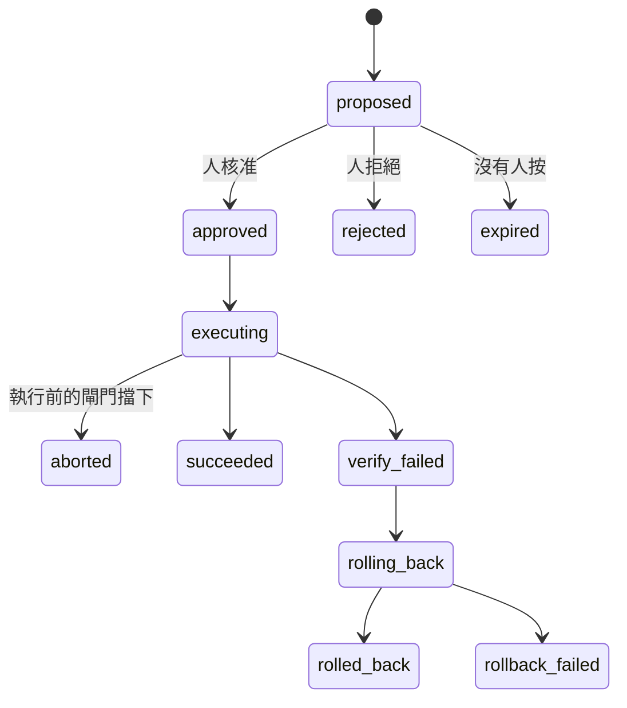

# Day27：提案是一列會自己走完的狀態，而演習決定那列數不數

> 「建議回滾 payment-service」是一句話
> 一句話沒有狀態、不會過期
> 也沒有辦法在事後回答
> 那天到底是誰按的

昨天把四個平面跟那條從建議到自主的光譜攤開，收在一張狀態圖上，圖裡唯一一條不需要任何人做任何事就會走到的路叫 `已過期`。今天把那張圖真的做出來，然後——這是這一天真正花力氣的地方——**在我自己弄壞的東西上把整條路走一次，而且要讓那一次算數**。

程式碼在範例 repo [`OTel_AIOps_Agent`](https://github.com/tedmax100/OTel_AIOps_Agent) 的 [`ironman-2026/day27/`](https://github.com/tedmax100/OTel_AIOps_Agent/tree/main/ironman-2026/day27)。

## 為什麼是一列資料，不是一支腳本

最直覺的做法是讓 agent 判斷完之後直接呼叫一支腳本。這條路上藏著三個問題，而且三個都只在**壞掉的那天**才會出現。

第一，腳本沒有身分。事後想問「上週四那次回滾是誰決定的、根據哪一次調查」，只能去翻 log，而 log 是 agent 自己寫的，agent 自己說自己當時很有把握，這句話沒有證據力。

第二，腳本沒有時效。判斷的那一刻跟動手的那一刻中間隔了多久，腳本不知道。一個十五分鐘前算出來的「現在可以回滾」，在告警風暴裡可能已經是上一個世界的事。

第三，也是最貴的一個：腳本會被重複呼叫。同一個告警在十分鐘內連續打進來三次，就會有三次判斷、三次呼叫，而 `kubectl rollout undo` 連按三次的結果不是「回滾三次」，是回到三個版本之前。

所以提案在這套系統裡不是一句話，是資料庫裡的一列，有主鍵、有狀態、有到期時間、有動作對象。`actions.py` 只放型別化的動作註冊表，`action_requests.py` 管這列資料的生命週期，兩者刻意分開：**能做什麼**跟**現在准不准做**是兩個不同的問題，壓在一起就是昨天講的那種「執行跟治理被壓成一格」。

## 註冊表：agent 講得出口的動作只有三個

`GET /actions` 回的是這個 build 的契約，不是它的接線：

```json
{
  "actions": [
    {"name": "k8s.configmap_flag_set", "reversible": true, "requires_approval": true, "executable": true, "has_dry_run": true},
    {"name": "k8s.rollout_undo",       "reversible": true, "requires_approval": true, "executable": true, "has_dry_run": true},
    {"name": "k8s.scale",              "reversible": true, "requires_approval": true, "executable": true, "has_dry_run": true}
  ],
  "actions_enabled": true
}
```

三個動作，全部可逆、全部需要核准、全部有乾跑。這個清單短得有點誇張，但那是刻意的：agent 能提的動作只有被寫進註冊表的那幾個，它沒有辦法自己組一句 `kubectl` 出來。自然語言在這裡被擋在門外，因為**型別化的動作**是後面每一道檢查的前提，你沒辦法對一段任意字串算影響範圍。

`executable` 跟 `actions_enabled` 分開回報也有原因。前者是「這個 build 有沒有實作」，後者是「這個部署准不准跑」。兩個都是 false 的時候從外面看起來一模一樣，但一個要改程式、一個只要改環境變數。

## 狀態機的真實長相



叢集裡那張帳現在是 28 列，攤開來長這樣：

| 狀態 | 筆數 |
| --- | --- |
| `aborted` | 10 |
| `expired` | 10 |
| `succeeded` | 5 |
| `rolled_back` | 2 |
| `rollback_failed` | 1 |

`autonomy` 欄位 28 列全部是 `propose`，自主那一格到現在一次都沒有觸發過。

這張表最值得看的是**成功只有五筆，而被擋下來的有十筆**。被擋下來不是壞事，那正是這一層要做的事；真正的問題在旁邊那個 10，那是沒有人按的數量，跟被擋下來的一樣多。

## 授權會過期，而且過期是預設

`approval_ttl_seconds` 預設 900，十五分鐘。超過就自己走到 `expired`，不需要任何人做任何事。

一開始我覺得這個設計有點嚴格，直到把那十筆過期的提案攤開看時間分佈才改觀。它們不是在十五分零一秒的時候擦邊過期的，是**根本沒有人打開過**。也就是說 TTL 在這裡沒有擋掉任何一個「本來想按但太慢」的人，它擋掉的是十次「沒有人在看」。

這裡有一個很容易寫錯的細節：過期必須是**寫進資料庫的狀態轉換**，不能只是查詢時的一句 `WHERE created_ts > now() - 900`。差別在事後。前者留下一列「這件事被提出來過、沒有人理它」的紀錄，後者只是讓那列資料安靜地從查詢結果裡消失，而那正是你最需要知道的一件事。

> 我一開始真的是用查詢條件寫的。改成狀態轉換是因為某天想回答「這個月有幾個提案沒人看」，發現這個問題在原本的設計下**問不出來** QQ

## 核准之後還有四道閘門

核准不等於執行。`execute` 這個階段開始之後，還有四件事會讓它在碰到叢集之前停下來。這四道全部寫進 audit，所以可以直接數：

| 閘門 | 問的問題 | 實際擋下 |
| --- | --- | --- |
| 前置條件重驗 | 核准當下的症狀，現在還在嗎 | 18 次通過 |
| 乾跑與影響範圍 | 這個動作會動到幾個東西 | 3 次擋下 |
| 冪等 | 同一件事是不是已經有人在做了 | 6 次擋下 |
| 熔斷 | 這個目標最近是不是一直失敗 | 1 次擋下 |

冪等那六筆全部長同一個樣子：

```
idempotency abort  {'superseded_by': '92690e7562a54af8',
                    'idem_key': 'k8s.configmap_flag_set|demo/user-flags#user_session_cache_disabled|...'}
```

`idem_key` 是**動作|對象|告警指紋**三段組成的。三段缺一不可：只有動作會把不同服務的回滾當成同一件事，只有對象會把兩個不同事故對同一個 deployment 的處置合併，只有指紋則根本沒有對象概念。有了這把 key，告警風暴打進來三次，第二第三次會在 `superseded_by` 上指回第一次，然後停手。

熔斷那一筆是這樣紅的：

```
breaker abort  {'reason': 'breaker open for demo/payment-service
                (2 consecutive failures on demo/payment-service)'}
```

門檻是同一個目標連續失敗兩次就跳開，另外還有一個一小時三次的頻率上限。這道門保護的不是叢集，是**人**：一個一直失敗又一直重試的自動化，會把值班的人淹沒在通知裡，而且每一則都長得一樣。

現在 `GET /actions/breaker` 回的是 `{"open": []}`，沒有任何目標處在熔斷狀態。這種空結果很容易被當成「這個機制沒在跑」，所以那一筆歷史紀錄比現值有用得多。

## 一個名字說錯了話：`rollback_failed`

跑完幾輪之後，帳上出現一筆 `rollback_failed`，而它的故事是這樣：動作執行時 401、回滾也 401，因為那張憑證根本沒有寫入權限。

```
execute  fail  {'error': '(401)\nReason: Unauthorized ...'}
rollback fail  {'action': 'k8s.rollout_undo', 'error': 'UnauthorizedException: (401) ...'}
```

問題是 `rollback_failed` 這個名字讀起來像「我們動了它，然後收不回來」，值班的人看到會立刻去確認現場被改成什麼樣子。實際上什麼都沒有發生，兩次呼叫都在認證那一關就被打回來了。

同一個狀態名蓋住了兩種完全不同的現場：**改到一半收不回來**，跟**從頭到尾沒碰到**。這兩種在半夜三點的處置方式差得非常遠。狀態機的名字不只是給程式看的，它是值班的人第一眼會讀到的那句話，取錯名字等於在事故當下說謊。

## 這些帳要算數，得先真的走完一次——而演習有一個哲學問題

上面那 28 列裡，成功的五筆全部是我在測試時按出來的。所以現在要做的事是把整條路**在一個真的壞掉的系統上**走一次。

但這座叢集上的每一個事故都是我注入的。所以「等一個真的事故發生再驗證」不是一個計畫，是一句好聽話。

反過來也不成立：如果每一次演習都直接記進正式帳裡，那些成功率、那些校準數字就會變成**在演我自己排練過的題目**。一份混著排練的成績單，比沒有成績單更危險，因為它看起來很專業。

所以演習必須同時滿足兩件互相拉扯的事：它要真的走完整條路（不然驗證不到任何東西），而且它在每一本帳上都要跟真實事故**分得開**。這一天後半的力氣大部分花在第二件事上。

## 第一場演習全綠，而它什麼都沒證明

那次我把旗標打開、立刻發告警、agent 跑完、動作執行、驗證通過，全綠。看起來很漂亮，直到我回頭去看那段時間的指標，發現**症狀根本還沒出現**。

原因很無聊：那個旗標是從 ConfigMap 投影成檔案的，要六十秒左右才會落到 pod 裡。我在旗標還沒生效的時候就發了告警，所以 agent 查到的是一個健康的系統，而驗證查到的當然也是健康的。整條路走完了，只是路上什麼都沒有。

修法寫進腳本裡變成兩個步驟。先等七十五秒讓投影落地，然後**確認症狀真的在指標上看得到**才發告警：

```
[12:03:13] injecting session-cache: user_session_cache_disabled=true
[12:03:14] waiting 75s for the projected flag file to land
[12:04:37] symptom is observable: orders_total and user_auth_checks_total both have series
[12:04:37] alert posted (startsAt=2026-08-23T12:04:37Z, drill=True)
```

那句 `symptom is observable` 是這整支腳本裡最重要的一行。沒有它，後面每一個綠燈都只證明「這條路徑不會拋例外」，證明不了任何跟事故有關的事。

> 這個坑我覺得特別值得記，因為它不是程式錯，是**實驗設計錯**。程式跑得好好的，綠燈也是真的綠，只是我量的東西跟我以為我在量的東西不是同一個 XD

另一個設計上的選擇是**只動一個變數**。注入腳本刻意不重啟 pod，因為同一分鐘裡的一次 rollout 會給延遲曲線第二個解釋，而事後你分不出來 agent 是靠哪一個推出結論的。

## 排練跟事故要在兩個地方分開，而且不能靠同一把 key

`drill=true` 這個標記寫在告警的 label 上，然後它必須在兩個不同的地方被展開，這件事我是踩到才知道的。

**第一個是冪等 key。** 前面講過 `idem_key` 是動作|對象|指紋。如果排練跟真實事故共用一把 key，那排練會把真實事故那一次「已經有人在做了」地擋掉。所以後綴加在排練這一側：

```
k8s.configmap_flag_set|demo/user-flags#user_session_cache_disabled|2b0a13c99c8f670a|drill
k8s.configmap_flag_set|demo/user-flags#user_session_cache_disabled|2b0a13c99c8f670a
```

上面那筆是演習，下面那筆是真實事故。後綴掛在演習那邊是刻意的：真實事故的 key 保持原樣，這樣演習永遠不會偷走真實事故的那一次執行額度。

**第二個是告警的冷卻窗。** 同一個指紋十分鐘內只處理一次，這條規則本來是用來擋告警風暴的，結果排練一發，真實告警在同一個窗裡就被吃掉了。所以冷卻的 key 也要分。

但有一樣東西**不能**分：告警指紋本身。指紋是用來認「這是同一個事故」的，如果排練換一個指紋，案例記憶就會把同一個事故拆成兩個，那反而製造出另一種假象——兩個事故同時活著，等於沒有事故。

## 六道護欄，一輪完整地亮綠

修好實驗設計之後那一輪的 audit 完整長這樣，從提案到終局大約三分鐘：

```
proposed       ok       action=k8s.configmap_flag_set  autonomy=propose
approved       ok       trace_id=89a7db0197c3804eae599cfbb926ab70
execute        start    args={configmap: user-flags, ...}
precondition   ok       checked 4
dry_run        ok       blast_radius: target demo/user-flags,
                        revision user_session_cache_disabled=True→False
execute        success
verify         settle   settle_seconds=165  (the verify query looks back 120s)
verify         pass     value 0 ≤ max_value 0.01
```

`precondition ok checked 4` 是核准當下那四個症狀在執行前又被查了一次。這一步在演習裡看起來多餘，在真實事故裡是唯一擋得住「人核准完去泡咖啡，回來按下去時問題已經自己好了」的東西。

`verify settle 165` 那一行值得多講一句。驗證用的那條 PromQL 往回看兩分鐘，所以修好之後如果立刻查，那個窗裡還混著壞掉時候的資料點。等一百六十五秒不是保守，是**讓查詢的回看窗完全落在修好之後**。

第一次做這件事的時候我沒等，結果驗證失敗、系統照著設計自動回滾，把一個已經修好的東西改了回去。那次的紀錄現在還在帳上：`verify fail (value 3.407 > max_value 0.01)` 接著 `rollback success`。一個修對了但被自己的驗證窗判死的動作，比修錯還難查，因為每一步的紀錄都寫著「正常」。

## 排練練不到學習那一半，這是設計

跑完之後，腳本會把案例讀回來，印出下一次調查會拿到什麼：

```
case key on the request: ffa6ab9638c72564
occurrences: 8   status: open
root_cause : (none — nobody has confirmed one)
resolution : action=k8s.configmap_flag_set runbook=session-cache-timeout verified=True
```

`occurrences` 從 7 變成 8，因為這個事故確實又被調查了一次。但 `resolution` 的時間戳停在前一次真實事故那天，這一輪什麼都沒寫進去。

這是刻意的：寫入案例記憶的那兩支函式在排練上會直接 return。理由跟前面那本帳一樣，**一個我自己注入的故障被修好，不是關於真實事故的證據**。

代價要講清楚：這代表演習沒有辦法驗證「學習」那一半。要驗證它就得關掉排練標記，讓那一輪被當成真實事故記進去，而那會在帳上留下一列「發生過一個事故」，實際上是我按的。這個取捨不該被腳本安靜地做掉，所以它是一個旗標，預設是排練，而且每一輪都會印出自己在量的是哪一半。

順帶一提，校準表最新那兩列長這樣：

```
{'id': 31, 'ts': '2026-08-23T12:04:55Z', 'confidence': 0.65, 'correct': None, 'drill': 1}
{'id': 30, 'ts': '2026-08-22T15:42:16Z', 'confidence': 0.9,  'correct': 1,    'drill': 0}
```

`drill` 這一欄是新的。在它之前，排練跑出來的信心分數會跟真實事故的混在同一條校準曲線上，而校準曲線決定的正是「這隻 agent 準不準、能不能不用問人」。也就是說，在那之前，**我可以靠重播同一場演習來替自主權背書**。

同一個事故、同一份 runbook，排練那次的信心 0.65、真實那次 0.9，換一次跑就差 0.25。這個數字後面還有得說。

## 一個順手翻出來的洞：它能重啟東西，自己的記憶卻在記憶體裡

推理平面那張 graph 編譯的時候給的是 `graph.compile(checkpointer=MemorySaver())`，狀態存在**行程的記憶體**裡。同一條對話問第二次，前面查到的東西都還在；服務重啟，全部消失。

平常這只是「重啟之後聊天要重講一次」。但把執行平面接上去之後，這件事的性質變了：註冊表裡那三個動作，每一個都會讓 workload 重新起來，而 `k8s.rollout_undo` 本來就是拿來收拾一次壞掉的部署的。也就是說，**這套系統最常被用到的時刻，正好是叢集裡最多東西在重啟的時刻**。

agent 自己那個 pod 不在那三個動作的作用範圍裡，所以不會發生「它把自己回滾掉」這種事。危險的是更平凡的版本：節點資源不夠、平台自己的滾動更新、或是我 `kubectl rollout restart` 了一次 agent 去載新設定。任何一次都會把那條調查的記憶清空，而外面看起來只是它突然不記得剛才在查什麼。

提案那一列資料不受影響（那在資料庫裡），所以核准、執行、驗證這條鏈是完整的。掉的是**推理的過程**。事後要回答「當時為什麼准」，帳上那列答得出來；「當時為什麼提」，答不出來。

> 這個坑我是先在文章裡發現的，不是在事故裡。
> 「一個能重啟服務的系統，自己的記憶卻在記憶體裡」這句話寫下來就覺得不太對勁 :(

## 這對值班的人有什麼差別

把提案做成一列有狀態的資料，值班的人拿到的是三個原本要自己補完的東西：**這次會動到什麼**（乾跑算出的影響範圍，同時回答了「這是不是唯一一個副本」）、**這件事是不是已經有人在做**（冪等擋下的那六筆）、**事後問得出來**（誰按的、什麼時候、當時的判斷來源）。

而演習跟事故分不開的系統，會用三種方式騙人：

**成功率是假的。** 帳上那幾筆成功如果混著排練，「這個處置過去成功過五次」這句話就沒有意義，而值班的人要靠它決定敢不敢按。

**告警被自己吃掉。** 冷卻窗共用的那段時間，我做過一次演習之後真實告警不見了。如果那是真的事故，它會安靜地不存在十分鐘。

**校準是假的。** 這是最慢才會咬人的一個。信心分數的可信度會被排練灌水，然後某天系統宣布自己夠準了，而那個「夠準」是在演我排練過的題目。

## 今天沒做的事

- **五道門一道都還沒接上。** 今天講的四道閘門全部發生在核准**之後**，管的是「這次執行安不安全」。決定「這件事需不需要人核准」的那五道門是另一組東西，留給明天。
- **驗證只看一個 PromQL 條件**（`value 3.407 > max_value 0.01`），而那個 165 秒是我用查詢回看窗算出來的常數，不是系統自己推出來的。
- **只有一個事故有 runbook。** 這一輪能跑完是因為 session-cache 那個事故有對應的處置動作。
- **失敗之後的清理是我手動做的**，排練的收尾也是腳本做的——系統本身不知道自己剛剛在排練。
- **`MemorySaver` 還沒換掉。**

## 小結

今天做的兩件事其實是同一件：把「建議」變成一列會自己走完的資料，然後證明那列資料算數。

前半的價值不在自動化程度，而在**每一個轉換都留下了可以事後問的東西**。後半的價值不在「它跑通了」，而在為了讓這次跑通算數，前面得先擋掉多少種自己騙自己的方式：症狀還沒出現就發告警、排練偷走真實事故的執行額度、排練的信心分數混進校準曲線。

帳上那 28 列裡最刺眼的還是那個 10。被閘門擋下的十筆是機制在工作，沒有人按的十筆是機制在空轉，兩個數字一樣大，但只有後者是我造成的。

而一場演習的價值，不在它有多少綠燈，在它能不能在該紅的時候紅。第一次那場全綠的，一個結論都不該從它身上拿。

> 那次假綠燈我還開心了大概二十分鐘，截圖都存好了。
> 後來把指標拉出來一看，那段時間的錯誤率是 0 ^^;
