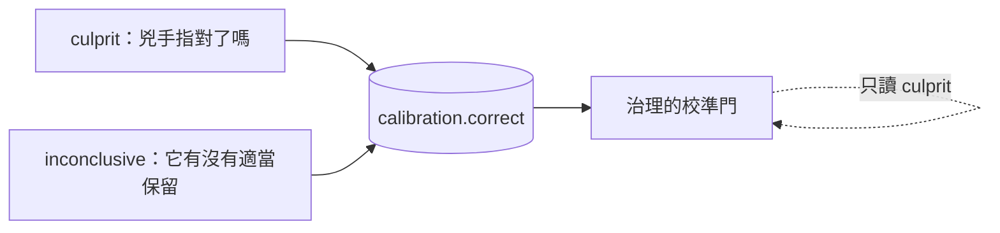

# Day28：五道門，那個 0.9 憑什麼算數

> 信心分數是推理平面自己講的
> 治理平面沒有義務相信它
> 這句話聽起來很酸
> 但它是第一道門的全部內容

昨天那輪演習跑完，agent 對同一個事故給的信心是 0.65。前一天的真實那輪，同一個事故、同一份處置程序，它給 0.9。同一件事差了 0.25，而如果自主權是掛在信心門檻上的，這 0.25 就是「要不要叫醒一個人」的差別。

今天處理五道門。第一道問的是**憑什麼相信那個數字**，另外四道問的都不是準不準——而它們失敗的樣子完全不一樣。

程式碼在範例 repo [`OTel_AIOps_Agent`](https://github.com/tedmax100/OTel_AIOps_Agent) 的 [`ironman-2026/day28/`](https://github.com/tedmax100/OTel_AIOps_Agent/tree/main/ironman-2026/day28)。

## 校準：把「它說幾分」跟「它到底對不對」對起來

**校準**（calibration）這個詞在機器學習裡有很精確的意思，值得先講清楚，因為它跟直覺的「準確率」不是同一件事。

一個模型宣稱信心 0.9 的那些判斷裡，如果大約九成是對的，它就是校準良好的。注意這跟「它很準」無關：一個只有六成正確率的模型，只要它在自己會錯的時候老實給 0.6，它就是校準良好的，而且**是可以拿來做決策的**。反過來，一個八成正確率但每次都喊 0.99 的模型，比前者危險得多，因為沒有辦法用它的分數區分「這次可以放手」跟「這次要看一下」。

自主權要的其實不是高正確率，是**可以被讀的分數**。

三個數字負責量這件事：

- `ECE`（expected calibration error）：把判斷照信心分箱，每箱算「宣稱的信心」跟「實際正確率」的差，再按箱的大小加權平均。0 是完美。
- `MCE`（maximum calibration error）：所有箱裡最糟的那一箱。平均值會互相抵銷，這個不會。
- `Brier score`：把每一筆的 `(信心 − 是否正確)²` 平均起來。它同時懲罰不準跟不老實。

這三個都需要一份東西才算得出來：**被標註過的紀錄**。

## 標註要從哪裡來，而且橋要怎麼搭才不算作弊

agent 每跑完一次調查，就往 `calibration` 表寫一列：它的信心、它的結論摘要、以及一個空的 `correct` 欄位。那個欄位要等別人來填。

「別人」是誰，是這道門真正的設計問題。

最省事的做法是讓系統自己填。執行平面本來就會驗證自己的處置有沒有效，把那個驗證結果當成「這次判斷是對的」寫回去，資料量立刻變多。這條路我沒有走，而且在程式裡把它擋死了：有一組來源被列為**自我標註**，它們寫進去的判決永遠不會被算進解鎖自主權的那份證據裡。

理由很簡單。執行平面驗證的是「症狀有沒有消失」，推理平面宣稱的是「我知道為什麼」。這兩件事在同一次事故裡經常同時成立，但它們不是同一個命題，而且用前者去證明後者，等於**讓系統自己說自己判斷得很好**。一套能靠自己的話解鎖自己權限的系統，那道門就不是門了。

所以能填那個欄位的只有兩種來源：讀過逐字稿的人，以及在已知答案的題目上機械評分的 grader。這兩種都在系統外面。

### grader 能判什麼，判不了什麼

「在已知答案的題目上機械評分」這句話聽起來很抽象，實際做起來限制非常清楚：**只有故障是我們自己注入的那些題目，答案才還原得回來。**

演習就是這種題目。有一個劇本把壞掉的 flag 檔**放進 pod template**，順便把版本號往上加，於是前一個 ReplicaSet 真的是一個好狀態，怪那次部署是對的答案。另一個劇本把同一個壞 flag 放進**那份沒有被改過的 template 所掛載的 ConfigMap**，這時候 `rollout undo` 會忠實地還原一個從來不是問題的 template，症狀一動也不動。兩個劇本的正確答案是相反的，而它們在告警上長得一模一樣。

所以 grader 的規則可以寫死成一句話：劇本 a 指認版本才算對，劇本 b 指認版本就是錯。這不是我對每一筆的主觀判斷，是**當初對叢集做了什麼**。

判不了的也一樣清楚。三個月前那筆說「上游 gateway timeout」的調查，要判就得回去看那天的 metrics，而那些資料早就過了保留期。幾筆 chat 問答不是事故，指認兇手那把尺量不了它們。這些我一筆都沒有標，理由寫在腳本的常數表裡：**一個沒有人能重建的判決，比一個空欄位更糟。**

### 一個 grader 才問得出口的問題

七筆標完之後，錯的那五筆裡有四筆是同一種錯法，而且是我沒預料到的那種。

三筆是上面那個「壞 flag 在 ConfigMap」的劇本，它每一次都說「版本 x 的程式碼有 regression」。第四筆是我當天下午自己弄出來的事故：我沒有部署任何東西，只是把 ConfigMap 的 flag 翻成 true，再重啟 payment。它給的結論是「v2.5.0 的程式碼迴歸」，信心 0.95，並建議回滾到前一版。

回頭查那個部署的歷史，四個 revision 跑的是**同一個 image**：

```
rev  git_version  image
68   v2.4.1       demo-services/payment:dev
69   v2.5.0       demo-services/payment:dev
70   v2.5.0       demo-services/payment:dev
71   v2.5.0       demo-services/payment:dev
```

`git_version` 在這套 demo 裡是一個 label，不是一個不同的 build。所以它建議的那次回滾，就算真的執行了也不會讓拒絕率降下來一點點。

四筆，四次都指向版本，四次都很有信心。共同點是**告警上帶著 `git_version` 這個 label**。它不是不會查，它把「這裡有一個版本號」讀成了「這是一次部署造成的」，而沒有去分辨故障到底在 pod template 裡，還是在那個 template 掛載的 ConfigMap 裡。

這件事只有 grader 問得出口。一個讀逐字稿的人會覺得那份報告寫得很好——它有 metrics、有 logs、有 traces、每個數字都對。錯的不是任何一個觀測，是**從觀測到歸因的那一步**，而那一步要有已知答案才驗得出來。（這條線後面還有一整天，那天要處理的是它建議的處置。）

> 這也讓我對前面那條「排練不能替真實背書」的規則多了一層理解。
> 排練不算數是因為同一份證據被重播了很多次，
> 但排練能做的另一件事是這個：它是唯一有標準答案的考卷 :)

## 兩種 `correct`，不是同一種對

這是我在這道門上踩過最深的一個坑。

有些告警查完之後的正確答案是「沒有事故」。agent 如果老老實實說「我沒找到問題」，那是**對的行為**，應該被記一筆 `correct=1`。

問題是校準的數學讀不懂這件事。一筆信心 0.0、`correct=1` 的紀錄，在數學眼裡是「它只給了 0.0 卻答對了」，於是算出一個 gap = 1.0，也就是最大可能的校準誤差。這隻 agent 做對了事，然後在成績單上被記了一筆滿分的錯。

當時的 MCE 就是被這種紀錄撐起來的。

修法不是改數學，是承認**那個 `correct` 欄位一直在回答兩個不同的問題**：



所以資料表多了一欄 `grading_mode`，由標註的人（或 grader）填，說明這一筆的 `correct` 在回答哪一個問題。校準的門只讀 `culprit` 那一種，因為 ECE 那套數學假設的正是「宣稱的信心對應到指對兇手的機率」。

那批 `inconclusive` 的紀錄沒有被丟掉，它們回答的是另一個很有用的問題（這隻 agent 會不會在沒事的時候硬要指認一個兇手），只是那個問題要用另一把尺量。

> 我第一次把兩種混在一起算的時候，得到一個 MCE 1.0 的可靠度圖，還很認真地在想「它到底怎麼會錯得這麼徹底」。錯的是我拿一把尺量了兩種東西 QQ

## 現在這條曲線長什麼樣子

把排練排除掉、只留 `culprit`：

```
Calibration over 4 labeled run(s) (of 18 recorded):
  ECE   = 0.1875
  MCE   = 0.3
  Brier = 0.1731
  accuracy 0.75 vs confidence 0.5625 → overconfidence -0.1875
  reliability:
    bin            n   conf    acc    gap
    [0.2,0.3)    2  0.200  0.500  0.300
    [0.9,1.0)    2  0.925  1.000  0.075
```

四筆。這個數字很難看，而它難看是有原因的，那個原因不在這一天，在後面講「量錯四次」那一天。

先看得懂這張表要怎麼讀。`overconfidence` 是負的，代表它整體偏保守：實際正確率 0.75，自己只喊 0.5625。最下面那兩箱說得更清楚，信心 0.9 以上那兩次全對，信心 0.2 那兩次對了一半。

用直覺講：**它在最有把握的時候是對的，在沒把握的時候比自己說的還行**。這對自主權來說是好消息，但四筆撐不起任何結論。

## 門檻不是一個數字，是四個

那道門要放行，需要同時滿足：

| 條件 | 要求 | 現在 |
| --- | --- | --- |
| 被標註過的判斷 | ≥ 20 | 4 |
| 其中出自人或 grader | ≥ 20 | 4 |
| 在信心 ≥ 0.8 這個區間的樣本數 | ≥ 3 | 2 |
| 那個區間的正確率 | ≥ 0.7 | 1.0 |

最後兩列是我覺得這道門設計得最對的地方：**只看會被用到的那個區間**。

自主權是在信心 0.8 以上才給的，所以在 0.3 那一段校準得再好也不能證明什麼——那些判斷永遠不會走到這道門前面。一個系統如果拿全域平均當通過條件，就會發生「靠一大堆低信心的正確判斷，去替高信心區間的胡說八道背書」。

所以現在這道門是紅的，而它紅的理由是**區間裡只有兩筆**，不是**正確率不夠**。這兩句話在報表上都是紅燈，但它們要的東西完全不一樣：一個要人去標，一個要 agent 變強。

補一段後來的變化。前面那幾筆用 grader 標完之後，同一張表變成這樣（排練已經濾掉）：

| 條件 | 要求 | 標之前 | 標之後 |
| --- | --- | --- | --- |
| 被標註過的判斷 | ≥ 20 | 4 | 5 |
| 其中出自人或 grader | ≥ 20 | 4 | 5 |
| 在信心 ≥ 0.8 這個區間的樣本數 | ≥ 3 | 2 | **3** |
| 那個區間的正確率 | ≥ 0.7 | 1.0 | **0.667** |

一格轉綠，一格轉紅。而轉紅那格才是這件事開始有意義的訊號：原本那個 1.0 是兩筆撐起來的，補進第三筆之後它就掉了。**一條只會往上走的曲線，通常不是在量品質，是在量樣本數太少。**

## 同一個數字，還在更前面決定了另一件事

寫到這裡我才發現一件有點尷尬的事。

這道門的整個立論是「信心分數是推理平面自己講的，治理平面沒有義務相信它」。可是我回頭看調查迴圈的停止條件，它長這樣：抽出 `Findings`，如果 `confidence` 低於門檻，就換一個假設再查一輪。

也就是說，**同一個我不敢拿來開自主權的數字，一直在更前面決定「還要不要繼續查」**。而且那個位置沒有任何人在量它。校準表至少還會把 0.9 跟後來的對錯放在一起對帳；停止條件這邊，它說夠了就是夠了。

更麻煩的是那個分數怎麼來的。它是模型照著 prompt 裡三條規則替自己的工作打的分。考生手上握著考場的鑰匙。

所以停止條件改成不問模型。四條檢查，每一條都能從落盤的紀錄重算一次：

| 檢查 | 它在問什麼 |
| --- | --- |
| `observed` | 這一輪有沒有任何一次查詢真的量到東西 |
| `independent_sources` | 說這件事的來源有沒有超過一個 |
| `causal_roles` | 這些觀測有沒有講到超過一種因果角色 |
| `conclusion_cites_evidence` | 結論有沒有引用任何具體的值 |

前兩條靠的是後面會講到的那層 Fact Adapter：每個工具結果進 context 之前，先被確定性規則判成 observed / empty / unavailable / error / truncated / context，只有 observed 算得上證據。沒有那層，「有沒有量到東西」這句話根本問不出口，因為空陣列跟一筆資料在字串層面長得一樣無辜。

兩個門檻都是 2。**一個來源自己同意自己不算佐證**：兩次 PromQL 查詢是一個來源不是兩個，所以計數是算 store 不是算呼叫次數；只有 mechanism 是一個沒有人受害的機制，只有 impact 是一個沒有解釋的症狀。

那為什麼不是三？我們的 Tempo 只留一小時，變更紀錄也不是每次都在。三選三的規則會有很高的比例是敗在 stack 的狀態，而不是敗在調查品質。而一道經常因為錯誤理由亮紅燈的門，結局是可預測的：某個凌晨三點會有人把它偷偷調鬆，然後那個數字再也沒有人敢動。**訂一個守得住的門檻，比訂一個看起來很嚴格的門檻有用。**

停止條件改了，接在它後面的那句話也得跟著改。以前不夠的時候 agent 收到的是「你的信心是 0.55，低於門檻，請換一個假設」——那實際上是在叫它再猜一次。現在它收到的是缺口本身：

```
The evidence for this conclusion is not yet sufficient. What is missing:
- independent_sources: 1 independent source(s) ['runtime']; needs 2
- causal_roles: observations speak to ['mechanism']; needs 2 distinct roles

Query a store you have not used yet this incident: logs; traces; the deploy/commit history.
Establish what changed (a deploy, a rollout, a config or code diff); and what users or
callers actually saw (error logs, failed requests).
Do NOT repeat a query that already came back empty - change the selector, the window,
or the store.
```

一個只查過 Prometheus 的調查會被指去看 logs 或 traces；一個從頭到尾沒有建立「什麼變了」的調查會被要求去建立它。這是可以照著做的指令，前面那句不是。

還有一個容易漏掉的細節：**證據是跨轉向累積的**。每一輪的台帳照樣重置（那是給模型看的當輪 context），但這道門問的是整場調查，第一輪查到的 metric 不會因為第二輪換了假設就消失。

把舊規則跟新規則放在同一批 run 上並排：

```
run                                           conf  old       new
one store, one role, sounds certain           0.90  stop      pivot      <-- disagree
three stores, two roles, sounds unsure        0.55  pivot     stop       <-- disagree
everything came back empty                    0.65  pivot     pivot
solid evidence, conclusion cites none of it   0.80  stop      pivot      <-- disagree
```

第一列是新規則比較嚴。第二列反過來，那是一場四筆觀測、三個 store、有 trigger 也有 impact 的完整調查，只因為模型對自己沒把握，舊規則會叫它再跑一輪。**一道只會變嚴格的門，久了會被當成稅來繞。**

那 confidence 呢？留著，治理平面照樣讀，它是這條校準曲線唯一的原料。**改變的只有一件事：它不再單獨決定任何事。**

> 這個改動我拖了很久才動手，因為舊的那行 `if confidence < threshold` 看起來實在太合理了。
> 直到我在寫這道校準門的時候發現，我一邊在文章裡說「不要相信那個數字」，
> 一邊在程式裡拿它決定要不要收工 XD

## 準不代表能動：另外四道門

最省事的設計是一道門：信心夠高就放行。這條路的問題在於，「這隻 agent 的判斷通常是對的」跟「這一次可以讓它自己動手」之間，還隔著三個完全獨立的前提。

它讀的那張圖，跟真實環境還對得上嗎。它手上那張憑證，現在還動得了東西嗎。它要用的那個處置程序，過去真的修好過這個問題嗎。任何一個不成立，一隻校準完美的 agent 都會做出一個有信心、有根據、而且沒有用的決定。

叢集上的實際狀態長這樣：

```
calibration    False  calibration unproven (4 labeled run(s) < 20); autonomy withheld
data_quality   False  injected knowledge never checked against these stores; env fit unproven
actuation      True   write credentials authenticate and hold exactly the required
                      permissions in demo (checked 144s ago)
fixture_record False  fixtures: overconfident by +0.4156 > 0.1 (newest label 2d ago)
```

四道裡三道紅，而三個紅燈的意思完全不同。

### 第二道：那張圖是這座環境的嗎

**資料品質**這道門問的第一件事不是「資料有沒有缺」，是**「這份知識屬不屬於這裡」**。

這個順序是踩過才排出來的。前面某一天我做了一組治理資產（registry、拓撲、契約），然後拿去量一隻在另一座叢集上跑的 agent，分數很難看。難看的原因不是 agent 笨，是那份注入給它的知識描述的是別座環境。當時我在文章裡寫下的結論，其實是用一把量錯對象的尺量出來的。

修法是給這件事一個數字。準備一座**孿生環境**：服務、拓撲、訊號全部一樣，只有名字不同。然後問同一份知識在兩邊各自解析得出多少東西。答案是 1.0 對 0.0，乾淨得有點好笑，但那個 0.0 正是我需要的證據——**注入的知識在陌生環境裡不會報錯，它只會安靜地什麼都對不上**。

所以這道門的第一問是環境契合度，不合就直接回報，後面的檢查連做都不用做：如果目錄描述的是另一座系統，其他每一個維度量的都是錯的東西。契合度過了之後才輪到另外三問：契約裡引用的指標，schema registry 有沒有真的宣告過；拓撲最近有沒有跟真實 trace 對過帳；有沒有出現「觀察得到但沒有人宣告」的邊。

### 第三道：那張憑證現在還動得了東西嗎

這道門是唯一一道會去問叢集的，而它有一段不太體面的來歷。某次執行失敗，錯誤是 401，我第一反應是「憑證死了」，寫進文章裡。隔天才發現不是死了，是**那張憑證從頭到尾就沒有寫入權限**，而整套系統從來沒有在動手之前問過這件事。

一張憑證健不健康，只有在你真的用它的那一刻才觀察得到。所以這道門不是讀一個快取的狀態，是實際去問一次 Kubernetes：

```json
{"proven_good": true, "score": 1.0, "namespaces": ["demo"],
 "missing": [], "excess": [],
 "note": "write credentials authenticate and hold exactly the required permissions in demo"}
```

`missing` 跟 `excess` 兩欄一起看才有意思。前者是「它做不到答應的事」，後者是「它拿到的比需要的多」。第二種不會讓任何東西失敗，所以永遠不會有人來修它，而它正是那種出事之後會被寫進事後報告的東西。

這也是四道裡唯一綠的一道。順帶一提，`checked 144s ago` 那個秒數是這道門的一部分：一個十分鐘前的健康結論，在憑證被輪替過的世界裡沒有意義，所以它會過期。

### 第四道：這個處置程序自己的成績單

前三道問的都是 agent。這一道問的是**那份 runbook**。

一個處置程序會退化。它剛寫出來的時候修得好那個問題，半年後系統長得不一樣了，同一套步驟跑完之後症狀還在：

```json
{"runbook_id": "payment-bad-deploy",
 "total_executions": 5, "ok": 1, "verify_failed": 2, "rollback": 2,
 "verify_failed_rate": 0.4,
 "status": "needs_review",
 "decay_signals": ["verify_failed 40% (2/5) — the symptom survived the fix"]}
```

`the symptom survived the fix` 這句話是這張成績單的重點：動作跑完了、沒有報錯，然後問題還在。

這道門跟其他幾道有一個結構上的差別：它是**逐份 runbook** 的判斷，不是一個全域的值。所以它沒有辦法回答「這套系統現在健不健康」，只能回答「這一次要用的這份程序，過去修好過嗎」。也因此我沒有把它放進那張全域的門狀態表裡，它是在提案當下才被問的。

### 第五道：在已知答案的題目上有沒有退步

最後一道最容易被誤會成跟第一道重複。它們都在講「準不準」，但證據來自兩個完全不同的地方：正式那條校準曲線問的是這隻 agent 在**真實事故**上準不準，由讀過逐字稿的人判定；回歸紀錄問的是它在**已知答案的題目**上有沒有退步，由 grader 機械評分。

把兩者合併會發生什麼事，我算過一次：合併之後前兩道門立刻變綠，因為 fixture 那邊有近百筆標註。但那等於讓「在烤好的固定資料上跑出來的成績」去替「對活的叢集寫入」背書。而後面會講到的一個實驗剛好量過那個背書值多少——同一題只換掉時鐘、程式碼一個字沒改，成績可以從全對變成全錯。

所以是分開計、都要過。同一把尺，兩份證據。

這道門現在紅在 `overconfident by +0.4156 > 0.1`，而括號裡那句 `newest label 2d ago` 是它另一半的設計：**這份紀錄會過期**。五道裡有三道都有時效（憑證會過期、拓撲對帳會過期、fixture 紀錄會過期），因為它們描述的都是一個會自己變的世界。

還有一件事花了我一些時間才想通：這份證據必須進版本控制，不能是 harness 跑完留在本機的那個資料庫。理由是它現在是一道門，而**一道讀取「我本機那個檔案」的門，等於沒有門**。

## 這對值班的人有什麼差別

沒有校準的信心分數，值班的人只能用經驗值去折算。「它說 0.9 大概等於七成吧」這種折算每個人心裡的係數都不一樣，而且沒有辦法交接。有了校準，那個分數變成一句可以查證的話：**這隻 agent 過去講 0.9 的時候，二十次裡對了幾次**。這句話可以寫進交接文件，可以被新來的人讀懂，也可以在它退步的時候被發現。反過來說，這也是為什麼「自我標註不算數」這條規則不能通融——如果分數的可信度是系統自己認證的，那句可以交接的話就退回成「它說它很準」。

五道門攤開來，另一個差別是**紅燈會說話**。「系統說現在不能自動處理」這句話沒有用，值班的人拿到它只能自己想辦法。「校準只有四筆」「這份知識還沒對過這座環境」「這個處置程序上五次有兩次沒修好」，這三句話各自指向一個具體的人可以做的動作，而且指向的還是不同的人。

如果只有一道總門，最常見的失敗是**它綠了，但你不知道它憑什麼綠**。五個問題壓成一個布林值之後，任何一個前提悄悄失效都不會有人發現。

## 今天沒做的事

- **只有四筆。** 剩下的路很清楚：去標。目前有十幾筆非排練的高信心調查躺著等人看，而它們才是能動這個數字的東西。
- **`inconclusive` 那批還沒有自己的門。** 那把尺已經分出來了，但還沒有人用它訂過任何門檻。
- **沒有量過那四條檢查值不值得。** 停止條件換成確定性規則之後，調查品質有沒有變好，我沒有跑過前後對照。要跑那個對照需要一份不會隨時間流動的題目。
- **runbook 那道還沒進總覽。** 它是逐份判斷的，要放進總覽得先想清楚「全域值」該怎麼定義。
- **環境契合度只在啟動時算一次。** 它應該像憑證那樣定期重問。
- **`excess` 那一欄還沒有人在管。** 權限比需要的多不會讓任何東西失敗，所以現在沒有任何流程會去收它。

## 小結

第一道門要的不是一個更高的分數，是**一個可以被查證的分數**。校準做的事情就是把「它說幾分」跟「它後來對不對」放在同一張表上，然後老實承認現在那張表只有四列。而那個分數在調查迴圈裡的位子也讓出來了——停止條件現在問的是四件我隨時可以從落盤紀錄重算的事。

另外四道門的共同點是它們**都不問「這個判斷對不對」**。它們問的是這個判斷所依賴的東西還成不成立：資料屬不屬於這裡、憑證動不動得了、程序修不修得好、以及最近有沒有退步。一隻很準的 agent 配上一張過期的憑證，會產生一個有把握、有根據、而且執行不了的決定，而在只有一道門的系統裡，那個決定會一路走到最後才失敗，失敗的時候現場已經是半夜三點了。

那四列裡最有意思的是負的過度自信。這套系統目前的問題不是它太敢講，是**沒有人在它講完之後告訴它對不對**。

> 「校準」這個詞我一開始以為是要去調模型的溫度參數之類的。
> 結果九成的工作量是在吵「誰有資格說它錯了」XD
>
> 這五道門我最喜歡的是它們互相不能代替這件事。
> 最不喜歡的也是這件事，因為那代表要湊齊五份證據才開得了一次 ^^;
