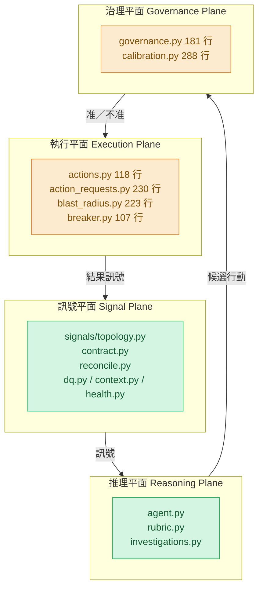
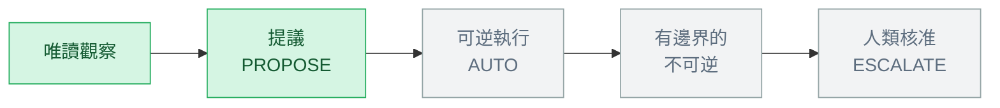
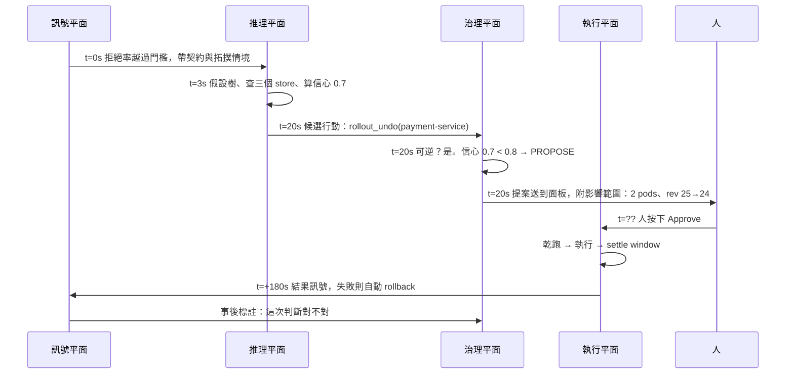
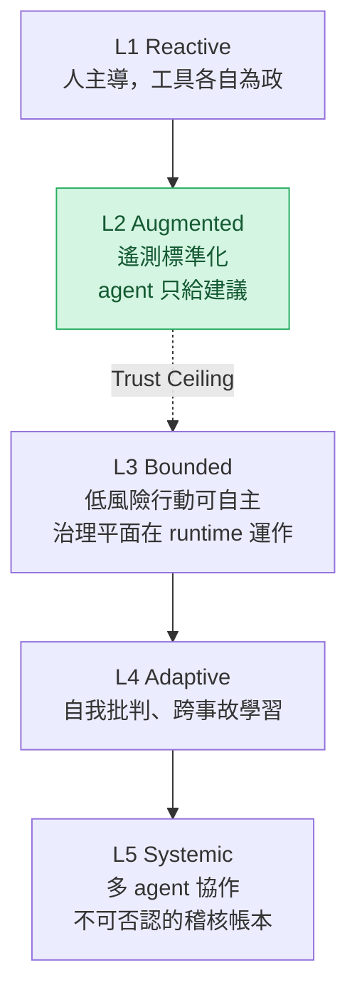

# Day28：建議之後呢，四個平面跟一組沒有人按過的開關

> 一個沒有人按過的開關
> 跟一個不存在的開關
> 平常看起來完全一樣
> 只有在事故當下才分得出來

昨天那隻 agent 在同一組題目上拿了 3.5/9，比二十七天前那隻還低，而低的原因是我做出來的治理資產屬於另一座環境。收尾的時候我留了三句話：信心分數沒校準、授權層級沒走過、回饋迴圈沒閉合。今天開始的七天，就是去處理那三句。

先講清楚今天不動手。這是一個純概念日，沒有指令、沒有輸出、沒有程式碼連結。之所以要花一整天講結構，是因為接下來每一天都是「填一格」，而如果那張格子圖沒有先畫出來，後面七天就會變成邊做邊定義新名詞，讀起來像在追一個永遠沒補完的伏筆。

今天要交代的是一套架構語言，來源是 [《代理式可靠性工程》（Agentic Reliability Engineering，簡稱 ARE）](https://learning.oreilly.com/library/view/agentic-reliability-engineering/0642572294809/) 第六章。前面二十七天我刻意只借了它零星幾個詞（`決策級遙測`、`silent decay`），沒有把它的骨架整套搬進來，因為那時候的內容不需要。現在需要了。

## 四個平面，跟一張假裝成總覽圖的進度條

ARE 把一套代理式可靠性系統拆成四個`平面`（plane）：訊號平面（Signal Plane）、推理平面（Reasoning Plane）、執行平面（Execution Plane）、治理平面（Governance Plane）。

它用「平面」而不是「層」是刻意的。層意味著上層吃下層、失效會往上傳染，腦子裡的模型是一疊相依關係。平面意味著`正交`：每個平面各自運作，只透過明確的介面相交，一個平面壞掉不應該自動汙染另外三個。書裡把這件事寫成四句話：壞掉的訊號不應該直接觸發執行、推理錯誤不應該繞過治理、執行失敗不應該汙染意圖、治理規則改動不應該逼你重寫自動化。

每個平面的職責一句話講完，但更重要的是它「絕對不做」什麼：

| 平面 | 負責 | 絕對不做 |
| --- | --- | --- |
| 訊號 | 讓真相可被觀測：收集、正規化、加上擁有者與拓撲情境、發布可查詢的系統狀態 | 不判斷什麼重要、不推論因果、不觸發行動 |
| 推理 | 把結構化的真相變成有邊界、對齊意圖的判斷：假設、比較、算信心 | 不執行。它的輸出永遠是提案，不是命令 |
| 執行 | 照著被核准的決定改變系統，然後把結果訊號送回訊號平面 | 不決定要做什麼、不推論替代方案、不覆寫治理 |
| 治理 | 在 runtime 判斷「這個行動現在准不准」 | 不推論狀態。狀態是推理平面的事，它只管`權限` |

其實這張表最有用的地方不是拿來背，是拿來當一份體檢表。書裡講得很直接：如果你的監控系統直接觸發腳本，你把訊號跟執行壓成一格了，架構裡根本沒有留下推理的機會；如果你的自動化裡面寫著 policy 判斷，你把執行跟治理壓成一格了，policy 在自動化被改動的當下就變得看不見也管不住；而如果你的 AI 系統又決定又執行，那是最危險的一種壓縮，因為它拿掉的正是讓自主性有邊界的那道檢查。

拿這份體檢表照一次這個 repo，得到的不是「有／沒有」兩種答案，是三種：

綠色那兩格是前二十七天蓋出來的。橘色那兩格**不是「還沒蓋」，是「蓋好了、測試過了、但從來沒有拿到過真實輸入」**。這六支檔案加起來 1147 行（`wc -l` 數的，不是估的），而它們共同的狀態長這樣：`actions_enabled` 的預設值是 `False`、`calibration` 表裡的標註數不夠、過去事故庫因此是空的。

所以這七天的動詞不是「做出來」，是「跑跑看」跟「證明它會擋」。這跟前二十七天那條「該紅的還會不會紅」是同一個標準，只是對象從 registry 換成了防護網。

> 我原本以為這個系列會是一份施工日誌，翻完 repo 才發現要寫的是驗收報告。
> 這兩件事的心情差很多：施工你可以決定蓋到哪裡停，驗收是那個東西會自己告訴你它行不行 QQ

## 平面之間傳的是什麼：三份契約

平面的邊界如果只靠「大家記得不要越界」，那就只是一份設計文件上的宣告。要讓邊界真的成立，中間傳的東西得有形狀。ARE 在這裡給了三份契約，剛好對應三個交界。

**訊號契約**（§4.3）宣告的是：這個訊號代表什麼、訊號平面保證什麼、它是設計來支撐哪些決策的。書裡列的欄位是 name / version / owner / 支援的決策 / 新鮮度保證 / 最小觀測視窗 / 信心門檻 / 排除條件 / schema。這件事第二階段做過了，`signals/contract.py` 那 161 行裡的 `SignalContract` 有 `freshness_seconds`、有 `supported_decisions`、有每個 SLI 的權威 PromQL 跟單位。當時我是為了讓 agent 不要每次都自己重推一次查詢才寫的，現在回頭看，那就是這份契約。

書裡有一句話值得抄下來：推理平面應該讀契約，不是讀原始資料流。理由不是效能，是`校準`。推理的品質不會好過它能依賴的假設，而契約提供的正是那些假設（多新、樣本夠不夠、什麼時候不該信）。沒有那些保證，每一次判斷都是在賭。

**候選行動**（§4.4）是推理平面的輸出，也是這個系列後面每一天都會回頭指的那個東西。書裡給的結構是提案 id、觸發訊號、領先假設、排序後的行動選項、意圖對齊、風險估計、信心分數、所需的授權層級。它有兩個作用：治理平面可以在不重做一次推理的前提下評估它，而當人回頭問「它為什麼那樣做」的時候，這份提案就是稽核紀錄本身。

這裡有個我一直沒講清楚的對照。第三階段做的假設樹、信心分數、`rubric.py` 的守門、`blast_radius.py` 的影響範圍，其實一直在往這個結構長，只是當時我沒有名字可以叫它。今天把書的詞彙貼回去之後才看得出來缺哪幾格：意圖對齊那格是空的，所需授權層級那格也是空的，而後者正是治理平面要讀的第一個欄位。

**行動契約**（§4.5）是執行平面的目錄。書裡的立場很硬：執行平面不能執行不在目錄裡的東西，自由生成行動明確被排除在職責之外。這聽起來很綁手綁腳，而那個綁手綁腳就是安全性質本身。書裡那句話我覺得講得非常好：可靠性的失敗很少是因為缺少行動，是因為不安全的行動，而「行動不夠」這個問題比「行動不安全」好解得多。

`actions.py` 的 docstring 就是照這個寫的：agent 只能講出一個已經被註冊過的行動名字，而且就算講對了，執行還要再過一道 master kill switch。目前註冊表裡只有兩個東西，`k8s.rollout_undo` 跟 `k8s.scale`，每個都帶著 `reversible` 跟 `requires_approval` 兩個旗標。那兩個旗標不是給人看的註解，是治理平面真的會讀的欄位。

## 授權不是開關，是一條光譜

第三張圖是這七天真正的主題。ARE §4.6 的核心主張是：治理要放進 runtime，而不是放在 runtime 外面的簽核流程裡。變更審查會議、簽核工作流、寫成 SOP 的 runbook，這些機制在「行動很稀少、時間壓力很低」的時候是有效的，在「行動連續發生、時間壓力很高」的時候會整組失效，而後者正是 agent 運作的常態。

治理平面不重做判斷，它只回答一個問題：這個提案、帶著這個信心、在現在這些條件下，准不准。而答案不是二元的，是分級的。

`governance.py` 把這條光譜實作成一個 `StrEnum`，只有三個值：`AUTO`、`PROPOSE`、`ESCALATE`。判斷規則逐條讀是這樣的：不可逆的行動一律 `ESCALATE`，沒有例外；標了 `requires_approval` 的最高只能到 `PROPOSE`；信心低於 `governance_conf_low`（0.5）也是 `ESCALATE`；0.5 到 `governance_conf_high`（0.8）之間是 `PROPOSE`；只有信心 ≥ 0.8、可逆、沒有標核准、而且**校準被證明是好的**，才會拿到 `AUTO`。

最後那個條件是這整段的關鍵。書裡把它寫成一句話：自主權是掙來的，而且是可以被收回的。高信心是必要條件但不是充分條件，agent 的歷史必須顯示它講的信心真的跟著現實走。`_calibration_verdict()` 那個函式就是這句話的程式碼版本，而它有兩道門：總標註數要夠（`governance_min_labeled_runs = 20`），其中非自我標註的數量也要夠（`governance_min_human_labeled_runs = 20`）。`_SELF_LABEL_SOURCES` 只排除 `remediation-verified` 跟 `remediation-failed` 這兩個來源，翻成白話就是**「自己說自己修好了」不能拿來解鎖自主權**。

所以現在按下去會發生什麼？光譜上那兩格綠色就是答案：目前能走到的最遠是 `PROPOSE`。不是因為程式碼沒寫，是因為證據不夠。

搭在授權光譜旁邊的是「人在哪裡」。ARE §4.7 開頭第一句是「human in the loop 不等於人工簽核」，然後把人拆成三種模式：

- **迴圈之上**（above the loop）：人定義意圖。服務目標、可接受的風險、影響範圍容忍度、成本限制。節奏是週到月，在冷靜的時候做，由擁有這個服務的團隊做。書裡認為這是最有價值、也最被低估的一種參與。
- **迴圈之中**（in the loop）：人參與特定的那一次決策，而且照設計應該是稀少的。當治理平面因為信心低、條件反常、或 policy 明講而把提案路由給人的時候，人拿到的是一份已經調查完、上下文已經整理好、假設已經命名、選項已經排序的提案。人的工作是對一個準備好的問題下判斷，不是從原料開始組裝那個問題。
- **迴圈之上監看**（on the loop）：人看 SLO（Service Level Objective，服務水準目標）、抽樣審查自主決策、在校準漂移時調門檻。這是唯一會 scale 的模式，因為那個工程師不是在核准決策，是在看那個核准決策的系統。

照這三個定義去對這個 repo：迴圈之上監看被 `eval/harness.py` 撐起來了一部分，迴圈之中的審查介面只做到一半（後端的核准 endpoint 有，前端那頁只列得出提案，按鈕還沒接上去），迴圈之上那層目前散在 `signal.yaml` 跟 policy 裡，還沒有一個地方讓人把「這個服務可以自動做到哪」寫下來。

> 舉個現實案例，我看過一個團隊為了「安全」，把所有自動化都改成要人按確認。半年後那個確認變成值班的人閉著眼睛按，因為一天要按四十次。
> 這種我只能說「很棒！」——防護網還在，只是變成一個橡皮圖章 XD

## 一條它現在還跑不起來的時間軸

ARE §4.8 用一個結帳延遲事件走了一次完整時間軸，從 t=15s 偵測、t=18s 提案、t=22s 核准、t=23s 執行，到 t=180s 驗證結果。我把它換成這座 demo 上那個真的發生過的事故（payment-service 在某個版本之後拒絕率上升），畫成同一種節奏：

這張圖有一半是假的，我先講清楚是哪一半。從 t=0 到 t=20 那段是真的，前二十七天跑過很多次，信心 0.7 跟那個 2 pods、rev 25→24 都是實際輸出裡抄下來的數字。從 `H->>E` 那一箭頭開始往下全部是示範性重演：核准這件事目前只存在成一支 HTTP endpoint（`POST /actions/requests/{id}/approve`），plugin 那頁只把提案列出來，沒有那顆按鈕，而且就算按了，`actions_enabled` 是關的，也不會有 executor 接手；最後那條「事後標註」的箭頭同樣沒有東西在跑，而它正是讓第一格的門檻可以被回頭校正的那條線。

換句話說，**這座系統目前是一條走到一半就停住的迴圈，而停住的位置剛好是「建議」跟「行動」的交界**。後面幾天要做的事，就是從那個箭頭往下，一段一段讓它第一次拿到真實輸入。

## 階梯：現在卡在第幾級

最後一張圖先畫出來放著，細節留給後面。ARE §4.9 給了一個五級成熟度模型，三個維度：可觀測性（系統能感知並賦予情境的能力）、推理（決策怎麼形成與驗證）、授權（agent 被允許做哪些行動）。治理不是第四個維度，因為治理是那個在 runtime 執行授權的機制，它的成熟度藏在授權維度裡。

書裡最值得記住的一句話是：整個模型最難的一段不是 L4 到 L5，是 **L2 到 L3**，它把那個位置命名為`信任天花板`（Trust Ceiling）。因為那是系統從「agent 是顧問」變成「agent 是執行者」的那一刻，而它需要四個機制同時到位：治理平面、行動契約、自動逆轉、被校準過的信心。多數團隊帶著其中三個就去嘗試，然後第一次自主失敗剛好就落在缺的那一個上面。

書裡還特別點名了一種失敗方式：團隊想用「把 prompt 寫得更嚴格」來補治理平面投資的不足，而 prompt 層級的安全性在有負載的時候撐不住。這句我讀的時候有點刺，因為第一階段有一整天在講「規定寫在 prompt，執行才在圖上」，那時候我把它當成一個關於注入的觀察，現在看它其實就是這件事的另一個講法。

照這三個維度粗略定位，這個 repo 大概在 L2：遙測標準化做過了、拓撲圖可查詢也有在對帳、agent 會給結構化的建議，但所有寫入動作都還要人按。而 L2 有一個專屬的量尺叫建議接受率（Suggestion Acceptance Rate，SAR），我現在量不出來，因為那顆按鈕沒有人按過，分母是 0。

## 小結

總結來說，今天沒有跑任何一行程式碼，做的事情只有一件：把接下來七天要填的格子先畫出來，並且把 repo 現況誠實地擺進那張圖裡。得到的結論比我動筆前預期的要窄，也要具體一些——執行跟治理這兩格不是白紙，是一組沒有人按過的開關，而它們的狀態不是「壞掉」也不是「好的」，是「不知道」。

一個從來沒有被觸發過的防護網，跟一個不存在的防護網，在證據等級上是一樣的。這句話會是接下來七天的判準，也是最後一天要回頭驗收的東西。至於那條光譜為什麼現在只走得到 `PROPOSE`，答案剛剛已經出現過一次了：不是程式碼不夠，是標註數還是 0，而標註這件事買不到，只能一筆一筆累積出來。

> 花二十七天做出一隻可以被檢查的 agent，結果第二十八天發現真正沒被檢查的是我自己寫的那道檢查 XD
> 下一件要做的事很不浪漫：把那六支檔案的真實呼叫關係畫出來，因為大綱寫的跟 repo 裡的差很多。
