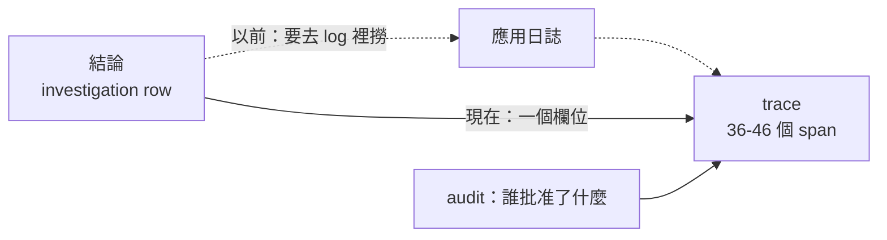

> 一個做可觀測性的 agent
> 自己的推理過程沒有被觀測
> 這個諷刺太好寫了，所以我差點就直接寫了

這篇本來的標題是「決策不可回放」。我大綱裡寫好的結論是：`audit.record` 在執行那一側被呼叫了 24 次，寫入類動作每一步都有紀錄，但 `agent.py` 一次都沒有呼叫它，所以「要改叢集」可回放、「怎麼推理出這個結論」不可回放。

grep 一次就能得到這個結論，而且它讀起來很有力。**問題是它是錯的。**

程式碼在範例 repo [`OTel_AIOps_Agent`](https://github.com/tedmax100/OTel_AIOps_Agent) 的 [`ironman-2026/day28/`](https://github.com/tedmax100/OTel_AIOps_Agent/tree/main/ironman-2026/day28)。

## 先問清楚「回放」到底要回答什麼

寫之前我先把「可回放」拆成六個具體問題，因為這個詞太模糊，模糊的詞很容易讓人用一個模糊的答案打發過去：

1. 它的結論是什麼
2. 它有多少信心
3. 它呼叫了哪些工具、順序是什麼
4. 每一句查詢實際上問了什麼
5. 它做決定之前，模型看到的是什麼
6. 這次調查花了多少 token

前兩題是「結果」，後四題是「過程」。系統裡有三個地方在記東西：investigation 那張表、audit log、以及 agent 自己身為一個被 instrument 的服務所產生的 trace。所以就一個一個問。

## 然後我發現我這幾天的實驗全部沒有 trace

`replay_probe.py` 寫好第一次跑，Tempo 裡什麼都沒有，於是我差點就要收工寫「果然沒有」。

還好停下來想了一下：**這幾天所有的探測腳本，都是我在 host 上直接呼叫 `run_headless()` 的。** 那條路徑沒有經過 `opentelemetry-instrument`，SDK 根本沒有啟動，當然一個 span 也不會產生。叢集裡那個 agent 才是被 instrument 的那一個，而它從 Day23 到現在沒有被我驅動過任何一次真的調查。

所以要問「決策有沒有被 trace」，得從被 instrument 的服務走進去：

```bash
kubectl -n demo port-forward svc/aiops-agent 8090:8000
curl -X POST localhost:8090/webhook/alert -H 'x-webhook-secret: <secret>' -d '{"alerts":[…]}'
```

日誌立刻就不一樣了，每一行都掛著同一個 trace id：

```console
[trace_id=fe6b426e8e7a63d37d61d4fcc4b07722 span_id=d52c49561f874a4e resource.service.name=aiops-agent]
  - HTTP Request: GET http://prometheus.demo.svc:9090/api/v1/query?query=sum+by+%28git_version…
[trace_id=fe6b426e8e7a63d37d61d4fcc4b07722 …] - rubric: trace ID hallucination detected —
  missing in Tempo: ['4b2a9c8d7e6f5a4b3c2d1e0f9a8b7c6d']
[trace_id=fe6b426e8e7a63d37d61d4fcc4b07722 …] - headless RCA done conf=0.95
```

順帶一提，中間那行是 Day26 那個守門在正式路徑上抓到一次真的幻覺，而且是它自己編了一個漂亮的 32 位十六進位。它被擋下來、被要求重查，然後那次調查的結論最後是對的。**兩天前寫的東西在完全沒有預期的情況下上場，這種時刻蠻爽的 :)**

## trace 裡面比我以為的完整得多

把那條 trace 從 Tempo 撈出來：

```console
spans in Tempo for that trace: 46
  by instrumentation: {'fastapi': 4, 'httpx': 12, 'langchain': 30}
   6 ChatGoogleGenerativeAI.chat
   5 execute_task agent
   5 execute_task route_after_agent
   3 execute_task tools
   2 invoke_agent LangGraph
   2 execute_tool query_tempo_traces
   1 execute_tool query_prometheus
```

`opentelemetry-instrumentation-langchain` 把 LangGraph 的每一個 node、每一次工具呼叫、每一次模型呼叫都變成了 span。三十個 span 裡有 `execute_task agent`（模型在想）、`execute_task route_after_agent`（Day22 那個條件分支真的走了哪一邊）、`execute_tool ...`（每一次查詢）。

**Day22 我畫的那張四個 node 的圖，在這裡是一條可以逐格播放的實際錄影。**

打開一個工具 span 看屬性：

```console
execute_tool query_prometheus
    gen_ai.operation.name      = execute_tool
    gen_ai.tool.name           = query_prometheus
    gen_ai.tool.call.arguments = {"input_str": "{'expr': 'sum by (git_version, reason) (rate(…
    gen_ai.tool.call.result    = {"output": {"resultType": "vector", "result": [{"metric":
                                 {"git_version": "v2.5.0", "reason": "new_validator"}…
    gen_ai.task.status         = success
```

模型那一種更完整，`gen_ai.system_instructions`（整份系統 prompt）、`gen_ai.input.messages`（它看到的每一則訊息）、`gen_ai.usage.input_tokens` / `output_tokens` 全都在，還有 LangGraph 自己的 `langgraph_node`、`langgraph_step`。

也就是說，那六個問題裡的後四題，答案一直都在 Tempo 裡躺著。

> 這裡有一件事值得記：這些 span 是**別人寫的 instrumentation 幫我產生的**，我沒有為此寫過任何一行程式碼。這正是這系列一直在講的那條因果鏈的另一端：遵守 semantic convention 的好處，是別人做的工具可以直接看懂你的東西。gen_ai 這組慣例還在演進，但它現在已經足夠讓一次 agent 調查被完整重播。

## 那到底缺什麼

缺的東西很小，小到有點好笑：**沒有任何欄位把「這個結論」連到「那條 trace」。**

investigation 那張表記了 fp、時間、結論、信心、governance 決策，但沒有 trace id。audit log 記了誰在什麼時候提了什麼動作，也沒有 trace id。所以要從一份結論走到它的推理過程，唯一的路是去日誌裡用時間或 fp 撈，撈到那行 `trace_id=...`，再貼進 Grafana。



改法是兩個地方各加一行：記錄調查的時候問一次「我現在在哪條 trace 裡」，寫進去；每一筆 audit 進來的時候做同樣的事。

```python
def current_trace_id() -> str | None:
    """The trace this code is running inside, as a 32-char hex string.

    The agent is auto-instrumented, so an investigation already produces a full
    trace: every LangGraph node, every tool call with its arguments and result,
    every model call with its prompt and token usage. What was missing is the
    one string that gets you from a stored conclusion back to that trace.
    """
```

它回 `None` 的情況也要處理好，因為那正是我一開始撞到的那種：在 host 上跑、沒有 instrumentation、沒有 trace。**拿不到就不寫，不要拋例外，也不要寫一個假的。**

接上之後，同一支探測腳本的輸出：

```console
latest investigation: fp=383238a67e692abb ts=2026-08-06T14:12:07Z
  conclusion : High payment decline rate caused by a code regression in version v2.5.0…
  confidence : 0.9
  trace_id   : f1f393acce6a9cdb26d91a1565d4abe0

question                                 where it lives     answerable
--------------------------------------------------------------------------
what did it conclude                     investigation row  yes
how confident was it                     investigation row  yes
which tools did it call, in what order   trace              yes
what exactly did each query ask          trace              yes
what did the model see before it decided trace              yes
how many tokens did it cost              trace              yes

tokens on this investigation: 26123

the tool calls, in order (from the trace alone):
  - query_prometheus: {'expr': 'sum by (git_version, reason) (rate(payment_charges_total…
  - k8s_deployment_status: {'service': 'payment-service'}
  - query_prometheus: {'expr': 'sum by (git_version, reason) (rate(payment_charges_total…
  - query_tempo_traces: {'traceql': '{resource.service.name="payment-service" && status=error}'}
```

audit 那一側也一樣：

```console
2026-08-06T14:12:07Z proposed ok {'action': 'k8s.rollout_undo', 'autonomy': 'propose',
  'reversible': True, 'trace_id': 'f1f393acce6a9cdb26d91a1565d4abe0'}
```

> 26,123 個 token 一次調查。這個數字以前也是查不到的，現在它跟推理過程長在同一條 trace 上。真的要上生產環境的話，這個欄位可以直接接成一張「每次告警花多少錢」的儀表板，而且它跟成本中心的關聯是天然的，因為 span 上有 service name ^^

## 對值班的人來說差在哪

事後檢討會上最常出現的一句話是「它為什麼會這樣判斷」。

沒有那個欄位的時候，這句話的成本是：先在 investigation 列表找到那次調查，抄下 fp 跟時間，去 Loki 撈那段時間的 agent 日誌，找到 trace id，貼進 Grafana，然後才開始看。這中間任何一步斷掉（日誌輪替、時間對不上、fp 不知道去哪找），這個問題就變成無解，而無解的下場通常是「那就不要相信它了」。

有那個欄位之後，這句話的成本是一個連結。**而這個差別會決定一件事：出事之後，這個 agent 是被檢討，還是被移除。** 一個能被檢討的系統可以慢慢變好，一個查不出原因的系統只會被關掉。

反過來說也有代價要誠實講：那條 trace 裡有完整的系統 prompt 跟每一則訊息。Day7 就撞過一次類似的事（live-check 吃到自己 coding agent 的遙測，裡面有 PII）。**推理過程可回放，等於推理過程可外洩**，這件事在真的環境裡要先想清楚保存期限跟誰能看。

## 今天沒做的事

- **plugin 還沒把那個連結畫出來。** 欄位存進去了，但 investigation 列表上還沒有一個「看它怎麼想的」按鈕。
- **Tempo 只留一小時。** 這是 Day23 就記過的帳，而它在這裡的意思是：昨天那次調查的推理過程，今天已經沒了。要留住得改保留期，或把 span 另外落地。
- **`agent.py` 還是一次都沒有呼叫 `audit.record`。** 我原本以為這是問題，現在覺得未必：推理過程有 trace，而 audit 是給「誰動了叢集」用的。但兩者的職責分界目前只寫在我腦子裡，沒有寫在程式碼裡。
- **沒有量 instrumentation 的開銷。** 36 到 46 個 span、每個模型 span 都帶著完整 prompt，這在高頻告警下的體積跟成本我沒有量。

## 小結

總結來說，今天最有價值的不是那兩行程式碼，是差一點就用 grep 的結果寫完一整篇文章。`agent.py` 裡沒有 `audit.record` 是真的，但由此推論「決策不可回放」是錯的，因為記錄它的根本不是那一層。而我第一次跑探測拿到空結果的時候，那個錯誤結論看起來還被「證實」了一次，如果沒有停下來問「為什麼是空的」，這篇會變成一個講得很漂亮、但事實是反的故事。

> 這系列寫到現在，我最常犯的錯不是查錯資料，是先想好結論再去找證據。
> 而空結果最會配合這種人 QQ
