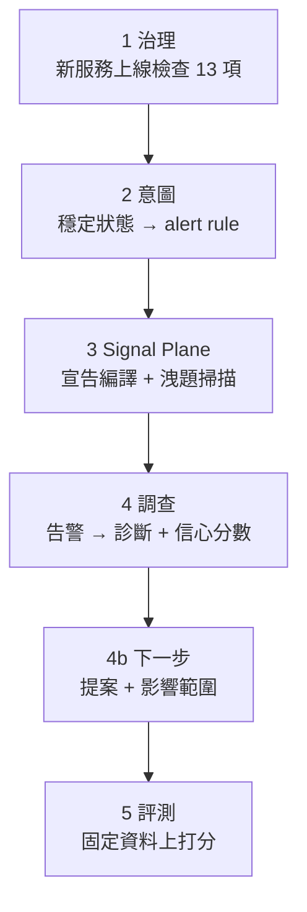

> 每一段單獨跑都是綠的
> 這句話跟「整條鏈是通的」
> 中間隔著一次真的把它們接起來

前面二十八天，每一天都在自己那一段裡驗證自己那一段。今天把它們接起來跑一次：一個新服務的上線檢查 → 意圖編成告警規則 → 服務自己的宣告編成拓撲 → 一個告警進去，診斷跟下一步建議出來 → 同一隻 agent 對著固定資料被打分。

第一次跑，六個階段裡有三個是紅的。

程式碼在範例 repo [`OTel_AIOps_Agent`](https://github.com/tedmax100/OTel_AIOps_Agent) 的 [`ironman-2026/day29/`](https://github.com/tedmax100/OTel_AIOps_Agent/tree/main/ironman-2026/day29)。

## 先講順序，因為順序不是我排的



前四段跑在活的 k3d 叢集上，最後一段會啟動預先建好的 stack image。這兩件事**不能同時發生**，因為那個 image 自己要佔 9090／3100／3200，正好是前面幾段 port-forward 用的埠。

所以 `e2e.sh` 的最後一段做的第一件事是把 port-forward 關掉。這不是設計，是現實逼出來的順序，而它剛好也是對的順序：**先在真的環境裡看它會不會動，再到固定資料上量它有多準。**

## 六段的真實輸出

```console
── 1. governance: shipping-v1 onboarding checklist ──
13/13 通過

── 2. intent: steady state -> alert rules ──
  - alert: checkout-success-rate
    expr: sum(rate(orders_attempts_total{app_outcome=~"authorized"}[30m]))
          / sum(rate(orders_attempts_total[30m]))
  - alert: checkout-latency
    expr: histogram_quantile(0.99, sum by (le) (rate(orders_duration_bucket[30m]))) > 2

── 3. signal plane: compile + leak check ──
compiled 5 fragments → topology.yaml (5 nodes, 6 edges, journeys=['checkout'])
                     + contracts.yaml (5 contracts)
runbook payment-bad-deploy matched alertname 'PaymentDeclineRateHigh' only after
  normalization (trigger says 'payment-decline-rate-high') — align the alert rule
  or the runbook trigger
no answer tokens in anything handed to the model.

── 4. investigation: alert -> diagnosis ──
{"accepted":["383238a67e692abb"],"skipped":[]}
conclusion : Code regression in payment-service v2.5.0 introduced a spike in decline
             rate due to the new_validator reason.
confidence : 0.7
trace_id   : abb6fac796db47d684ed5238a5e37b36
next step  : k8s.rollout_undo -> propose

── 4b. next step: the proposal and its footprint ──
action    : k8s.rollout_undo (proposed)
footprint : 2 pod(s), revision 25->24, policy_ok=True
policy    : within policy (affected 2 pod(s), ns demo)

── 5. evaluation: scored against fixed data ──
  payment-decline-service              100% (1/1)   100%   100%   0.90
  user-service-no-incident               0% (0/1)   100%   n/a    0.10
  order-service-discover-before-query    0% (0/1)     0%   n/a    0.60

── end to end ──
6 ok, 0 failed
```

有幾行是這幾天的東西第一次在同一條鏈上一起出現。

第三段那句 warning 是 Day27 加的：告警名字跟 runbook 的 trigger 拼法不同，比對還是成功了，但它吵了一聲。**這正是這條鏈以前斷掉的地方**，而現在它會在整條鏈跑的時候把自己的問題講出來。

第四段的 `trace_id` 是 Day28 加的那個欄位。第 4b 段的 `footprint` 是 Day27 加的，**提案跟它的大小終於在同一行上**。

而第三段那句「no answer tokens」是 Day24 的量尺檢查：在打分之前先確認 prompt 裡沒有答案。**它排在評測前面，是因為在它綠掉之前，第五段那些數字沒有意義。**

## 三個紅燈，沒有一個是主功能壞掉

第一次跑出來是 3 ok / 3 failed。三個失敗長得完全不一樣。

**第一個是我自己的手藝。** 第 4、4b 兩段是 SyntaxError：我把 JSON 解析寫成 bash 函式裡的 `python3 -c` 字串，跳脫字元疊了三層。修法是把它拆成一支 `report.py`。沒什麼好講的，但它佔掉的時間比後面兩個加起來還多 XD

**第二個是檢查本身錯了。** 第三段的洩題掃描報了兩個 leak：

```
[LEAK] injected #2: ## Runbook diagnostics auto-run: payment-bad-deploy
         culprit version: 'v2.5.0'
           | - result: {"service": "payment-service", …, "git_version": "v2.5.0", "revision": "25", …
```

那個 `v2.5.0` 不是誰寫進 prompt 的，是 runbook 的唯讀診斷**當場去叢集查出來的**。事故是真的，服務真的跑在 v2.5.0 上。Day24 那支掃描器只認字串，分不出「人寫下的答案」跟「機器量到的事實」。

這件事的意思是：**這個檢查只有在事故沒發生的時候才會綠**。而它的用途正好是在有事故的環境上驗證量尺，所以它會在最該用的時候變紅。一個在系統正常運作時會亮紅燈的檢查，等於教所有人忽略它。

修法是把注入分成兩類：人寫的（schema catalog、契約、runbook 散文）要掃，量出來的（診斷結果、依賴健康、能力快照）標成 `read` 不判：

```console
[ok  ] system prompt (schema catalog)
[ok  ] injected #0: ## Signal context (topology v1.0.0)
[ok  ] injected #1: ## Runbook: payment-bad-deploy — payment-service decline-rat
[read] injected #2: ## Runbook diagnostics auto-run: payment-bad-deploy
[read] injected #3: ## Dependency health (live) — payment-service
[ok  ] injected #4: An alert just fired. Investigate the root cause and conclude
```

**第三個是一句話騙了我十分鐘。** 評測那段的 log 洗出一整排：

```
headless: capability snapshot failed for user-service: 2 validation errors for SystemMessage
  content.str Input should be a valid string [input_value=None]
```

我以為 pydantic 出了什麼相容性問題，追進去才發現：`capability_for_services()` 在那個服務沒有任何即時資料的時候，**照設計回 `None`**，然後 `SystemMessage(content=None)` 才炸掉、被外層 except 抓住、印成 failed。

真相是「這個服務在這份資料裡沒有東西可以列」，一句正常的事實，被寫成一行看起來像 bug 的錯誤。這跟 Day25 那個 Loki 空結果、Day27 那個 singleton 拒絕理由是同一種病：**訊息描述的是它撞到的技術現象，不是它遇到的實際情況。**

## 固定資料上的分數，跟活叢集上的不一樣

第五段有一件事要誠實講。同樣三個 fixture：

| fixture | 活的 k3d | 固定 stack image |
| --- | --- | --- |
| payment-decline-service | 2/2 | 1/1 |
| user-service-no-incident | 1/2 | 0/1 |
| order-service-discover-before-query | 2/2 | 0/1 |

那個 stack image 裡沒有 Kubernetes API，所以 k8s 工具全部退化成 unavailable；它的資料也是生成器烘出來的，`order-service` 那些業務指標的形狀跟活叢集不一樣，agent 一路查回空的。

所以**這兩個環境量到的不是同一件事**。固定資料量的是「同一份輸入下，agent 的行為穩不穩」，活叢集量的是「在會動的真實系統上它撐不撐得住」。我原本以為固定資料是活叢集的嚴格替代品，跑完才知道兩邊都需要。

而 fixture 是跟著它被寫出來的環境長的：Day24 那兩個 fixture 是對著活叢集寫的，搬到固定資料上，它們量的東西悄悄變了。

> 這件事在真實團隊裡的版本是「在 staging 綠得很漂亮」。差別只在我這裡兩邊都是自己寫的，所以沒有人可以怪 XD

## 還有一段沒有接上

第四段那些新東西（`trace_id`、提案的 footprint），跑的是我在 host 上起的那份服務，因為**叢集裡那個 agent 跑的是舊 image**。

也就是說，這條鏈今天是通的，但它通的是「我這台機器上的程式碼」。要讓叢集裡那份也一樣，得重新 build image、推進 k3d、重新部署。這一步今天沒做，而它就是那條從程式碼到跑著的系統之間、永遠會被低估的距離。

## 對值班的人來說差在哪

把六段拼起來之後，這條鏈能替值班的人回答的問題是這樣一串：

告警燒起來 → 三十秒後有一個結論跟一個信心分數 → 旁邊有一個「下一步做什麼」的提案，寫著它會換掉兩個 pod、從 revision 25 回到 24、在 policy 範圍內 → 而如果你不信，有一個 trace id 可以打開看它是怎麼想的 → 而如果你想知道它平常準不準，有一組 fixture 的分數可以看。

**沒有任何一段是「相信它」。** 每一段都給了一個可以自己去查的東西，這是這系列從 Day1 那個憑空生出 814 的 agent 走到今天，唯一真正想換到的東西。

至於「它自己去做」，這系列不做，那是下一個系列的題目。

## 今天沒做的事

- **叢集裡的 image 是舊的。** 這條鏈今天證明的是程式碼，不是部署。
- **第五段只有一顆種子。** 為了讓整條鏈在一次 demo 裡跑完，`-n 1`，所以那三個數字只能當訊號。
- **固定資料上的兩個 fixture 還是紅的**，而且紅的原因是資料形狀不同，不是 agent 變差。要嘛把 fixture 改成環境無關的，要嘛把那份固定資料補齊，兩件事都沒做。
- **這支 `e2e.sh` 沒有進 CI。** 它現在是「我手動跑一次」的東西，而依賴鏈這麼長的腳本，沒有人定期跑它就會壞在下一次。

## 小結

總結來說，今天最有價值的資訊是第一次跑的那個 3 ok / 3 failed，而不是後來那個 6 ok。三個紅燈裡一個是我的手藝、一個是檢查器自己的判準錯了、一個是錯誤訊息在說謊，沒有一個是「主要功能壞掉」，但如果沒有把整條鏈接起來跑，這三個都不會出現，因為每一段單獨跑的時候它們都是綠的。這也是為什麼端到端這件事不能靠推論：**每一段都通，不代表接起來也通，這句話要用一次真的跑來證明。**

> 這條鏈跑通之後我才發現一件事：這幾天所有的驗證都是從告警那頭進去的。
> 人在 Grafana 打字的那一頭，其實還缺了一段 :(
> 接下來幾天就處理它。
