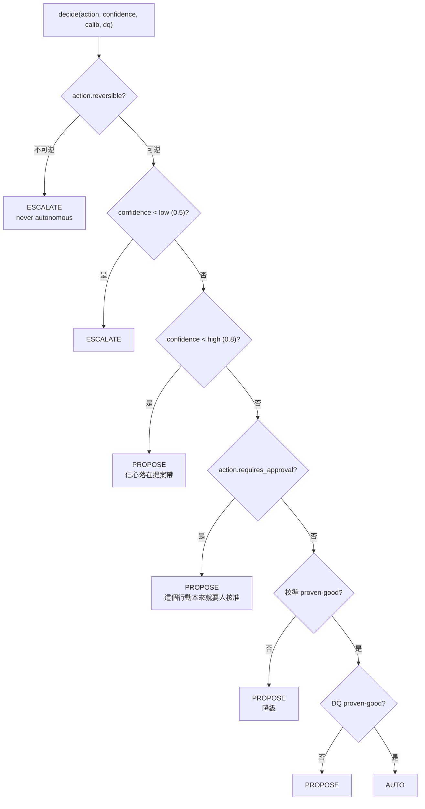
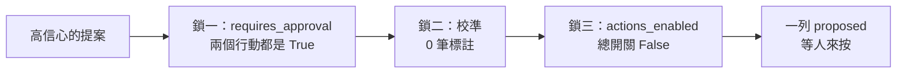
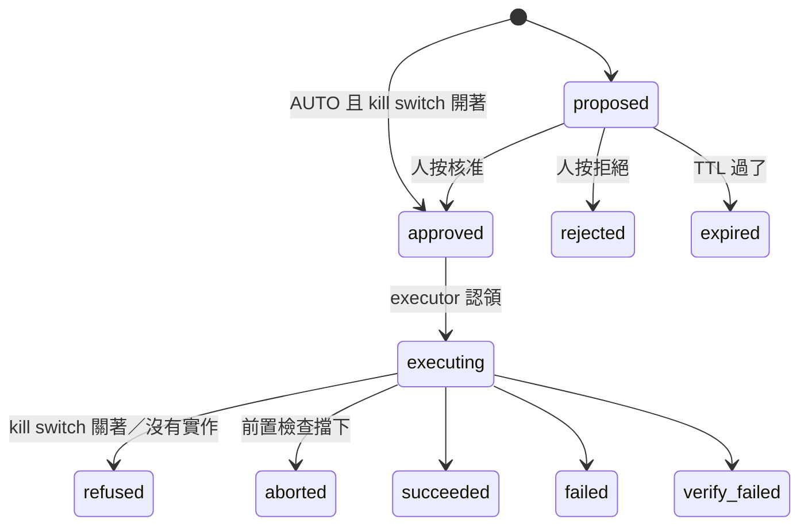
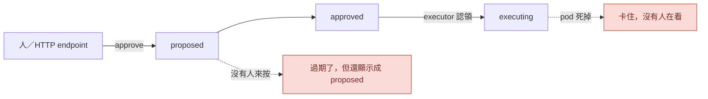

# Day30：一道從來沒被評估過的門，跟一個只有人按才會動的狀態機

> 那兩支檔案的 docstring 都寫得很好
> 一支講自主權要靠校準紀錄換
> 一支講狀態轉移為什麼是原子的
> 而我今天量出來的是，一段從來沒改變過任何結果，一段只有在有人敲門的時候才會動

昨天畫出真實的呼叫關係，結論是提案那條路一直是活的，斷掉的是提案之後那一段。今天把那一段的前兩格一起讀完：`governance.py` 決定一個行動准不准自己做，`action_requests.py` 把那個判斷變成一列可以被人按的紀錄。它們是同一條路上前後相鄰的兩格，分開讀會看不出來今天最後那個結論。

程式碼在範例 repo [`OTel_AIOps_Agent`](https://github.com/tedmax100/OTel_AIOps_Agent) 的 [`ironman-2026/day30/`](https://github.com/tedmax100/OTel_AIOps_Agent/tree/main/ironman-2026/day30)。兩支探測腳本都不需要叢集、不需要 LLM（Large Language Model，大型語言模型），暫存 SQLite 檔加真的模組，沒有 mock。

## 為什麼「信心 0.9」不足以決定任何事

先講上游那個模組想解決的問題。agent 跑完一次調查，findings 上面帶一個 `confidence`，比方說 0.9。這個數字是它自己寫的。前面有一次實測裡它在自己的推論裡寫著「沒有找到反證」，然後給了 1.0，我當時看到那份報告的反應是想笑又笑不太出來。

所以問題不是「它有多有信心」，是**它過去說 0.9 的時候，實際上對了幾成**。這個東西在 ARE（Agentic Reliability Engineering，代理式可靠性工程）裡叫 `校準`（calibration，白話點講就是「這隻 agent 的嘴巴跟它的手對不對得上」），而 [ARE 這本書](https://learning.oreilly.com/library/view/agentic-reliability-engineering/0642572294809/) §6.2 的第一條約束講得很硬：自主權是掙來的、而且是可以被收回的，而掙的憑據不能是它自己給自己打的分數。

`governance.py` 的 docstring 把這件事翻成三個層級：

- `AUTO`：政策允許自己執行（後面還有一道總開關）
- `PROPOSE`：算出來給人看，人按了才算數
- `ESCALATE`：連按鈕都不要生，直接交回給人

聽起來很清楚。今天要確認的是這三個層級在目前這個 repo 裡實際上怎麼分佈。

## 逐條讀那個判斷

`decide()` 整個函式的判斷順序是這樣，順序本身就是設計：



硬性安全規則排在最前面：不可逆的行動不管信心多高都是 ESCALATE，這條在 `confidence` 之前就決定了。之後才是信心分帶，最後那三格才是「掙來的自主權」那一段。

要注意的是圖裡 `action.requires_approval?` 那一格的位置。它在校準那兩格上面。這個排法本身沒有錯，一個標記成需要人核准的行動，本來就不該因為 agent 最近表現不錯就變成自動的。但它有一個副作用，等一下量出來會很直接。

`test_governance.py` 有十幾條測試，涵蓋率上看每個分支都有人走過：不可逆會 ESCALATE、低信心會 ESCALATE、中信心 PROPOSE、高信心加好校準會 AUTO、校準過度自信會降回 PROPOSE。看起來很完整。但每一條測試用的都是這個東西：

```python
def _spec(reversible=True, requires_approval=False, name="k8s.test"):
    return ActionSpec(
        name=name, description="d", reversible=reversible, requires_approval=requires_approval
    )
```

`requires_approval` 預設是 `False`。而註冊表裡真的存在的行動，兩個都是 `True`。**這證明了意圖，沒有證明機制**，而這句話今天還會再用一次。

> 這種「排在前面的檢查會讓後面的檢查失去意義」的形狀，其實跟前面那個 policy 只比對名字前綴是同一類東西：不是邏輯錯，是這條路上根本走不到後面那些判斷，而程式碼看起來仍然完整。

## 拿真的註冊表去掃一遍

```bash
# 從 o11y-bench 主 repo 的根目錄跑
python3 ironman-2026/day30/probe_governance.py
```

先看它認得哪些行動，以及一份乾淨到不能再乾淨的校準紀錄：

```
[0] registered actions (2)
    k8s.rollout_undo   reversible=True requires_approval=True impl=wired
    k8s.scale          reversible=True requires_approval=True impl=wired

[baseline] 25 grader labels, overconfidence -0.1 — every calibration gate satisfied
```

25 筆非自我標註、過度自信是負的（也就是它比實際表現還保守），這份紀錄過得了所有校準檢查。接著拿它去掃信心值：

```
[1] the real registry
    k8s.rollout_undo   0.3->escalate 0.6->propose  0.9->propose  1.0->propose
    k8s.scale          0.3->escalate 0.6->propose  0.9->propose  1.0->propose

[2] the same actions with requires_approval flipped off
    k8s.rollout_undo   0.3->escalate 0.6->propose  0.9->auto     1.0->auto
    k8s.scale          0.3->escalate 0.6->propose  0.9->auto     1.0->auto
```

兩排的差別只有一個布林值。**在目前註冊的行動上，`AUTO` 這個層級是到不了的，而擋住它的不是校準，是那個旗標。** [2] 那排把旗標翻掉之後 AUTO 立刻出現，同一份校準資料、同一個信心值，證明後面那幾格程式碼是活的、會動的，只是現實中沒有任何一個行動走得到那裡。

換句話說，這個模組最核心、docstring 花了半頁在講的那段校準判斷，在這個 repo 至今沒有改變過任何一次結果。它每次都會被算出來，算出來的字串也每次都被塞進 `Decision.calibration_note` 裡跟著提案跑，但決定去向的一直是上面那一格。

## 唯一真的裝在門上的那把鎖

前面講的是壞消息，這一段是好消息。校準那格內部其實有兩道門，`_calibration_verdict()` 依序檢查：

```python
labeled = calib.get("labeled") or 0
if labeled < settings.governance_min_labeled_runs:      # 20
    return False, f"calibration unproven ({labeled} labeled run(s) < 20); autonomy withheld"

if human_labeled is not None and human_labeled < settings.governance_min_human_labeled_runs:  # 20
    return False, (f"insufficient human/grader labels ({human_labeled} < 20); "
                   "self-produced labels cannot unlock AUTO")
```

第一道問「總共有幾筆標註」，第二道問「其中有幾筆不是它自己標的」。第二道那個 `human_labeled` 來自 `store.cal_count_by_source(exclude_sources=_SELF_LABEL_SOURCES)`，而那個常數只排除兩個來源：

```python
_SELF_LABEL_SOURCES = ("remediation-verified", "remediation-failed")
```

這兩個來源是 `execution.py` 執行完之後自己回頭驗證的結果。也就是說，agent 修完之後自己去查一下說「嗯我修好了」，這筆紀錄進得了資料庫、算得進總數，但解不開自主權：

```
[3] self-produced labels vs grader labels, at confidence 0.9
    after 25 x remediation-verified  labeled=25  non-self=0
        -> propose  insufficient human/grader labels (0 < 20); self-produced labels cannot unlock AUTO
    after 20 x grader                labeled=45  non-self=20
        -> auto     calibration ok (overconfidence -0.1, 45 runs)
```

25 筆自我標註，第一道門過了（25 ≥ 20），第二道門把它擋下來。再灌 20 筆 grader 標註進去，同一個信心值、同一個行動，判斷才變成 AUTO。這是 ARE §6.2 第一條約束最字面的一行程式碼，而且它是今天所有探測裡唯一一個「機制真的裝好了、而且真的會擋」的東西。

順帶一個小發現：過度自信那道檢查寫的是 `if overconf > settings.governance_max_overconfidence`，所以負的一路通行。一隻永遠說 0.3、實際上都對的 agent，會拿著滿分的校準成績單走到 AUTO 那格，而它的信心數字對值班的人來說一點資訊都沒有。

> 我還是把它寫出來會比較誠實：那兩個門檻都是 20，而 20 是設定檔裡的一個地板數字，不是統計上「夠了」的數字。20 筆全部集中在信心 0.9 那一格，跟 20 筆散在各個信心區間，能講的話完全不一樣。

## 那，現在按下去會發生什麼

這是上游這半段最想回答的一句話。探測四直接讀真實的那個 store：

```
[4] the real store, right now
    recorded=0 labeled=0 non-self=0 overconfidence=None
    k8s.rollout_undo   -> propose  high confidence but action is approval-gated
                          calibration unproven (0 labeled run(s) < 20); autonomy withheld
    k8s.scale          -> propose  high confidence but action is approval-gated
                          calibration unproven (0 labeled run(s) < 20); autonomy withheld
```

答案是 PROPOSE，而且是三道各自獨立的鎖同時鎖著：



這三道鎖沒有一道是多餘的，但它們疊在一起造成一個實際的問題：**現在這個系統告訴你「不行」的理由，跟你以為的理由不是同一個。** 看那兩行輸出，`reason` 說的是「approval-gated」，`calibration_note` 說的是「unproven」，同一列紀錄上兩句話、兩個原因。如果明天我把標註灌到 20 筆、校準也漂亮，第二句會變綠，第一句不會，結果一模一樣還是 PROPOSE。反過來說，如果有人為了「讓自動化跑起來」去把 `requires_approval` 改成 `False`，他會發現還是 PROPOSE，然後很可能繼續往下改。

## 那一列 proposed 之後呢

上面那條路最後產出的東西，是一列 `proposed`。從這裡開始換一支檔案。

治理平面算出來的 `Decision` 是一個 pydantic 物件，活在記憶體裡，函式回傳完就沒了。但「這個行動被允許到什麼程度」這件事必須撐得比一次函式呼叫久，因為中間要插進去一個人：人要看得到它、要能按、按完要留下是誰按的、而且隔天有人問起的時候要查得到。所以它得變成一列有狀態的紀錄。

`action_requests.py` 的 docstring 把職責切得很清楚：這支檔案管一個請求現在在哪個狀態、以及它可以合法地移動到哪裡；執行的時候發生什麼事是 `execution.py` 的；到底會不會真的動到叢集是 `actions.py` 那道 kill switch 的。狀態總共 13 個，其中 7 個標著 `(7b-4+)`，也就是執行管線之後才會用到、今天不碰的那一段：



所有的狀態轉移都走同一個函式，`store.ar_transition()`，而它的核心只有一句 SQL：

```sql
UPDATE action_requests SET status=? WHERE request_id=? AND status=?
```

最後那個 `AND status=?` 是重點。它不是「先讀出來看一下是不是 proposed，是的話再寫進去」，而是把讀跟寫壓成同一句原子操作，然後看 `cur.rowcount > 0`。這叫 compare-and-set（簡稱 CAS），兩個人同時按核准的時候，第二個人的 UPDATE 會匹配到 0 列，函式回 `False`，`approve()` 因此回 `None`。

這個設計是對的。要確認的是它在真的併發的時候也是對的，因為現有那三條相關的測試（double approve、approve after TTL、approve missing）都是單執行緒依序呼叫，只證明了「第二次呼叫看到狀態已經變了」。

```bash
python3 ironman-2026/day30/probe_lifecycle.py
```

```
[1] 8 threads approve the same request simultaneously
    approve() returned a request 1 time(s) out of 8
    after                  status=approved   actor=human-2 outcome=''
```

八個執行緒，恰好一個贏。連跑三次，贏的分別是 `human-2`、`human-1`、`human-1`、`human-0`，誰贏是隨機的，但**數量永遠是 1**。CAS 在真的併發下守住了，這一格是好的，也是今天下半段唯一的好消息。

## 三個沒有人管的狀態

剩下三個探測撞出來的東西骨架相同，先一個一個看。

**一、同樣過期的請求，approve 跟 reject 給出不同的故事。**

```
[2] the same stale request: approve() vs reject()
    approve() -> None
    approved path          status=expired    actor=None outcome='approval TTL elapsed before action'
    reject()  -> a request
    rejected path          status=rejected   actor=human outcome=''
```

兩列一模一樣的請求，`expires_ts` 都被我改到 60 秒前。走 approve 那條路的結果是 `expired`，`outcome` 留下了原因；走 reject 那條路的結果是 `rejected`，`actor` 是那個人。原因很單純：`approve()` 開頭有一行 `_expire_if_stale()`，`reject()` 沒有。

從「會不會出事」的角度看，這不是 bug，兩邊都是終局狀態，沒有東西會被執行。但從稽核軌跡的角度看，這兩列紀錄講的是兩個不同的故事：一個說「它逾時了，沒人來得及處理」，另一個說「有人看過並且決定不做」。前者該問的是為什麼沒人看到，後者該問的是那個人為什麼判斷不做，而事後翻紀錄的人分不出來。

**二、沒有人碰的過期請求，會一直待在待辦清單裡。**

```
[3] a stale request nobody touches
    listed under status=proposed: 1
    stored                 status=proposed   actor=None outcome=''
```

`_expire_if_stale()` 全專案只有一個呼叫點，就是 `approve()` 裡面那一行。也就是說過期是被動觸發的：沒有人去按那顆核准，那列紀錄就會用 `proposed` 的身分一直躺在那裡，`list_requests(status="proposed")` 撈得到它，plugin 那頁也會把它畫出來。

TTL（Time To Live，存活時間）存在的理由寫在 `config.py` 的註解裡，講得很好：核准會走味，一個在時窗內沒被處理的請求要讓它過期，免得世界已經動了之後還有人拿著舊的前置條件去行動（那是典型的 TOCTOU）。設計意圖是對的，但目前那個時窗只有在有人來敲門的時候才會被檢查。

實務上會怎樣：凌晨兩點出了一次事故，agent 提了一個回滾建議，沒有人處理。早上九點有人打開面板，看到一列 `proposed`，上面寫著回滾 payment-service 到 rev 24。那個提案是七小時前的世界算出來的，而畫面上沒有任何東西告訴他這件事，除非他自己去看 `created_ts`。他按下去，`approve()` 才在那一刻發現它過期了，然後回 `None`。運氣好的話畫面會跳一個 409，運氣不好的話他會以為自己按了。

**三、executor 認領到一半死掉。**

```
[4] the pod dies between claim and outcome
    executor claimed it: True
    after the crash        status=executing  actor=human outcome=''
    a restarted executor re-claims it: False
    approve() on it now: None
```

`execution.py` 認領一個請求的方式是 `approved → executing` 的 CAS，這樣兩個 executor 不會搶到同一列。問題是認領成功之後如果那個 pod 被砍掉（重新部署、OOMKilled、節點被驅逐），那列紀錄就永遠停在 `executing`。重啟後的 executor 沒辦法重新認領，因為它找的是 `approved`；人也沒辦法做任何事，因為 `approve()` 找的是 `proposed`。這一列就卡在一個既不是終局、也沒有人會再看它一眼的狀態，而且全專案沒有任何地方在掃 `executing` 的殘留。

> 我在別的地方踩過同一個坑，那次是一個訂單狀態卡在「處理中」三個月，沒有人發現，因為報表只看成功跟失敗兩種。
> 卡住的東西最可怕的地方不是它壞了，是它不會叫 QQ

這三件事的骨架是同一個：**這個狀態機的推進完全依賴有人來敲門。** 核准要人按、過期要靠有人試著按、卡在執行中的那列要靠有人發現。沒有任何一個角色在背景把時間的流逝變成狀態的變化。



這在目前的狀態下沒有造成任何傷害，因為 kill switch 是關的，卡住的那列本來也不會動到叢集。但這幾天的目標是把那個開關打開，而開關打開之後，這兩個虛線框就從「一列難看的紀錄」變成「一個沒有人知道的、進行中的變更」。

## 兩個缺口，都在同一個地方

平台工程的角度今天有兩個很具體的形狀，而它們指向同一個缺口。

第一個在上游：`requires_approval` 是掛在行動上的，不是掛在（行動、目標）這一對上的。`k8s.rollout_undo` 用在 demo namespace 裡一個三副本的無狀態服務上，跟用在 payment 上，在註冊表裡是同一格、同一個布林值。真正跟目標有關的風險判斷不在這裡，它在 `blast_radius.py`（namespace 白名單、影響 pod 數上限、單副本拒絕），那是另一個平面、另一個時間點的檢查。所以現在的分工是：行動的性質歸平台團隊（誰能改註冊表誰就決定），爆炸半徑歸執行前的政策，而「payment 這個服務願意讓 agent 自動做到哪一級」這件事，repo 裡仍然沒有地方可以寫。這個缺口的代價是可以預期的：一旦哪天真的要讓某一個低風險的場景自動跑，唯一的做法是把註冊表裡那個旗標翻掉，而那一翻是全域的。paved road 的重點從來不是只有一條路，是預設那條最好走、要走別條得自己說明理由，現在這裡連別條路的入口都沒有，只有一個總開關。

第二個在下游：一個提案卡在畫面上，成本是誰的？如果過期只在按下去的那一刻才算，成本就落在**值班的人**身上，而他手上的資訊是最少的，因為他不知道 TTL 是 900 秒（那寫在服務端的設定檔裡）。反過來，如果清單本身就把過了時窗的提案標出來，或者乾脆讓它們自己走到 `expired`，成本就落在平台團隊身上，代價是多一支背景工作。這是這系列反覆問的同一個問題：一道 gate 擋下來之後，對方能不能自己修好。目前這道門擋下來的訊息是 HTTP 409 加一句 `request not approvable (missing, expired, or already decided)`，三種原因擠在同一句話裡，而它們對值班的人來說是三件完全不同的事。

兩個缺口的共同點是：**這條路上每一個「誰可以決定什麼」的問題，目前的答案都是平台團隊，因為那是唯一有地方可以寫的角色。**

## 今天沒做的事

- **三道鎖一道都沒開，三個洞一個都沒補。** 今天的目的是把「按下去會發生什麼」講清楚，不是讓它變成 AUTO。開哪一道、補哪一個，得先有標註數字跟開關打開之後的實際影響。
- **兩支腳本都不是測試。** `probe_governance.py` 跟 `probe_lifecycle.py` 都是印東西給人看，沒有斷言，也沒有進 `tests/`。真正該補的是一條「拿註冊表裡真的存在的行動去走 AUTO 那條路」的測試，那條測試現在會告訴你到不了。
- **兩處訊息打架都只講不改。** `reason` 跟 `calibration_note` 兩句話、409 那句把三種原因擠成一句，改它們要動到 plugin 跟現有測試。
- **`requires_approval` 的每服務分級沒有設計。** 今天只寫出缺口的形狀，那牽涉到誰擁有那份設定。
- **沒有撞 `execution.py` 那一側。** 今天只到「認領」那一格為止，認領之後的乾跑、rubric 檢查、settle window 都沒碰。
- **併發只測到 8 個執行緒、同一個 process。** 兩個 replica 同時打同一個 SQLite 檔是另一回事，那牽涉到 SQLite 的鎖行為。
- **DQ（data quality）那格完全沒碰。** 它排在校準後面，而校準那格現在都走不到。

## 小結

總結來說，今天沒有改任何一行產品程式碼，做的事情是把兩支檔案的 docstring 跟它們的實際效果各對一次帳。上游那段最重要的校準邏輯是活的、正確的、有測試的，但在真實的註冊表上從來沒有被評估到，唯一真的在擋人的是「自己說自己修好了不算數」那一條，它擋得乾淨俐落。下游那個狀態機的 CAS 在八個執行緒下守住了，而它之外的三條路都指向同一件事：只有在有人按的時候它才會動，時間本身不會讓任何一列紀錄前進。

把兩半放在一起看，接下來要做的事情就收斂成一件很具體的東西：那個 `non-self=0` 得變成一個大於 20 的數字，而且不是靠 agent 自己標的。在那之前，校準曲線、過度自信、自主權階梯，講起來都還是設計稿。

> 寫這篇的時候我原本準備了一段「來看看校準門怎麼把它擋下來」的示範，跑完第一個探測才發現根本輪不到那道門上場。
> 而寫那兩支探測腳本花的時間，比我讀完那十幾條測試的時間還短。早知道每次看到「這裡有測試」就先花十分鐘撞一下，前面三十幾天可以少寫幾篇認錯的文章 XD
