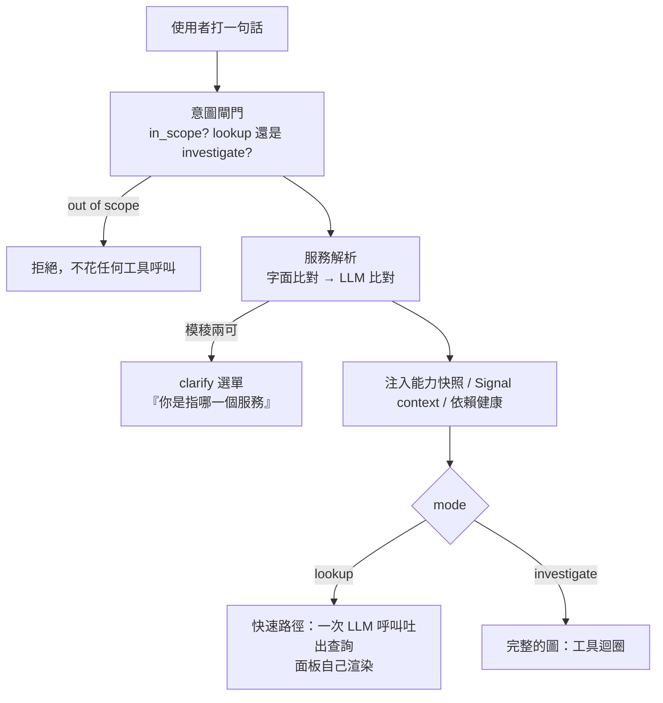

> 告警進來的那一輪，它會列假設樹、給信心分數、留一筆紀錄
> 人打字進來的那一輪，它就只是回答問題
> 而我一直以為那是同一隻 agent

昨天把整條鏈跑通之後，我回頭看那六個階段，發現一件很尷尬的事：**從 Day23 到昨天，每一次驗證都是從告警那頭進去的。** `/webhook/alert`、`run_headless()`、eval harness，全部都是。

但這整套東西最後要用的樣子，是一個人在 Grafana 的輸入框打一句「payment 的拒絕率為什麼變高了」。那條路我一次都沒有量過。

今天量了，然後發現它缺一半。

程式碼在範例 repo [`OTel_AIOps_Agent`](https://github.com/tedmax100/OTel_AIOps_Agent) 的 [`ironman-2026/day30/`](https://github.com/tedmax100/OTel_AIOps_Agent/tree/main/ironman-2026/day30)。

## 打字那條路，模型開始想之前先發生三件事

先講清楚這條路的形狀，因為它跟告警那條差很多。



意圖閘門做兩件事。第一是**擋掉不相干的問題**，而且是 fail-closed：分類器自己壞掉的時候一律拒絕，因為「分類失敗就放行」等於給了一條繞過的路。第二是分模式：

```console
$ uv run python chat_probe.py
payment-service 的拒絕率為什麼變高了   in_scope=True  mode=investigate  services=['payment-service']
order-service 的 p95 latency          in_scope=True  mode=lookup       services=['order-service']
近10筆 payment 的錯誤 log              in_scope=True  mode=lookup       services=['payment-service']
幫我寫一個 python 快排                 in_scope=False mode=investigate  services=[]
哪個服務最近最不健康                    in_scope=True  mode=investigate  services=[]
```

`lookup` 那兩題不需要 ReAct 迴圈。使用者要的是**看到那張圖**，agent 的工作只是把中文翻成一句 PromQL/LogQL，剩下的交給面板去跑。一次 LLM 呼叫、零工具呼叫。這個分流不是為了省錢，是因為「顯示一個指標」跟「查出根因」在互動上根本是兩件事。

最後一列 `哪個服務最近最不健康` 解析不到服務，因為它問的是全部。這種情況不注入能力快照，agent 得自己 discover。

## 然後我把兩條路的清單並排

| | 人打字（改之前） | 告警 webhook |
| --- | --- | --- |
| 意圖閘門 / 服務解析 / clarify 選單 | ✅ | — |
| 能力快照、Signal context、依賴健康 | ✅ | ✅ |
| **RCA playbook（假設樹＋五步＋信心規則）** | ❌ | ✅ |
| **findings：結論／信心／suspected_version** | ❌ | ✅ |
| 過去事故注入 | ❌ | ✅ |
| **investigation 紀錄 ＋ `trace_id`** | ❌ | ✅ |
| trace ID 幻覺守門 | ✅ | ✅ |
| 面板、alert 提案卡 | ✅ | — |

中間那四列就是這三十天的成果裡，**只長在告警那一側的部分**。

白話講：你在 Grafana 問「payment 為什麼一直被拒」，拿到的是一段有面板的回答，但沒有假設樹、沒有信心分數、事後在 investigation 列表裡找不到這次對話，也沒有一條 trace 可以回頭看它怎麼想的。

這不是設計取捨，是我沒發現。`_RCA_PLAYBOOK` 這個常數只被 `_alert_to_prompt()` 用到，而那個函式只有 webhook 會呼叫。**同一個圖、同一組工具、同一份 catalog，只有 kickoff 那段話不一樣，出來的東西就差這麼多。**

## 補起來只有三件事

**一，investigate 模式也拿到同一份方法。** 把 playbook 抽出來，chat 的 investigate 回合注入一份。

**二，回合結束後抽 findings。** 圖跑完之後把 checkpoint 裡的訊息拿出來，跑一次結構化抽取，用一個新的 `findings` 事件送到前端，同時存一列 investigation（`source: chat`，並帶著 Day28 那個 `trace_id`）。

**三，注入過去事故。** 原本的查詢要 service ＋ alertname 兩個條件，而 chat 問句沒有 alertname，所以改成 alertname 可選。理由很簡單：「上次有人查這個服務，結論是什麼」本來就是一個同事會記得的事。

跑一次：

```console
$ uv run python chat_turn.py "payment-service 的拒絕率為什麼變高了"
tool_start query_prometheus {'expr': 'sum by (git_version, reason) (rate(payment_charges_total{status="declined"}…
tool_start query_prometheus {'expr': 'sum by (git_version, reason) (rate(payment_charges_total[5m]))', …
findings   confidence=0.7 services=['payment-service'] version=v2.5.0
           The decline rate for payment-service has increased due to a spike in declines with the
           reason "new_validator"…
suggestions ['v2.5.0 的新拒絕原因 "new_validator" 的詳細錯誤日誌', '比較 v2.5.0 和 v2.4.0 的程式碼差異', …]

stored row: fp=day30-demo source=chat confidence=0.7 trace_id=10d35edee3e4a743d43395ee6b55f5c8
```

前端那一側也接了三個地方：對話框下面多一條信心分數與結論的橫幅；investigation 列表上，chat 來的那幾列會標成 `chat`，而且有 `trace_id` 的都多一個「看它怎麼想的」連結，直接開到 Trace Explorer 的那條 trace；提案那一列現在會把 Day27 存進去的影響範圍（幾個 pod、revision 怎麼變、有沒有過 policy）畫出來。

## 兩個踩到的坑，都跟「話要對誰講」有關

**第一版我把 playbook 接在使用者訊息後面**，結果中文問題拿到一半英文的回答：一大塊英文指令黏在問句尾巴，模型就順著換語言了。改成獨立的 system message，使用者的訊息維持原樣，並在最後一行重申「用使用者的語言回答」（放最後是因為近因效應，這條規則是模型最先忘的），問題才消失。

**第二版它把整棵假設樹印在回答裡。** 告警那條路沒人看，印出來無所謂；chat 這條路，使用者會看到三段 H1/H2/H3 加確認條件與反駁條件，然後才是答案。所以指令要明說：**內部想，不要印，最後只留一行信心與還不能排除什麼。**

這兩個坑講的是同一件事：**同一段指令，對著沒人看的批次流程跟對著一個正在等答案的人，寫法是不一樣的。**

> 另外一個沒有解決的東西：那一輪它給的信心是 0.7，但同一個問題我跑過一次拿到 1.0，而那次它在答案裡自己寫「Contradictory evidence: None found」——它根本沒去找反證，卻給了滿分。playbook 裡明明寫了「沒做反證嘗試 → 信心 ≤ 0.5」。這個數字準不準，是下一個系列的第一個題目 :(

## 對值班的人來說差在哪

差別在那一輪對話結束之後還剩下什麼。

以前：一段講得不錯的分析，關掉分頁就沒了。事後有人問「昨天那個誰查的、結論是什麼」，答案是去翻 Slack。

現在：那次對話會出現在 investigation 列表裡，帶著信心分數、可以被標記正確或錯誤（那個標記會餵給校準），而且有一個連結可以打開它當時的推理過程。**一次隨手的提問，跟一次會被記錄下來的調查，中間差的就是這幾個欄位。**

而 `lookup` 那條路刻意什麼都不留，因為「給我看 p95」本來就不是一次調查，硬要記錄只會把列表洗掉。

## 今天沒做的事

- **chat 不會產生 remediation 提案。** 提案來自 runbook 的 remediation 區塊，而 runbook 的 trigger 是告警形狀的（要 alertname）。一句問話要怎麼比對到 runbook，我還沒有想清楚，硬比會在「payment 的延遲如何」這種問題上比到 decline 的 runbook。
- **信心分數還是模型自己講的。** 上面那個 1.0 就是證據。
- **clarify 選單只在解析模稜兩可時出現**，而「哪個服務最近最不健康」這種問題是直接不注入，沒有任何提示告訴使用者「我沒有鎖定服務」。
- **沒有量 chat 這條路的分數。** eval fixture 現在全部是告警形狀的。

## 小結

總結來說，今天做的事情不難，難的是發現要做：前面二十九天我一直在驗證那條沒有人看的路徑，而真正會被用的那一條，缺了假設樹、信心分數、紀錄跟回放連結。原因也不是設計上的取捨，只是 playbook 那個常數剛好只有一個呼叫點。這種缺口在自己的專案裡特別容易發生，因為兩條路徑「看起來」都是同一隻 agent，你只有把兩邊的清單並排寫下來，才會看到中間那四個空格。

> 這系列到現在，我大概有一半的發現都來自「把兩個東西並排列成一張表」。
> 不是什麼高明的方法，但它逼你把「我以為一樣」寫成兩欄 XD
