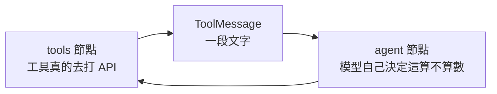
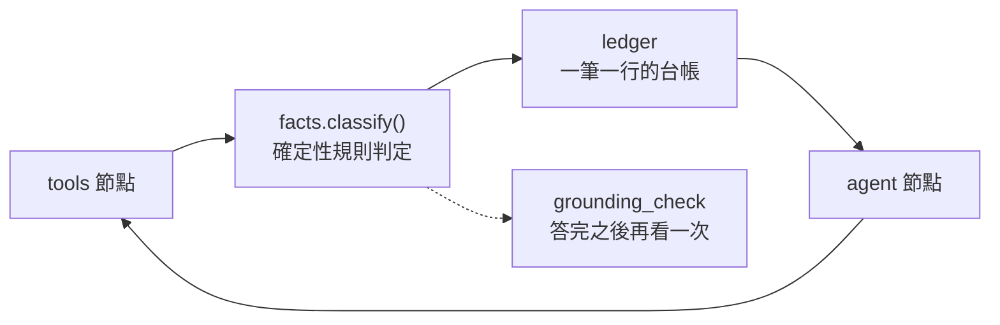
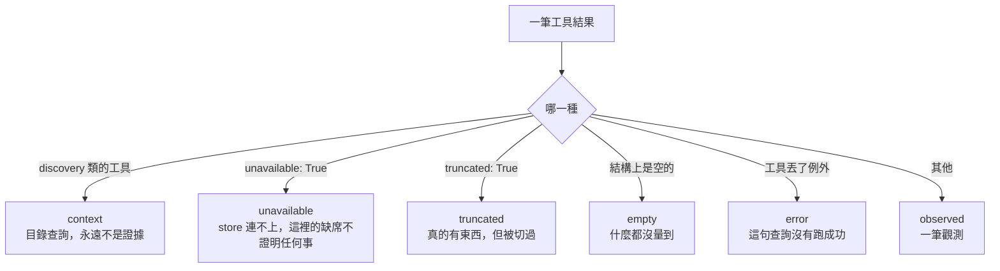

# Day31：空結果不是證據，而這件事不能靠勸的

> 一句查不到東西的查詢
> 跟一句查到東西的查詢
> 在對話紀錄裡長得一模一樣
> 而只有其中一句可以拿來下結論

昨天那篇的最後一句是「紅的理由沒有一句是模型不夠強」。我本來以為那是收尾，結果隔天回頭翻 benchmark 的逐字稿，發現有一種失敗一直在那裡，而且它也不是模型不夠強造成的：**agent 查了四次，四次都空，然後報出一個精確到小數點的數字。**

這件事前面提過兩次。一次是這系列的第一天，那隻 agent 憑空生了一個 trace ID；一次是講 collector 被壓垮那天，「空結果的第三種真相」是資料根本沒送到後端。兩次我都把帳算在模型頭上。今天想把這筆帳重算一次，因為中間還有一層我沒看過：那個空結果，在進到模型眼前的時候，長得跟一筆真的觀測完全一樣。

程式碼在範例 repo [`OTel_AIOps_Agent`](https://github.com/tedmax100/OTel_AIOps_Agent) 的 [`ironman-2026/day31/`](https://github.com/tedmax100/OTel_AIOps_Agent/tree/main/ironman-2026/day31)。指令都假設從 `aiops-agent/service/` 底下跑。

## 勸告不是控制

先講一件已經做過的事，因為今天做的事是它的下一步。

前面處理三個 store 的怪癖那天，`query.py` 多了一個功能：查詢回空的時候，工具會自己補一句話說明為什麼空。Prometheus 那邊會去比對 `__name__` 的清單，發現這個指標根本不存在就直接指名；Loki 那邊會去比對可索引標籤，發現你用了 `service` 而不是 `service_name` 就把五個能用的鍵列出來。

```console
{'resultType': 'vector', 'result': [],
 'note': 'No such metric in Prometheus: payment_declines_total.',
 'hint': 'Call discover_metrics(service) for the names this service really emits — '
         'rewording this query will return empty again.'}
```

那句 `rewording this query will return empty again` 是刻意寫給一個特定行為看的：模型拿到空結果之後最愛做的事就是換句話再問一次。

問題是這整段都是**勸告**。它是 payload 裡的一段英文，跟旁邊那些真的資料混在一起，要不要理它是模型自己決定。

而勸告有沒有用，這系列前面剛好量過一次。做「已經排除的假設」那個功能的時候，我把「這條路已經被人排除了」寫進 prompt，三個 seed 全部把那個被排除的假設原封不動講了回來，而且信心分數比沒看過這句話的那組還高。當時的結論寫在 `refutation.py` 的開頭：一個不能被機器執行的約束，不要指望模型幫你遵守。

> 我那時候還安慰自己說，那是因為 prompt 寫得不夠強硬。後來把語氣改成全大寫的 MUST NOT，結果沒有比較好，只是我的 prompt 變醜了 XD

同一個道理套回空結果：`note` 寫得再清楚，它終究是一段可以被忽略的文字。今天要做的是把同一個判斷搬到模型沒有投票權的地方。

## 一筆工具結果，到底是什麼

先講結構，因為這一層放在哪裡決定了它有沒有用。

現在的流程是這樣：`tools` 節點跑完工具，把回傳值塞進一則 `ToolMessage`，然後整串對話丟回給 `agent` 節點。中間沒有任何人問過「這一筆是什麼東西」。



一則空的 Prometheus 回應、一則「Kubernetes 連不上」、一則被 cap 截斷的 Tempo 結果、一則真的有 6 條 series 的向量，在這條路上是同一種東西：文字。它們的差別只存在於模型讀完之後的理解裡，而那個理解不會留下任何可以檢查的痕跡。

今天加的 `app/facts.py` 就是插在中間那一層：



它做的事只有一件：把每一筆工具結果判成六種狀態之一，而且**這個判定讀的是 payload 本身的結構，不是模型對它的描述**。



六種裡面只有 `observed` 跟 `truncated` 可以當證據。其他四種各自有各自的理由，而且理由不一樣這件事很重要：`empty` 是「這段時間真的沒有」，`unavailable` 是「我根本沒看到」，這兩句話對值班的人來說是完全不同的下一步，但在舊的流程裡它們都只是一段文字。

## 六種狀態，拿真的 store 各撞一次

`probe_facts.py` 就是這份判定表的可執行版本：對三個 store 各問一次「有的東西」跟「沒有的東西」，然後把判定印出來。不經過模型、不花 token，因為這些是 payload 的性質。

跑之前要有流量。沒有流量的時候，寫對的查詢也會回空，而這支腳本會照實印出來：

```bash
kubectl -n demo port-forward svc/prometheus 9090:9090 &
kubectl -n demo port-forward svc/loki 3100:3100 &
kubectl -n demo port-forward svc/tempo 3200:3200 &
WEBAPP_URL=http://localhost:8002 ../../demo-services/scripts/load.sh 10 90

uv run python ../../otel-aiops-agent/ironman-2026/day31/probe_facts.py
```

```console
Prometheus, a metric this stack never emits  [live]
  payload : {'resultType': 'vector', 'result': [], 'note': 'No such metric in Prometheus: …
  verdict : empty        usable=False

Prometheus, a metric it does emit  [live]
  payload : {'resultType': 'vector', 'result': [{'metric': {'service_name': 'payment-service'}, 'value': 1.304}, …
  verdict : observed     usable=True

Loki, `service` instead of `service_name`  [live]
  payload : {'resultType': 'streams', 'result': [], 'note': 'Not an indexable stream label: service. …
  verdict : empty        usable=False

Loki, the selector that indexes  [live]
  payload : {'resultType': 'vector', 'result': [{'metric': {}, 'value': 372.0}]}
  verdict : observed     usable=True

Tempo, a window that is past retention  [live]
  payload : {'traces': [], 'count': 0}
  verdict : empty        usable=False

Tempo, the last hour  [live]
  payload : {'truncated': True, 'reason': 'Tempo result > 8192B; returning slim summaries.', …
  verdict : truncated    usable=True

k8s, a service that does not exist  [live]
  payload : {'service': 'billing-service', 'namespace': 'demo', 'pod_count': 0, 'pods': []}
  verdict : empty        usable=False

the catalog, which is never evidence  [live]
  payload : {'service': 'payment-service', 'metric_count': 6, 'identity_labels': […
  verdict : context      usable=False
```

三個 store 的「空」長得都不一樣，這也是為什麼這件事沒辦法用一條通則寫完。Prometheus 是 `result: []`，Tempo 是 `traces: []` 加一個 `count: 0`，k8s 是 `pod_count: 0`，Loki 依查詢種類不同會回 `streams` 或 `vector`。每一種都被模型當成數字讀過至少一次。

那個 `[live]` 標記是刻意加的。一支會在 store 沒回應的時候偷偷改用預錄 payload 的腳本，本身就是這一天在講的那種毛病，所以每一行都要標明自己是不是剛剛真的問到的。

### 那個 catalog 為什麼自己一國

`discover_metrics` 這類工具回的是「這個服務有哪些指標可以查」。它非常有用，是模型寫出正確查詢的前提，但它**不是對這次事故的觀測**。

把它算成證據會出現一個很微妙的錯：一輪調查裡三次呼叫全是 discovery，台帳上看起來有三筆資料，實際上一次都沒有量到事故本身。所以 `catalog` 在這裡自己是一個 domain，永遠不會被算進「幾個獨立來源」。

## 一個我判錯的格子

`truncated` 這一格，第一版我判成不可用。理由聽起來很正當：payload 被 cap 切過，你不知道被切掉的那部分長什麼樣，怎麼能拿來下結論。

跑真實 stack 的時候才發現這條規則太貪心了：

```console
Tempo, the last hour  [live]
  payload : {'truncated': True, 'reason': 'Tempo result > 8192B; returning slim summaries.',
             'traces': [{'traceID': '31c23409fd04f91bb3bf8f16892b4a0', …
  verdict : truncated    usable=True
```

一個服務、一小時，這是這隻 agent 最常打的一種 trace 查詢，而它超過 8 KB 的 cap。也就是說**這套 stack 裡最普通的一次 trace 查詢就是 truncated**，第一版等於把一次成功的查詢說成沒查到。

改法不是把它放行就算了。`truncated` 現在算證據，但它在台帳上帶著一句自己的話：

```
[f06] ok trace/mechanism query_tempo_traces: real but capped — cite what is in it, never a total or a rate from it
```

裡面那幾條 trace 是真的，引用它們沒問題；拿它去算「總共幾條」「錯誤率多少」就不行，因為那個總數在被人看到之前就已經被切掉了。這是我在這一層裡唯一一個「可以用但要小心」的格子，其他五格都是非黑即白。

> 這個坑其實是好事。要不是跑了真的 stack，我會帶著一條「看起來很嚴謹」的規則上線，然後某天有人問我為什麼 agent 說 Tempo 查不到東西，而 Tempo 明明有 :(

## 台帳長什麼樣

判定完之後要有人看得到，不然它只是一堆 dataclass。每個 loop 注入回對話的就是這張台帳，一筆一行：

```console
EVIDENCE LEDGER (machine-typed from the tool payloads, not from your summary):
[f01] XX runtime/mechanism query_prometheus: no data in this window — MUST NOT be cited as evidence
[f02] ok runtime/mechanism query_prometheus: resultType=vector, result[6]
[f03] XX log/impact query_loki_logs: no data in this window — MUST NOT be cited as evidence
[f04] ok log/impact query_loki_logs: resultType=vector, result[1]
[f05] XX trace/mechanism query_tempo_traces: no data in this window — MUST NOT be cited as evidence
[f06] ok trace/mechanism query_tempo_traces: real but capped — cite what is in it, never a total or a rate from it
[f07] XX runtime/mechanism k8s_pod_status_tool: no data in this window — MUST NOT be cited as evidence
[f08] XX catalog/context discover_metrics_tool: catalog/reference lookup — orients the next query, not evidence
usable: 3/8 across 3 independent source(s) ['log', 'runtime', 'trace']. role is a hint from which store answered, not proof it tested that role.
```

最後那一行有兩個地方值得講。

`independent source(s)` 算的是 store，不是次數。兩句 PromQL 是一個來源不是兩個，這跟信心分數那三個維度裡的「訊號多樣性」講的是同一件事，只是現在它是算出來的而不是模型自己報的。

`role is a hint` 那半句是**故意留下的一句自白**。`runtime/mechanism` 這種標記是從「哪個 store 回答的」推出來的，`query_prometheus` 有能力講機制，不代表這一句 PromQL 真的驗了機制。要真的知道，得在查之前就把假設綁在那一步上，而這一層沒有做那件事。所以它在每一個印出來的地方都自稱是提示，免得下游有人把它當判決用。

## 守門：同一句答案，兩種下場

台帳只是給模型看的，還是可以被無視。所以答完之後還有一道，跟前面那兩道守門排在一起：trace ID 對不對得上、有沒有把人排除掉的假設講回來，然後是這一道。

```console
every observation empty: SENT BACK
  Every observation this turn was unusable as evidence (discover_metrics_tool:context,
  k8s_pod_status_tool:empty, query_loki_logs:empty, query_prometheus:empty,
  query_tempo_traces:empty), yet your answer states a conclusion or quotes a number.
  Rewrite it: say which checks you ran, that each returned nothing usable, …

this turn's real facts: allowed

saying so plainly, on the same empty turn: allowed
```

同一句話「payment-service 的拒絕率是 55%，根因是 v2.5.0 的新 validator」，在一輪什麼都沒量到的調查裡會被退回，在有觀測的那輪就過。而在同樣什麼都沒量到的那輪，老實說「我查了四次都是空的，沒有證據」是可以過的。

門檻壓在地板上是刻意的：**零筆可用才擋**。這一層沒有把假設綁在每一步上，所以它判斷不了「一筆夠不夠」，只判斷得了「有沒有」。把門檻拉高到「至少兩種獨立來源」在技術上五分鐘就改得完，但那會變成一道我沒辦法解釋為什麼是二不是三的規則。

比對的方式也故意很笨：關鍵詞加上一個「數字後面帶單位」的規則。這跟前面那道反證守門是同一個取捨，理由也一樣：「因為你這一輪每一筆觀測都是空的，而你講了一個數字」是一句可以對值班的人講出口的話，相似度分數不是。列表編號的 `1.` `2.` 不算數字宣稱，不然這個警告會很快被訓練成噪音。

### 對值班的人來說差在哪

凌晨三點，agent 說「payment-service 的拒絕率 55%」。

在舊的流程裡，這句話你沒辦法快速驗證。它可能是真的量到的，也可能是四個空結果之後拼出來的，而兩者在畫面上一模一樣。你要嘛相信它然後去重啟一個可能無辜的服務，要嘛自己重跑一次那四句查詢，那大概花掉五分鐘。第二條路比較安全，但如果每次都要走第二條，這隻 agent 就沒有存在的必要。

現在那句話後面跟著一張台帳，上面寫著這輪有三筆可用、來自三個不同的 store，還是零筆全空。這不會讓 agent 變聰明，它只是讓「要不要相信這句話」從一個判斷題變成一個查表題。

> 這也是我覺得這類系統最容易被低估的一件事。多數時候人要的不是更準的答案，是**知道這個答案該信到幾分**。前者要換模型，後者只要把判斷過程露出來。

## 誰維護這一層，成本落在誰身上

這一層在維護上有一個很好的性質：它不需要任何團隊配合。

前面治理那一段的判準是「成本會不會隨團隊數線性成長」。`facts.py` 認的是 store 的回應格式，不是各服務的命名，所以新服務接進來不用做任何事，也不用學任何新概念。要維護的是另一件事：**新增一個工具的時候，要記得在那兩張表裡各加一行**，說它屬於哪個 domain、能講哪個因果角色。漏了會怎樣？它會被歸到 `unknown` 加 `context`，也就是預設不算證據。

預設值往嚴的那邊倒是刻意的。漏加一行的後果是「這個工具的結果暫時不算數」，值班的人看得到台帳上那一行寫著 `unknown`，會來問我；反過來如果預設算數，漏加一行的後果是一筆沒人檢查過的東西被當成證據，而且不會有任何人發現。

不過這個設計有個代價要講清楚：**這一層只認得出「格式上是空的」，認不出「查錯問題」。** 一句語法正確、目標服務也對、但問錯時間窗的查詢，回來的資料是真的，它就會被判成 `observed`。它擋的是憑空生數字，不是擋錯誤推理。

## 今天沒做的事

- **證據沒有跟假設綁在一起。** 台帳只知道「這筆是什麼」，不知道「這筆在驗什麼」。要做得在查之前就把假設寫下來，那是計畫層的事，這一層沒有計畫層。
- **`role` 還是一個猜測。** 從工具反推因果角色，準確率沒有量過，所以它現在只敢自稱提示。
- **門檻壓在零。** 「一筆夠不夠」「兩種來源夠不夠」目前完全沒判斷，而信心分數那一側仍然是模型自己報的數字。這兩件事其實是同一件事的兩半，留給後面。
- **k8s 的兩種空分不開。** `billing-service` 這個服務不存在，跟一個真的服務的 pod 全掛了，回來都是 `pod_count: 0`，現在一律當成 `empty`。
- **沒有量它對分數的影響。** 這一輪一樣沒有跑完整的評測去比對加這一層前後的差別。老實講前面欠這件事已經欠很多次了，而原因每次都一樣：fixture 吃的是會流動的資料。
- **台帳的 token 成本沒有量。** 它每個 loop 都會重新注入一次，八筆的時候大概是十行，但一輪長調查會累積到幾筆、擠掉多少上下文，沒有測。

## 小結

總結來說，今天做的事情其實很小，就是在工具跟模型中間插一層判定，加上一支不用 token 就能重跑的探測腳本。但它換掉的是一個假設：以前我以為只要工具把話講清楚，模型就會做對，而這系列已經量過兩次，那個假設不成立。

比較實際的收穫是那個 `truncated` 的坑。它提醒了我一件事，這種確定性的規則有兩個方向會出錯，一個是放太鬆讓假證據混進去，另一個是收太緊把真的量測說成沒量到。第二種不會有人抱怨，因為它的症狀是 agent 變得比較保守，而保守看起來像謹慎。

至於這一層對排查品質到底有多少幫助，現在還講不出一個數字。能講的只有一件事：**空結果被當成證據這條路，現在被機器擋住了，而不是被一段 prompt 拜託不要走。**

> 這篇的規則我來回改了三次，兩次都是被真實 payload 打臉。
> 一個只在單元測試裡跑過的判定規則，跟一份猜出來的沒有差別 QQ
