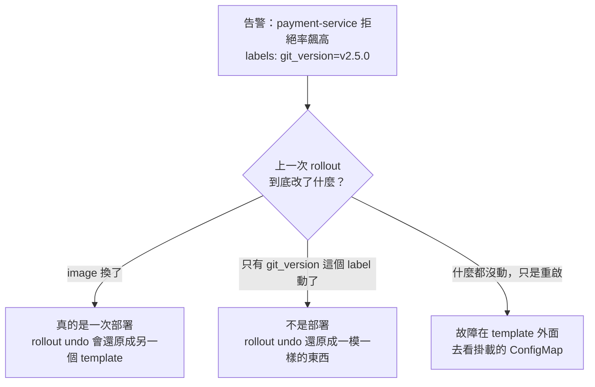

# Day32：一個對的診斷，配一個沒用的處置

> 它說對了原因
> 然後提議了一個
> 就算執行也不會有用的處置
> 而報表上這叫做一次成功的調查

前面講校準那天說過，能填 `correct` 那個欄位的只有兩種來源，人或是在已知答案的題目上機械評分的 grader。我把七筆答案還原得回來的調查標完，錯的五筆裡有四筆是同一種錯法，而那個錯法我完全沒有預料到。

程式碼在範例 repo [`OTel_AIOps_Agent`](https://github.com/tedmax100/OTel_AIOps_Agent) 的 [`ironman-2026/day32/`](https://github.com/tedmax100/OTel_AIOps_Agent/tree/main/ironman-2026/day32)。指令都假設從 `aiops-agent/service/` 底下跑。

## 四次都怪同一個東西

那四筆的結論長得幾乎一樣：「`payment-service` 版本 x 的程式碼有 regression」。信心分別是 0.95、0.95、0.95、0.95。

而它們的共同點不是故障，是**告警上帶著一個 `git_version` 標籤**。

其中三筆是演習，劇本我自己寫的：壞掉的 flag 放進那份**沒有被改過的 pod template 所掛載的 ConfigMap**。第四筆是我自己在某個下午弄出來的事故，做法更單純，我沒有部署任何東西，只是把 ConfigMap 裡的 flag 翻成 true，再重啟 payment。

四次它都說是部署造成的。而四次都不是。

這件事嚴重在哪，看它建議的處置就知道：`rollout undo`。那個動作會忠實地把 pod template 還原成前一版，而故障根本不在 template 裡，症狀不會有任何變化。**值班的人會照著做，然後看著拒絕率一動也不動，開始懷疑自己是不是漏了什麼。**

## 這套 demo 裡，版本號是一個 label

回頭查那個 deployment 的歷史，答案有點難堪：

```
rev  git_version  image
68   v2.4.1       demo-services/payment:dev
69   v2.5.0       demo-services/payment:dev
70   v2.5.0       demo-services/payment:dev
71   v2.5.0       demo-services/payment:dev
```

四個 revision 跑的是同一個 image。`git_version` 是 pod template 上的一個標籤，不是一個不同的 build，所以「回滾到上一版」在這套環境裡不會改變任何跑起來的東西。

這是 demo 環境的簡化，真實的部署當然會換 image。但它把一個真實的問題放大得很清楚：**agent 是從標籤推論「這是一次部署」，而不是從「什麼真的變了」。** 換成一個會換 image 的環境，這個推論仍然有一半的時候是錯的——config 型的故障在真實系統裡一點都不罕見，flag、ConfigMap、外部設定中心，全都不在 pod template 裡。

從告警的角度看，這三種形狀完全一樣：



`agent` 手上原本沒有任何工具回答得了圖裡那個菱形。它有 `k8s_deployment_status`，那支回答的是「這次部署有沒有健康地跑起來」，是另一個問題。

## 第一次修法：把答案放在它拿得到的地方

於是加了一支唯讀的工具 `k8s_change_provenance`，做的事情只有一件：把最近幾個 ReplicaSet 的 pod template 拿出來比對。

比對的欄位刻意選得很窄——image、env、掛載的 ConfigMap 與 Secret。不做逐欄位的完整 diff，因為 `kubectl rollout restart` 會寫一個時間戳註記，逐欄位比會每次都報「有變化」，而那句話等於沒說。

它回的是一句話：

```
verdict: the last rollout changed nothing the process runs (at most a version label
or a restart). If behaviour changed, the cause is outside the template — check the
mounted config: configMap/payment-flags
```

加完工具，把同一個事故重造一次，發 webhook 讓它跑。這一次它的結論是：

> **A configuration change in the `payment-flags` ConfigMap enabled a new validation rule** … `k8s_change_provenance` confirms that the recent rollouts (revisions 70–73) did not involve code changes (the image remained `demo-services/payment:dev`)

同一個事故、同一組帶著 `git_version` 的告警，上一輪說是 code regression，這一輪說是 ConfigMap。而且它把工具那句話原樣引用進了結論。

看到這裡我以為今天就到這了。

## 但處置沒有跟著診斷走

同一份輸出往下捲，治理決策那一段寫著：

```
governance action=k8s.rollout_undo -> propose (high confidence but action is approval-gated)
```

它一邊說原因在 ConfigMap，一邊還是提議回滾。

原因不在模型，在 runbook。那份 `payment-bad-deploy.yaml` 的 remediation 是寫死的：

```yaml
remediation:
  - desc: Roll back payment-service to the previous version
    action: k8s.rollout_undo
```

**runbook 是照著告警匹配的，不是照著結論挑的。** 匹配的條件是 alertname 加 service，而那三種形狀的告警一模一樣，所以無論它查出什麼，端出來的處置都是同一個。診斷那條線修好了，處置那條線完全沒有動。

而這種錯法比診斷錯更難發現：報告寫得漂亮、原因也對，錯的只有最後那一格，而那一格正好是唯一會被執行的東西。

## 第二次修法：提議之前，先問叢集

所以加的第二層不在模型那邊，在提議動作的路徑上。在把 runbook 的 remediation 送進治理決策之前，先問一次叢集：這個動作在這裡有沒有可能有用。

規則只有一條：**當最近幾次 rollout 沒有改變任何跑起來的東西，`rollout undo` 就是不適用的**，因為它會還原一個一模一樣的 template。

三件事值得說明。第一，**這道檢查不看信心分數**——信心講的是「我對這個診斷有多確定」，適用性講的是「這個處置有沒有可能有用」，那是兩個不同的問題，而且後者不歸模型管，所以 0.95 也好、1.0 也好，一樣擋。第二，它問的是叢集，不是那份報告的文字；去解析結論裡有沒有「ConfigMap」這個詞，等於又把判斷交回給模型的文筆。第三，**k8s 答不出來的時候不擋**——fail-closed 在這裡是錯的，k8s 一安靜就把所有提議都吃掉，而那正是值班的人最需要它們的時候。

改完部署，同一個事故再發一次 webhook。這一次它的結論是：

```
headless RCA done conf=0.90: Code regression in payment-service v2.5.0 causing a
spike in declined charges due to a new_validator reason.
```

**它又說錯了。** 而且這一次它從頭到尾沒有呼叫那支新工具（我去數了 `list_namespaced_replica_set` 的呼叫次數，零次）。但治理那一段是這樣的：

```
governance action=k8s.rollout_undo -> escalate
  (the cluster says the last rollouts changed nothing the process runs, so a rollback
   restores an identical pod template; the mounted config (configMap/payment-flags)
   is where the change is)
```

兩次跑並排看：

| | 有沒有用那支工具 | 診斷 | 提議的動作 |
| --- | --- | --- | --- |
| 第一次 | 有，還引用了它的原話 | ✅ ConfigMap 造成的 | ⚠️ `rollout_undo → propose` |
| 第二次 | 沒有 | ❌ 又說成 v2.5.0 的 code regression | ✅ `rollout_undo → escalate` |

**加一個工具，只是把正確答案放在它拿得到的地方，它拿不拿是機率問題；而那道在提議之前直接去問叢集的檢查，兩次都成立。** 兩件事都做了才是完整的，但如果只能做一件，要做的是後面那件。

## 隔天早上重看，那道檢查的形狀不對

收在上面那句話是挺漂亮的，直到隔天我重看那條路徑。

runbook 對每一張 decline-rate 告警都只提供 `rollout undo`，然後我在最後一刻用叢集的事實把它劃掉。**這是補丁，不是設計。** 而且它有兩個很實際的副作用：值班的人看到的是「這次沒有提議任何動作」，理由躺在服務的 log 裡；還有那道檢查只認得一條規則，多一種事故就要多寫一條 if。

真正該修的是**一份 runbook 只能給一個答案**這件事。

所以 remediation 的步驟可以帶條件了，而條件讀的是**已經跑完的那批唯讀診斷**：

```yaml
diagnostics:
  # 分岔點。故意不帶 `check`
  - id: provenance
    action: k8s_change_provenance
    args: { service: payment-service }

remediation:
  - desc: 把 payment-service 回滾到上一版
    action: k8s.rollout_undo
    when:
      diagnostic: provenance
      output_contains: "restores a genuinely different pod template"
```

`when` 刻意做得很不會表達：只有「哪一條診斷」「它的狀態」「它的輸出有沒有這段字」「事故參數等不等於某個值」，全部是 AND，沒有 or、沒有 not、沒有運算式。半夜三點看不懂的分支，比沒有分支更糟；比這個複雜的東西應該是第二份 runbook，不是同一份裡面更聰明的一行。

決定分岔的還是叢集回的那句話，不是模型寫的那段話——跟上面那句「確定性那層才每次都成立」是同一件事，只是這次確定性搬到了 runbook 裡。

## 我差一點自己埋一顆雷

寫完第一版，我本來要給那個 `provenance` 診斷加一條 `check`，讓它「確認故障在 template 外面」。手指停在鍵盤上大概三秒，然後想起執行那一側有這麼一段：一個提案被人核准、真的要執行之前，**它會把那份 runbook 的診斷再跑一次，任何一條 `check` 失敗就中止執行**。

那是一道好門，它擋的是「你按核准的時候，世界已經跟提議的時候不一樣了」。

但它跟分支放在一起會出事。如果 `provenance` 帶著「必須說 outside the template」這條 check，那麼在**真的推壞了 image** 的那條分支上，這條 check 本來就該失敗——於是那條分支上正確的處置（回滾）會在核准之後被自己的前置檢查中止掉。

**`check` 是「這件事必須成立，否則不要動手」；`when` 是「這是哪一種事故」。** 兩件事長得像，放在同一份 YAML 的同一層，而搞混的代價是一個被核准的正確處置在最後一秒被無聲擋掉。

所以拿來分類的診斷步驟不帶 `check`，只用 `output_contains` 分岔。這句話寫進了程式的 docstring、runbook 的註解，還有一條測試——因為三個月後的我一定會想「這條加個 check 更嚴謹吧」。

## 第二條分支：重啟是動作的一部分

ConfigMap 那條分支，我原本理所當然要接上那個現成的改 flag 動作——session-cache 那個劇本用的就是它。

寫到一半停下來查了一件事：payment-service 的 flag 是什麼時候讀的。**開機時讀一次。**

而那個動作不會重啟任何東西（user-service 是每個 request 重讀，所以同一個動作在那個劇本裡是真的有效的）。也就是說，如果我把它接上去，agent 會做出一個「診斷完全正確、但執行了也不會有任何變化」的提議——**那正是這一整天在修的那個錯誤，換了一件衣服**。

第一版我把那條分支寫成一個沒有註冊在 registry 裡的名字（寫給人看、不執行）。然後當天稍晚還是把動作補完了，因為「等哪天」通常就是永遠：多一個 `restart_deployment` 參數，patch 完 ConfigMap 之後用 `kubectl.kubernetes.io/restartedAt` 這個註記把 Deployment 滾一次。刻意用註記而不是砍 pod，rollout 會照 `maxUnavailable` 走；也刻意用 kubectl 用的同一個註記，這樣事後有人手動重啟，歷史上看到的是一套機制不是兩套。

session-cache 那份**沒有**這個參數，而且有一條測試釘住它。**同一個動作、兩個服務，該不該重啟的答案不一樣**——這件事沒有辦法從動作的名字推出來，只能從服務怎麼讀設定推出來，所以它屬於 runbook，不屬於動作的預設值。

爆炸半徑也得跟著改。沒有重啟的時候，一個 ConfigMap patch 不換掉任何一個 pod；有重啟的時候會，而那正是人按下核准時真正在批准的東西：

```
payment-service | pods 2 | singleton False
   - restarts payment-service (2 pod(s)) after the flip
order-service   | pods 2 | singleton True
   - restarts order-service (1 pod(s)) after the flip
   - 'order-service' does not mount this ConfigMap — restarting it will not make it read the new value
```

最後那一句是給打錯字的人看的：那兩個參數只差一個服務名，而重啟一個根本沒掛這份 ConfigMap 的服務，翻了 flag 也不會有任何東西去讀它——又是一次「執行成功、症狀不動」。

## 分支往「開」的方向壞

一個步驟只有在條件**明確為假**的時候才會被拿掉。沒跑診斷、runbook 裡的 id 打錯、provenance 查詢炸了——三種情況都是兩條分支全部留著。

理由是兩個代價不對稱。拿錯的代價是值班的人**永遠看不到那個修法**；留錯的代價是治理閘門多審一行，而那道閘門本來就在那裡。

而且沒被選上的那條**留在畫面上，帶著原因**：

```
## Runbook remediation branch
- [NOT FOR THIS INCIDENT] Roll back payment-service to the previous version — `k8s.rollout_undo`
  (provenance does not say 'restores a genuinely different pod template')
- [APPLIES] Turn the new payment validator back off and restart payment-service
  (the change is in the mounted config, not in the image)
```

「我們沒有回滾，因為上幾次 rollout 根本沒改到跑起來的東西」是一句關於這次事故的事實，值班的人讀完會知道這是哪一種故障。一份被默默縮短的清單什麼都沒教到人。

前一層那道適用性檢查沒有拿掉。分支是在 runbook 寫對的時候省下麻煩，適用性檢查是在 runbook 寫錯、或者根本沒寫分支的時候接住——一個是設計，一個是保險，而且兩個問的是同一個叢集。

## 這對值班的人有什麼差別

半夜被叫起來的時候，人最沒有的東西是時間，而最容易被浪費時間的方式，就是照著一份看起來很有把握的建議做了一件沒有用的事。

那不只是浪費五分鐘。做完之後症狀沒變，人的第一個反應不是「這個建議是錯的」，是「那我是不是漏看了什麼」，於是接下來十分鐘會拿去重新查一遍已經查過的東西。**一個沒用的處置，成本不是它自己，是它讓人開始懷疑所有其他判斷。**

反過來說，那句 escalate 的理由、還有那張留著沒被選上的分支清單，都是可以直接讀的。它們沒有替人做決定，但把人省下來的那一步指出來了。

## 今天沒做的事

- **那條 ConfigMap 分支可執行了，但還沒有人按過。** 乾跑對過、測試有，而這個系列反覆講的就是沒被按過的按鈕不算數。
- **`when` 只讀診斷輸出的字串。** 哪天 provenance 那句 verdict 的措辭改了，分支會安靜地不成立。那句話現在同時是人看的訊息跟機器的判斷依據，這遲早要拆開。
- **適用性規則只有一條。** scale 遇到不是資源問題的事故、flag 改寫遇到根本沒有那個 flag 的服務，都還沒有對應的檢查。
- **兩次跑不是一個樣本數。** 「模型有時候會用那個工具、有時候不會」這件事我只看到兩次，沒有量過比例。
- **`suspected_version` 那個欄位還是 v2.5.0。** 就算它在正文裡說對了是 ConfigMap，結構化欄位還是填了版本號。下游要是有人只讀那個欄位，一樣會被誤導。

## 小結

今天做的三件事其實是同一句話的三個版本：把「這個處置有沒有可能有用」從模型手上拿走。

第一次是加一支唯讀工具，把答案放在它拿得到的地方——結果證明它拿不拿是機率問題。第二次是在提議之前直接問叢集，兩次都成立。第三次是隔天早上發現前面那道檢查的形狀是補丁，於是把分岔搬進 runbook 的資料結構裡，讓錯的處置從頭到尾不會出現在清單上。

**能被驗證的規則要放在確定性那一層，不要指望勸模型。** 這句話這三十幾天講過三次了，一次是空結果不能當證據，一次是停止條件不能問模型，這是第三次。

而第三次跟前兩次有一個差別：這次它不只是「擋住」，是**先分類，再給出對的那一個**。擋住是安全，分類才是知識。

> 我本來把這篇的標題想成「幫 agent 補上它缺的那個工具」。
> 寫到一半發現真正有效的那半根本不在模型這邊，只好改標題。
> 隔天早上又發現那半的位置也不對 XD
