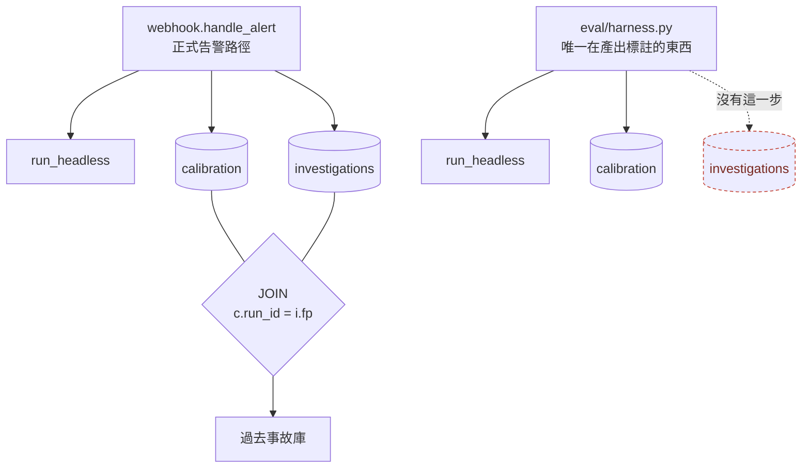
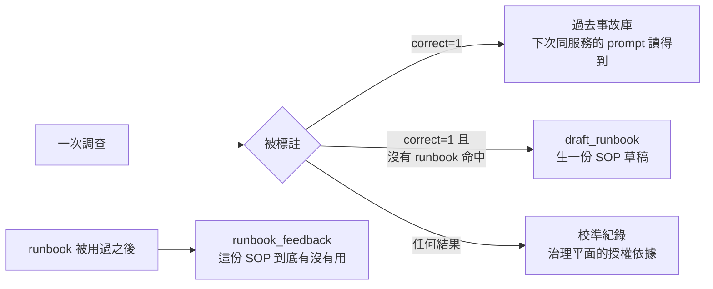

# Day32：35 筆標註進去了，過去事故庫還是 0 筆

> 這三天我做的事情很像同一件
> 每個零件單獨看都是對的
> 也都有測試
> 壞掉的一直是它們中間那條縫

昨天補了 `grading_mode`，關卡從一個抵銷出來的綠燈退回「還沒量夠」的紅燈。今天要驗收的是另一個本來以為會自己活過來的東西：過去事故庫。

程式碼在範例 repo [`OTel_AIOps_Agent`](https://github.com/tedmax100/OTel_AIOps_Agent) 的 [`ironman-2026/day32/`](https://github.com/tedmax100/OTel_AIOps_Agent/tree/main/ironman-2026/day32)。

## 本來以為不用寫程式的一天

agent 在組 prompt 的時候會呼叫一個 `_past_incident_context()`，把這個服務過去被判定正確的調查撈出來，變成一段「以前發生過這些事」貼進去。它撈的方式是一個 JOIN：

```sql
SELECT i.payload FROM investigations i
JOIN calibration c ON c.run_id = i.fp
WHERE ... AND c.correct = 1
```

原本的盤算很單純：Day31 把 35 筆標註灌進 `calibration`，`correct = 1` 的有 20 筆，那這個查詢就應該開始有東西了。今天要做的是 A/B，同一組 fixture 跑兩次，一次注入過去事故一次不注入，看分數有沒有差。

實際量出來是這樣：

```
[1] the real store
    calibration labeled rows: 35
    investigations rows:      0
    retrievable precedent:    0
```

`investigations` 表是空的。JOIN 的另外一半從來沒有人寫過。

## 兩張表，兩個寫入者

追下去的結果是這樣：`calibration` 跟 `investigations` 這兩張表，在正式的告警路徑上是同一個函式接連寫的，`webhook.py` 裡的 `_investigate_and_sink()` 先 `record_run()` 再 `record_investigation()`，兩個都用同一個 `fp`，所以 JOIN 對得起來。

而 eval harness 走的是另一條路。它的 docstring 寫得很清楚，受測單元是 `run_headless`，也就是**繞過 webhook 直接叫 agent**。這個設計是對的，eval 要測的是 agent，不是 webhook 的收件邏輯。但副作用是：`record_investigation()` 那一行在 webhook 裡，harness 沒有它。



所以事情變成：**唯一會產出標註的流程，剛好是唯一不寫另一半的流程。** 標註灌得再多，JOIN 都是 0。

還有一個更小、但更陰的東西。就算今天直接在 harness 裡補一行 `record_investigation(thread_id, ...)`，JOIN 還是對不起來，因為那兩個 id 不一樣：

```python
thread_id = f"eval-{fixture.id}-s{seed}-{run_nonce}"      # 給 LangGraph 用的
run_id    = f"eval-{fixture.id}-seed{seed}-{run_nonce}"   # 寫進 calibration 的
```

`s0` 跟 `seed0`，差兩個字元。這種東西不會報錯，JOIN 只會安靜地回零筆，而零筆跟「這個服務以前沒出過事」在畫面上長得一模一樣。Day2 講缺情境的時候用的例子是 Prometheus 回 HTTP 200 加空陣列，兩年後我在自己的 SQL 裡又寫了一個一樣的東西 QQ

## 順手把昨天那個欄位用上

修的部分有兩個。第一個是讓 harness 也寫 `investigations`，而且用 `run_id` 當 fp，不是 `thread_id`。

第二個是昨天埋的伏筆。原本那句 `WHERE ... AND c.correct = 1`，在有了 `grading_mode` 之後可以講得精確：

```sql
WHERE ... AND c.correct = 1 AND c.grading_mode = 'culprit'
```

為什麼要加這個，昨天算過一次：在 `inconclusive` 那批紀錄上，`correct = 1` 的意思是「它正確地誰都沒有怪」。把那種紀錄當成一次成功解決的過去事故餵給 agent，等於在告訴它「上次這個服務出事，結論是沒出事」，這跟這段 context 想做的事情正好相反。

`NULL` 也一起排除掉。這段輸出是要進 prompt 的，來源不明的東西不進 prompt，這個預設值我覺得沒什麼好猶豫。

## 四個探測

```bash
# 從 o11y-bench 主 repo 的根目錄跑
python3 ironman-2026/day32/probe_past_incidents.py
```

```
[2] a graded run with no investigation row (what the harness writes today)
    retrieved: []

[3] the same run, both tables, same id
    retrieved: ['both']

[4] rows that must never come back as precedent
    +hedged-non-incident    (correct=1 but it blamed nobody)
     retrieved: ['both']  -> excluded
    +wrong-run              (graded wrong)
     retrieved: ['both']  -> excluded
    +unlabeled              (no verdict yet)
     retrieved: ['both']  -> excluded
    +unknown-mode           (correct=1, but nobody said what that means)
     retrieved: ['both']  -> excluded
```

第三格是修好之後該有的樣子。第四格那四列每一列都寫進兩張表、都對得上 JOIN 的 id，只差在標註的內容，而四個都沒有被撈出來。其中 `hedged-non-incident` 那一列，在昨天改之前是會被撈出來的。

這四條也補成了單元測試，因為它們是那種「壞掉不會有人發現」的規則。

## 那個 A/B 今天做不了

原本今天的主菜是 A/B：同一組 fixture，注入過去事故 vs 不注入，比分數。做不了，理由很實際。

要跑出過去事故，得先有一輪真的 harness 執行寫進兩張表，而那需要整套 stack 起來加 LLM 呼叫。今天做的是把管線接上跟把規則釘住，接上之後第一次真的跑，才會有第一批可以拿來 A/B 的資料。

我本來想用合成資料硬做一個 A/B，想想還是算了。**注入的東西是我自己編的，那量到的就是「編得好不好」，不是「這個機制有沒有用」。** Day23 已經有過一次分數變好但因果證不了的經驗，那次至少資料是真的跑出來的，今天連那個都沒有。

> 講一句我自己的判斷：這種「先把管線接好、實驗留給有真資料的那天」的取捨，在做 eval 的時候比想像中常見。硬要在這一天生一個數字出來，最後那個數字會變成後面每一天都在小心繞開的東西。

## 知識迴圈的另外兩條，也掛在同一組管線上

ARE（Agentic Reliability Engineering，代理式可靠性工程）講持續學習的時候，重點不是模型會不會變聰明，而是**系統有沒有把每一次事故的結論留下來、而且下次真的讀得到**。這個 repo 裡有三條這樣的迴圈，今天可以一起看：



三條的起點都是同一件事：**有人（或有東西）對那一次調查下了一個判斷。** 沒有那個判斷，三條全部不會動。

`draft_runbook` 那條的觸發條件是「被標成正確、而且當時沒有任何 runbook 命中」，設計得挺好：那正好是「agent 找到了根因，而我們對這個告警還沒有 SOP」的時刻，知識最值得被留下來。而它目前唯一的入口是 plugin 上那顆按鈕，也就是說**它只在有人按的時候才會長出東西**。這句話跟 Day30 那個狀態機的結論是同一句。

順帶一提，昨天那個 `grading_mode` 讓這條路順便安全了一點：UI 那條標註路徑現在一律標成 `culprit`，所以不會有「在一個沒出事的告警上按了正確，然後系統認真幫你生一份 SOP 草稿」這種事。這個我不是刻意設計的，是改完之後才發現的。

## 接縫沒有擁有者

平台工程的角度，這三天可以收在同一句話上。

`webhook.py`、`eval/harness.py`、`governance.py`、`store.py` 這幾支，每一支都有清楚的職責、有 docstring、有測試，而且測試都是綠的。壞掉的每一次都在**兩支檔案中間**：兩個 store 沒有橋、兩張表沒有共同的寫入者、一個欄位被兩種語意共用、一個 id 差兩個字元。

這種東西之所以難抓，是因為它不屬於任何一支檔案的責任範圍。寫 harness 的人（我）沒有理由去想 webhook 寫了哪些表；寫治理的人（也是我）沒有理由去確認校準紀錄是誰產的。**每個人都在自己的邊界內做對的事，而缺陷長在邊界上。**

一個團隊要抓到這種東西，靠的不是更嚴格的 code review，是**有沒有一個地方會定期去問「這條路端到端真的通嗎」**。這三天我做的每一件事，本質上都是在手動扮演那個角色，而手動扮演的東西遲早會停。

> 舉個現實案例，我看過一個團隊每個服務的健康檢查都是綠的，然後整條下單流程掛了兩個小時。那次事後檢討的結論不是「健康檢查寫得不好」，是沒有任何一個東西在檢查「這幾個服務串起來還能不能下單」。今天這個 JOIN 就是同一個形狀，只是規模小很多。

## 今天沒做的事

- **A/B 沒有跑。** 管線接上了，但要真的跑一輪 harness 才有資料，那需要整套 stack 加 LLM。
- **沒有回填 `investigations`。** 六月那 35 筆的調查內容沒有留下來（當時就沒寫），所以補不回去，只能從下一輪開始有。
- **那兩個 id 的命名沒有統一。** 今天只是在寫入的時候挑對了那一個，`thread_id` 跟 `run_id` 還是兩個不同的字串，下一個人一樣會踩。
- **`draft_runbook` 沒有非 UI 的入口。** 它還是只在有人按的時候才會動。
- **沒有任何東西在檢查這條路端到端是通的。** 今天的探測是我手動跑的，它沒有進 CI。

## 小結

總結來說，今天原本是驗收的一天，結果變成修接縫的一天。過去事故庫沒有自己活過來，因為它是一個 JOIN，而那兩張表在唯一會產出標註的那條路上只有一半有人寫。修完之後它會在下一輪真的跑起來的時候有東西，而昨天那個欄位順便讓它撈不到不該撈的紀錄。

比較有用的收穫是那個 A/B 的取捨。我原本很想生一個數字出來，畢竟四天下來還沒有一個「變好了」的結果。但用自己編的資料去驗證一個檢索機制，量到的只會是自己編得好不好。這種時候把管線接好、把規則釘成測試、然後誠實寫下「還沒跑」，比生一個數字有用。

> 這三天我沒有讓 agent 變聰明一點點，做的全部是把它已經有的東西接起來。
> 但至少現在那些綠燈，紅的時候是真的紅 :)
