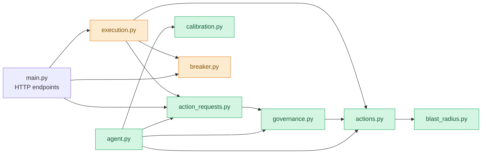
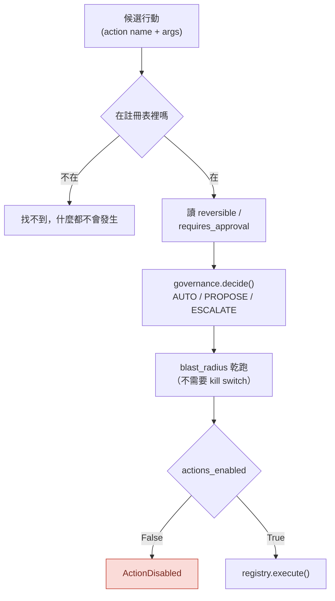

# Day33：先讀現況，順便發現自己那支工具有個盲點

> 昨天那張四平面圖
> 我是照檔案名字排的
> 今天想確認一下呼叫關係是不是也長那樣
> 結果先確認到的是量圖的尺壞了

昨天畫了四個平面，把 `actions.py`／`action_requests.py`／`blast_radius.py`／`breaker.py` 放進執行平面、`governance.py`／`calibration.py` 放進治理平面，然後說那兩格是「蓋好了但沒有人按過」。今天要做的第一件事是回頭驗證那句話，因為那張圖是我對著檔名跟 docstring 排出來的，而檔名不會告訴你誰真的呼叫誰。

程式碼在範例 repo [`OTel_AIOps_Agent`](https://github.com/tedmax100/OTel_AIOps_Agent) 的 [`ironman-2026/day33/`](https://github.com/tedmax100/OTel_AIOps_Agent/tree/main/ironman-2026/day33)。這一天的指令都假設你在那個 repo 的根目錄下跑。

## 為什麼不直接讀就好

第二階段開頭做過同一件事：那時候我要畫 `signals/` 的資料流，寫了一支 `importgraph.py`，從 AST（abstract syntax tree，抽象語法樹）把真實的 import 關係挖出來，而不是用 `grep "^from"`。理由是函式內部、`try` 裡面、`__main__` 底下的 `import` 也是一條真的邊，grep 只看得到檔案開頭那幾行。那次挖出來的東西是整篇最有價值的發現：`weaver.py` 沒有任何東西呼叫。

這次的動機更直接一點。ARE（Agentic Reliability Engineering，代理式可靠性工程）那套平面語言很好用，好用到有點危險：只要一支檔案的 docstring 上寫著 "Governance plane"，我就會很自然地把它放進那一格，然後開始講它在架構裡的位置。但一支沒有人呼叫的檔案，不管 docstring 寫得多完整，在事故當下的貢獻是零。

所以今天的順序是：先把尺拿出來量，量完再講架構。

## 尺本身有個洞

把 Day14 那支工具指到 `app/`（六支檔案就住在這裡，跟其他十四支平鋪在一起），輸出的最後一段長這樣：

```
nothing in this package imports: breaker, execution, main, store
  breaker          runnable as a CLI: NO
  execution        runnable as a CLI: NO
  main             runnable as a CLI: NO
  store            runnable as a CLI: NO
```

四個孤兒。`main` 是 FastAPI 的進入點，沒人 import 它很正常。但 `store` 是這整個服務的持久化層，`execution` 是執行管線，說沒有人 import 它們，第一個該懷疑的不是程式碼，是量它的那支工具。

翻回 `local_imports()` 那段，問題只有一行：

```python
head = (node.module or "").split(".")[0]
if node.level == 1 and head in siblings:
    found.add(head)
```

Python 的相對 import 有兩種寫法，AST 長得不一樣：

```python
from .governance import Decision     # ImportFrom(module="governance")
from . import store, audit           # ImportFrom(module=None, names=[store, audit])
```

第二種的 `module` 是 `None`，`(None or "").split(".")[0]` 得到空字串，空字串不在 `siblings` 裡，這條邊就被安靜地丟掉了。而 `from . import store` 正是這個 codebase 慣用的寫法，`grep -rn "from \. import" app/*.py` 數出來有 16 處。

修法很短，`--focus` 那個過濾參數是順手加的（20 支檔案一次全印太吵，一次讀一個平面比較清楚）：

```python
if node.module:
    head = node.module.split(".")[0]
    if head in siblings:
        found.add(head)
else:
    # `from . import store, audit` → 每個 alias 各自是一條邊
    for alias in node.names:
        if alias.name in siblings:
            found.add(alias.name)
```

修完再跑一次，孤兒從四個變一個：

```
nothing in this package imports: main
  main             runnable as a CLI: NO
```

`store` 實際上被九支檔案 import、`breaker` 被 `execution` 跟 `main` import、`execution` 被 `main` import。三個都是假孤兒。

這裡要講清楚一件事：**第二階段那篇文章裡的 `signals/` 那張圖沒有受影響**，因為那個 package 從頭到尾沒有人用 `from . import` 這種寫法（我特地回去掃過）。所以那支工具在它被寫出來的那個資料夾上是對的，換一個資料夾就開始漏，而漏掉的時候它不會報錯，只會給你一份看起來很乾淨的孤兒清單。

> 這個形狀在這個系列出現太多次了：`-r .` 的假綠燈、policy 只比名字前綴、守門的正規表示式看不到三分之一的 ID。
> 共通點都是「壞掉的時候，症狀是一切看起來很順利」。而這次是我自己寫來抓別人問題的那把尺 QQ

## 修好之後的真實圖

`--focus` 那六支，出來的表是這樣（省掉幾列跟今天無關的）：

```
module           imports                                   imported by
---------------------------------------------------------------------------------
action_requests* audit, config, governance, store          agent, execution, main
actions        * blast_radius, config                      agent, execution, governance
blast_radius   * config                                    actions, agent, execution
breaker        * config, store                             execution, main
calibration    * config, store                             agent, execution, investigations, main, webhook
governance     * actions, config, store                    action_requests, agent
execution        action_requests, actions, agent, audit, blast_radius, breaker, calibration, config, rubric, runbook, store  main
```

畫成圖：



比昨天那張四平面圖精確的地方在這裡：**治理平面不是冷的**。`governance.py` 被 `agent.py` 跟 `action_requests.py` 兩邊 import，也就是說每一次調查跑完，只要條件成立，那道閘門真的會被叫到，會算出 AUTO／PROPOSE／ESCALATE，也真的會生出一列 ActionRequest。冷掉的只有 `execution.py` 跟 `breaker.py` 那一段，而它們掛在 `main.py` 的 HTTP endpoint 底下，agent 自己走不過去。

昨天那句「一組沒有人按過的開關」因此要修正得更精確：**提案這條路是通的，斷掉的是提案之後那一段**。這也解釋了為什麼前面三十一天完全沒感覺到它們的存在，因為那條斷線的位置剛好在人看得到的東西（提案卡）後面。

## 那道閘門藏在一扇很窄的門後面

真正讓我停下來的是 `agent.py` 裡呼叫治理的那段條件：

```python
decisions: list = []
if matched_rb and matched_rb.remediation:
    ...
    decisions = propose_remediations(...)
```

整個治理平面只有在**「這次告警比中了一份 runbook，而且那份 runbook 有寫 remediation」**的時候才會被觸發。第三階段有一天就是撞在這上面：`PaymentDeclineRateHigh` 這個 alertname 比不到 `payment-decline-rate-high` 這份 runbook，於是 0 decisions、0 action requests，而當時報表上只印了一行 `runbook: None`，我以為只是告警名字取得亂。

現在看清楚了，那不是命名問題，是**整個治理平面的唯一入口就是那一次字串比對**。比對失敗的時候，四個平面裡有一個直接從圖上消失，而系統沒有任何地方會說「治理沒跑」。這跟第二階段收斂出來的那條規則是同一件事的另一面：任何回傳集合的檢查函式，都要能回答「這個空集合是結論，還是我根本沒查成功」。`decisions = []` 現在還回答不了這個問題。

順帶一提，`governance.py` 裡有一段文字我覺得很值得看：

```python
Autonomy.AUTO: "AUTO (policy permits autonomous execution)"
+ ("" if enabled else " — but execution kill-switch is OFF, so PROPOSE"),
```

連「拿到 AUTO 但開關是關的」該說什麼都先寫好了。這句話從來沒有被印出來過，因為要印出來得先有 20 筆非自我標註。

## 註冊表：agent 講得出口的行動只有兩個

`actions.py` 是六支裡最短的（118 行），但它是執行平面能不能被講清楚的關鍵。設計上它做了四件事：

- **typed 註冊。** `ActionSpec` 是一個 pydantic model，欄位是 `name`／`description`／`reversible`／`requires_approval`／`category`／`impl`／`dry_run`。agent 只能講出一個已經註冊過的名字，講別的就找不到。目前註冊表裡只有兩個：`k8s.rollout_undo` 跟 `k8s.scale`。
- **風險旗標是給治理讀的，不是給人看的註解。** `reversible=False` 直接讓那個行動永遠拿不到 AUTO，`requires_approval=True` 讓它最高只能到 PROPOSE。
- **`impl` 目前是 `None`。** 註冊一個真的實作是另一次要單獨被 review 的改動，這件事寫在 docstring 裡。
- **kill switch 長在註冊表裡面，不是長在呼叫方。** `registry.execute()` 第一件事就是檢查 `settings.actions_enabled`，關著就丟 `ActionDisabled`。這個位置很重要：如果檢查寫在每個呼叫端，那它就是一個「大家記得要檢查」的約定；寫在唯一能執行的那個入口，它才是一道門。

而 `dry_run` 那個欄位是接好的。乾跑不會改變狀態，所以它可以在 kill switch 關著的時候就先跑，這也是提案卡上那個「2 pods、rev 25→24」的來源。



## 跟大綱對帳

大綱 v8 那段是我照著 repo 掃一遍寫的，今天逐項量下來有三處對不上，就地更正：

| 大綱寫的 | 今天量到的 |
| --- | --- |
| 六支檔案共 1199 行 | **1147 行**（`wc -l`） |
| `governance.py` 15 條測試、`blast_radius.py` 14 條 | **12 條**、**9 條**（`grep -c "^def test_"`） |
| 362 條測試 | `pytest --collect-only` 收到 **354 條**（`test_rubric.py` 因為本機缺 `respx` 沒收進來） |

還有一件大綱沒提到的：**`actions.py` 沒有自己的測試檔**。`tests/` 底下有 25 個檔案，沒有 `test_actions.py`，它只被 `test_governance.py`／`test_execution.py`／`test_learn.py` 間接碰到。那道 kill switch 的檢查（關著要丟 `ActionDisabled`）目前沒有一條測試是直接針對它寫的，而那是這九天要打開的那顆開關本身。

昨天講「一個從來沒有被觸發過的防護網，跟一個不存在的防護網，證據等級是一樣的」，今天這一格就是那句話最字面的一個例子。

## 這組開關的擁有者是誰

平台工程的角度今天有一個新的形狀。前三十一天問的問題是「產品團隊要付多少成本才接得上治理」，這九天要問的是另一個：**這組開關該由誰來按**。

拆開來看有三個不同的角色。`reversible` 跟 `requires_approval` 這兩個旗標是**行動的性質**，寫在註冊表裡，由平台團隊決定，因為它們是關於這個動作在 k8s 上會做什麼，跟哪個服務無關。`actions_enabled` 是**全域的總開關**，也是平台團隊的，而且它應該是一個明確的、被 review 過的變更，不是一個環境變數被誰順手改掉。真正該下放的是第三個：**某個服務願意讓 agent 自動做到哪一級**，那是服務團隊的意圖宣告，而現在 repo 裡沒有任何地方可以寫它。

昨天講人在迴圈之上那層做的事就是這個。目前那層是空的，所以授權層級是全域一套，套在所有服務上。

> 我看過一種很常見的做法：自動化的開關是一個環境變數，改它不用 PR。
> 出事之後大家花兩小時在查「這東西什麼時候被打開的」，最後在某個人的 shell history 裡找到答案。這種我只能說「很棒！」

## 今天沒做的事

- **沒有跑任何一次治理判斷。** 今天全部是靜態讀，`propose_remediations()` 在今天的實測裡一次都沒被呼叫。要讓它真的跑一次，得先有一次比中 runbook 的告警。
- **`decisions = []` 分不出兩種原因**（真的沒有可提的行動 vs 根本沒比中 runbook），今天只是把這個洞指出來，沒有補。
- **`actions.py` 的測試沒補。** kill switch 那條路徑仍然沒有直接測試。
- **服務層級的授權宣告沒有設計。** 今天只講到它不存在。
- **importgraph 只看 import，看不到呼叫。** `agent.py` import 了 `governance`，不代表那行程式碼在每次調查都會執行到（今天正好抓到它藏在一個 `if` 後面）。要看真的有沒有被執行，得換一種量法，那個留給後面。

## 小結

總結來說，今天只做了一件事：把昨天那張照檔名排出來的圖，換成照呼叫關係排的。結論比我預期的好一點也壞一點。好的是治理平面其實一直在跑，提案這條路是通的，不是我昨天說的那樣整格冷著；壞的是那條路只有一扇很窄的門進得去，而門關上的時候整個平面會安靜地從圖上消失。

至於那支量錯的工具，我本來想默默修掉就好。留著寫出來的理由跟這系列一路的做法一樣：那支工具在它被寫出來的資料夾上是對的，換一個資料夾就開始漏。這跟最後一天講的「治理是環境的函數」是同一句話，只是這次被證明的對象換成我自己的工具。

> 修完那五行之後我第一個念頭是「還好我有回頭跑一次」。
> 第二個念頭是，那前面幾十天我沒回頭跑的東西還有多少 XD
