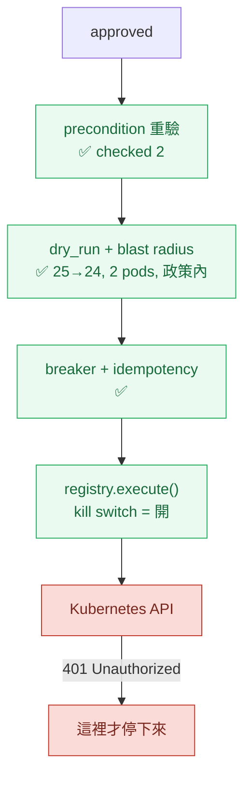
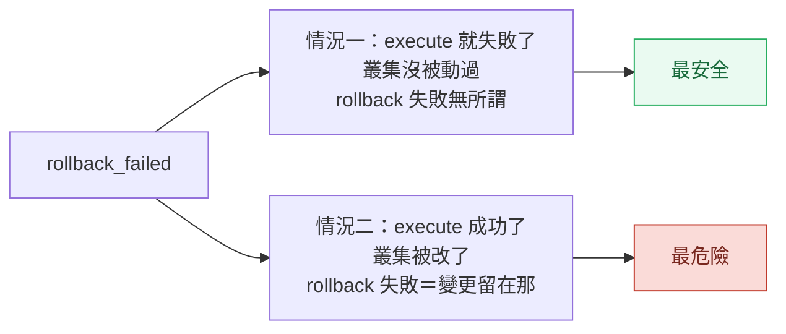

# Day33：我準備了一整天要按的那顆開關，已經開了 46 天

> 我以為今天的重頭戲是把 `actions_enabled` 設成 true
> 結果它一直是 true
> 而擋住真實變更的那個東西
> 不是我蓋的任何一道門

昨天把過去事故庫的接縫修好，那條路要等下一輪真的跑才有東西。今天做的是這七天真正的那件事：**讓它動一次**，然後在同一天把每一道門弄壞給它看。

程式碼在範例 repo [`OTel_AIOps_Agent`](https://github.com/tedmax100/OTel_AIOps_Agent) 的 [`ironman-2026/day33/`](https://github.com/tedmax100/OTel_AIOps_Agent/tree/main/ironman-2026/day33)。今天前半在真實叢集上跑，後半不需要叢集也不需要 LLM。

## 開場就被打臉

我打開叢集裡那份 Deployment，準備把環境變數改掉：

```console
$ kubectl -n demo get deploy aiops-agent -o jsonpath='{range .spec.template.spec.containers[0].env[*]}{.name}={.value}{"\n"}{end}' | grep ACTIONS
ACTIONS_ENABLED=true
```

它是 true。而且旁邊那個 write RBAC 的 token secret 是 46 天前建的，也就是說**這顆開關從 6 月 22 號就開著**，而我這七天一直用「那是一組沒有人按過的開關」在講它。

那 46 天裡它做了什麼？把 pod 裡那份資料庫撈出來看：

```console
== action_requests by status ==
  {'status': 'aborted',  'action': 'k8s.rollout_undo', 'n':  1, 'ts': '2026-06-22T15:12:31Z'}
  {'status': 'proposed', 'action': 'k8s.rollout_undo', 'n': 10,
   'lo': '2026-06-22T15:47:44Z', 'hi': '2026-08-06T14:08:43Z'}

executions: 0
```

十筆提案躺在 `proposed`，最舊的 46 天前，`executions` 表是空的。

先講那十筆。它們的 TTL 是 900 秒，也就是全部早就過期了，而 `list_requests(status="proposed")` 照樣把它們撈出來，plugin 那頁照樣把它們畫成待處理。**Day30 那個「過期是被動的、要有人來敲門才會算」的發現，這裡有 46 天份的真實證據。** 當時我是在暫存 SQLite 上量出來的，今天看到的是它在一個跑了一個半月的環境上長成什麼樣子：一份十筆的待辦清單，每一筆都是舊世界算出來的建議，而畫面上沒有任何東西會說。

## 那一筆 `aborted` 是怎麼來的

剩下那一筆有完整的稽核軌跡，而且它比我預期的有用得多：

```console
2026-06-22T15:12:31Z  proposed       ok     system
2026-06-22T15:15:26Z  approved       ok     nathan-smoke-test
2026-06-22T15:15:26Z  execute        start  system
2026-06-22T15:15:26Z  precondition   ok     system   {"checked": 2}
2026-06-22T15:15:26Z  dry_run        abort  system
      blast_radius: target demo/payment-service, revision 17→16, replicas 1→1,
                    affected 1 pod(s), singleton
      reason: target is a singleton (single replica) — denied by policy
```

**這條管線在它第一次遇到真實輸入的時候就紅了，而且紅得完全正確。** 前置條件重驗過了兩項，乾跑算出影響範圍，然後 `deny_singletons` 這條政策把它擋下來：payment-service 當時只有一個副本，回滾它等於整個服務中斷。

我當時只是隨手做了一次 smoke test 就跑去做別的事，沒有把這條軌跡讀完。今天讀完才發現，這七天我一直在說的「防護網從來沒有紅過」，其實紅過一次，只是我沒去看。

而今天 payment-service 是兩個副本。也就是說，同一條路今天再走一次，那道門不會再擋。

## 今天再跑一次

```console
$ kubectl -n demo get deploy payment-service -o jsonpath='rev={...revision} replicas={.spec.replicas}'
rev=25 replicas=2
```

發一個真的告警進去，等它產出提案，然後按核准：

```console
2026-08-08T08:57:34Z  proposed       ok     system
2026-08-08T09:02:44Z  approved       ok     day33-live
2026-08-08T09:02:44Z  execute        start  system
2026-08-08T09:02:44Z  precondition   ok     system   {"checked": 2}
2026-08-08T09:02:44Z  dry_run        ok     system
      blast_radius: target demo/payment-service, revision 25→24, replicas 2→2,
                    affected 2 pod(s)
      reason: within policy (affected 2 pod(s), ns demo)
2026-08-08T09:02:45Z  execute        fail   system
      error: (401) Reason: Unauthorized
2026-08-08T09:02:45Z  rollback       fail   system
      error: UnauthorizedException: (401) Reason: Unauthorized
```

四道唯讀的門全部放行，影響範圍算得清清楚楚（25→24、兩個 pod、在政策內），然後在真的要動叢集的那一毫秒，**Kubernetes 回了 401**。

自動回滾接著觸發，也是 401。那一列的最終狀態是 `rollback_failed`，而 Deployment 從頭到尾停在 revision 25，什麼都沒發生。

## 擋住它的不是我蓋的任何一道門

追下去，401 的原因是那個 ServiceAccount token：

```console
$ 解開 pod 裡掛的那份 token
iss= kubernetes/serviceaccount
exp= None          ← 沒有到期時間
sub= system:serviceaccount:demo:aiops-agent-write
```

它是一個舊式的、不會過期的 token。既然不會過期，它為什麼會被拒絕？因為那個 k3d 叢集中間被重建過，API server 的簽章金鑰換了，而 Secret 裡那串位元組還是舊叢集發的。**它不是過期，是它效忠的那個政府倒了。**

這件事最刺的地方是：從 6 月 22 號到今天，這個 agent 手上握著一張早就無效的通行證，而**沒有任何一個地方會說**。RBAC 沒有健康檢查，那張 token 也不會自己回報「我簽不出去了」。要不是我今天真的按下去，它可以再躺 46 天。



綠色那幾格是這七天在讀、在改、在寫測試的東西，它們今天全部放行，而且放行得有道理：影響範圍真的在政策內。紅色那格不是我蓋的，也不是任何人為了這個場景選的，它是一張因為叢集重建而失效的憑證。

**我今天沒有讓一個真實變更發生，而讓它沒發生的是一個意外。** 這件事寫出來有點難看，但它正好是這系列一路在講的那句話最極端的版本：一個從來沒有紅過的防護網，跟一個不存在的防護網，證據等級是一樣的。今天我終於讓那張網接到球了，然後發現接住球的是網子後面那面牆。

> 這個形狀我在別的地方看過：一個團隊的權限申請流程走得很嚴謹，結果真正擋住誤操作的是那個一直沒人修好的 VPN。等到 VPN 修好那天，才發現流程從來沒有真的擋過任何東西。

## `rollback_failed` 這個名字有問題

修 token 之前我先盯著那個終局狀態看了一下，愈看愈不安。

今天這一列是 `rollback_failed`，而它的實際意思是「執行沒成功，所以什麼都沒改，然後回滾也沒成功，但那不重要因為沒東西要滾」。這是**最安全的結果**。

而同一個狀態的另一種意思是：「執行成功了，叢集被改了，然後回滾失敗了，所以那個變更現在留在那裡而且沒有人在管」。這是**最糟的結果**。

值班的人早上打開清單，兩者長得一模一樣。



要分辨得去翻稽核軌跡，看那個 `execute` 是 `fail` 還是 `ok`。資訊都在，只是不在人第一眼會看到的那個欄位。今天沒有改它，因為改狀態機的名字要動到 plugin 跟現有的九條測試，我不想在同一天做兩件事。

## 修好 token 之後：換一道門擋

把那個 Secret 刪掉重建（讓 token controller 用現在這座叢集的金鑰重新簽一次），重啟 agent，再發一次一模一樣的告警，再按一次核准：

```console
status= aborted
outcome= idempotent: target already acted on for this incident (48e7df7697ac4034)
```

**冪等那道門把它擋下來了。** `idem_key` 是 `k8s.rollout_undo|demo/payment-service|383238a67e692abb`，動作、目標、事故指紋三個都一樣，所以第二次不准動。這條規則是對的，告警風暴會對同一件事發十次通知，而回滾這種動作不該做十次。

但它同時暴露一件事：第一次那個嘗試**根本沒有成功**，401 擋在最後一毫秒，叢集完全沒被動過。而冪等的紀錄不管這個，它只認「這個 key 被用過了」。所以一次暫時性的失敗會讓這個事故**永遠不能再重試**，而它給的理由是 `already acted on`，跟事實正好相反。

這跟上面 `rollback_failed` 是同一種病：**把「試了但沒發生」跟「發生了」歸成同一類。**

不死心，我改了標籤再發一次：

```console
{"accepted":[],"skipped":[{"fingerprint":"383238a67e692abb","reason":"cooldown"}]}
```

第三道門。webhook 的去重冷卻期是 600 秒，而指紋只由部分標籤算出來，我多加的那個 `run` 標籤根本沒進去。

於是今天的成績是：**四道門，三種不同的拒絕，一次都沒有執行成功。**

## 後半：把每一道門都弄壞一次

上面那些是被動撞到的。真正該做的是主動去撞，而且要能重複跑。所以寫了一支 `regress_guards.py`，形狀跟 Day12 那支 `regress.sh` 一樣：每一條寫死「餵什麼進去」跟「預期它拒絕，理由要包含哪個字串」，全綠 exit 0，任何一道門放行 exit 1。

```bash
# 從 o11y-bench 主 repo 的根目錄跑
python3 ironman-2026/day33/regress_guards.py -v
```

```
governance
  PASS  irreversible action never goes autonomous, even at confidence 1.0
  PASS  confidence below the low threshold escalates
  PASS  an approval-gated action is never AUTO
  PASS  overconfidence 0.25 > 0.1 downgrades AUTO to PROPOSE
        propose: overconfident by +0.25 > 0.1; autonomy narrowed
  PASS  50 self-produced labels do not unlock AUTO
        propose: insufficient human/grader labels (0 < 20); self-produced labels cannot unlock AUTO
  PASS  50 inconclusive-graded labels do not unlock AUTO
        propose: curve saw 0 eligible row(s); calibration unproven
  PASS  labels with no recorded grading mode do not unlock AUTO
  PASS  [control] 50 culprit-graded grader labels DO reach AUTO
blast radius
  PASS  an unreadable dry-run fails closed
  PASS  a protected namespace is refused
  PASS  a namespace off the allowlist is refused
  PASS  an action crossing namespaces is refused
  PASS  scale-to-zero is refused, and says so instead of blaming singleton
  PASS  a single-replica target is refused
  PASS  more than 5 affected pods is refused
  PASS  a rollback with no previous revision is refused
  PASS  [control] a 2-pod rollback inside demo is allowed
breaker
  PASS  [control] a fresh breaker allows
  PASS  2 consecutive failures trip the target breaker
  PASS  a tripped breaker stays open on the next check
  PASS  only an explicit human reset closes it again
  PASS  3 executions in 3600s trips the global rate limit

22/22 guards behaved as specified
```

有三條標著 `[control]`，它們是**故意寫成應該放行**的。這件事我覺得比其他十九條都重要：**一個什麼都拒絕的守門，跟一個什麼都不拒絕的守門，一樣沒用。** 如果我只寫拒絕的案例，那把 `evaluate_policy` 改成 `return False, "no"` 也能讓這份清單全綠。

另外幾條值得單獨講：

「scale-to-zero 被拒絕，而且理由要講對」那條，測的不是它擋不擋，是**它擋下來之後說了什麼**。副本數縮到零的目標同時也是單副本，所以兩條規則都會擋，而如果訊息說的是「因為它是單副本」，值班的人會跑去把副本數設成 1，然後被同一道門用另一個理由再擋一次。程式碼裡把 scale-to-zero 那條排在 singleton 前面就是為了這個。

「熔斷之後只有人能關」那條，測的是它**不會自己好**。連續失敗兩次之後 breaker 打開，再檢查一次還是開的，只有明確呼叫 reset 才會關回去。一個會自己復原的熔斷器在 flapping 的場景下等於沒有。

## 這七天的門，誰在按

平台工程的角度今天很好講，因為證據齊了。

這七天做出來的四道門，今天全部通過測試，也全部在真實輸入上放行了。**它們是對的，而且是必要的，但它們沒有一道是最後那道。** 最後那道是 RBAC，一個 Kubernetes 自己提供的、跟這整套治理設計完全無關的東西。

我覺得這不是壞消息，是分工。應用層的治理負責回答「這件事該不該做、範圍多大、憑什麼相信這隻 agent」，那些問題 RBAC 答不了。而「這個身分現在有沒有權限」是基礎設施的事，那件事應用層也不該自己重做一遍。問題出在中間：**沒有任何一個地方在檢查那張憑證還有沒有效**，於是一個安全機制在無聲失效的狀態下，替一個沒有人打算依賴它的地方擋了 46 天的班。

這條線在這系列出現過太多次了：Day2 那個空陣列、Day31 那段從來沒被評估到的校準邏輯、Day32 那個沒人寫的表。今天是它的最後一種形狀，也是最貴的一種——**一個沒有人在看的成功狀態**。

## 今天沒做的事

- **沒有一次真的成功執行。** 三種拒絕都是對的拒絕，但這代表 `execute → verify → settle window → 驗證失敗自動回滾` 這段的後半，今天仍然沒有被真實輸入走過。要走完得等冷卻期過、換一個事故指紋，那是下一次的事。
- **`rollback_failed` 跟 `already acted on` 兩個訊息都沒改。** 它們把「試了但沒發生」跟「發生了」講成同一件事，今天只量出來。
- **那十筆過期提案沒有清掉。** 留著當證據，也留著提醒背景過期那件事還沒做。
- **提案上的 `blast_radius` 是 null。** 人在按核准的時候，看不到影響範圍，那個數字要等到執行當下才算出來。Day24 那天的整個主張是「建議回滾不是建議，回滾會換掉這兩個 pod 才是」，而它現在沒有走到人眼前。
- **`regress_guards.py` 沒進 CI。** 跟前面每一支一樣。
- **沒有量憑證健康。** 今天修好 token 是手動的，沒有任何東西會在它下次失效時說話。

## 小結

總結來說，今天原本要證明的是「這顆開關按下去會發生什麼」，實際證明的是三件別的事：那顆開關已經開了 46 天而我不知道；我蓋的四道門在真實輸入上全部放行且放行得有道理；真正擋住變更的是一張因為叢集重建而失效的憑證，而那件事沒有任何地方會說。

比較有用的是後半那 22 條。前半是運氣，一次真實的按下去只能證明「這一次發生了什麼」；後半是可以重複跑的，而且裡面那三條 `[control]` 讓它不會退化成一份「全部拒絕就算過」的清單。這七天講了很多次防護網，今天它終於有一份自己的回歸測試。

> 我花了半小時在想要不要把 401 那段寫進去，因為它讓整篇的高潮變成一個運維事故。
> 後來想想，這系列從第一天開始就是在寫我以為的跟實際量到的差在哪，今天只是差得比較大 XD
