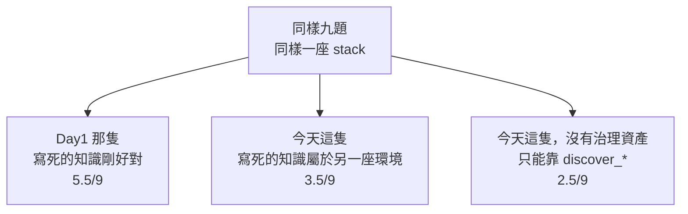

> 三十三天前那隻 agent 拿了 4.5/9
> 今天這隻，同一組題目、同一支評分器
> 拿了 3.5

最後一天，把帳算清楚。

Day1 留下的東西一直都在：九題自然語言的 RCA 問題、一支不接 LLM 的評分器、真值在打分當下現算。這一路講了治理、schema、拓撲、契約、agent、守門、評測，最後幾天才把人打字那一側補起來，如果這些真的有用，就應該在那張分數表上看得到。

程式碼在範例 repo [`OTel_AIOps_Agent`](https://github.com/tedmax100/OTel_AIOps_Agent) 的 [`ironman-2026/day33/`](https://github.com/tedmax100/OTel_AIOps_Agent/tree/main/ironman-2026/day33)。

## 為了讓這個比較成立

比之前得先把兩件事釘住，不然數字沒有意義。

**同一份資料。** 那九題是對著 Day1 那座產生器 stack 寫的，它的指標叫 `http_requests_total`，label 是 `job`。這系列後面用的 demo-services 叢集完全不是這個 schema。所以今天兩隻 agent 都跑在同一個容器上，就是 Day1 那個 image。

**同一支評分器。** `bench/grade.py` 從 `day01/` 直接 import，一個字都沒改，真值一樣在打分當下去 stack 現算。

然後跑三輪：Day1 那隻、今天這隻、以及今天這隻但把治理資產拿掉。

## 數字

同一小時、同一座 stack、每題跑一次：

| | 總分 | metrics | logs | traces |
| --- | --- | --- | --- | --- |
| Day1 那隻（寫死 schema、4 次預算） | **5.5/9** | 1.5 | 1.0 | 3.0 |
| 今天這隻（三次） | **3.5 / 2.5 / 3.5** | 1.0 / 1.0 / 0.5 | 1.0 / 0.0 / 0.0 | 1.5 / 1.5 / 3.0 |
| 今天這隻，拿掉治理資產 | **2.5/9** | 0.5 | 1.0 | 1.0 |

第一行就先打了我一巴掌：Day1 當時記錄的是 4.5/9，同一隻 agent 今天跑出 5.5/9。第二行更清楚，同一份程式碼、同一座 stack、連著跑三次，總分在 2.5 到 3.5 之間跳，logs 那一欄從 1.0 掉到 0.0 又留在 0.0。**LLM 的變異就是這麼大**，所以這裡所有數字都只能當訊號，不能當測量值。這也是 Day24 那天講的「一個 fixture 跑兩次講不了穩定度」的另一個版本，而我到最後一天還是只有一顆種子可以給。

不過在這個雜訊之下，那個排序是穩的：**三十三天之後，今天這隻在這座 stack 上比 Day1 那隻還差。**

## 為什麼

報告裡看得很清楚：

```console
promql-highest-backend-error-ratio  FAIL
  answer: I couldn't find a metric named `http_server_requests_total`.
          Please check the metric name and try again.

traceql-error-chain-orders          PARTIAL
  call: query_tempo_traces {'traceql': '{http.request.method="POST" && …}'}
        -> 400 invalid TraceQL query: unknown identifier: http
  call: query_tempo_traces {'traceql': '{span.http.request.method="POST" && …}'}
```

它去查 `http_server_requests_total`、用 `service_name` 當 label、用 `span.http.request.method` 這種 OTel 語意慣例的屬性名。這些在 demo-services 那座叢集上全部是對的，**在這座 stack 上全部是錯的**。

也就是說，今天這隻 agent 犯的錯，跟 Day1 那隻犯的錯是同一種：**帶著一份寫死的環境知識，自信地查了不存在的東西。** 差別只在 Day1 那隻的寫死知識剛好對應這座 stack（它就是為了這座 stack 寫的），而今天這隻的寫死知識是我這一路做出來的 schema catalog 跟 Signal Plane 契約，對應的是另一座環境。

我第一天在 Day1 罵的那個反面教材，今天是我自己。

有一個地方倒是看得出這幾天的東西有在工作。Day25 那個「空結果自己解釋」的提示，真的出現在它的回答裡：

```console
promql-highest-backend-error-ratio  FAIL
  answer: I'm sorry, I encountered an error when running the query. There were no results,
          and the following hint was returned: "Call discover_metrics(service)…"
```

工具告訴它「這個名字不存在，去 discover」，它把這句話原封不動講給使用者聽，然後就停在那裡。**提示送到了，但它沒有照著做。** 這比它默默重寫一次查詢好一點（至少使用者知道發生什麼事），但離「自己修好」還有一段距離。

## 那把治理拿掉呢

這是我今天做的第三輪，也是唯一能救回一點顏面的一輪：把 schema catalog 換成一段「什麼都不宣稱、請自己 discover」的中性文字，signal context 整段不注入，其他都不動。

結果是 **2.5/9，比帶著錯的治理資產還差一分。**

所以結論不是「治理沒用」，而是更精確的一句：**治理是環境的函數。** 對的環境上它是資產，錯的環境上它是負債，而完全沒有比帶錯的還糟：就算內容是錯的，那份 catalog 至少還教會它「查詢要先想清楚 label 是什麼」這件事的形狀。



這張圖是我這一路做出來的東西裡，最不想承認、但也最有用的一個結論。

## 那今天這隻到底好在哪

上面那組數字量的是「換一座陌生環境」。在它自己的環境上，Day29 那條端到端的鏈給的是另一個答案：

```console
conclusion : Code regression in payment-service v2.5.0 introduced a spike in
             decline rate due to the new_validator reason.
confidence : 0.7
trace_id   : abb6fac796db47d684ed5238a5e37b36
next step  : k8s.rollout_undo -> propose
footprint  : 2 pod(s), revision 25->24, policy_ok=True
```

而且這是在 Day24 把洩題拿掉之後跑的，evaluation 上 payment 那題兩顆種子都對、版本也對。

把兩邊放在一起，這一路真正換到的東西可以講得很具體，而且沒有一項是「分數變高」：

- **答案裡的每一個東西都有地方可以查證。** trace ID 會被守門去 Tempo 對（Day26）、數字要有非空的查詢結果撐著（Day24）、推理過程有一條 trace 可以逐格看（Day28）。
- **「下一步」會連它的大小一起講。** 回滾兩個 pod、revision 25→24、在 policy 範圍內（Day27）。
- **失敗會講話。** 空結果會說哪個 label 不存在（Day25）、alertname 拼法不同會吵一聲（Day27）、prompt 裡有答案會 exit 1（Day24）。
- **表現不好可以歸因。** 以前只能說「它今天怪怪的」，現在可以說「它查回空的之後沒有 discover 就換句話再問」，而那是報表上會自己跳出來的一行（Day24）。

第一項到第四項的共同點是：**它們都不是讓 agent 更聰明，是讓它更容易被檢查。**

## 對誰有價值

如果只能講一件事：**新服務要接上這套東西，從「讀十幾篇文件然後問人」變成「跑一支腳本，它會告訴你缺哪一項、下一步做什麼」**（Day13 那 13 項檢查）。平台團隊推得動的東西，通常不是最正確的那個，是成本最低的那個。

第二件事是給值班的人的。凌晨三點那個場景，這一路做的所有事情最後都落在同一句話上：**你不需要相信它，你可以查它。** 一個能被檢討的 agent 可以慢慢變好，一個查不出原因的 agent 只會在第二次出錯之後被關掉。

第三件事是給我自己的。這系列有一半的內容是我踩到的坑：`-r .` 的假綠燈、policy 只比名字前綴、洩題寫在 catalog 裡、守門看不到三分之一的 ID、範圍在人同意之後才算、以及今天這個。**把坑寫出來的成本是難堪，收益是它不會再吃我一次。**

## 還缺什麼

分兩類。第一類是能補只是還沒補的，全部來自前面每一天的「今天沒做的事」：

- `regress.sh`、`leakcheck.py`、`e2e.sh` 都沒進 CI，所以它們現在都是「我記得跑」的東西
- `eval/fixtures.yaml` 只有三個 case，而且其中兩個換到固定資料上就失效（Day29）
- `baseline.json` 還是舊的，回歸目前沒有基準可比
- Tempo 只留一小時，超過一小時的事故，第四步抓 trace 結構上必失敗（Day23），而昨天的推理過程今天也已經沒了（Day28）
- 提案的範圍存進去了，但 plugin 還沒把它畫在卡片上（Day27）
- judge 的判決沒有進評測，「judge 準不準」還是手動跑一批案例（Day26）
- 只有兩種動作有乾跑，沒有乾跑的動作會直接跳過那道門（Day27）
- 叢集裡的 image 比程式碼舊（Day29）

第二類是結構性的，要下一個系列才處理：

- **信心分數還沒有被校準。** 0.7 這個數字現在只是模型自己講的，沒有人回頭統計「它說 0.7 的時候實際上對幾成」。`calibration.py` 已經在 repo 裡了。
- **授權層級沒有真的分級。** `governance.py` 會依信心跟校準決定 AUTO / PROPOSE / ESCALATE，但 `actions_enabled` 一直是關的，所以那條路徑從來沒有被走過（Day26 那個安靜的洞就是這個）。
- **回饋迴圈沒有閉合。** 過去事故庫從 Day23 到今天都是空的，agent 每次調查都像第一次。

這四支檔案（`governance.py`／`calibration.py`／`breaker.py`／`action_requests.py`）都已經在 repo 裡，我刻意沒有展開它們，因為要先有校準跟授權層級才講得清楚。

## 小結

總結來說，這三十三天沒有讓 agent 在同一組題目上考得更高分，今天的實測甚至是倒退的，而倒退的原因是我做出來的治理資產屬於另一座環境。這件事本來可以不寫，只要我拿 demo-services 上那條漂亮的端到端輸出當結尾就好。但寫出來之後，這系列的主張反而變得比較精確：治理不是一個放諸四海的加分項，它是「這座環境的知識被寫下來、而且持續對帳」這件事本身，換一座環境就得重來一次。而沒有它的版本更差，這一點至少是站得住的。

如果要用一句話收掉這三十三天：**我沒有做出一隻更聰明的 agent，我做出了一隻可以被檢查的 agent，而在凌晨三點，後者比較有用。**

> 寫到最後一天才發現最有力的證據是自己打自己臉，這種事大概只有跑實測才會遇到。
> 下一個系列要處理的第一個問題，就是那個 0.7 到底是不是 0.7 XD
