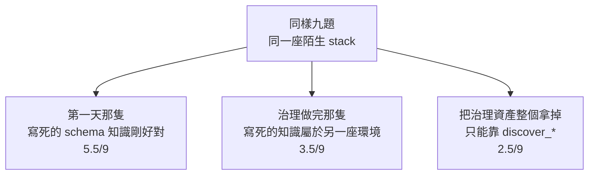
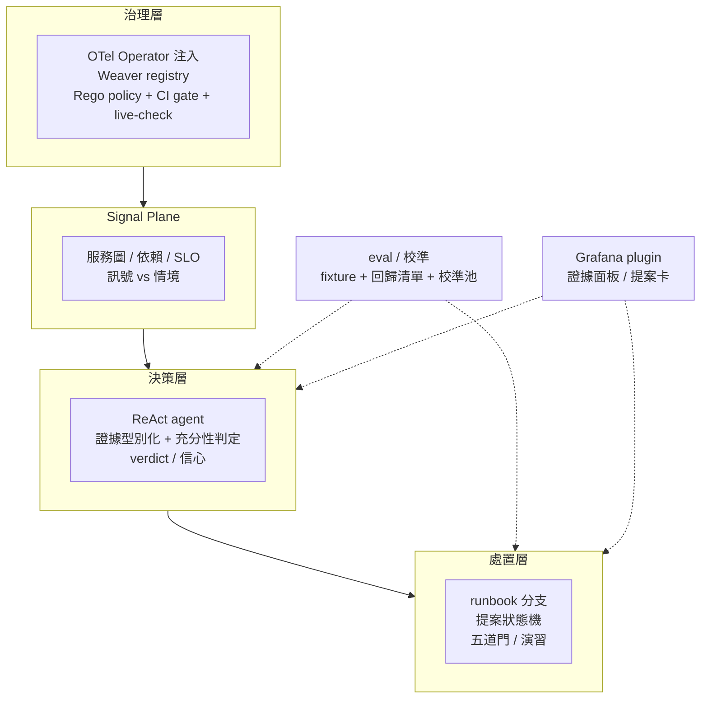
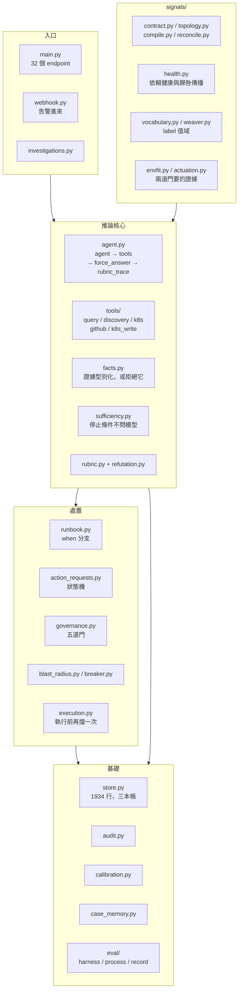
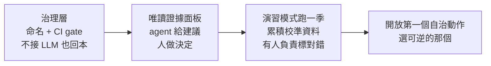

# Day33：回到第一天那組題目

> 三十二天下來
> 那隻 agent 的分數其實沒有變高
> 變的是我終於知道
> 它為什麼答錯

昨天那四筆 0.95 信心的誤判，最後是靠一份 runbook 的分支結構修掉的，不是靠把提示寫得更懇切。今天不動任何程式碼，就做一件事：把第一天那個問題重新問一次，然後回答「這一套東西如果要搬進一間真的公司，哪些現在就能用、哪些不能」。

第一天的問題是這樣的：一隻能查 Prometheus、能查 Loki、能查 Tempo 的 agent，丟進一套它沒見過的可觀測性系統，考九題，拿了 4.5/9。當時我的直覺是「模型不夠強」或者「提示寫得不夠好」。三十二天之後，這兩個答案我一個都不會再給。

## 先把那把尺的結果攤開來

`OTel`（OpenTelemetry）治理做完、Signal Plane 接上、證據型別化上線之後，同一組九題在同一座陌生環境上量過三輪（數字都在前面那幾天，這裡只是放在一起看）：



這張圖我看了很多次，每次都想把它藏起來。做了二十幾天治理，換到陌生環境上的分數是**退步的**。

而收尾這幾天又發現這張圖有一個我當時沒有考慮到的變數。那道「這份知識屬不屬於這座環境」的檢查，跑出來是 `only 10/16 resolves … the catalog may belong to another environment`，六個業務 metric 全部對不到。我差點就把它當成上面那個結論的第二份證據，還好先去 Prometheus 看了一眼：整座 stack 當時只剩三十個 metric，全是自動儀器化跟 SDK 自己的，因為**流量產生器沒在跑，叢集閒置了快一天**。把流量打開等一分鐘再量一次，同一份 catalog 是 16/16 滿分。

所以那句 `may belong to another environment` 在這裡是誤導的：**它分不出「這份知識屬於別座環境」跟「這座環境現在是空的」**，而這兩件事的處置完全相反，一個要改 registry，一個只要把流量打開。值班的人讀到那句話會跑去翻治理資產，翻半天什麼也不會找到。

這也讓上面那個 3.5/9 多了一個要問的問題：當時那座陌生環境，有沒有可能也有一部分是空的。我沒有留下當時的 metric 清單，所以這個問題現在答不了。

但它其實是這系列最有用的一個結果，因為它把「治理有沒有用」這個問題問得更精確了一點：**治理是環境的函數。** 在對的環境上它是資產，在錯的環境上它是負債，而完全沒有比帶著錯的還糟——就算內容是錯的，那份 catalog 至少教會了 agent「下查詢之前要先想清楚 label 長什麼樣」這件事的形狀。

所以如果只看那個總分，這三十二天等於白做。真正換到的東西得換一個問法才看得到：**同一個答案，我現在有幾種辦法可以不相信它？**

- 它講的 trace ID 會被拿去 Tempo 對一次，對不到就退回。
- 它講的數字背後必須有一次非空的查詢結果撐著，空結果不算證據，而且這件事是在工具跟模型中間用一層判定擋掉的，不是拜託它不要那樣做。
- 它提議的處置，在提議之前會先去問叢集「這個動作在這次事故上有沒有可能有用」。
- 它說 0.7 的時候，那個 0.7 會進一張表，等著被後來的事實打臉。
- 整段推理有一條 trace 可以逐格看，包含它做決定之前看到的是什麼。

第一天那隻拿 4.5 分的 agent，這五件事一件都做不到。它答錯的時候，我唯一能說的話是「它今天怪怪的」。

> 我一直到很後面才想通，「分數」跟「可被檢查」量的根本是兩件事。
> 分數量的是這一次對不對，可被檢查量的是**下一次錯的時候我要花多久才找得到原因**。
> 值班的人要的是第二個。

## 最後長出來的東西

把三十二天的東西攤平，它是四層，加上兩條橫著穿過去的線。每一層都只依賴它下面那層，而上面那層在下面那層垮掉的時候，不會停下來，會**照樣輸出一個看起來很有把握的答案**。這是整套設計裡最需要記住的一句話。



**治理層**的產出是「欄位有語意、命名不會漂移」的遙測。它決定的不是 agent 查不查得到，是它查到之後**推不推得出東西**。`enum` 的 `members` 是 LLM（大型語言模型）唯一能事先知道 label 值域的地方，而一個沒有值域的 label，agent 只能猜，猜錯了它不會知道自己猜錯。

**Signal Plane** 決定 agent 知道要往哪裡查。它把服務圖、依賴、SLO（服務水準目標）跟當下的訊號整理成可以走的結構，並且區分「訊號」跟「情境」，那個差別具體到最後就是一個 JSON 欄位的差別。少了這層，agent 的第一步是亂槍打鳥，而它的工具預算是有限的。

**決策層**是這系列花最多時間、也翻案最多次的一層。真正有效的東西不是模型，是模型旁邊那兩件：把查到的東西轉成有型別的證據，以及在證據不夠的時候**不准它下結論**。

**處置層**回答的是「知道原因之後要幹嘛」。這裡有提案的狀態機、帶條件分支的 runbook、演習跟真實兩套額度、五道自治的門，還有事後把結果寫回案例庫的那一步。

橫著的兩條，一條是 eval 跟校準，它決定上面四層合起來能不能升級信任等級；另一條是 Grafana 上那個面板，它決定值班的人看到的是一句結論，還是一句結論加上它的證據。

用一句話把這張圖串起來：**治理層讓資料可推斷，Signal Plane 讓 agent 知道去哪，決策層在證據不足時閉嘴，處置層讓動作可演習、可核准、可回滾，eval 決定這一切能不能被信任多一點。**

> 這張圖我如果早三十天畫出來，這系列大概可以少寫十天。
> 但我畫不出來，因為每一層的邊界都是撞牆撞出來的 XD

## 落到檔名的話，它長這樣

上面那張圖是概念層的，實際的東西是一個 FastAPI 服務，`app/` 底下四十幾個模組、大約一萬七千行（`wc -l app/**/*.py` 數出來的）。攤開來大概是這樣：



有三件事是攤開之後才看得出來的。

**`store.py` 有 1934 行，比 `agent.py` 那 2017 行只少一點。** 一個「AI 排查系統」裡，負責持久化的那支跟負責推論的那支一樣大，這件事本身就是這系列的結論：真正吃掉工作量的不是模型那一段，是把每一步都變成事後查得到的一列。

**十二支工具裡，只有一支會改東西。** `tools/k8s_write.py` 是唯一的寫入路徑，而它要走完提案狀態機、治理閘門、爆炸半徑乾跑、執行器這四關才碰得到叢集。其他十一支全是唯讀，包含昨天那支決定分支怎麼走的 `k8s_change_provenance`。

**`signals/envfit.py` 跟 `signals/actuation.py` 是兩支專門為了門而存在的模組。** 它們不參與任何推論，只回答「這份知識屬不屬於我現在查的這座 store」跟「這張憑證現在動不動得了」。把它們寫成獨立模組而不是幾行檢查，是因為那兩道門要的是證據，不是一個布林值。

> 這張圖畫完我自己嚇了一跳：跟 LLM 直接有關的只有中間那一格。
> 其他四格都是在處理「萬一它講錯了怎麼辦」QQ

## 這系列真正主張的只有一句話

如果要把三十二天壓成一句，是這句：**能被驗證的規則要放在確定性那一層，不要指望勸模型。**

這句話我不是想出來的，是被打臉三次之後歸納出來的：

1. 空結果不能當證據。第一版做法是在提示裡寫清楚「查不到就說查不到」，工具也回了一段很明確的提示。結果 agent 把那句提示原封不動唸給使用者聽，然後停在那裡。後來改成在工具跟模型中間插一層判定，這條路才真的被關上。
2. 停止條件不能問模型。「你覺得夠了嗎」這個問題，模型永遠答得出一個理由。改成四件我隨時可以從落盤紀錄重算的事之後，這個判斷才變成可查證的。
3. 處置適不適用不能靠模型自己想。加一支唯讀工具把答案放在它拿得到的地方，它拿不拿是機率問題；改成提議之前直接問叢集，兩次都成立；再改成把分岔搬進 runbook 的資料結構裡，錯的處置從頭到尾不會出現在清單上。

三次的形狀完全一樣：**我以為把資訊給足就好，實際上得把選擇權拿走。**

反過來也要講清楚，不是所有東西都能這樣搬。「這次事故的原因是什麼」沒辦法寫成規則，那本來就是模型該做的事。可以搬走的是它周圍那些**答案唯一、而且我隨時查得到**的判斷：這個 label 存不存在、這個 trace ID 在不在 Tempo 裡、這個 ConfigMap 有沒有被那個 Deployment 掛載、這張憑證過期了沒。

> 舉個現實案例，很多團隊導入 AI 排查失敗的第一個徵兆，是提示檔案越寫越長。
> 那通常代表有人正在用文字去補一個結構上的洞，而那個洞會一直在。

## 還沒解的問題

這比上面任何一段都重要，因為讀者接下來要做的事就是這幾件。

**自治權到今天一次都沒開。** 那張全域的門狀態表上四道紅著三道（第四道是逐份 runbook 問的，不在這張表上），理由分別是「人標過的只有十一筆，門檻是二十」「沒有人在服務行程裡問過這份知識屬不屬於這裡」「已知答案那組題目上最近一次的成績是過度自信」。沒有一句是「模型不夠強」。

**案例召回是斷的，不是髒的。** 表設計對、查詢對、寫入對，但在有人把根本原因那個欄位填起來之前，第八次事故拿到的東西是零個字元。機制全對跟證據全空，在報表上長得一模一樣。

**設定型的事故曾經四次全歸因到部署，這件事今天有了新的量測。** 那四筆的共同點是告警上帶著 `git_version` 這個標籤，信心都是 0.95，而原因其實在 ConfigMap。收尾這天我又造了一次一模一樣的事故打進去，這次它說的是 `configuration regression in the payment-flags ConfigMap`，提的動作是改 flag 加重啟，而 `rollout_undo` 被明確擋掉：

```console
runbook payment-bad-deploy: not proposing k8s.rollout_undo
  — provenance does not say 'restores a genuinely different pod template'
governance action=k8s.configmap_flag_set -> propose
```

所以那條路徑是真的修好了，一次新鮮的事故驗過。**但結構化欄位沒有跟上**：同一筆調查的 `suspected_version` 還是填著 `v2.5.0`。正文說 ConfigMap、欄位說版本號，下游只讀欄位的人一樣會被誤導。這是一個「答案對了但它的結構化形式還在說舊答案」的洞，而它只有在有人同時讀兩邊的時候才看得見。

**而「歸因對、處置沒用」這件事，帳上沒有地方可以記。** 有一筆調查指對了 ConfigMap，卻提了一個 `rollout_undo`——回滾會忠實還原 pod template，而故障不在 template 裡。可是那兩個 correct/wrong 按鈕問的是歸因，`error_dimension` 那個有 `action` 選項的欄位只被存起來、不進任何計算，而評處置的那支 API 只收真的執行過的動作。那筆提案沒有人按，最後過期了。**一個正確的診斷配一個沒用的提案，在三本帳上留下的痕跡是零。**

**那道門的證據存在行程的記憶體裡。** 環境適配那支算完之後，結果放在一個 module-level 的變數上。我在同一個 pod 裡用另一個行程跑了一次，量到滿分，門卻還是紅的，因為服務那個行程從來沒問過。這個系統一路在講「證據要落盤、要進版控才算數」，而它自己有一道門的證據，重啟一次就沒了。

**Tempo 只留一小時。** 超過一小時的事故，調查的第四步結構上必然失敗。這不是 agent 的問題，是保存期限的問題，而它會表現成 agent 的問題。

**兩次跑不是一個樣本數。** 「模型有時候會用那個工具、有時候不會」這件事我只看到兩次，沒有量過比例，而這系列裡有幾個結論其實建立在這種樣本數上。

## 那，這套東西搬進公司能不能用

我把它拆成三段，因為答案不一樣。

**現在就可以直接上生產的，是治理層。** Weaver registry、Rego policy、CI gate、live-check 這一整套跟 LLM 一點關係都沒有，它做的事情是把命名跟語意變成 merge 的一道門。就算你完全不打算做 AIOps，這一段本身就會回本：新服務接上這套東西的成本，從「讀十幾篇文件然後去問人」變成「跑一支腳本，它會告訴你缺哪一項、下一步做什麼」。平台團隊推得動的東西，通常不是最正確的那個，是成本最低的那個。

**可以上、但要接受它只是副駕的，是決策層加那個面板。** agent 給診斷跟建議，證據攤在旁邊，人按下處置。這段值得上的理由不是它診斷得準，是**就算它只對一半，把證據攤平在值班的人面前這件事本身就在省時間**。前提是面板要能顯示它的證據跟不確定性，只顯示一句結論的面板比沒有還糟。

**不建議照抄的是自治處置。** 上面那份清單就是理由。在自己家的環境裡，讓一個「設定型事故 4/4 歸因錯、而且信心 0.95」的系統自己動手，是拿真的事故去換教訓。

除此之外，這套 demo 裡有三個東西是為了寫文章方便才長那樣的，搬走之前一定要拆掉：

| demo 裡的樣子 | 為什麼不能帶走 |
| --- | --- |
| 提示裡的 catalog 曾經寫著那次事故的答案 | 那是開書考，任何分數都不算數 |
| Tempo `block_retention` 一小時 | 事故回顧永遠來不及 |
| metrics 沒有 pod / instance label | 多個 replica 的 counter 疊成同一條 series，`rate()` 會憑空生出流量 |

還有一件更不舒服的事得先說：公司的服務數量跟噪音都遠比這座 demo 高，所以**第一版的準確率會比這系列量到的更低**，不會更高。先預期這件事，才不會在第一次評測之後就把整個專案關掉。

導入順序我會這樣排，理由是每一步都要能單獨回本，不能靠「等全部做完就會很讚」來說服人：



第三步那個「有人負責標對錯」是整條路上最容易被跳過、也最不能跳過的一件。這系列後半段所有卡住的地方，追到最後都是同一句話：機制寫好了，但沒有人在讀，也沒有人有義務去填那一欄。**這是一個排班表的問題，不是一個模型的問題。**

第四步如果真的要開，第一個開放的動作應該是「重啟一個無狀態服務」這種做錯了也回得來的，不是擴容，更不是改流量。

> 這一段我猶豫了很久要不要寫得這麼保守。
> 但這系列如果最後留下一句「照這樣做就能自動修復系統」，那前面三十二天寫的坑就白踩了 ^^;

## 如果你要自己做一次

不用從第一天照著跑三十二遍。真的必要的只有三件，其他都是這三件的延伸：

一，**先有一把尺**。九題也好、三題也好，題目要是真實事故、答案要固定，而且要在做任何改善之前先量一次。沒有基準的話，後面所有的「有沒有變好」都是感覺。

二，**把命名跟語意變成一道 CI 的門**。這件事的投資報酬率跟 agent 無關，做完之後 agent 才有東西可以推斷。

三，**在模型旁邊放判定，不是放叮嚀**。空結果不算證據、trace ID 要對得到、處置要先問叢集，這三條就足以擋掉這系列裡大部分的幻覺。

剩下的（校準、五道門、案例庫、runbook 分支）都是在你已經有人在讀報表之後才會有意義的東西。太早做，它們會全部變成綠燈很漂亮但沒有人看的儀表板。

## 小結

總結來說，三十二天下來，我沒有把那隻 agent 變聰明。它現在在陌生環境上的表現甚至比第一天差，而我有辦法解釋為什麼。

換到的東西是另一種：它答錯的時候會留下痕跡，它沒把握的時候會停下來，它提議的動作在被人按下之前會先被問「這件事有沒有可能有用」，而它每一個數字後面都有一次真的查詢撐著。這些沒有一項是模型的功勞，全部是它周圍那幾層的功勞。

所以如果這系列只能留一句話給要開始做這件事的人：**先去修那個環境，不要先去換那個模型。**

> 寫到最後一天才發現，這系列的標題其實可以更誠實一點，
> 叫做《我如何花三十二天證明問題不在模型身上》。
> 謝謝一路看到這裡的你，我們下個系列見 :)
