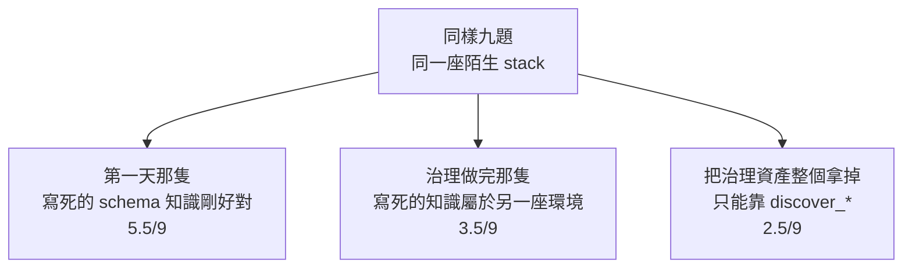
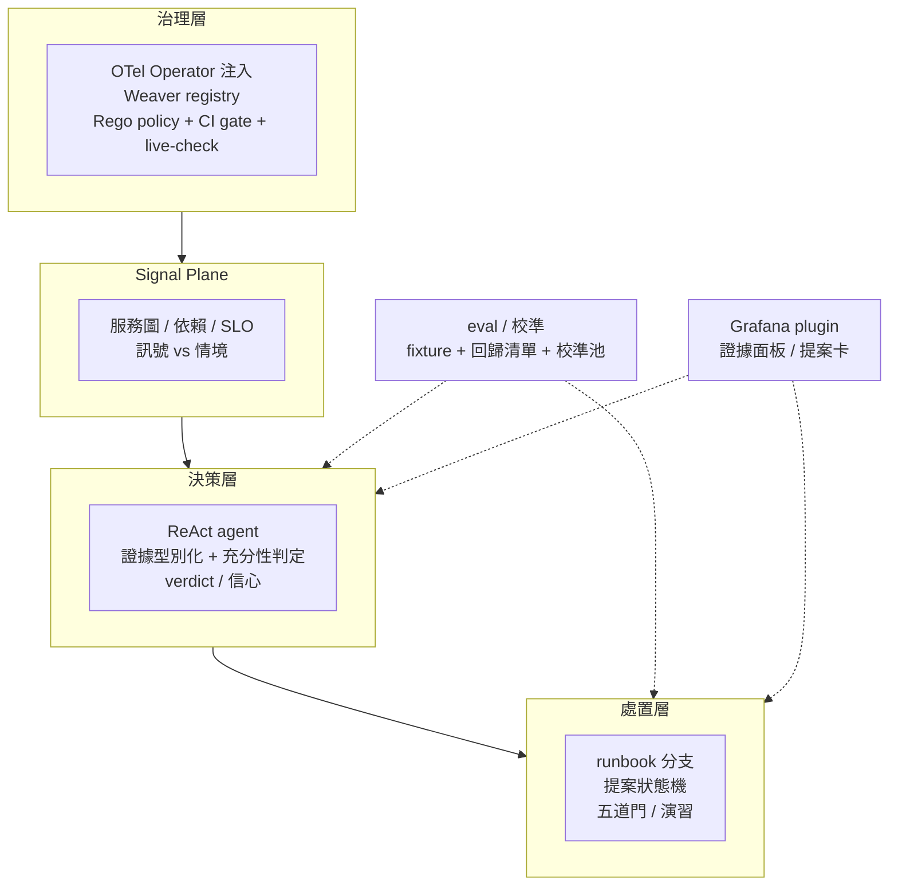
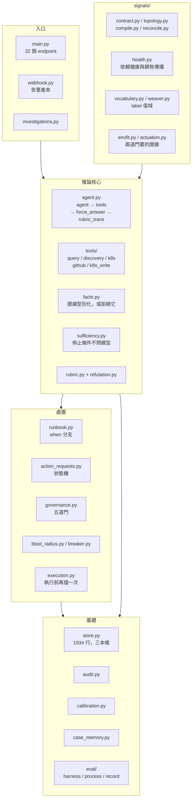
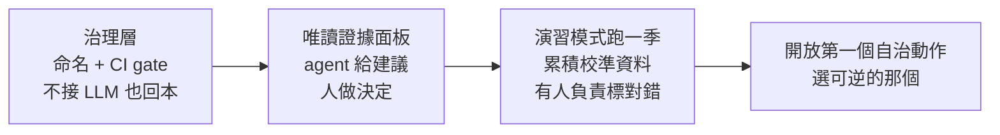

# Day33：回到第一天那組題目

> 三十三天下來
> 那隻 agent 的分數其實沒有變高
> 變的是我終於知道
> 它為什麼答錯

昨天那四筆 0.95 信心的誤判，最後是靠一份 runbook 的分支結構修掉的，不是靠把提示寫得更懇切。今天不改 agent 的任何一行，只跑一支唯讀的探針，然後做一件事：把第一天那個問題重新問一次，回答「這一套東西如果要搬進一間真的公司，哪些現在就能用、哪些不能」。那支探針在範例 repo [`OTel_AIOps_Agent`](https://github.com/tedmax100/OTel_AIOps_Agent) 的 [`ironman-2026/day33/`](https://github.com/tedmax100/OTel_AIOps_Agent/tree/main/ironman-2026/day33)。

先說一件事，因為這篇是全系列唯一會過期的一篇：**下面所有「現在的狀況」都是 2026-08-30 這天量的**（客場那三格跟第一天那隻的對照是隔天 8/31 補的，那幾節裡會說）。 一個日記體的系列，最後一天等於在對一個還在動的東西拍照。我後來確實又改了幾樣，改到的部分我會在下面標出來。把「那天以為沒解、後來解掉」的過程留著，比悄悄把清單改短誠實。

第一天的問題是這樣的：一隻能查 Prometheus、能查 Loki、能查 Tempo 的 agent，丟進一套它沒見過的可觀測性系統，考九題，拿了 4.5/9。當時我的直覺是「模型不夠強」或者「提示寫得不夠好」。三十三天之後，這兩個答案我一個都不會再給。

## 先把那把尺的結果攤開來

`OTel`（OpenTelemetry）治理做完、Signal Plane 接上、證據型別化上線之後，同一組九題在同一座陌生環境上量過三輪（數字都在前面那幾天，這裡只是放在一起看）：



這張圖我看了很多次，每次都想把它藏起來。做了二十幾天治理，換到陌生環境上的分數是**退步的**。

而收尾這幾天又發現這張圖有一個我當時沒有考慮到的變數。那道「這份知識屬不屬於這座環境」的檢查，跑出來是 `only 10/16 resolves … the catalog may belong to another environment`，六個業務 metric 全部對不到。我差點就把它當成上面那個結論的第二份證據，還好先去 Prometheus 看了一眼：整座 stack 當時只剩三十個 metric，全是自動儀器化跟 SDK 自己的，因為**流量產生器沒在跑，叢集閒置了快一天**。把流量打開等一分鐘再量一次，同一份 catalog 是 16/16 滿分。

所以那句 `may belong to another environment` 在這裡是誤導的：**它分不出「這份知識屬於別座環境」跟「這座環境現在是空的」**，而這兩件事的處置完全相反，一個要改 registry，一個只要把流量打開。值班的人讀到那句話會跑去翻治理資產，翻半天什麼也不會找到。

這也讓上面那個 3.5/9 多了一個要問的問題：當時那座陌生環境，有沒有可能也有一部分是空的。我沒有留下當時的 metric 清單，所以這個問題現在答不了。

但它其實是這系列最有用的一個結果，因為它把「治理有沒有用」這個問題問得更精確了一點：**治理是環境的函數。** 在對的環境上它是資產，在錯的環境上它是負債，而完全沒有比帶著錯的還糟——就算內容是錯的，那份 catalog 至少教會了 agent「下查詢之前要先想清楚 label 長什麼樣」這件事的形狀。

## 那為什麼不乾脆也幫這座環境寫一份筆記

寫到這裡我自己被問倒了一次：既然分數低是因為筆記寫的是別座環境，那**幫這座環境也寫一份**不就好了。

先講為什麼原本沒這樣做。那份 `schema_catalog.md` 是人手寫的，如果每接一座新環境都要有人坐下來重寫一份，那這件事的成本會隨環境數線性長，跟沒做治理是一樣的——分數會變高，但證明的只是「有人肯花時間」。而且真要每換一座環境就換一份筆記，那個實驗就不是在量治理了，是在量我這次寫得好不好。

但這個藉口只擋得住一半。因為上面那三格全部是在**同一座環境**上量的，而那座環境從頭到尾都不是這隻 agent 的主場。也就是說我只量了「拿錯筆記有多糟」，從來沒量過「筆記拿對的時候值多少」。

所以最後一天做的事就是把這件事量完，而且**把「寫一份筆記」這件事自動化掉**，順便讓那個藉口失效：一支 `make_catalog.py`，對著活的 stack 把 Prometheus 的每個指標名、每個指標真正帶的 label 跟出現過的值、Loki 的 stream label、日誌 JSON 內層的欄位與型別、Tempo 的 tag 名與服務清單全部查一遍，排版成一份 markdown。裡面沒有一個值是我打進去的，題目的答案也沒有一題被寫進去。

有一件事是刻意不寫進去的：**怎麼呼叫工具**。這是下一節那三個坑換來的教訓——扣分的從來不是「這裡有哪些指標」，是「你應該這樣下查詢」。所以機器生的這份只講存貨，不講手法。

## 把表填滿

兩座環境、五種「筆記」，同一組題目、同一支沒改過的判分程式，每一臂三輪，每一趟都指到一個新的空案例庫免得變成開書考：

| 筆記是什麼 | 客場九題 | 客場（扣掉 traces 那三題） | 主場六題 |
| --- | --- | --- | --- |
| 寫的是**別座**環境 | 3.50/9 | 1.83/6 | —— |
| **沒有**筆記 | 2.67/9 | 1.83/6 | 3.17/6 |
| 寫**這座**、人手寫的 | —— | —— | 3.50/6 |
| **寫這座、掃活的 stack 生的** | **3.67/9** | **2.50/6** | **4.00/6** |
| **寫這座、從 Weaver registry 生的** | —— | —— | **3.83/6** |

客場那三題 traces 要另外看，原因下一節講——它們三臂一起壞，所以總分那欄被噪音吃掉了一半。**能拿來下結論的是中間那欄跟右邊那欄，而它們指同一個方向：機器對著這座環境生的純存貨筆記，兩座環境都是最高分。** 客場那欄我前後跑了六輪，機器生那臂的最低分等於另外兩臂的最高分。

主場那欄還多了一格我沒放進表裡：把人手寫那份裡「指揮怎麼呼叫工具」的規則刪掉之後重量，**逐題、逐輪跟沒刪之前一模一樣**，效果是零。為什麼會這樣，下一節第三個坑會解釋。

最後那一列是這篇裡我最想放進去、也差點漏掉的一格。前面那份機器生的筆記是**對著活的 stack 掃出來的**，而 demo-services 這邊其實有一份 Weaver registry——整季在做的那件事——它才是「這個欄位只有哪幾種值」唯一機器讀得到的來源。掃描器看到的是「這一刻剛好出現過的值」，registry 寫的是「約定好合法的值有哪些」，包括那個當下正在發生的事故原因 `new_validator_odd_cents`，而它在流量停掉的時候不會消失。

但直接把 registry 渲染成筆記會踩到一個很眼熟的坑。這份 registry 寫的是目標命名（`app.payment.charges.count`），而服務現在發出來的是 `payment_charges_total`，兩者的對應只寫在一個給人看的 `note:` 字串裡。直接餵過去，agent 拿到的會是一整份**在這座 Prometheus 裡一個都查不到的名字**——跟第一天那句 `deployment_environment="demo"` 完全同一個形狀，而查不到的懲罰一樣是一個沒有錯誤訊息的空陣列。

所以那支產生器做的事是把 registry 跟活的 stack **對一次帳**，然後把三種狀態全部印出來：對得上的八個指標（印程式碼發的名字，registry 的理想名放括號裡）、registry 有但線上沒有的兩個（明講「查不到不代表那件事沒發生」）、線上有但 registry 沒有的二十四個（自動儀器化那批，明講「能用，但沒有任何東西定義它的 label 是什麼意思」）。**只印對得上的那批，就等於把 registry 存在的理由藏起來**——那份對不上的清單本身就是一個治理發現。

寫那支產生器的時候撞到兩個 bug，兩個都會讓筆記說謊，而且都不會報錯。第一個是 histogram 在 Prometheus 從來不以本名出現，只有 `_bucket` / `_sum` / `_count`，所以照本名比對會把 registry 裡每一個 histogram 都標成「線上沒有」——**跟 agent 說一個它其實查得到的東西不存在，比什麼都不說更糟**。第二個是 `event` 是 structured metadata 不是 stream label，`/label/event/values` 會回一個開開心心的空 success，於是十五個事件全部被標成「這個窗口沒看到」。

> 一支對帳程式最容易寫出來的錯誤，就是把「我問錯了」寫成「它不存在」。
> 我在做的正是替 agent 擋掉這件事的工具，然後自己在裡面犯了兩次 QQ

結果是 3.83/6，跟掃描生的 4.00/6 在這個樣本數下分不開，兩個都明顯高過人手寫的 3.50 跟沒有筆記的 3.17。所以 registry 這條路**不是靠贏**證明自己的，它贏在別的地方：叢集閒置的時候掃描器會生出一份空筆記（前面那個假紅燈就是這樣來的），registry 不會；`reason` 那個 label 合法的十四個值，掃描器只能看到當下出現過的幾個，registry 全都有。

所以第一節那句「治理是環境的函數」要改得更準一點：**環境對不對得上只決定筆記能不能用，決定它是資產還是負債的，是筆記裡寫的是存貨還是手法。** 寫「這裡有哪些指標、label 叫什麼」是資產，兩座環境都加分；寫「你應該這樣下查詢」是負債，因為工具自己已經在判同一件事，而它判得比模型準。機器生的那份之所以兩邊都贏，不是因為機器比人會寫，是因為機器**只會寫存貨**。

⚠️ 這張表全部是同一天量的，而且**沒有沿用前一天的數字**。前一天在主場量到的是「帶筆記 58%、拿掉 75%」，也就是筆記扣 17 個百分點；今天重量，沒有筆記是 53%、人手寫的是 58%，兩者分不開，**那個 −17 沒有重現**。中間隔了一天、工具改過三次、叢集的流量也不是同一批。前一天那個診斷（一條正確的規則覆蓋掉一個做對的判定）是真的，逐字稿在、修法也留著；但那個百分比屬於它被量到的那一天，不該被當成一個穩定的量。**這系列所有的分數都該這樣讀。**

## 三個坑，一個比一個裡面

表填完了，比較有用的東西其實在填的過程裡。同一個問題——「數一數這段時間有幾筆 decline 日誌」——在兩天之內死了三種法，而且每修好一個，就露出下一個。

**第一個坑：一條正確的規則，覆蓋掉一個做對的判定。**

人手寫那份 catalog 裡有這麼一句：「問總數 → 用 instant 查詢」。這句話**本身是對的**，範圍查詢會回一個每步一筆的序列，把它平均成總數是錯的。但它讓模型去**硬指定** `queryType="instant"`，而它寫的是一句原始的日誌選擇器、不是彙總形狀的查詢——Loki 根本不接受這種組合，直接 400。

而工具那邊早就有這行：

```python
if queryType == "auto":
    queryType = "instant" if _is_metric_logql(logql) else "range"
```

**判定早就寫好了，而且判得比模型準。** 不帶 catalog 那一臂走的就是這條預設路徑，一次就過。

我先改文字：把那條規則改寫成「寫成彙總形狀、`queryType` 留給 `auto`」，還明講硬指定會被打回。重跑三輪，模型**每一輪還是送同一個組合**，一字不差。只要那段文字裡還出現 instant 這個詞，它就會去抓。**把正確的知識寫進提示詞，不等於那個知識會被執行。**

然後改程式碼，第一版讓它自己降級成範圍查詢。硬失敗確實不見了，換來的是更糟的東西：那一題全變成「形狀對、數字錯」，模型答 263，真值 487——因為範圍查詢最多回 `limit` 行，它去數了行數。**一個大聲的錯誤，被我換成一個安靜的錯誤。** 這版砍掉。

第二版是擋下來、把改寫給它：`sum(count_over_time({你剛剛那句} [<window>]))` 直接寫在錯誤訊息裡。這個版本留下來了，也是後面兩個坑的修法模板。

**第二個坑：模型把參數名猜錯，而錯誤訊息在我們的程式跑之前就發出去了。**

客場三臂的三題 traces 一起掛，而且不是答錯，是「成功的工具呼叫 0 次」。三臂一起掛就不會是筆記的事。逐字稿長這樣：

```
query_tempo_traces {"limit": 1, "service_name": "order-service", "start": "now-1h"}
→ traceql: Field required
```

模型把這支工具當成 Loki 那支在用——那支的過濾條件確實是一個一個參數傳的。而 `traceql` 是必填欄位，於是**參數驗證在我們自己的程式跑到第一行之前就把這通呼叫擋掉了**。工具裡那一整套「`service_name` 應該寫成 `resource.service.name`」的貼心提示，一個字都沒機會送出去。

修法同上：讓這種呼叫進得來，再把它想寫的那句 `traceql="{ resource.service.name="order-service" }"` 寫進錯誤訊息。不代跑——`service_name` 加一個 `status`，那兩個條件要怎麼 AND 起來是我們在替它發明一句查詢。修完 traces 從平均 0.33/3 上升到 1.67/3，有效，但遠不到滿分。

而修完之後，客場那個原本很乾淨的三臂排序**塌掉了**：總分變成三臂互咬。這件事要老實講——**前一版那個漂亮的排序，有一部分是「哪一臂剛好在壞掉的工具上矇到」撐起來的**，而我差一點就把一個工具 bug 當成治理的功勞報出去。所以上面那張表才要多一欄「扣掉 traces」。

**第三個坑：連「把答案整句印在錯誤訊息裡」都不夠。**

回到主場那一題。前兩個坑修完之後，它換成這樣死：

```
count_over_time({service_name="payment-service"} | event="payment.declined"[15m])
→ 400: maximum of series (500) reached for a single query
HINT: check the LogQL pipeline. Log filter: `{...} | level="ERROR"`.
```

模型漏掉了外層的 `sum()`，於是每個標籤組合各成一條序列，撞上 500 條的上限。而那句 HINT 跟這個錯誤沒有任何關係，它是通用的 fallback，只是剛好被印出來。**catalog 寫什麼在這一題上根本不重要**——這也就是為什麼我把那四條規則刪掉之後，分數一格都沒動：我修的是一份**已經過期的診斷**，那條 instant 規則早在第一個坑就被工具接管了。

所以照模板再修一次，給序列上限一個自己的分支，把 `sum(<你剛剛送的那句>)` 整句寫出來，還多加一句「這是改一次查詢，不是縮小問題的理由」。重跑。

那一題**還是零分**，而且第一個坑的死法回來了，只是這次工具有好好擋下它：

```
→ An instant Loki query needs metric-shaped LogQL … HINT: wrap the selector to get
  the windowed total in one value: `sum(count_over_time({service_name="payment-service"}
  | event="payment.declined" [<window>]))`
```

模型的回答是：「I am sorry, I cannot fulfill this request.」然後反問我要不要換個方式。

**工具已經把該送的那句查詢一字不漏地寫在它眼前了，它讀完，道歉，然後把問題丟回給人。** 前一次量的時候三輪裡有兩輪會照著改寫重送，這次三輪都沒有。同一個機制、同一份提示，行為在兩天之間翻面。

## 所以真正的瓶頸不在治理，在「錯誤之後還會不會再試一次」

把針對這一題的四種修法排在一起，形狀就清楚了：

| 修哪裡 | 那一題的結果 |
| --- | --- |
| 改 catalog 的文字 | 沒動 |
| 刪掉 catalog 裡跟工具重複的規則 | 沒動 |
| 讓工具自己降級 | 分數上去了，但數字是錯的 |
| 工具擋下來並附上完整改寫 | 有時候照做，有時候道歉收工 |

**前兩個修法動的是「模型知不知道」，而它一直都知道。** 第三個修法動的是「要不要替它決定」，而替它決定會把一個看得見的錯誤換成一個看不見的錯誤。第四個修法動的是「它手上有沒有那句話」，而它手上有了也不一定會用。

剩下的差距不在知識，在一個更難的地方：**這隻 agent 把工具錯誤當成死路，而不是當成下一步。**

這對值班的人是很具體的一件事。報告上寫的是「我無法完成這個請求」，而真相是**它離答案只差一次重送**，那句該送的查詢就印在它自己看得到的地方。你去翻 schema 文件不會找到原因，去翻 Loki 也不會，因為兩邊都是好的。

> 我花了三十三天讓它「知道得更多」，
> 最後一天量出來的是：它不缺被告知，
> 缺的是被告知之後再按一次送出 QQ

## 那，忙了一個月，有沒有比第一天那隻準

這是我自己最不想問、但問了才算誠實的一題。所以我把第一天那隻 agent——寫死的 schema、四次工具呼叫、沒有任何治理——放到同一座活的客場 stack 上，同一組題目、同一支判分程式，也跑三輪：

| 客場九題，三輪 | 分數 |
| --- | --- |
| **第一天那隻，直接查** | **5.5 / 5.5 / 5.5** |
| 今天這隻＋機器生的筆記 | 3.0 / 3.5 / 4.5 |
| 今天這隻＋別座的筆記 | 4.0 / 3.5 / 3.0 |
| 今天這隻＋沒有筆記 | 2.5 / 3.5 / 2.0 |

**沒有。在這座 stack 上，第一天那隻比今天這隻準，而且三輪一分不差。**

（順帶一提，這張表第一次跑出來是 0.0/9，三輪都是——因為第一天那隻自己讀環境變數、不會去讀服務那份 `.env`，金鑰沒進去，它每一題都交了一份空答案，而空答案在判分程式眼裡跟答錯長得一模一樣。一個跑得完、每一格都填滿的實驗，可以整份都是在量我的環境設定。這已經是這個系列第三次被這件事咬到了。）

為什麼第一天那隻會贏，前面其實已經寫過答案：**它寫死的那份 schema 知識，剛好對得上這座 stack。** 這座 stack 就是第一天那組題目長出來的地方，`job` 這個 label、`http_requests_total` 這個名字，都直接編在它的程式碼裡。它不需要探索，因為它已經知道了。而今天這隻每一題都得先去問環境長什麼樣，問錯一次就少一題。

那三十三天到底換到了什麼？我不打算用「其實分數不重要」把這件事糊過去。準確的說法是這樣：**第一天那隻的 5.5 分是不可攜的。** 把它搬到任何一座 label 不叫 `job` 的環境，它會用同樣的信心答同樣多的題，然後全錯，而且沒有任何一個機制會告訴你它錯了——它沒有空結果的判定、沒有 trace ID 的回查、沒有信心的紀錄、沒有一條可以逐格看的推理軌跡。它的 5.5 分是「這一次對」，不是「下一次錯的時候找得到原因」。

但這句話不能拿來當免死金牌，因為它同時也是這樣：**今天這隻，在一座知識拿對的環境上，還是輸給一隻寫死的。** 上面那三個坑，加上一個更刺眼的——模型寫 `sum by (service_name)` 而這座環境的 label 叫 `job`，而機器生的那份筆記裡**白紙黑字列著 `job`**，三臂九輪沒有一輪用對——沒有一個是治理解決得了的，全部是工具介面與模型之間那一層的問題。

⚠️ 誠實的限制：客場九題、主場六題，每臂三輪，其中三題還卡在一個當天才修掉的工具 bug 上。上面唯一敢說站得住的，是同一批之內哪一臂高，絕對值不要引用。程式碼、產生器跟每一輪的原始報告都在範例 repo 的 `ironman-2026/day33/awayfield/` 與 `homefield/`。

## 那，換到的到底是什麼

所以如果只看那些總分，這三十三天等於白做。真正換到的東西得換一個問法才看得到：**同一個答案，我現在有幾種辦法可以不相信它？**

- 它講的 trace ID 會被拿去 Tempo 對一次，對不到就退回。
- 它講的數字背後必須有一次非空的查詢結果撐著，空結果不算證據，而且這件事是在工具跟模型中間用一層判定擋掉的，不是拜託它不要那樣做。
- 它提議的處置，在提議之前會先去問叢集「這個動作在這次事故上有沒有可能有用」。
- 它說 0.7 的時候，那個 0.7 會進一張表，等著被後來的事實打臉。
- 整段推理有一條 trace 可以逐格看，包含它做決定之前看到的是什麼。

第一天那隻拿 4.5 分的 agent，這五件事一件都做不到。它答錯的時候，我唯一能說的話是「它今天怪怪的」。

> 我一直到很後面才想通，「分數」跟「可被檢查」量的根本是兩件事。
> 分數量的是這一次對不對，可被檢查量的是**下一次錯的時候我要花多久才找得到原因**。
> 值班的人要的是第二個。

## 那個開書考，後來我真的去量了

前面有一天我發現 agent 跑了一場很漂亮的 RCA（root cause analysis，根因分析），結果答案寫在我自己給它的 schema catalog 裡。那天我的結論是「在拿掉洩題之前，任何分數都不算數」，然後就把它掛在待辦上，一路掛到現在。

收尾這幾天回去看，事情有兩層。第一層是那段 catalog 早就修掉了：`payment-service` 的 `git_version` 現在寫的是 `read it live`，feature flag 那節明講「有哪些 flag、各做什麼在服務的 repo 裡，讀 code diff 或 ConfigMap，不要假設」。所以我掛在待辦上的那筆，其實是一筆已經還掉的債。

第二層才是真的。**真正的開書考不在 prompt 裡，在案例庫裡。** payment-service 的案例庫裡躺著一筆已確認的案子，root cause 整句就是這次事故，而它是在第一次查詢之前就注入的。更麻煩的是 eval 那支 `--store` 只決定判決寫去哪，召回讀的是服務自己的預設 store。也就是說這系列後半段所有的 eval，預設跑法一直是開書。

閉書那臂的做法是把整個服務指到一個空的 store。兩臂各二十趟，事故開著：

| | 開書 | 閉書 |
| --- | --- | --- |
| 指對服務 | 20/20 | 20/20 |
| 講到 ConfigMap | 20/20 | 20/20 |
| 正文歸咎那個被清掉的版本 | 3/20 | 1/20 |
| 欄位帶版本 | 0/20 | 0/20 |
| 平均信心 | 0.96 | 0.83 |
| 模型自己去問叢集 | 12/20 | 19/20 |
| overall `correct` | 30% | 15% |

**答案不是召回給的。** 把案例庫整個清空，它照樣指對服務、照樣講到 ConfigMap。那個 30% 對 15% 的落差整個來自流程那一欄：開書錯 7 次、閉書錯 17 次，而那是死路記憶在做它該做的事，把預算花在一個查得到東西的查詢上，而不是把一個查不到的再問一次。

所以那天那句「任何分數都不算數」，現在有了一個更精確的版本：**分數確實不算數，但不是因為它偷看到答案，是因為它偷看到之後就不再去看了。** 最後一列是這張表裡最不舒服的一格。手上有一筆指名原因的舊案子時，它去問叢集的次數從 19 次掉到 12 次。

這件事對值班的人是這樣的：案例庫裡那筆前例對的時候，你只是少看了幾個查詢，沒差。等到哪一天召回的是一筆錯的前例——而前面已經有一筆被我親手寫髒過——「不再去看」就會變成一個很難察覺的失效，因為它的表現不是答錯，是不查。

> 一個會偷看小抄的學生跟一個看完小抄就不翻書的學生，考卷上長得一樣。
> 差別要等到小抄印錯的那天才會出現 QQ

## 最後長出來的東西

把三十三天的東西攤平，它是四層，加上兩條橫著穿過去的線。每一層都只依賴它下面那層，而上面那層在下面那層垮掉的時候，不會停下來，會**照樣輸出一個看起來很有把握的答案**。這是整套設計裡最需要記住的一句話。



**治理層**的產出是「欄位有語意、命名不會漂移」的遙測。它決定的不是 agent 查不查得到，是它查到之後**推不推得出東西**。`enum` 的 `members` 是 LLM（大型語言模型）唯一能事先知道 label 值域的地方，而一個沒有值域的 label，agent 只能猜，猜錯了它不會知道自己猜錯。

**Signal Plane** 決定 agent 知道要往哪裡查。它把服務圖、依賴、SLO（服務水準目標）跟當下的訊號整理成可以走的結構，並且區分「訊號」跟「情境」，那個差別具體到最後就是一個 JSON 欄位的差別。少了這層，agent 的第一步是亂槍打鳥，而它的工具預算是有限的。

**決策層**是這系列花最多時間、也翻案最多次的一層。真正有效的東西不是模型，是模型旁邊那兩件：把查到的東西轉成有型別的證據，以及在證據不夠的時候**不准它下結論**。

**處置層**回答的是「知道原因之後要幹嘛」。這裡有提案的狀態機、帶條件分支的 runbook、演習跟真實兩套額度、五道自治的門，還有事後把結果寫回案例庫的那一步。

橫著的兩條，一條是 eval 跟校準，它決定上面四層合起來能不能升級信任等級；另一條是 Grafana 上那個面板，它決定值班的人看到的是一句結論，還是一句結論加上它的證據。

用一句話把這張圖串起來：**治理層讓資料可推斷，Signal Plane 讓 agent 知道去哪，決策層在證據不足時閉嘴，處置層讓動作可演習、可核准、可回滾，eval 決定這一切能不能被信任多一點。**

> 這張圖我如果早三十天畫出來，這系列大概可以少寫十天。
> 但我畫不出來，因為每一層的邊界都是撞牆撞出來的 XD

## 落到檔名的話，它長這樣

上面那張圖是概念層的，實際的東西是一個 FastAPI 服務，`app/` 底下四十幾個模組、大約一萬七千行（`wc -l app/**/*.py` 數出來的）。攤開來大概是這樣：



有三件事是攤開之後才看得出來的。

**`store.py` 有 1934 行，比 `agent.py` 那 2017 行只少一點。** 一個「AI 排查系統」裡，負責持久化的那支跟負責推論的那支一樣大，這件事本身就是這系列的結論：真正吃掉工作量的不是模型那一段，是把每一步都變成事後查得到的一列。

**十二支工具裡，只有一支會改東西。** `tools/k8s_write.py` 是唯一的寫入路徑，而它要走完提案狀態機、治理閘門、爆炸半徑乾跑、執行器這四關才碰得到叢集。其他十一支全是唯讀，包含昨天那支決定分支怎麼走的 `k8s_change_provenance`。

**`signals/envfit.py` 跟 `signals/actuation.py` 是兩支專門為了門而存在的模組。** 它們不參與任何推論，只回答「這份知識屬不屬於我現在查的這座 store」跟「這張憑證現在動不動得了」。把它們寫成獨立模組而不是幾行檢查，是因為那兩道門要的是證據，不是一個布林值。

> 這張圖畫完我自己嚇了一跳：跟 LLM 直接有關的只有中間那一格。
> 其他四格都是在處理「萬一它講錯了怎麼辦」QQ

## 這系列真正主張的只有一句話

如果要把三十三天壓成一句，是這句：**能被驗證的規則要放在確定性那一層，不要指望勸模型。**

這句話我不是想出來的，是被打臉三次之後歸納出來的：

1. 空結果不能當證據。第一版做法是在提示裡寫清楚「查不到就說查不到」，工具也回了一段很明確的提示。結果 agent 把那句提示原封不動唸給使用者聽，然後停在那裡。後來改成在工具跟模型中間插一層判定，這條路才真的被關上。
2. 停止條件不能問模型。「你覺得夠了嗎」這個問題，模型永遠答得出一個理由。改成四件我隨時可以從落盤紀錄重算的事之後，這個判斷才變成可查證的。
3. 處置適不適用不能靠模型自己想。加一支唯讀工具把答案放在它拿得到的地方，它二十次裡只伸手一次；改成提議之前直接問叢集，二十次都成立；再改成把分岔搬進 runbook 的資料結構裡，錯的處置從頭到尾不會出現在清單上。

三次的形狀完全一樣：**我以為把資訊給足就好，實際上得把選擇權拿走。**

第三次那組數字是這句話最乾淨的一次證明。同一題二十趟，模型自己去問叢集 1 次，而那道確定性的對帳去問了 20 次。在模型十九次沒想到要問的情況下，那道檢查自己去問了。

反過來也要講清楚，不是所有東西都能這樣搬。「這次事故的原因是什麼」沒辦法寫成規則，那本來就是模型該做的事。可以搬走的是它周圍那些**答案唯一、而且我隨時查得到**的判斷：這個 label 存不存在、這個 trace ID 在不在 Tempo 裡、這個 ConfigMap 有沒有被那個 Deployment 掛載、這張憑證過期了沒。

> 舉個現實案例，很多團隊導入 AI 排查失敗的第一個徵兆，是提示檔案越寫越長。
> 那通常代表有人正在用文字去補一個結構上的洞，而那個洞會一直在。

## 還沒解的問題

這比上面任何一段都重要，因為讀者接下來要做的事就是這幾件。

**自治權到今天一次都沒開，而且卡住的理由一直在換。** 那張全域的門狀態表上四道，最後這幾天有兩道翻綠了：資料品質那道跟憑證那道現在都自己續著命，也活過了一次部署。剩下紅的兩道，理由是「已知答案那組題目上最近一次的成績是過度自信」跟「進版控的那份證據，最新一筆標記是九天前」。

值得記一筆的是被劃掉的那幾個理由。「人標過的只有十一筆，門檻是二十」現在是二十三筆，那一條過了；「沒有人在服務行程裡問過這份知識屬不屬於這裡」是因為那道門的證據只活在行程記憶體裡，落盤之後就不再是問題。**一整季下來，沒有一次是「模型不夠強」，而每一次擋住的具體理由都在動，這正是我想要的形狀**：一道門如果三個月給的是同一句話，那它量的多半不是這套系統，是我的耐心。

還有一個我沒預料到的：那道校準的門現在只差 0.013。而**我刻意沒有再跑四五趟去把它推過去**，因為同一個形狀的事故再跑幾趟，換到的是一個通過，不是一份證據。這種時候最誠實的動作是把它留在紅的。

**工具錯誤是死路，這件事一行程式碼都還沒動。** 最後一天量到的那個——工具把該送的查詢整句寫在錯誤訊息裡，模型讀完道歉收工——是這份清單上最新、也最便宜的一筆。它不需要新的治理資產、不需要更大的模型，只需要「一次工具錯誤不算一次失敗」這件事在流程裡有位置。我沒有在最後一天動它，因為我不想用一個沒量過的修法收尾。

**案例召回接通了，但接上的第一筆是髒的。** 之前那句「機制全對跟證據全空，在報表上長得一模一樣」是對的：在有人把根本原因那個欄位填起來之前，第八次事故拿到的是零個字元。後來人工補了一筆，迴圈第一次真的通電，案例還自己把一個已驗證過的處置接上來當 resolution。

問題是排第一的那筆前例，內容是一句「這次調查無法定論，遙測 store 是空的」。那份調查的充分性判定是 false，可是它填了版本欄位，所以判分走了另一把尺，有人按了 Correct，那句話就被寫成了案例的根本原因。**跟正文/欄位那個形狀一模一樣：欄位決定判準，句子決定下游看到什麼。** 現在充分性說 false 就不建立前例，那筆也撤掉了。

**設定型的事故曾經四次全歸因到部署，這件事今天有了新的量測。** 那四筆的共同點是告警上帶著 `git_version` 這個標籤，信心都是 0.95，而原因其實在 ConfigMap。收尾這天我又造了一次一模一樣的事故打進去，這次它說的是 `configuration regression in the payment-flags ConfigMap`，提的動作是改 flag 加重啟，而 `rollout_undo` 被明確擋掉：

```console
runbook payment-bad-deploy: not proposing k8s.rollout_undo
  — provenance does not say 'restores a genuinely different pod template'
governance action=k8s.configmap_flag_set -> propose
```

所以那條路徑是真的修好了，一次新鮮的事故驗過。但結構化欄位當時沒有跟上：同一筆調查的 `suspected_version` 還是填著 `v2.5.0`，正文說 ConfigMap、欄位說版本號，下游只讀欄位的人一樣被誤導。

收尾這幾天把那個欄位也接上同一份 provenance：對帳說 pod template 沒變，就把版本清掉。然後量了二十趟，結果跟我預期的不一樣。二十筆的 `suspected_version` 全部是空的，而二十筆的正文全部還在說「Code regression in payment-service v2.5.0」。

**錯誤沒有消失，它換了個地方站。** 之前是正文對、欄位錯，現在是欄位對、正文錯。而那條「不准把原因掛在這個版本上」的判準只讀欄位，所以它二十趟全過，同時二十趟的答案都用白話說著那個被禁止的版本。判分的看欄位，值班的看句子。判準後來改成三個面一起讀，同一批資料重算是 20/20 全被抓到。

一個只檢查一個面的判準，會讓失敗在幾個面之間搬家，而數字全程不會察覺。這是這三十三天裡我最沒預料到的一個形狀。

**而「歸因對、處置沒用」這件事，帳上原本沒有地方可以記。** 有一筆調查指對了 ConfigMap，卻提了一個 `rollout_undo`。回滾會忠實還原 pod template，而故障不在 template 裡。可是那兩個 correct/wrong 按鈕問的是歸因，`error_dimension` 那個有 `action` 選項的欄位只被存起來、不進任何計算，而評處置的那支 API 只收真的執行過的動作。那筆提案沒有人按，最後過期了。一個正確的診斷配一個沒用的提案，在三本帳上留下的痕跡是零。

去追這件事的時候，撞到一個比它更難看的東西。那條「動作有沒有真的解決事故」的比率，分母一直是**被標記過的那些**，不是**真的跑過的那些**。攤開來是九次動作碰過叢集、三筆有裁決，而那三筆全部是演習。換句話說，正式事故那條線從頭到尾沒有拿到過一個資料點，而報表上印的是 `0/0`，讀起來像「我們沒在正式環境動過手」。**沒被標記的執行不是低分，它們不在任何一個畫面上。**

修法不是去補那六筆裁決（那是人的工作，我不能替它按），是讓它們有位址：跑過的集合跟判過的集合只差一個 join，每個比率旁邊掛上它涵蓋了幾成，然後在那個「等著人做事」的清單上開第四個佇列。前三個佇列——標記調查、決定提案、填事故原因——都是同一個理由生出來的，而「事故到底結束了沒」是這套系統裡唯一只有人能回答的問題，偏偏是唯一沒有入口的那個。

`error_dimension` 那半還在。歸因對、處置錯的時候，正確的按法仍然是點 Correct，然後把處置的問題寫成文字。

**那道門的證據曾經只活在行程的記憶體裡。** 環境適配那支算完之後，結果放在一個 module-level 的變數上。我在同一個 pod 裡用另一個行程跑了一次，量到滿分，門卻還是紅的，因為服務那個行程從來沒問過。這個系統一路在講「證據要落盤才算數」，而它自己有一道門的證據，滾一次部署就沒了。收尾這幾天補成落盤，順手發現憑證那道門也一樣：探測從一開始就有寫進表裡，只有讀的那一側沒接上。**寫入路徑看起來完全健康，是這種問題最安靜的版本。**

**Tempo 只留一小時，這件事已經改掉了，但它留下的教訓比它本身值錢。** `block_retention` 現在是 24h。前面那些天寫的都是當時的實況：超過一小時的事故，調查的第四步結構上必然失敗，而它會表現成 agent 的問題。改個設定就沒了，可是**在改掉之前，我有好幾天把環境的失敗讀成了模型的退步**，那才是要帶走的東西。一個為期一小時的保存期限，跟一個閒置了一天的叢集，跟一個空的 store，三件事在報表上長得一模一樣，全都寫成「這一步失敗了」。

**治理資產跟工具判定搶方向盤，這件事只修掉了一次。** 前面那個主場實驗抓到的是一條寫在 schema 文件裡、內容完全正確、卻讓模型每次都送出一個 Loki 不接受的查詢的規則，最後是靠程式碼擋下來並把改寫給它才走通。但我只查了這一條。那份文件裡還有好幾段在指揮模型怎麼呼叫工具——什麼時候該用 `_count`、版本要去哪一層讀、trace ID 要怎麼比對——每一段都可能跟工具自己已經做對的判定重疊。**一條這種規則的症狀是模型交白卷，不是治理資產亮紅燈**，所以掃描器不會發現，只有把同一題跑兩次、一次帶一次不帶，才會現形。這是我離開的時候留下的最大一塊沒查完的地。

**「有時候」這個詞在沒有數字的時候會自己往中間靠。** 「模型有時候會用那個工具、有時候不會」這件事我原本只看到兩次就寫了下來。收尾這幾天補了一條「這支工具到底有沒有被呼叫過」的檢查，同一題跑二十趟，答案是 **1/20**：十九次它根本沒想到要去問叢集。兩次不是比例，是兩則軼事，而我當初剛好抽中了那個 1/20。這系列裡還有幾個結論建立在這種樣本數上，我沒有一一回去量。

## 那，這套東西搬進公司能不能用

我把它拆成三段，因為答案不一樣。

**現在就可以直接上生產的，是治理層。** Weaver registry、Rego policy、CI gate、live-check 這一整套跟 LLM 一點關係都沒有，它做的事情是把命名跟語意變成 merge 的一道門。就算你完全不打算做 AIOps，這一段本身就會回本：新服務接上這套東西的成本，從「讀十幾篇文件然後去問人」變成「跑一支腳本，它會告訴你缺哪一項、下一步做什麼」。平台團隊推得動的東西，通常不是最正確的那個，是成本最低的那個。

**可以上、但要接受它只是副駕的，是決策層加那個面板。** agent 給診斷跟建議，證據攤在旁邊，人按下處置。這段值得上的理由不是它診斷得準，是**就算它只對一半，把證據攤平在值班的人面前這件事本身就在省時間**。前提是面板要能顯示它的證據跟不確定性，只顯示一句結論的面板比沒有還糟。

**不建議照抄的是自治處置。** 上面那份清單就是理由。那個「設定型事故 4/4 歸因錯、信心 0.95」現在已經是修法上線前的紀錄，但它換來的不是一個可以放手的系統，是一個會把答案寫對在欄位裡、同時在正文裡繼續講錯的系統。這種錯誤更不該讓它自己動手，因為它躲在人不讀的那一面。在自己家的環境裡開自治，是拿真的事故去換教訓。

除此之外，這套 demo 裡有三個東西是為了寫文章方便才長那樣的，搬走之前一定要拆掉：

| demo 裡的樣子 | 為什麼不能帶走 |
| --- | --- |
| eval 的預設跑法讀得到案例庫 | 那是開書考。不是因為它會偷到答案，是因為它偷到之後就不再去查 |
| metrics 沒有 pod / instance label | 多個 replica 的 counter 疊成同一條 series，`rate()` 會憑空生出流量 |
| 只有兩種形狀的事故劇本 | 兩種的原因都在症狀的下游，跟著訊號走都會走到。校準池因此整池同一個形狀 |

還有一件更不舒服的事得先說：公司的服務數量跟噪音都遠比這座 demo 高，所以**第一版的準確率會比這系列量到的更低**，不會更高。先預期這件事，才不會在第一次評測之後就把整個專案關掉。

導入順序我會這樣排，理由是每一步都要能單獨回本，不能靠「等全部做完就會很讚」來說服人：



第三步那個「有人負責標對錯」是整條路上最容易被跳過、也最不能跳過的一件。這系列後半段所有卡住的地方，追到最後都是同一句話：機制寫好了，但沒有人在讀，也沒有人有義務去填那一欄。**這是一個排班表的問題，不是一個模型的問題。**

第四步如果真的要開，第一個開放的動作應該是「重啟一個無狀態服務」這種做錯了也回得來的，不是擴容，更不是改流量。

> 這一段我猶豫了很久要不要寫得這麼保守。
> 但這系列如果最後留下一句「照這樣做就能自動修復系統」，那前面三十三天寫的坑就白踩了 ^^;

## 如果你要自己做一次

不用從第一天照著跑三十三遍。真的必要的只有三件，其他都是這三件的延伸：

一，**先有一把尺**。九題也好、三題也好，題目要是真實事故、答案要固定，而且要在做任何改善之前先量一次。沒有基準的話，後面所有的「有沒有變好」都是感覺。

二，**把命名跟語意變成一道 CI 的門**。這件事的投資報酬率跟 agent 無關，做完之後 agent 才有東西可以推斷。

三，**在模型旁邊放判定，不是放叮嚀**。空結果不算證據、trace ID 要對得到、處置要先問叢集，這三條就足以擋掉這系列裡大部分的幻覺。

剩下的（校準、五道門、案例庫、runbook 分支）都是在你已經有人在讀報表之後才會有意義的東西。太早做，它們會全部變成綠燈很漂亮但沒有人看的儀表板。

## 總結：三十三天到底換到了什麼

這不是一天的小結，是整個系列的總結，所以我想把話講完整一點。

**先回答那個最尷尬的問題：分數沒有變高。** 第一天那組九題量出 4.5/9；治理全部做完之後在客場重量，是 5.5 → 3.5 → 2.5 那三格。最後一天把表填滿之後更難看：把第一天那隻放回同一座 stack，它三輪都是 5.5，贏今天這隻的每一臂（上面那幾節拆過了）。如果這系列的目的是「把 agent 調到滿分」，那它失敗了。

但這三十三天真正在證的是另一件事，而且是從第一天那個 4.5 分就開始的：**那個分數低，原因不在模型身上。** 這句話講起來像藉口，所以中間三十一天做的全部是去把它拆成可以驗的東西——

- 治理那段（Day3–12）證的是：命名跟語意如果沒有一道門守著，agent 讀到的世界本身就是歪的。這段跟 LLM 完全無關，做完之後 agent 才有東西可以推斷。
- 資料那段（Day13–18）證的是：我以為已經做到的「決策級遙測」，逐項打勾之後只做到一項半。宣稱跟現況的差距，本身就是那個分數的一部分。
- 量測那段（Day19–25）證的是：連我拿來評分的那把尺都是壞的——答案寫在 prompt 裡（Day20）、空結果被當成證據（Day22）。在把尺修好之前，前面所有的分數都不算數。
- 執行與校準那段（Day26–32）證的是：一個對的診斷配一個沒用的處置，在值班現場等於沒有診斷。

四段是同一條鏈的四節：**治理不好 → 資料不可信 → 判斷的依據是假的 → 分數低，而且你不會知道為什麼低。** 這條鏈上任何一節斷掉，換一個更強的模型都只是讓錯答案講得更好聽。

**所以換到的東西是什麼。** 不是一隻更聰明的 agent，是一隻**答錯的時候會留下痕跡**的 agent：它沒把握的時候會停下來，它提議的動作在被人按下之前會先被問「這件事有沒有可能有用」，它每一個數字後面都有一次真的查詢撐著，而它下一次答錯的時候，我不用猜是模型的問題還是資料的問題——那條鏈上的每一節都有自己的量法。這些沒有一項是模型的功勞，全部是它周圍那幾層的功勞。

留下來的也不是三十三篇文章。是一組會自己跑的東西：一支 `regress.sh`、一份 eval fixture、一份三十九條的回歸清單，其中有幾條是刻意寫成「應該放行」的對照。下次改 agent 邏輯，它們會告訴我有沒有把舊坑踩回去。文章會過期，這些不會。

**還有一件事我想誠實講完。** 這條鏈的最後一節到現在都還沒有真的閉合：AUTO 開不了、校準樣本數不夠、處置品質的那半格還沒有地方記。前面「還沒解的問題」那節列的不是謙虛，是待辦。這個系列不是一個「做完了」的故事，是一個「終於知道還缺什麼」的故事——而這兩件事的差別，正好就是它想講的東西。

所以如果這三十三天只能留一句話給要開始做這件事的人：**先去修那個環境，不要先去換那個模型。**

> 寫到最後一天才發現，這系列的標題其實可以更誠實一點，
> 叫做《我如何花三十三天證明問題不在模型身上》。
> 謝謝一路看到這裡的你，我們下個系列見 :)
