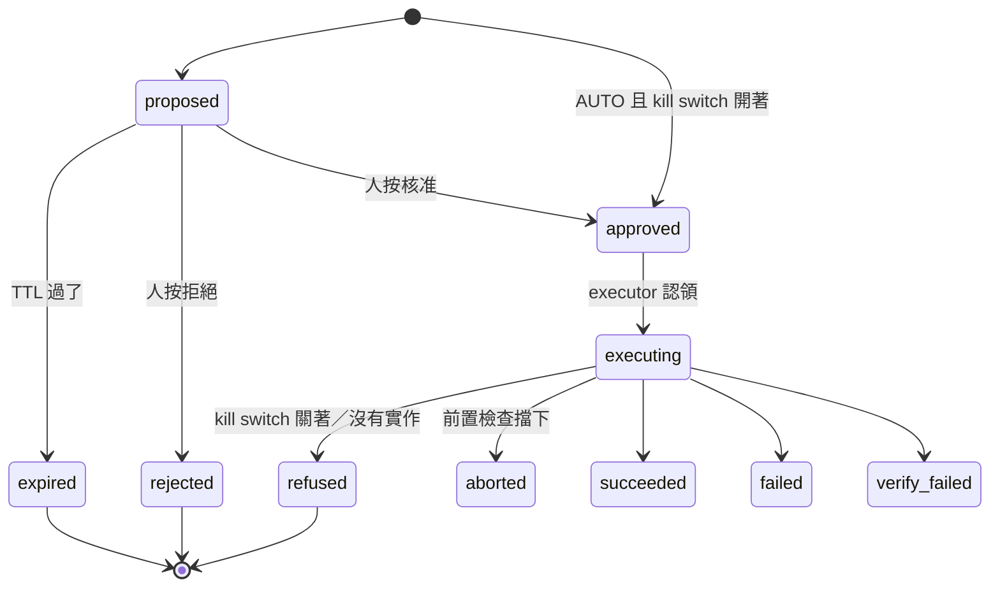
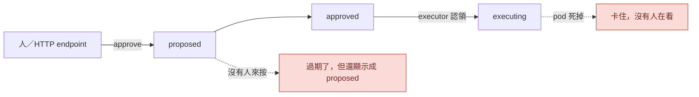

# Day34：狀態機撞牆測試，順便撞出兩個沒人管的狀態

> 九條測試都綠的
> 而且測的東西都對
> 只是它們全部都是一個執行緒
> 依序呼叫兩次，然後停在「第二次回 None」

昨天畫出真實的呼叫關係，結論是提案那條路一直是活的，斷掉的是提案之後那一段。今天就從斷點的第一格開始：`action_requests.py`，那個把治理的判斷變成一列可以被人按的紀錄的狀態機。

程式碼在範例 repo [`OTel_AIOps_Agent`](https://github.com/tedmax100/OTel_AIOps_Agent) 的 [`ironman-2026/day34/`](https://github.com/tedmax100/OTel_AIOps_Agent/tree/main/ironman-2026/day34)。這一天的指令都假設你在那個 repo 的根目錄下跑，不需要叢集，也不需要 LLM。

## 為什麼一個判斷不能只是一個判斷

治理平面算出來的東西是一個 `Decision`，它是一個 pydantic 物件，活在記憶體裡，函式回傳完就沒了。但「這個行動被允許到什麼程度」這件事必須撐得比一次函式呼叫久，因為中間要插進去一個人。

人要看得到它、要能按、按完要留下是誰按的、而且隔天有人問起的時候要查得到。所以它得變成一列有狀態的紀錄。`action_requests.py` 的 docstring 把職責切得很清楚：這支檔案管**一個請求現在在哪個狀態、以及它可以合法地移動到哪裡**；執行的時候發生什麼事是 `execution.py` 的；到底會不會真的動到叢集是 `actions.py` 那道 kill switch 的。

狀態總共 13 個，畫出來長這樣（灰色那幾個是執行管線之後才會用到的，今天不碰）：



`Status` 是一個 `StrEnum`，13 個值裡有 7 個標著 `(7b-4+)`，也就是還沒走到的那一段。今天要撞的是前半段那幾條線。

## 讓一個轉移安全的是那句 SQL

所有的狀態轉移都走同一個函式，`store.ar_transition()`，而它的核心只有一句 SQL：

```sql
UPDATE action_requests SET status=? WHERE request_id=? AND status=?
```

最後那個 `AND status=?` 是重點。它不是「先讀出來看一下是不是 proposed，是的話再寫進去」，而是把讀跟寫壓成同一句原子操作，然後看 `cur.rowcount > 0`。這叫 compare-and-set，兩個人同時按核准的時候，第二個人的 UPDATE 會匹配到 0 列，函式回 `False`，`approve()` 因此回 `None`。

這個設計是對的。我今天想確認的是它在**真的併發**的時候也是對的，因為現有那三條相關的測試（double approve、approve after TTL、approve missing）都是單執行緒依序呼叫，只證明了「第二次呼叫看到狀態已經變了」。那證明的是意圖，不是機制。

## 四個探測

寫了一支 `probe_lifecycle.py`，用一個暫存 SQLite 檔加真的模組，沒有 mock。四個探測各印出那一列最後長什麼樣。

### 一、八個執行緒同時按核准

```
[1] 8 threads approve the same request simultaneously
    approve() returned a request 1 time(s) out of 8
    after                  status=approved   actor=human-2 outcome=''
```

八個執行緒，恰好一個贏。連跑三次，贏的分別是 `human-2`、`human-1`、`human-1`、`human-0`，誰贏是隨機的，但**數量永遠是 1**。CAS 在真的併發下守住了，這一格是好的。

### 二、同樣過期的請求，approve 跟 reject 給出不同的故事

```
[2] the same stale request: approve() vs reject()
    approve() -> None
    approved path          status=expired    actor=None outcome='approval TTL elapsed before action'
    reject()  -> a request
    rejected path          status=rejected   actor=human outcome=''
```

兩列一模一樣的請求，`expires_ts` 都被我改到 60 秒前。走 approve 那條路的結果是 `expired`，而且 `outcome` 那欄留下了原因；走 reject 那條路的結果是 `rejected`，`actor` 是那個人。

翻回程式碼，原因很單純：`approve()` 開頭有一行 `_expire_if_stale()`，`reject()` 沒有。

從「會不會出事」的角度看，這不是 bug，兩邊都是終局狀態，沒有東西會被執行。但從稽核軌跡的角度看，**這兩列紀錄講的是兩個不同的故事**：一個說「它逾時了，沒人來得及處理」，另一個說「有人看過並且決定不做」。前者該問的是為什麼沒人看到，後者該問的是那個人為什麼判斷不做。事後翻紀錄的人分不出來這兩件事。

這個形狀在這系列出現過很多次，都是同一句話的變形：一份看起來像結論的紀錄，沒有講清楚它其實是逾時。

### 三、沒有人碰的過期請求，會一直待在待辦清單裡

```
[3] a stale request nobody touches
    listed under status=proposed: 1
    stored                 status=proposed   actor=None outcome=''
```

這個是我覺得比較有實務影響的一個。`_expire_if_stale()` 全專案只有一個呼叫點，就是 `approve()` 裡面那一行。也就是說**過期是被動觸發的**：沒有人去按那顆核准，那列紀錄就會用 `proposed` 的身分一直躺在那裡，`list_requests(status="proposed")` 撈得到它，plugin 那頁也會把它畫出來。

TTL 存在的理由寫在 `config.py` 的註解裡，講得很好：核准會走味，一個在時窗內沒被處理的請求要讓它過期，免得世界已經動了之後還有人拿著舊的前置條件去行動（那是典型的 TOCTOU）。設計意圖是對的，但目前那個時窗只有在有人來敲門的時候才會被檢查。

實務上會怎樣：凌晨兩點出了一次事故，agent 提了一個回滾建議。沒有人處理。早上九點有人打開面板，看到一列 `proposed`，上面寫著回滾 payment-service 到 rev 24。那個提案是七小時前的世界算出來的，而畫面上沒有任何東西告訴他這件事，除非他自己去看 `created_ts`。他按下去，`approve()` 才在那一刻發現它過期了，然後回 `None`。運氣好的話畫面會跳一個 409，運氣不好的話他會以為自己按了。

### 四、executor 認領到一半死掉

```
[4] the pod dies between claim and outcome
    executor claimed it: True
    after the crash        status=executing  actor=human outcome=''
    a restarted executor re-claims it: False
    approve() on it now: None
```

`execution.py` 認領一個請求的方式是 `approved → executing` 的 CAS，這樣兩個 executor 不會搶到同一列。問題是認領成功之後如果那個 pod 被砍掉（重新部署、OOMKilled、節點被驅逐），那列紀錄就永遠停在 `executing`。

重啟後的 executor 沒辦法重新認領，因為它找的是 `approved`；人也沒辦法做任何事，因為 `approve()` 找的是 `proposed`。**這一列就卡在一個既不是終局、也沒有人會再看它一眼的狀態**，而且全專案沒有任何地方在掃 `executing` 的殘留。

> 我在別的地方踩過同一個坑，那次是一個訂單狀態卡在「處理中」三個月，沒有人發現，因為報表只看成功跟失敗兩種。
> 卡住的東西最可怕的地方不是它壞了，是它不會叫 QQ

## 這三件事的共通點

第二、三、四個發現長得不一樣，但骨架是同一個：**這個狀態機的推進完全依賴有人來敲門**。核准要人按、過期要靠有人試著按、卡在執行中的那列要靠有人發現。沒有任何一個角色在背景把時間的流逝變成狀態的變化。

昨天畫的那張圖是靜態的 import 關係，今天這個是動態的：



這在目前的狀態下沒有造成任何傷害，因為 kill switch 是關的，卡住的那列本來也不會動到叢集。但這九天的目標是把那個開關打開，而開關打開之後，這兩個虛線框就從「一列難看的紀錄」變成「一個沒有人知道的、進行中的變更」。

## 這道門的成本落在誰身上

平台工程的角度今天很具體。一個提案卡在畫面上，成本是誰的？

如果過期只在按下去的那一刻才算，那成本就落在**值班的人**身上：他要自己去看時間戳、自己判斷這個建議還新不新鮮、按下去被拒絕之後自己想辦法理解為什麼。而他手上有的資訊是最少的，因為他不知道 TTL 是 900 秒（那寫在服務端的設定檔裡）。

反過來，如果清單本身就會把過了時窗的提案標出來，或者乾脆讓它們自己走到 `expired`，那成本就落在平台團隊身上，代價是多一支背景工作、多一個要維護的東西。這是這系列反覆問的同一個問題：一道 gate 擋下來之後，對方能不能自己修好。目前這道門擋下來的訊息是 HTTP 409 加一句 `request not approvable (missing, expired, or already decided)`，三種原因擠在同一句話裡，而它們對值班的人來說是三件完全不同的事。

## 今天沒做的事

- **三個洞都只是量出來，沒有補。** 沒有加背景過期、沒有給 `executing` 殘留一個回收機制、`reject()` 那個不對稱也沒動。要改哪一個、怎麼改，得先看它們在開關打開之後的實際影響。
- **`probe_lifecycle.py` 不是測試。** 它印東西給人看，沒有斷言，也沒有進 `tests/`。把這四條變成會紅的測試是下一步該做的事。
- **沒有撞 `execution.py` 那一側。** 今天只到「認領」那一格為止，認領之後的乾跑、rubric 檢查、settle window 都沒碰。
- **409 那句話沒改。** 三種原因擠在一起這件事今天只講了，沒動它。
- **併發只測到 8 個執行緒、同一個 process。** 兩個 replica 同時打同一個 SQLite 檔是另一回事，那牽涉到 SQLite 的鎖行為，今天沒測。

## 小結

總結來說，今天沒有改任何一行產品程式碼，做的事情是拿現有那九條測試沒走過的路徑各走一次。CAS 那一格通過了，八個執行緒搶同一列，恰好一個贏，這是今天唯一的好消息。剩下三個發現都指向同一件事：這個狀態機只有在有人按的時候才會動，時間本身不會讓任何一列紀錄前進。

這件事在開關關著的時候是無害的，所以它可以在 repo 裡躺很久都沒有人發現。而這九天要做的正是把開關打開，所以它現在變成一個要排進去的東西，而不是一則觀察。

> 寫這支探測腳本花的時間，比我讀完那九條測試的時間還短。
> 早知道每次看到「這裡有測試」就先花十分鐘撞一下，前面三十幾天可以少寫幾篇認錯的文章 XD
