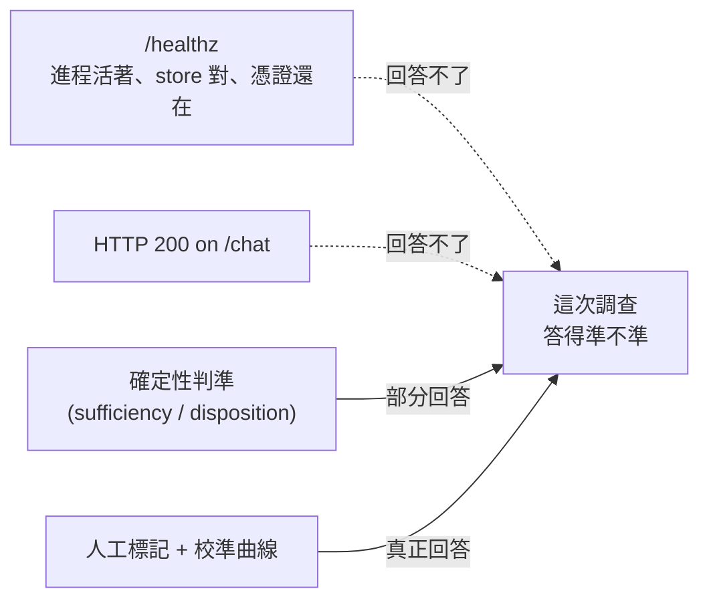
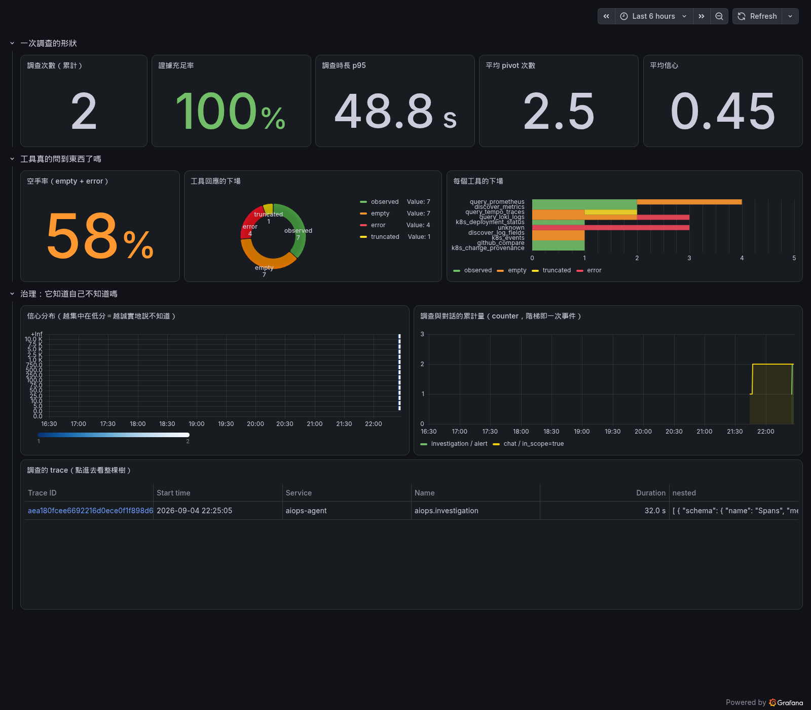
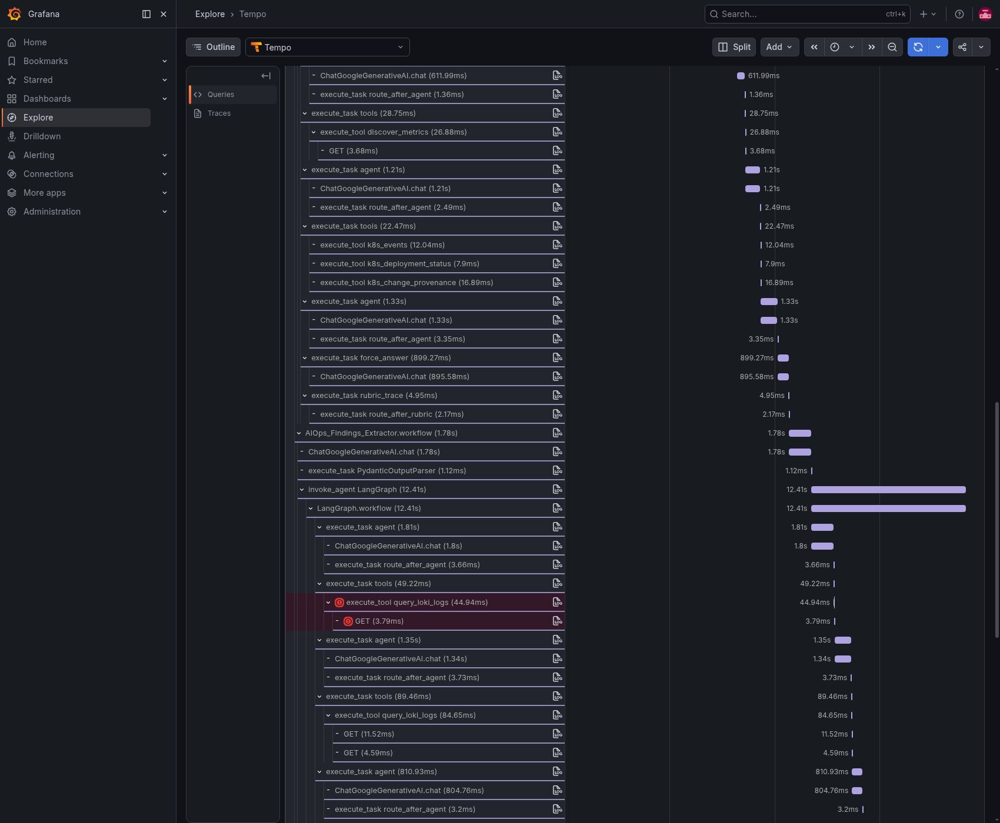

> `/healthz` 說它活著
> `/todo` 裡躺著一筆信心 0.9 的答案
> 而那個答案，我剛好知道是錯的

Day33 已經用「我們下個系列見」收尾了，這篇不算在三十三天裡。程式碼在範例 repo [`OTel_AIOps_Agent`](https://github.com/tedmax100/OTel_AIOps_Agent) 的 [`ironman-2026/day34/`](https://github.com/tedmax100/OTel_AIOps_Agent/tree/main/ironman-2026/day34)。

## 一筆還沒標記的案子

寫這篇的時候我對著這隻 agent 的 `/chat` 隨口問了一句「order-service 最近的延遲是不是變高了」，純粹想拿真數字。回頭看 `/todo`，這次調查躺在「待標記」清單裡，內容是這樣的（真實輸出，直接貼）：

```json
{
  "fp": "day34-probe-1788529545",
  "service": "order-service",
  "confidence": 0.9,
  "answer": "order-service 目前的延遲表現穩定... p95 延遲維持在約 4.75 ms...",
  "sufficiency": {"sufficient": false,
    "checks": [
      {"name": "causal_roles", "passed": false,
       "detail": "observations speak to ['mechanism']; needs 2 distinct roles"}
    ]}
}
```

信心 0.9，講得斬釘截鐵。但那句「p95 維持在約 4.75 ms」，我一眼就認得。它背後那條 PromQL 是 `histogram_quantile(0.95, sum by (le) (rate(http_server_duration_milliseconds_bucket[5m])))`，而 `http_server_duration_milliseconds` 這個 histogram 用的是 auto-instrumentation 的預設桶，只要資料量集中在最小的那個桶裡，`histogram_quantile` 不管真實分佈長什麼樣，算出來的 p95 永遠收斂在同一個值。

這件事我在系列前面已經量過一次，構造出來的假象數值就是 **4.75**。這次它不是被我構造出來的，是這隻 agent 自己在真實環境裡撞上，而且用 0.9 的信心把它講給我聽。

系統自己的充分性判定（`sufficiency.sufficient`）確實抓到了問題，但抓到的理由是「因果角色不夠」，不是「這個數字是假的」，**判準攔住了它，但攔錯了理由**。而且這筆案子到現在都還沒有人標記對錯：它就安靜地躺在 `/todo` 裡，跟其他真的答對的調查長得一模一樣，都是一筆等著人按 Correct 或 Wrong 的紀錄。

如果我沒有先前就診斷過這個 histogram 桶的問題，這句話會被我照單全收。**這就是這篇要講的事：光是服務活著、`/healthz` 回 200，回答不出「它現在準不準」這件事。**

## `/healthz` 回答的是另一個問題

看一下這隻 agent 自己的健康檢查：

```python
@app.get("/healthz")
async def healthz():
    from .signals.actuation import actuation_verdict
    return {"ok": True, "store": store.describe(), "actuation": actuation_verdict()}
```

它比一般教學範例裡那句 `return {"status": "ok"}` 講究一些，會帶上「現在讀的是哪個 store」跟「治理平面的憑證還動不動得了」，都是系列前面撞過真的坑之後才補上的欄位。但它回答的問題從頭到尾都是「這個程序活著嗎、它的地基穩不穩」，不是「它剛剛給的答案對不對」。這兩件事之間，有一整層東西是 `/healthz` 天生看不到的。



會不會答錯，跟服務會不會當機，是兩條幾乎不相關的曲線。這隻 agent 三十三天裡從沒當過機，但前面那個 4.75 的案例證明它照樣可以帶著高信心講錯話。

## 拿現成的「七維度」框架，一格一格對真實系統核對

監控 LLM agent 常見的說法，是把傳統指標之外再盯七件事：成功率、工具錯誤率、延遲、成本、token、記憶命中率、幻覺率。這個清單本身沒問題，問題是**每一項在真實系統裡有沒有真的被量到，量到的東西是不是量對了**。拿這隻 agent 現在的狀態一格一格核對：

| 維度 | 這隻 agent 現在的狀態 |
| --- | --- |
| 工具錯誤率 | 有，`aiops.tool.calls` 按 `disposition` 拆（見下） |
| 延遲 | 有 metric，但預設桶讓 p95 失真（見下） |
| Token / 成本 | 有 token，沒有 $，自動儀器化只給 token，價目表要自己接 |
| 成功率 | 沒有直接的完成率，只有更嚴格的充分性判定，兩者不是同一件事 |
| 記憶命中率 | 完全沒量，`case_memory.py` 沒有掛任何 metric |
| 幻覺率 | 沒有一個叫這個名字的數字，但有一套更慢、更嚴謹的替代（校準曲線） |

**工具錯誤率**是這幾格裡做得最紮實的一個。`aiops.tool.calls` 這個 counter 按 `disposition` 分四種狀態：`observed` / `empty` / `error` / `truncated`。單看 `/chat` 那兩次探測，空手率是 33%；這個數字比單純的 HTTP 錯誤率有用，因為三次查詢全部回 200，差別完全藏在 response body 裡，`disposition` 是唯一把它翻出來的維度。

`/chat` 只會開 counter，不會開 `aiops.investigation` 那個 span（下一段解釋原因），所以只跑這兩次探測，dashboard 左上「一次調查的形狀」那排全部是空的。為了讓截圖真的長出完整的樣子，我又對著這隻 agent 直接補跑了兩次背景告警觸發的 headless 調查（`payment-service`、`order-service` 各一次，用構造出來的 alert payload 觸發，不是真的事故，這件事誠實講清楚）。這是疊上這兩次之後、`aiops-agent-perf` 這張 dashboard 真的長這樣的截圖：



左上那排現在全部有數字：調查次數 2、證據充足率 100%、p95 時長 48.8 秒、平均 pivot 2.5 次、平均信心只有 0.45。這個信心數字不是我編的，是這兩次真的調查各自算出來的（payment-service 那次 0.30、order-service 那次 0.60，平均剛好 0.45）。

payment-service 那次的過程比數字有意思。它一開始把原因怪到 `v2.5.0` 這個版本上，但 `k8s_change_provenance` 那支工具查出「這次 rollout 沒動過 pod template」，內建的 rubric 判定當場攔下來重跑，log 裡真的印著 `rubric: answer blames a version the cluster cleared — retrying`，連續攔了兩次，第三輪才把結論改成「是掛載的 ConfigMap，不是版本」。三次 pivot，就是這樣被榨出來的。**信心 0.45 看起來不高，但它是「講錯話被攔下來重講」換來的分數，比一次就講對、卻沒人攔的 0.9 更值得信任。**

空手率也從單看 `/chat` 的 33% 變成兩條路徑疊起來的 58%，因為 headless 那兩次調查動用了更多工具（`k8s_deployment_status`、`k8s_events`、`query_loki_logs`、`query_tempo_traces`、`github_compare`），有的查到、有的落空，甚至有三次工具呼叫連名字都沒留下、直接被分類成 `unknown` 的 `error`。這也是誠實的一部分：這篇核對到這裡才發現，這隻 agent 偶爾會有工具呼叫連自己的名字都沒能記錄下來就先出錯了，這件事本身也還沒被我修。

最下面那張 trace 表格更直接：一筆真的 `aiops.investigation` span，時長 32.0 秒，點進 trace ID 可以看到整棵樹。**同一張 dashboard 上，`/chat` 貢獻了空手率跟 disposition 圓餅圖裡的一部分，headless 貢獻了左上那五格跟這筆 trace**，兩條路徑各自留下自己那部分的痕跡，剛好對出這隻 agent 兩條路徑的遙測落差長什麼樣。

## 點進那棵樹：LangGraph 的 node 長什麼樣子

前面一直在講 metric，但「點進去看整棵樹」這句話值得真的點進去一次。這是 payment-service 那筆 3-pivot 調查（trace ID `7aae4a19...`）攤開來的樣子：


這棵樹跟這系列前面畫過的 LangGraph 架構圖（`agent` / `tools` / `rubric_trace` 三個 node，外加一個 `force_answer`，中間用 `route_after_agent`／`route_after_rubric` 兩個條件邊決定走向）完全對得上，只是這次不是畫出來的，是 auto-instrumentation 真的記下來的：

- **`invoke_agent LangGraph` → `LangGraph.workflow`**：整個 graph 執行的外層兩層 span，GenAI semconv 自己就會生，不用我補。
- **`execute_task agent`**：對應 `agent` 這個 node，底下掛著 `ChatGoogleGenerativeAI.chat`，這才是真正打模型的那一步，這次呼叫花了 6.89 秒。
- **`execute_task route_after_agent`**：`add_conditional_edges` 那個判斷函式本身也開了 span，決定接下來是要呼叫工具、還是要走 `rubric_trace`。
- **`execute_task tools`**：真的伸手去查資料的地方，底下每個 `execute_tool <名字>` 就是一次工具呼叫（`query_prometheus`、`query_loki_logs`、`discover_metrics`、`k8s_events`、`k8s_deployment_status`、`k8s_change_provenance`），再底下的 `GET` 才是 httpx 打去 Prometheus/Loki/Tempo/K8s API 的那次 HTTP 請求。**`disposition` 這個維度就是從這一層的回應內容判斷出來的，樹上看不出 empty 還是 observed，要看 span 的 attribute。**
- **`execute_task rubric_trace` → `route_after_rubric`**：這是判斷「這次結論站不站得住腳」的那一步，判定不通過就繞回 `agent` 重跑，圖裡這個迴圈總共繞了三次，對應到前面提過的 3 次 pivot。

第二輪那次呼叫特別花時間（`execute_task agent (615.18ms)` 那格底下的工具呼叫），因為它同時打了 `query_prometheus`、`query_loki_logs`、`discover_metrics` 三支工具，而且是在第一輪被 rubric 打回票之後才補的。**這張圖回答了前面那句「三次 pivot 是這樣被榨出來的」到底是什麼意思：每一次 pivot 就是樹上多長出一整組 `agent → tools → rubric_trace` 的分支。**

繼續往下捲，會看到這棵樹裡還藏著一個真實的 `error`：



紅色那格是 `execute_tool query_loki_logs`，底下的 `GET` 也是紅的，這是一次真的失敗，不是我編出來示範用的。往上一點還看得到 `execute_task force_answer`：這是第四個 LangGraph node，工具呼叫預算用完、或是 pivot 次數到頂的時候，圖會被強制導去這個 node 逼它給出一個結論，不管 rubric 滿不滿意。**同一棵樹裡同時看得到「哪一步在跟 LLM 對話」「哪一步在跟真實系統對話」「哪一步在幫前兩者打分數」「哪一步是逼不出更好答案時的最後一道防線」，這是 metric 面板做不到的事。metric 告訴你這次調查平均花了多久、pivot 了幾次，trace 告訴你那幾次 pivot 具體卡在哪裡。**

**延遲**這格是這次核對過程裡最意外的收穫。`gen_ai.client.operation.duration` 這個 metric 是 GenAI auto-instrumentation 自動給的，理論上不用我自己補，但把真實的桶拉出來看：

```
le=0      count=0
le=5      count=12
le=10     count=12
...
le=+Inf   count=12
```

十二次 LLM 呼叫全部落在 `(0, 5]` 這一個桶裡。`histogram_quantile(0.95, ...)` 對著只有一個桶有樣本的分佈做線性內插，算出來是 `0.95 × 5 = 4.75`。而我從 Tempo 上把這幾次呼叫真正的 span 時長挖出來，十三筆分別是 `1.78 / 1.13 / 0.74 / 1.05 / 1.88 / 1.51 / 1.08 / 1.17 / 1.16 / 0.72 / 1.15 / 1.74 / 0.34` 秒，真正的 p95 大概落在 1.8 秒附近。

**面板上寫的 4.75，是真實 p95 的兩倍半以上**，不是因為系統變慢了，是因為 OTel SDK 給的預設桶邊界（`0, 5, 10, 25, 50...`）對這種次秒級的呼叫太粗，樣本全擠在最窄的那個桶裡，`histogram_quantile` 在裡面猜一個數字出來，猜出來的東西看起來很精確，其實只是內插公式的副產品。這跟前面那個 `http_server_duration` 的 4.75 是同一個病，只是這次病灶換了一個 metric。

> 兩個地方各自撞出同一個數字，我第一次看到的時候還以為自己複製貼上錯了。
> 後來才想通：只要「真實分佈全擠在第一個桶裡」這個前提成立，任何一個用預設桶的 histogram 都會吐出同一種形狀的假象，數字不是巧合，是這個 bug 家族的共同症狀。

**Token 有，成本沒有。** `gen_ai.client.token.usage` 這個 metric 是真的，這次探測疊出來輸入 56652、輸出 1073。但這隻是 token 數，不是錢。要把它換算成美金，得知道 `gemini-3.1-flash-lite` 這個 response model 當下的計費費率，而費率不是遙測系統該知道的東西，是要另外接一張價目表進來的。**很多團隊把「有 token metric」直接等同「有成本監控」，中間其實還隔著一層沒人做的轉換。**

**「成功率」跟這隻系統實際在做的事，根本不是同一個問題。** 一般監控會問「這次請求有沒有正常跑完、沒有拋例外」，這隻 agent 確實有這個數字（`aiops.investigation.duration` 上的 `error.type` 標記）。但它同時在問一個嚴格得多的問題：**這次調查有沒有足夠的證據撐得住它的結論**，也就是上面那個 `sufficiency` 判定。前面那筆 order-service 的案子，`error.type` 是乾淨的（它沒有拋例外，跑完了），但 `sufficiency.sufficient` 是 `false`。**一個技術上成功的請求，可以同時是一個證據不足的結論**，這兩者混在一起看的話，「成功率 99%」這種數字反而會把真正該注意的東西蓋掉。

**記憶命中率**是核對完全落空的一格。`case_memory.py` 裡確實有 `inv_query_similar` 這支函式，過去事故庫的召回也接進了 agent 的推理，但這條路徑上沒有掛任何 metric，命中了幾次、命中的案子後來被標記對還是錯，這些數字現在完全不存在。**這是一個誠實的缺口，不是我這篇順手補上的東西**，留在這裡當一個待辦。

**幻覺率沒有這個名字的數字，但有一套更嚴謹、也更慢的東西頂著它。** 這隻 agent 不是靠一個模糊的百分比在防幻覺，是靠人工標記 correct/wrong 之後餵進一條校準曲線。`governance._calibration_verdict()` 檢查的是「平均信心有沒有系統性高估」（overconfidence）、「AUTO 真正會用到的那個信心區間裡準確率夠不夠」，這兩個條件同時成立，自治的閘門才會開。這比「幻覺率 3%」這種單一數字嚴謹得多，代價是它需要人持續標記，而且是週級、不是秒級的訊號。前面那筆 order-service 案子如果沒有人去按 Correct 或 Wrong，它就只是一筆躺在那裡的原始資料，不會自動變成校準曲線上的一個點。**幻覺率這格的真正差距不是「沒有數字」，是「有沒有人在填那個數字」。**

## 分級：哪些數字要在面板上閃紅燈，哪些只能觀察

把這七格核對完一輪之後，能不能告警其實跟它多快能被人正確解讀直接相關。工具錯誤率、延遲這種有 Prometheus counter/histogram 撐著的，可以直接掛閾值告警；但像上面那個延遲 p95 的假象，如果直接對著 4.75 這個數字設告警閾值，閃紅燈的時機會完全跟真實延遲脫鉤。**告警閾值設在一個本身就失真的數字上，比沒有告警更危險，因為它會製造一種「有在盯」的錯覺**。

信心與充分性這類數字更適合走觀察而不是即時告警：`sufficiency.sufficient=false` 這件事本身不代表出事，可能只是這次問題問得比較模糊；但如果一整週的調查裡這個比例持續偏高，那就值得回頭看是不是哪個工具的資料源出了問題。而校準曲線這種需要人工標記才能算出來的東西，本來就是週級的訊號，硬要塞進秒級告警只會逼人隨便按一按了事。

## 總結

總結來說，這篇沒有蓋出新機制，做的事情是把「監控 agent 要盯哪些維度」這個常見框架，一格一格拿現有系統的真實輸出去對帳。核對完的結果不是全部打勾：工具錯誤率跟延遲確實有數字撐著，但延遲那個數字本身還帶著一個活的 bug；token 有、成本沒有；記憶命中率整格是空的；幻覺率沒有那個名字的指標，換來的是一套更嚴謹但也更依賴人的替代方案。**「監控了七個維度」跟「這七個維度量出來的東西真的可信」，中間永遠隔著一層要親自核對的工。**

> 那筆 order-service 的案子，我等一下要回去點 Wrong，順手把 `causal_roles` 那個判準能不能順便抓出 histogram 桶太粗這件事記一筆待辦。
> 這篇本來是想寫監控框架，寫到最後變成又抓到一個新地方在犯老毛病 XD
