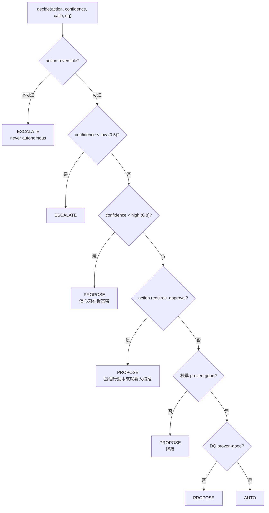

# Day35：自主權是掙來的，但要先確認那把鎖真的裝在門上

> 那個模組的 docstring 寫得很好
> 講的是自主權要靠校準紀錄換
> 而我今天量出來的是
> 那段判斷從來沒有改變過任何一次結果

昨天把 `action_requests.py` 的狀態機撞了一輪，結論是提案之後那段路只有在有人按的時候才會動。今天往上游走一格，看那些提案是怎麼被算出來的：`governance.py`，那個決定「這個行動可以讓 agent 自己做、還是得先問人」的地方。

程式碼在範例 repo [`OTel_AIOps_Agent`](https://github.com/tedmax100/OTel_AIOps_Agent) 的 [`ironman-2026/day35/`](https://github.com/tedmax100/OTel_AIOps_Agent/tree/main/ironman-2026/day35)。跟昨天一樣，不需要叢集、不需要 LLM，一支腳本跑完。

## 為什麼「信心 0.9」不足以決定任何事

先講這個模組想解決的問題。agent 跑完一次調查，findings 上面帶一個 `confidence`，比方說 0.9。這個數字是它自己寫的。Day30 那次實測裡它在自己的推論裡寫著「沒有找到反證」，然後給了 1.0，我當時看到那份報告的反應是想笑又笑不太出來。

所以問題不是「它有多有信心」，是**它過去說 0.9 的時候，實際上對了幾成**。這個東西在 ARE（Agentic Reliability Engineering，代理式可靠性工程）裡叫 `校準`（calibration，白話點講就是「這隻 agent 的嘴巴跟它的手對不對得上」），而書裡 §6.2 的第一條約束講得很硬：自主權是掙來的、而且是可以被收回的，而掙的憑據不能是它自己給自己打的分數。

`governance.py` 的 docstring 把這件事翻成三個層級：

- `AUTO`：政策允許自己執行（後面還有一道總開關）
- `PROPOSE`：算出來給人看，人按了才算數
- `ESCALATE`：連按鈕都不要生，直接交回給人

聽起來很清楚。今天要確認的是這三個層級在**目前這個 repo 裡**實際上怎麼分佈。

## 逐條讀那個判斷

`decide()` 整個函式的判斷順序是這樣，順序本身就是設計：



硬性安全規則排在最前面：不可逆的行動不管信心多高都是 ESCALATE，這條在 `confidence` 之前就決定了。之後才是信心分帶，最後那三格才是「掙來的自主權」那一段。

要注意的是圖裡 `action.requires_approval?` 那一格的位置。它在校準那兩格**上面**。這個排法本身沒有錯，一個標記成需要人核准的行動，本來就不該因為 agent 最近表現不錯就變成自動的。但它有一個副作用，等一下量出來會很直接。

> 這種「排在前面的檢查會讓後面的檢查失去意義」的形狀，其實跟 Day12 那個 policy 只比對名字前綴是同一類東西：不是邏輯錯，是這條路上根本走不到後面那些判斷，而程式碼看起來仍然完整。

## 現有的測試在測什麼

`test_governance.py` 有十幾條測試，涵蓋率上看每個分支都有人走過：不可逆會 ESCALATE、低信心會 ESCALATE、中信心 PROPOSE、高信心加好校準會 AUTO、校準過度自信會降回 PROPOSE。看起來很完整。

但每一條測試用的都是這個東西：

```python
def _spec(reversible=True, requires_approval=False, name="k8s.test"):
    return ActionSpec(
        name=name, description="d", reversible=reversible, requires_approval=requires_approval
    )
```

`requires_approval` 預設是 `False`。而註冊表裡真的存在的行動，兩個都是 `True`。

昨天那句話今天可以原封不動再用一次：這證明了意圖，沒有證明機制。

## 四個探測

一樣寫了一支腳本，`probe_governance.py`，用暫存 SQLite 檔跟真的模組，把註冊表裡真實存在的行動丟進 `decide()` 掃一遍。

```bash
# 從 o11y-bench 主 repo 的根目錄跑
python3 ironman-2026/day35/probe_governance.py
```

先看它認得哪些行動，以及一份乾淨到不能再乾淨的校準紀錄：

```
[0] registered actions (2)
    k8s.rollout_undo   reversible=True requires_approval=True impl=wired
    k8s.scale          reversible=True requires_approval=True impl=wired

[baseline] 25 grader labels, overconfidence -0.1 — every calibration gate satisfied
```

25 筆非自我標註、過度自信是負的（也就是它比實際表現還保守），這份紀錄過得了所有校準檢查。接著拿它去掃信心值：

```
[1] the real registry
    k8s.rollout_undo   0.3->escalate 0.6->propose  0.9->propose  1.0->propose
    k8s.scale          0.3->escalate 0.6->propose  0.9->propose  1.0->propose

[2] the same actions with requires_approval flipped off
    k8s.rollout_undo   0.3->escalate 0.6->propose  0.9->auto     1.0->auto
    k8s.scale          0.3->escalate 0.6->propose  0.9->auto     1.0->auto
```

兩排的差別只有一個布林值。**在目前註冊的行動上，`AUTO` 這個層級是到不了的，而擋住它的不是校準，是那個旗標。** [2] 那排把旗標翻掉之後 AUTO 立刻出現，同一份校準資料、同一個信心值，證明後面那幾格程式碼是活的、會動的，只是現實中沒有任何一個行動走得到那裡。

換句話說，這個模組最核心、docstring 花了半頁在講的那段校準判斷，在這個 repo 至今**沒有改變過任何一次結果**。它每次都會被算出來，算出來的字串也每次都被塞進 `Decision.calibration_note` 裡跟著提案跑，但決定去向的一直是上面那一格。

## 兩道校準門，跟唯一真的裝好的那把鎖

前面講的是壞消息，這一段是好消息。校準那格內部其實有兩道門，`_calibration_verdict()` 依序檢查：

```python
labeled = calib.get("labeled") or 0
if labeled < settings.governance_min_labeled_runs:      # 20
    return False, f"calibration unproven ({labeled} labeled run(s) < 20); autonomy withheld"

if human_labeled is not None and human_labeled < settings.governance_min_human_labeled_runs:  # 20
    return False, (f"insufficient human/grader labels ({human_labeled} < 20); "
                   "self-produced labels cannot unlock AUTO")
```

第一道問「總共有幾筆標註」，第二道問「其中有幾筆不是它自己標的」。第二道那個 `human_labeled` 來自 `store.cal_count_by_source(exclude_sources=_SELF_LABEL_SOURCES)`，而那個常數只排除兩個來源：

```python
_SELF_LABEL_SOURCES = ("remediation-verified", "remediation-failed")
```

這兩個來源是 `execution.py` 執行完之後自己回頭驗證的結果。也就是說，agent 修完之後自己去查一下說「嗯我修好了」，這筆紀錄進得了資料庫、算得進總數，但解不開自主權。探測三就是在量這件事：

```
[3] self-produced labels vs grader labels, at confidence 0.9
    after 25 x remediation-verified  labeled=25  non-self=0
        -> propose  insufficient human/grader labels (0 < 20); self-produced labels cannot unlock AUTO
    after 20 x grader                labeled=45  non-self=20
        -> auto     calibration ok (overconfidence -0.1, 45 runs)
```

25 筆自我標註，第一道門過了（25 ≥ 20），第二道門把它擋下來。再灌 20 筆 grader 標註進去，同一個信心值、同一個行動，判斷才變成 AUTO。這是 ARE §6.2 第一條約束最字面的一行程式碼，而且它是今天所有探測裡唯一一個「機制真的裝好了、而且真的會擋」的東西。

> 我還是把它寫出來會比較誠實：這兩個門檻都是 20，而 20 是設定檔裡的一個地板數字，不是統計上「夠了」的數字。20 筆全部集中在信心 0.9 那一格，跟 20 筆散在各個信心區間，能講的話完全不一樣。

順帶一個小發現。過度自信那道檢查寫的是 `if overconf > settings.governance_max_overconfidence`，所以負的一路通行。我上面那份 baseline 的 `-0.1` 就是這樣過的：信心都寫 0.9、實際上全對，是`低估自己`。這在安全性上沒問題（保守不會闖禍），但一隻永遠說 0.3、實際上都對的 agent，會拿著滿分的校準成績單走到 AUTO 那格，而它的信心數字對值班的人來說一點資訊都沒有。

## 那，現在按下去會發生什麼

這是我今天最想回答的一句話。探測四直接讀真實的那個 store：

```
[4] the real store, right now
    recorded=0 labeled=0 non-self=0 overconfidence=None
    k8s.rollout_undo   -> propose  high confidence but action is approval-gated
                          calibration unproven (0 labeled run(s) < 20); autonomy withheld
    k8s.scale          -> propose  high confidence but action is approval-gated
                          calibration unproven (0 labeled run(s) < 20); autonomy withheld
```

答案是 PROPOSE，而且是三道各自獨立的鎖同時鎖著：


這三道鎖沒有一道是多餘的，但它們疊在一起造成一個實際的問題：**現在這個系統告訴你「不行」的理由，跟你以為的理由不是同一個。**

看那兩行輸出，`reason` 說的是「approval-gated」，`calibration_note` 說的是「unproven」。同一列紀錄上兩句話、兩個原因。如果明天我把標註灌到 20 筆、校準也漂亮，這兩行的第二句會變綠，第一句不會，結果一模一樣還是 PROPOSE。反過來說，如果有人為了「讓自動化跑起來」去把 `requires_approval` 改成 `False`，他會發現還是 PROPOSE，然後很可能繼續往下改。

## 誰有資格說「這個行動可以自動做」

平台工程的角度今天有一個很具體的形狀：`requires_approval` 是掛在**行動**上的，不是掛在（行動、目標）這一對上的。

`k8s.rollout_undo` 這個行動，用在 demo namespace 裡一個三副本的無狀態服務上，跟用在 payment 上，在註冊表裡是同一格、同一個布林值。而真正跟目標有關的風險判斷不在這裡，它在 `blast_radius.py`（namespace 白名單、影響 pod 數上限、單副本拒絕），那是另一個平面、另一個時間點的檢查。

所以現在的分工是：行動的性質歸平台團隊（誰能改註冊表誰就決定），爆炸半徑歸執行前的政策，而「payment 這個服務願意讓 agent 自動做到哪一級」這件事，repo 裡仍然沒有地方可以寫。昨天講狀態機的時候提過一次，今天從另一邊又撞到同一個缺口。

這個缺口的代價是可以預期的：一旦哪天真的要讓某一個低風險的場景自動跑，唯一的做法是把註冊表裡那個旗標翻掉，而那一翻是**全域的**。paved road 的重點從來不是只有一條路，是預設那條最好走、要走別條得自己說明理由；現在這裡連別條路的入口都沒有，只有一個總開關。

還有一個比較小、但會慢慢變麻煩的東西。`decide()` 在 `confidence >= high` 的時候就會去打一次資料庫拿 `human_labeled`，而這一次查詢發生在 `requires_approval` 那格判斷**之前**。以現在的狀況來說，每一個高信心提案都會查一次資料庫，然後把結果丟掉，因為判斷早就被上面那格決定了。

## 今天沒做的事

- **三道鎖一道都沒開。** 這天的目的是把「按下去會發生什麼」講清楚，不是讓它變成 AUTO。開哪一道、憑什麼開，得先有標註數字。
- **`requires_approval` 的每服務分級沒有做。** 今天只寫出這個缺口的形狀，沒有設計它該長怎樣，那牽涉到誰擁有那份設定。
- **`reason` 跟 `calibration_note` 兩句話打架這件事沒改。** 跟昨天那個 409 把三種原因擠成一句一樣，只講不動。
- **腳本一樣不是測試。** `probe_governance.py` 印東西給人看，沒有斷言，也沒有進 `tests/`。真正該補的是一條「拿註冊表裡真的存在的行動去走 AUTO 那條路」的測試，那條測試現在會告訴你到不了。
- **低估自己那一側沒有檢查。** 只寫在文章裡，`_calibration_verdict` 沒動。
- **DQ（data quality）那格今天完全沒碰。** 它排在校準後面，而校準那格現在都走不到。

## 小結

總結來說，今天做的事情是把一個模組的 docstring 跟它的實際效果對了一次帳，結果是那段最重要的邏輯是活的、正確的、有測試的，但在真實的註冊表上從來沒有被評估到。而唯一真的在擋人的那道門，是「自己說自己修好了不算數」那一條，它擋得乾淨俐落。

這也把接下來要做的事情收斂成一件很具體的東西：那個 `non-self=0` 得變成一個大於 20 的數字，而且不是靠 agent 自己標的。在那之前，校準曲線、過度自信、自主權階梯，講起來都還是設計稿。

> 寫這篇的時候我原本準備了一段「來看看校準門怎麼把它擋下來」的示範，跑完探測一才發現根本輪不到那道門上場。
> 這系列到現在最常做的事，好像就是把自己前一天寫好的講稿撕掉 XD
