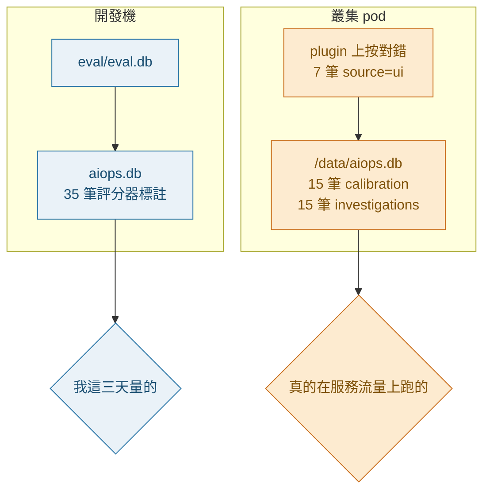
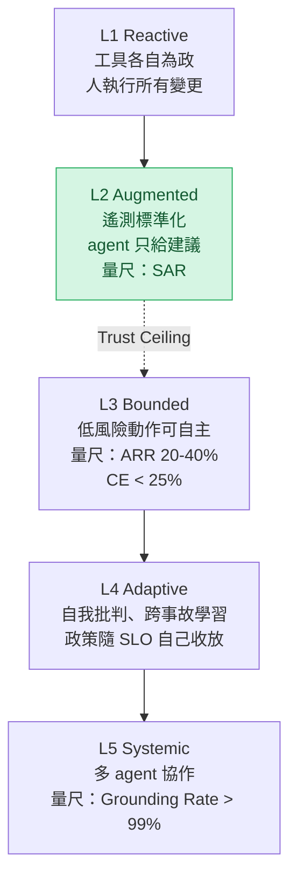
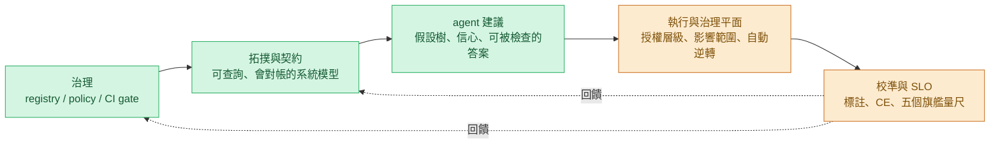

# Day35：階梯上的位置，跟一份七筆的人工標註

> 這三十四天做出來的東西
> 有一半的價值不在它能做什麼
> 在它終於算得出自己現在幾分
> 而算出來的數字沒有一個好看

昨天蓋了一座只改名字的孿生環境，量出「我手上這份知識屬不屬於這裡」是 1.0 對 0.0，也讓那句「治理是環境的函數」第一次會改變治理判決。今天是最後一天，做的事情是驗收：把那本書給的五個量尺拿出來，對著這座系統自己的資料算一次，然後在成熟度階梯上標出真正的位置。

程式碼在範例 repo [`OTel_AIOps_Agent`](https://github.com/tedmax100/OTel_AIOps_Agent) 的 [`ironman-2026/day35/`](https://github.com/tedmax100/OTel_AIOps_Agent/tree/main/ironman-2026/day35)。今天全部唯讀，跑的是從叢集裡撈出來的一份資料庫快照，不需要叢集也不需要 LLM（Large Language Model，大型語言模型）。

## 開場先修一個我這三天都搞錯的東西

打算算 SLO（Service Level Objective，服務水準目標）之前先確認資料在哪，結果第一步就撞到事情。

前面幾天我一直在講「標註只有 35 筆」「過去事故庫是 0 筆」，那些數字都是對著開發機上那份 `aiops.db` 量的。今天把叢集裡那顆 pod 掛的 `/data/aiops.db` 撈出來並排一看：

```
[1] the same schema, two stores, two different histories
  table              dev (aiops.db)    cluster /data
  calibration                    35               15
  investigations                  0               15
  action_requests                 0               13
  executions                      0                1
  audit                           0               28
  cluster labels by source: ui=7
  cluster non-self labels: 7   (Day31 measured this as 0 on the dev store)
```

兩件事情要更正。第一，`investigations` 那張表在叢集裡有 15 筆，不是 0，所以那個 JOIN 撈不到東西的結論只在開發機上成立。第二個更痛：`cluster non-self labels: 7`。那七筆的 `source` 是 `ui`，也就是有人真的在 plugin 頁面上按過對錯，時間全部落在 6 月 22 號那個下午。

我為了湊出「第一批非自我標註」花了整整一天去接評分器，而叢集裡一直躺著七筆真人按出來的標註。它們沒有被我看到的理由很單純：兩份資料庫檔名一樣、schema 一樣、程式碼一樣，只有掛載路徑不一樣。



而這個發現底下還藏了一顆更難看的地雷。前幾天為了分辨「這筆 `correct` 在回答哪個問題」，我在 calibration 表上加了一個 `grading_mode` 欄位，而且刻意做成 NULL 不匹配任何篩選（不知道就不算）。那些加欄位的 `ALTER TABLE` 是開連線時自動跑的，叢集裡的 image 比程式碼舊，所以那個欄位在叢集那份資料庫上還不存在：

```
[2] the column the cluster has not seen yet
  cluster calibration.grading_mode present: False
  gate reads modes=('culprit',) (NULL never matches — fail-closed on unknowns)
  after migration, grading_mode present: True
  labeled rows: 7   eligible for the curve after: 0
```

第四行是我把快照複製一份、用現在的程式碼開一次連線之後量到的。**新 image 上線的那一秒，那七筆唯一的真人標註會變成 0 筆算數的。** 那個 fail-closed 的設計我到今天還是覺得是對的，但它套在一份已經存在的資料上，效果是把歷史全部作廢，而且不會有任何一行 log 講這件事。

## 修它：一行 UPDATE，換到一張七筆的可靠度圖

這個要修其實很簡單，而且它值得單獨拆一段，因為它是一個很典型的遷移錯誤：**加欄位的遷移寫了，填欄位的那半沒寫。**

`grading_mode` 的 NULL 語意是「不知道這筆的 `correct` 在回答哪個問題」，而叢集那七筆的模式**其實是知道的**：它們來自 plugin 上那顆對／錯按鈕，按的對象是一份指名了兇手的 RCA（Root Cause Analysis，根因分析），那就是 `culprit` 這種評分。所以正確的遷移不是只加欄位，是加欄位的同時把已知的填進去，剩下真的不知道的才留 NULL。

```bash
# 從 o11y-bench 主 repo 的根目錄跑，預設是對複製出來的一份做乾跑
python3 ironman-2026/day35/fix_grading_mode.py
```

```
[1] before
  as it stands
    labeled=0 non-self=0 ece=None overconfidence=None
    gate: propose  calibration unproven (0 labeled run(s) < 20); autonomy withheld

[2] backfill grading_mode='culprit' for labeled rows from ('ui',)
  rows updated: 7

[3] after
  with the known modes filled in
    labeled=7 non-self=7 ece=0.5643 overconfidence=0.3929
    gate: propose  calibration unproven (7 labeled run(s) < 20); autonomy withheld
```

`labeled` 從 0 變 7，關卡那句話也從「0 筆」變成「7 筆，還差 13 筆」。兩句都是紅燈、都是保留自主權，但第二句是可以靠做事解決的，第一句是把資料丟掉之後的紅燈。這個差別跟前幾天那個「還沒量夠」跟「量完了不該信」的差別是同一件事，只是往前挪了一層：**先確定資料還在，再去談它夠不夠。**

修完之後才第一次看得到那七筆真人標註畫出來的形狀：

```
  reliability diagram over the labels that now count
    band        n    stated   actual   gap
    [0.2,0.3)   2    0.2      0.5      0.3
    [0.8,0.9)   3    0.8167   0.0      0.8167
    [0.9,1.0)   2    0.95     0.5      0.45
```

中間那一列是今天最該記住的一行。三筆講 0.82 的判斷，人回頭看的結論是**三次全錯**。而 0.8 正是 `governance_conf_high`，也就是走向自主執行那條路的門檻。前幾天用評分器那批資料算的時候，這一格是「說 0.8、只對一半」，換成真人標註之後它變成三次全錯。兩批資料在同一格上指著同一個方向，只是真人那批更難看。

七筆下不了結論，這點沒有變。但它現在是一個可以累積的紅燈，而不是一個被自己的遷移擦掉的空表。

> 我原本以為最後一天要寫的是「量出來的分數」。
> 結果最後一天做的是把前三天量錯的資料接回來，然後那批資料講的話比我原本要寫的結論兇 XD

## 五個旗艦 SLO，一個一個算

那本書（[《代理式可靠性工程》（Agentic Reliability Engineering，簡稱 ARE）](https://learning.oreilly.com/library/view/agentic-reliability-engineering/0642572294809/)，3.6 那節）挑了五個量尺，說這五個是承重的，其他都是從這五個推出來的，而且要一起讀才有意義。它的理由很實際：一個團隊如果拿十五個 SLO 在運作，實際上等於沒有在運作任何一個。

先把定義寫清楚，再看這座系統各自量到什麼：

| SLO                                           | 問的問題                             | 公式                                  | 這座系統                   |
| --------------------------------------------- | ------------------------------------ | ------------------------------------- | -------------------------- |
| ARR（Autonomous Resolution Rate，自主解決率） | 它多常願意自己收掉一個事故           | 自主解決的事故 / 偵測到的事故         | 0 / 3 = 0%                 |
| DQ-SLO（Decision Quality，決策品質）          | 它動手的時候對不對                   | 成功的自主決策 / 全部自主決策         | 0 / 0，算不出來            |
| RL-SLO（Reasoning Latency，推理延遲）         | 從偵測到做出決定要多久               | 決策時間 − 偵測時間                  | n=11，但 8 筆是假的        |
| AE-SLO（Action Effectiveness，行動有效性）    | 動作有沒有真的達到目的、有沒有副作用 | 有效的復原 / 全部復原                 | 0 / 1 = 0%                 |
| CE（Calibration Error，校準誤差）             | 它講的信心跟實際結果差多少           | 分箱之後\|信心 − 實際正確率\| 的平均 | 叢集 0.5643、開發機 0.1743 |

跑出來長這樣：

```bash
# 從 o11y-bench 主 repo 的根目錄跑
python3 ironman-2026/day35/slo_report.py
```

```
[3] the five flagships, over the cluster store
  ARR     autonomously resolved / detected incidents = 0 / 3 -> 0.0%
            (measurable, and it is a real 0: propose=13 — no request was ever raised at AUTO)
  DQ-SLO  successful autonomous decisions / autonomous decisions = 0 / 0 -> undefined (0 denominator)
            (not a measurement: the denominator is empty by construction)
  RL-SLO  decision_commit - startsAt, n=11: max 979s
            8 of them share one startsAt (a replayed alert body): 679-979s — that is my hand, not the system
            the 3 distinct alerts: 10s, 12s, 16s
  AE-SLO  effective recoveries / recoveries = 0 / 1 -> 0.0%
            (n=1, and the one failure was a 401 — it measures a credential, not an action)
  CE      cluster store: labeled=7 ece=0.5643 overconfidence=0.3929
            dev store:     labeled=35 ece=0.1743 overconfidence=-0.0029
            gate floor is 20 labeled runs — neither store answers the same question twice
```

五個數字，四種不同的沒用法，值得一個一個講。

ARR 是 0%，而這是一個真的 0。分母那個 3 是產生過提案的事故指紋數（沒走到提案的告警不在這份帳裡，這是我這支腳本的口徑，不是書的）。十三筆行動請求，`autonomy` 欄位全部是 `propose`，一筆 AUTO 都沒有。這不是「沒量到」，是治理平面每一次都判斷不該放手，而理由前幾天已經拆過了：信心夠高但動作標了 `requires_approval`，加上校準沒過。書裡說 30% 的 ARR 代表以人為主、agent 輔助，85% 代表真的做出了代理式運維。0% 代表這隻 agent 是純顧問。

DQ-SLO 算不出來，而且不是資料不夠，是分母結構上為空。沒有任何一次自主決策，就沒有「自主決策對不對」這個問題。書裡最有用的一句話是 ARR 跟 DQ-SLO 必須一起讀：高 ARR 配低 DQ-SLO 是不安全的自主，高 DQ-SLO 配低 ARR 是護欄綁太緊。我這個組合連被評的資格都還沒有。

**RL-SLO 是今天最好笑的一個。** 它量的是告警的 `startsAt` 到寫下決策之間隔多久，資料是現成的，算出來十一筆，最大值 979 秒。但把 `startsAt` 排一下就發現，其中八筆共用同一個時間戳，因為那是我當初手工存下來的一份告警 JSON，後來一路複製著重放。那八筆量到的不是系統反應多快，是我那天下午重放了幾次。真正不同告警的三筆是 10 秒、12 秒、16 秒。一個做對了的量測，跟一個量到自己的量測，在報表上長得一樣。

AE-SLO 是 0/1。唯一那次執行昨天回了 401，所以「有效的復原」是 0。但這個 0 沒有在講這個動作好不好用，它在講一張憑證。n=1 的比率不該被寫成百分比，我還是把它印出來，因為看到 `0.0%` 旁邊那個 `n=1` 才會記得它不能拿去開會。

CE 是唯一一個兩邊都算得出來的，而它給出兩個相反的結論。開發機那 35 筆評分器標註算出來的過度自信是 `-0.0029`（前幾天已經拆過，那是低估跟高估互相抵銷出來的），而叢集那 7 筆真人標註算出來是 `+0.3929`，ECE（Expected Calibration Error，期望校準誤差）0.5643。門檻是 0.1。**這座系統唯一有的真人標註，說法是這隻 agent 嚴重話說太滿。** 七筆當然不夠下結論，關卡現在給的也還是「還差 13 筆」那種紅燈，但方向跟評分器那批剛好相反這件事本身就是資訊。

> 值班的人不會問 ARR 是幾成，他會問「昨天那個建議準不準」。這五個量尺真正的用途不是給人看，是給治理平面當旋鈕：DQ-SLO 掉下來，信心門檻就該自己升上去。這件事現在還沒有任何自動連動，全部是我手動讀數字。

## 順手抓到的一個縮寫撞名

算 DQ-SLO 的時候翻了一下自己寫的程式碼，發現 `app/signals/dq.py` 的 docstring 寫著它是「ARE flagship SLO #2」，而它算的是 data quality，也就是宣告的拓撲跟實際呼叫圖對不對得上、上次對帳多久以前。書上的 flagship #2 是 Decision Quality，問的是「它動手的時候對不對」。

兩件都是真的該量的事，兩件也都真的用同一個縮寫。這個形狀在這系列出現過好幾次了，最早那次是一個 `status` 欄位多了一個值，後來是我自己寫的 `correct` 欄位在兩種評分模式下意思不一樣。今天輪到縮寫本身。差別是這次它還沒造成傷害，因為讀它的只有我一個人。

## 階梯上的位置：L2，而 L2 的量尺是壞的

書裡的成熟度模型有五級三個維度，維度是可觀測性、推理、授權，治理不算第四個維度，因為治理就是在 runtime 執行授權的那個機制。每一級的定義是「這三個維度上都必須成立什麼，這一級才能被安全地運作」。



六天前我猜這座系統在 L2，今天有數字之後，位置沒有變，但變得比較有內容：可觀測性那個維度其實已經摸到 L3 的門檻（拓撲圖可查詢、而且有在對帳），推理那個維度也接近 L3（多步、會分解問題、輸出結構化的候選行動），卡住的是授權。而授權卡住的原因不是程式碼，是證據。

L2 這一級有它專屬的量尺，叫 SAR（Suggestion Acceptance Rate，建議接受率）：人真的接受了多少比例的建議。書裡給的判讀很有意思，80% 以上代表這隻 agent 的推理值得聽，低於 60% 是在製造噪音，而高於 95% 反而代表它太保守，只講人本來就會做的事。

```
[4] Suggestion Acceptance Rate — the L2 gate metric (ARE 4.9)
  proposed=10, aborted=2, rollback_failed=1
  suggestions raised: 13   approved: 3   rejected: 0
  SAR = 23.1%
  actors who approved: day33-live, day33-live-2, nathan-smoke-test
  of the denominator, 10 expired without anyone opening them — SAR counts 'nobody looked' and 'a human said no' as the same event
```

23.1%，而這個數字一點都不能用。三個核准者全部是我在測試自己的東西，`rejected` 是 0（沒有人拒絕過任何建議，因為 plugin 上那顆按鈕還沒接起來），而分母裡有十筆是沒有人打開過的，它們的 TTL（Time To Live，存活時間）是 900 秒，全部早就過期，只是狀態機要有人來敲門才會把它們標成過期。

**SAR 把「人看過之後說不要」跟「沒有人看」算成同一件事。** 這兩件事對平台團隊的意義完全相反：前者是 agent 的推理品質問題，後者是介面問題，或者更難堪的，是根本沒有人在用。而書把 SAR 定成通往 L3 的門檻指標，也就是說如果我照著這個 23.1% 做決定，我會跑去改 prompt，而該修的是那顆按鈕。

至於再往上那一級，書裡把 L2 到 L3 那個交界叫`信任天花板`（Trust Ceiling），並且說這是整個模型最難的一段，難的不是 L4 到 L5。它的要求很硬：治理平面、行動契約、自動逆轉、被校準過的信心，四個必須**同時**到位，因為多數團隊帶著其中三個就去嘗試，然後第一次自主失敗剛好落在缺的那一個上面。

```
[5] the four L3 mechanisms (ARE 4.9: all four, simultaneously)
  governance plane, runtime-evaluated    13 decisions recorded, every one at PROPOSE; the kill switch has been ACTIONS_ENABLED=true in the deployment since 2026-06-22
  action contracts                       2 registered actions, both with reversible + requires_approval flags; dry_run abort=1, dry_run ok=2
  automatic reversal                     rollback fail=1
  calibrated confidence                  7 labeled runs in the cluster store vs a floor of 20
```

前三個有真實證據，而且證據是昨天那條軌跡給的：政策擋過一次單副本的回滾、乾跑算出過影響範圍、自動逆轉真的被觸發過（雖然它也 401 了）。第四個沒有。**這座系統缺的正好就是那一個，而它是四個裡面唯一不能靠寫程式補上的。**

> 舉個現實案例，我看過一個平台團隊把自動修復做得很完整，護欄、審核、稽核全齊，然後上線一年之後才發現產品團隊從來沒有點開過那個頁面。那個系統的 SAR 分母有幾千筆，分子是十幾筆。這種我只能說「很棒！」，因為每一個零件都是對的 XD

## 那自主權是什麼的函數

Series 1 最後一天量到一件事：同一組題目，帶著錯環境的治理資產考 3.5 分，完全不帶治理資產考 2.5 分，而為那座環境寫的第一版 agent 考 5.5 分。當時的結論是`治理是環境的函數`。那句話留下一個沒答的問題：那自主權呢，它是什麼的函數。

這七天做下來，答案很具體，而且有點無情：**自主權是標註數量跟校準誤差的函數。** 不是模型大小的函數，不是護欄數量的函數，也不是「我把治理平面寫得多完整」的函數。程式碼那一側六天前就寫完了，該紅的地方昨天也全部證明會紅，而現在擋著 AUTO 的東西只有兩個數字：標註筆數（叢集 7 筆、開發機 35 筆，門檻 20，而且要分得清楚哪些算數）跟過度自信（真人標註算出來 +0.39，容忍值 0.1）。

這兩個東西的共同點是它們都只能靠時間累積。標註要有人真的看過一次判斷然後說對或錯，校準曲線要有足夠多不同信心區間的紀錄才畫得出形狀。買不到，也沒辦法靠寫程式繞過去，唯一能做的是把產生標註這件事的成本壓低，讓它在日常工作裡自然發生，而不是排一天專門去補。

從平台工程的角度，這句話其實是好消息。「自主權是掙來的」如果只是一句態度，它就會變成一場沒有終點的會議；而它一旦被寫成兩個有門檻的數字，它就變成一件可以排進 backlog 的工作，也變成產品團隊可以自己看的儀表板。誰擁有那個數字也就清楚了：平台團隊擁有門檻跟量法，服務團隊擁有那些標註，因為只有他們知道那次判斷對不對。

## 三十四天串起來的那條線

最後把整條因果鏈畫一次。這系列從第一天那隻拿了 4.5 分、對著空結果編數字的 agent 開始，每一階段做的事情其實都在同一條鏈上：



前三格是綠的，實際跑過、也被檢查過。後兩格是橘的，機制都在，但拿到的真實輸入少到不足以支撐結論。而那兩條虛線的回饋箭頭是這張圖裡最重要的東西，也是唯一一段目前完全靠我手動接起來的：CE 變差的時候，沒有任何機制會自己把信心門檻調高，也沒有任何機制會回頭說「拓撲對帳該重跑了」。書裡把政策能被 SLO 狀態反過來調整這件事放在 L4，現在看得出來為什麼。

這條鏈還有一個講法，是這三十四天真正的主張：**遙測的品質決定 agent 判斷的品質，而遙測的品質是治理做出來的。** 中間任何一環是靠人記得去做，這條鏈就斷在那裡，而斷掉的樣子通常不是報錯，是一個看起來很正常的數字。

## 今天沒做的事

- **兩份 store 沒有合併。** 那 7 筆真人標註跟 35 筆評分器標註要不要放在同一個池子裡算，是一個判斷題（來源、環境、評分模式都不一樣），不是搬資料的問題。我傾向不合併，理由跟 Series 1 最後一天那個結論一樣：那兩批標註量的是兩座環境上的事。
- **回填只補了這一次，沒有變成遷移的一部分。** 今天那支腳本是外掛的，下一個加上去的欄位會再踩一次同樣的坑，除非把「加欄位」跟「填已知的值」綁在同一個動作裡。
- **`grading_mode` 沒有辦法回頭認人工按的那批以外的東西。** 剩下 8 筆是沒標註過的，模式仍然是 NULL，而那是對的。
- **五個 SLO 沒有一個進儀表板。** 今天是一支腳本印文字，而書裡明確講這五個該跟服務的可用性、延遲放在同一頁，不要開一個「AI 指標」的專屬頁面。
- **`dq.py` 那個撞名的 docstring 沒改。** 改字很快，但要先決定 data quality 這件事在這套詞彙裡叫什麼。
- **SAR 的分母沒有修。** 「沒有人看過」要跟「人拒絕了」分開，那需要一個「被開啟過」的紀錄，而那要等 plugin 那頁真的有人用。

## 到手的三件事

最後一天總要清一次帳，所以先講真的換到手的東西，而它們都不是「agent 變強了」。

**這套系統第一次能講出自己現在幾分。** 五個旗艦 SLO 現在有取數的路徑，數字全部難看，但難看跟量不出來是兩件不同的事。三十四天前我對這隻 agent 的描述只能是「它今天怪怪的」，現在我能說 ARR 0%、真人標註上的過度自信 +0.39、說 0.82 的那三筆判斷回頭看是三次全錯。後面這三句是可以排工作的，前面那句不是。

**階梯上的位置從猜變成有證據。** 信任天花板要求四個機制同時到位，而其中三個現在都有真實軌跡當憑據：政策擋過一次單副本的回滾、乾跑算出 25→24 那兩個 pod、自動逆轉真的被觸發過（雖然它也 401 了）。缺的是被校準過的信心，而它是四個裡面唯一不能靠寫程式補上的。

**標註管線接到了對的那一邊。** 今天那行 UPDATE 讓叢集裡唯一的七筆真人標註不會在下次部署時被自己的 fail-closed 設計擦掉，而它們一進場就給出一個比任何結論都有用的形狀：決定要不要放手的那一格，正好是這隻 agent 最不可信的一格。

## 還缺什麼才敢叫完整的 AIOps

這一段照系統的層級寫，不照天數寫。上面那份「今天沒做的事」是這一天欠的，下面這些是這整套東西欠的。

- **Act 那一格從來沒有成功過一次。** `executions` 表只有一列，`success=0`，而那次失敗是 Kubernetes 回的 401。`execute → verify → settle window → 驗證失敗自動回滾` 的後半段至今沒有被真實輸入走過，而 ARR、DQ-SLO、AE-SLO 三個 SLO 全部卡在這裡：不是量不準，是分母是零。一個沒有成功執行過的自動修復系統，嚴格講目前只是一個提案系統。
- **學習迴圈只接上了管線，還沒有累積。** 42 筆標註來自三個 fixture，門檻的單位是 run 而真正該問的是獨立事故數，這兩個數字差一個數量級。更關鍵的是沒有任何機制讓 SLO 惡化自己收緊自主權：CE 上升的時候信心門檻不會自己升上去，DQ 掉下來的時候也不會自動多送幾件給人看。error budget 這件事現在連手動版本都沒有。
- **觀測基礎撐不起長時間的事故。** Tempo 只留一小時，所以超過一小時的事故，「去抓那條 trace」這一步結構上必失敗；指標沒有 pod 級的 label，多 replica 的 counter 疊成一條 series，`rate()` 會生出憑空的流量；評測只有一顆種子，同一份程式碼連跑三次分數會在 2.5 到 3.5 之間跳。這三件都不是 agent 的問題，但它們決定了 agent 的天花板。
- **沒有一個使用者不是我。** SAR 那個 23.1% 的三個核准者全是我在測試，`rejected` 是 0 因為那顆按鈕還沒接起來，分母裡十筆是沒有人打開過的。整套治理最核心的假設「錯誤訊息夠好，對方就能自己修好」，從來沒有被第二個團隊驗證過。這一項我覺得是最被低估的。
- **這套東西自己的運維可靠性。** 那張憑證失效了 46 天沒有任何地方會說；過期是被動的，沒人來按就永遠顯示成待處理；認領到一半死掉的那列沒有回收機制；`rollback_failed` 同時代表最安全跟最危險的兩種結果；而冪等把「試了但沒發生」當成「發生了」，一次暫時性失敗就讓那個事故永遠不能重試。這些坑的護欄腳本一支都沒進 CI，全部是「我記得跑」。
- **環境相依只擋得住自主權，擋不住那份錯的知識。** 昨天那個契合度已經會在提案上說「這座環境只有 0/16 的知識叫得動」，並且把 AUTO 收回來，這一格算是從結論變成了機制。但 catalog 還是照樣被注入，agent 拿著錯的名字去查、照樣拿回空結果，只是它的建議不會被自動執行。而那個 0.9 的地板是拍的，也沒有歷史，一次掉下來跟連續三天掉下來目前是同一件事。
- **規模、協作、成本都還是單點。** 一隻 agent、一個 namespace、五個服務。多 agent 之間怎麼交接、稽核帳本怎麼變得不可否認，這些連碰都沒碰。成本只量到單次調查兩萬六千個 token，沒有任何東西會在告警風暴的時候說「這一小時已經燒掉多少」。

七項底下其實是同一個東西。這三十四天最貴的坑，幾乎沒有一個是某個零件寫錯：Weaver 的假綠燈是路徑跟預期的縫、洩題是 prompt 跟評測的縫、守門看不到三分之一的 trace ID 是兩種 ID 格式的縫、昨天那個 401 是應用層治理跟叢集憑證的縫、今天這個是兩份同名資料庫的縫。**每個零件都對、都有測試、都有人擁有，壞的一直是零件中間那條沒有人擁有的接縫。** 而接縫不會報錯，它只會安靜地給你一個看起來很合理的數字。

所以再往下要的東西，我覺得不是再多一道護欄，是跨零件的端到端檢查，而且它要能自己定期跑。「這條路端到端真的通嗎」這個問題，這三十四天一直是我手動在扮演那個會問的人，而手動扮演的角色遲早會停。

務實一點的順序大概是這樣：先把那顆按鈕接起來讓標註在日常裡自然長出來，再把那幾支護欄腳本放進 CI，這兩件做完，才有資格談讓執行成功一次。

## 小結

總結來說，今天算出來的五個數字沒有一個能拿去證明這套東西有效：兩個是真的 0，一個分母是空的，一個 n=1，剩下那個在兩份資料上給出相反的結論。而這件事本身就是這三十四天最實際的收穫，因為三十四天前我連「該量什麼」都講不出來，只能說「它今天怪怪的」。

今天唯一真的動到系統的，是那行把七筆標註的評分模式填回去的 UPDATE。它沒有讓任何分數變好，它換到的是那批標註不會在下次部署的時候安靜消失，以及那張 0.8 那一格全錯的可靠度圖。**這三十四天做的所有事情裡，價值最接近這一行的那一類，全部長得像這樣：讓一個已經存在的事實不要在傳遞的過程中掉掉。**

至於這座系統卡在 L2 到 L3 那個交界這件事，卡住的原因不是程式碼沒寫，是證據還沒累積。所以我最想留給下一個接手的人的，不是那些 policy 跟契約，是這句話：agent 的自主權不是設計出來的，是被別人的判斷一筆一筆餵出來的。

> 三十四天的最後一個修改是一行 UPDATE，改了七列，一個分數都沒變好。
> 我本來覺得這樣收有點寒酸，後來想想這三十四天最好用的東西幾乎都是這種大小 XD
> 謝謝看到這裡的你，如果只帶走一句，就帶走那句「你不需要相信它，你可以查它」。
