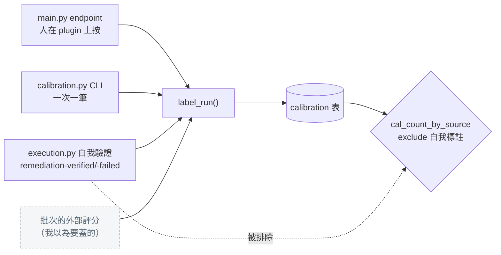
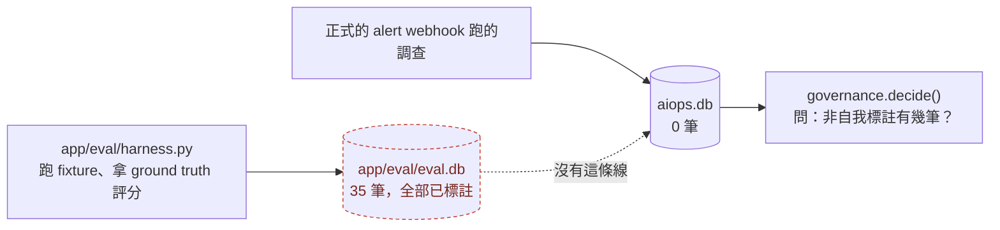

# Day36：把第一批非自我標註接上去，然後答案還是一樣

> 我以為今天要做的是產出資料
> 結果資料兩個月前就產好了
> 躺在一個沒有人接過去的資料庫裡
> 而那件事沒有任何地方會報錯

昨天量到的那行是 `non-self=0`，結論是這隻 agent 沒有任何外部標註，所以自主權在校準那一格永遠解不開。今天原本的計畫是去產出那批標註，把數字推過 20。實際做下來，工作內容跟我想的不太一樣。

程式碼在範例 repo [`OTel_AIOps_Agent`](https://github.com/tedmax100/OTel_AIOps_Agent) 的 [`ironman-2026/day36/`](https://github.com/tedmax100/OTel_AIOps_Agent/tree/main/ironman-2026/day36)。

## 標註要從哪裡來

先講為什麼這件事卡住。`label_run()` 這個函式在這個 repo 裡有三個呼叫點：`main.py` 的一個 HTTP endpoint（人在 plugin 上按對／錯）、`calibration.py` 的 CLI（一次標一筆）、還有 `execution.py` 的自我驗證（agent 執行完之後自己回頭查一下）。

第三個那條路產出來的標註，來源會寫成 `remediation-verified` 或 `remediation-failed`，而昨天量過了，那兩個字串正好是 `_SELF_LABEL_SOURCES` 排除掉的東西。前兩條路是人工的，一次一筆，要湊 20 筆得有人坐在那裡按 20 次。

畫出來是這樣，灰的那一格是我以為今天要蓋的東西：



所以我需要一個批次的、而且判斷來源不是 agent 自己的入口。這在 o11y-bench 那邊是現成的：整個 benchmark 的重點就是拿事先寫好的 ground truth 去評一次 RCA 對不對。我打算把它接成第四個入口。

然後我打開 `app/eval/harness.py`，看到它的 docstring 這樣寫：

```
Grading reuses `calibration.grade_against_truth` (service + optional version
match) so the harness stays decoupled from how correctness is judged. Each run is
also inserted+labeled into the calibration store, so a harness pass produces the
dense, unbiased CE data that production alone never gathers.
```

第四個入口早就存在了，而且是我自己在 eval 那幾天寫的。

## 那為什麼昨天量出來是 0

答案在同一支檔案往下二十行：

```python
DEFAULT_STORE = _HERE / "eval.db"  # separate from prod aiops.db unless overridden
```

eval harness 每跑一次 fixture，就把那一輪的信心值插進去、再用 ground truth 標上對錯，全部寫進 `app/eval/eval.db`。而 `governance.decide()` 去問標註數的時候走的是 `store.cal_count_by_source()`，那個函式沒指定 path 就吃 `settings.store_path`，預設值是 `aiops.db`。

兩個檔案，沒有任何一條路把它們接起來：



打開來看，eval 那邊有 35 筆，全部都有標註：

```
by source/correct:
  {'source': 'eval-harness', 'correct': 0, 'n': 15}
  {'source': 'eval-harness', 'correct': 1, 'n': 20}
```

**這個分開存是對的，不是 bug。** eval 跑的是合成的事故、用的是 fixture 裡寫死的答案，如果它們默默混進正式的歷史紀錄，那「這隻 agent 過去表現如何」這句話就被污染了。我當初那行註解寫得很清楚，也寫了 `unless overridden`。

問題是那個 override 從來沒有人做。整個 repo 裡唯一會產出外部判斷的流程，跟唯一需要外部判斷的關卡，中間沒有橋，而且橋不存在這件事在任何地方都不會亮紅燈。昨天要不是我去量那個數字，它可以繼續這樣躺著。

> 這個形狀在 Series 1 出現過好幾次了，只是那時候的主角是 label 名字不一致。今天換成兩個資料庫檔案，本質沒變：兩邊各自都正常，直到有一個東西需要同時讀懂兩邊。

## 橋要怎麼搭才不算作弊

接下來的問題比寫程式難：那 35 筆到底該不該算數。

我想到三種做法。第一種是讓治理平面直接去讀 `eval.db`，最省事，但等於把合成事故的成績直接當成營運歷史，而且以後正式跑的紀錄還是在另一邊，會愈接愈亂。第二種是把紀錄複製過去，但把來源洗成 `manual` 之類的，這個我連想都不該想。第三種是複製過去、**但把 `source` 原封不動留著**，讓那 35 列在資料庫裡永遠標著 `eval-harness`，誰去查都看得出來這批是哪裡來的。

我做的是第三種，寫成一支 `promote_labels.py`：

```bash
# 從 o11y-bench 主 repo 的根目錄跑
python3 ironman-2026/day36/promote_labels.py           # 先看會搬什麼
python3 ironman-2026/day36/promote_labels.py --apply
```

幾個刻意的設計：只搬已經有標註的（`correct IS NOT NULL`）、`source` 保留、同一個 `run_id` 已經在目標裡就跳過（可以重複跑）、預設是乾跑，`--apply` 是唯一會寫東西的參數。最後一項是這系列一路的預設值：會改變狀態的東西不要是預設行為。

搬之前先印一次現況，搬完再印一次：

```
source .../app/eval/eval.db
  35 labeled record(s) with source='eval-harness'
  0 already present in the target, 35 to promote

before
  target     labeled=0   non-self=0   overconfidence=None
  k8s.rollout_undo   -> propose  calibration unproven (0 labeled run(s) < 20); autonomy withheld
  k8s.scale          -> propose  calibration unproven (0 labeled run(s) < 20); autonomy withheld

promoted 35 record(s)

after
  target     labeled=35  non-self=35  overconfidence=-0.0029
  k8s.rollout_undo   -> propose  calibration ok (overconfidence -0.0029, 35 runs)
  k8s.scale          -> propose  calibration ok (overconfidence -0.0029, 35 runs)
```

`calibration unproven` 變成 `calibration ok`。兩道校準門今天都開了。

再跑一次昨天那支探測，最後那格：

```
[4] the real store, right now
    recorded=35 labeled=35 non-self=35 overconfidence=-0.0029
    k8s.rollout_undo   -> propose  high confidence but action is approval-gated
                          calibration ok (overconfidence -0.0029, 35 runs)
```

**判斷結果一模一樣，還是 PROPOSE。** 這正是昨天量到的那件事：擋在前面的是 `requires_approval`，校準那格根本不是決定去向的那一格。今天做的事情把三道鎖裡的第二道打開了，而門一樣不會動。

我覺得這個結果比「終於變成 AUTO」有用得多。如果昨天沒有先去量那個順序，今天我會在這裡卡很久，反覆檢查標註是不是沒寫進去、`source` 是不是打錯，因為畫面上的結論一個字都沒變。

## 那 35 筆到底有多少資訊量

這一段是今天最該講清楚的東西，因為數字很容易讓人放心。

門檻寫的是 20 筆，我搬過去 35 筆，看起來很寬裕。但那 35 筆長這樣：

| fixture | 跑了幾次 |
| --- | --- |
| `payment-decline-service` | 15 |
| `order-service-discover-before-query` | 10 |
| `user-service-no-incident` | 10 |

三個 fixture，兩個日子跑出來的。也就是說，這隻 agent 累積的「外部判斷」是**三個場景各跑十幾次**，而不是三十五個不同的事故。它證明的是在這三題上的穩定度，跟「它面對沒看過的事故有多可靠」是兩件事。

那個門檻設定叫 `governance_min_human_labeled_runs`，單位是 run。`run` 是這個系統裡唯一數得出來的東西，所以門檻就寫在 run 上，但真正該問的是`獨立事故數`（白話講就是「你考過幾種題型」，不是「你同一題寫了幾遍」）。這兩個數字在這裡差了一個數量級。

還有一件事我得寫出來，因為設定的名字會誤導人。`eval-harness` 這個來源之所以算「非自我標註」，是因為 `_SELF_LABEL_SOURCES` 只排除 `remediation-verified` 跟 `remediation-failed`，它是一份黑名單，不是白名單。而 harness 的判斷是拿 fixture 裡寫死的 truth 去比對，確實不是 agent 自己說了算，所以它通過 ARE（Agentic Reliability Engineering，代理式可靠性工程）§6.2 那條約束的字面要求。但錯誤訊息裡那句 `insufficient human/grader labels` 有個 `human`，而這 35 筆沒有任何一筆是人看過的。

> 我沒有把 `eval-harness` 加進黑名單，也沒有改那句訊息。改了就等於今天什麼都沒推進，而它現在是不是該算數，我覺得是可以爭論的。爭論本身寫下來比我單方面決定有用。

## 這條橋的維護成本落在誰身上

平台工程的角度今天很直接：我做的是一次性的複製，而 eval harness 以後每跑一次還是會寫進 `eval.db`。也就是說**這兩個數字從今天起就開始分岔**，而要它們對得上，得有人記得再跑一次 `promote_labels.py`。

一個要靠人記得的步驟，就是一個遲早會被忘記的步驟。而它被忘記的時候，症狀是治理平面用一份過時的校準紀錄在做授權判斷，畫面上沒有任何東西會說「這份紀錄停在兩個月前」。這跟昨天那個過期提案是同一個病：時間流逝本身不會讓任何東西前進。

真正該做的設計不是把橋做得更順手，是讓 harness 寫入的時候就決定好這批紀錄要不要進治理的視野，而那需要一個現在還不存在的東西：一份說明「哪些來源、以什麼權重、算不算數」的設定。現在這件事是靠 `_SELF_LABEL_SOURCES` 那個兩元素的 tuple 在兼任的。

順帶一提，這也是「產品團隊要付多少成本」的一個例子。如果哪天有第二隻 agent、或別的團隊接進來，他們要做的第一件事不是接 API，是搞懂自己的 eval 結果要寫到哪個檔案才會被算進去，而這件事目前只寫在一行程式碼註解裡。

## 今天沒做的事

- **沒有真的跑一輪 o11y-bench 的 grader。** 那需要把整套 stack 起來加 LLM 呼叫，今天搬的是六月跟八月已經跑出來的紀錄。所以這批標註的新鮮度是既定的，不是我今天決定的。
- **`_SELF_LABEL_SOURCES` 跟那句 `human/grader` 的訊息都沒改。** 上面那段 blockquote 講了為什麼。
- **沒有增加 fixture。** 三個場景這件事今天只量出來、寫下來，補題目是另一件事。
- **沒有做自動同步。** 一次性的腳本，要靠人記得再跑。
- **校準曲線一個字都沒看。** 上面那個 `-0.0029` 是整體的過度自信，它過關了，但那只是一個平均數。分箱之後長什麼樣，是下一步的事。
- **三道鎖還是三道。** 今天開了第二道，另外兩道沒碰。

## 小結

總結來說，今天實際做的事情跟計畫差很多：要產出的資料早就存在，缺的是一條沒有人接過的路，而接上去之後畫面上的結論一個字都沒變。這聽起來很像白工，但它讓「現在為什麼不能自動執行」這個問題從兩個模糊的原因收斂成一個明確的原因，而那個原因是可以被討論的——某個特定的行動，在某個特定的場景下，該不該保留人工核准。

比較有價值的反而是那三個 fixture 的分佈。一個寫成「20 次」的門檻，被三個場景各跑十幾次就滿足了，這件事在設定檔上完全看不出來。這個系列反覆在講的資料品質，今天輪到治理自己的資料被檢查一次。

> 那個 `-0.0029` 的整體過度自信漂亮到我差點想直接寫進小結。
> 然後我順手把分箱印出來，看到其中一格的 gap 是 1.0 QQ
