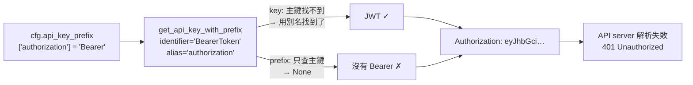
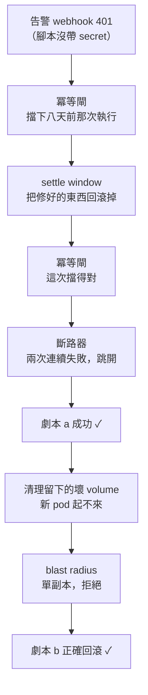

# Day36：把 Act 那一格走通，以及一個我信了三個月的錯誤診斷

> 寫完的程式碼跟跑過的程式碼
> 中間隔的不是測試覆蓋率
> 是有沒有人真的按下去
> 而我今天才第一次按

昨天把五個旗艦 SLO 算出來，難看的地方我都認了，但其中一句認得太客氣：「Act 那一格從來沒有成功過一次，分母是零」。今天要做的事很單純，就是讓它發生一次。結果這一次發生，花掉的時間全部在修東西。護欄一道一道把我擋下來，有兩道擋得完全正確，另外四道擋人的理由，跟它們以為自己在擋的東西不一樣。

程式碼在範例 repo [`OTel_AIOps_Agent`](https://github.com/tedmax100/OTel_AIOps_Agent) 的 [`ironman-2026/day36/`](https://github.com/tedmax100/OTel_AIOps_Agent/tree/main/ironman-2026/day36)。驗證環境：k3s v1.31.5+k3s1、kubernetes python client 36.0.2，演習跑在 2026-08-16 早上的 `demo` namespace，全部有稽核紀錄。

今天不是唯讀的，這是這個系列第一次讓程式真的改叢集狀態。

## 先修正昨天那句話：那個 401 不是憑證死了

昨天有一句寫得很有畫面：「那張憑證失效了 46 天沒有任何地方會說」。這句是錯的，而且錯得很有代表性。

事情是這樣。今天第一件事是把可執行性預檢部署上去。那個機制早就寫完了，但我一 `curl` 才發現叢集上跑的那版根本沒有 `/actions/readiness` 這個路徑，也就是說它寫完之後從來沒被部署過。**一個只存在於 repo 裡的防護措施，防的是 code review，不是事故。** 部署完之後探針第一次回答，答案是紅的：

```
"note": "write credentials did not authenticate against the cluster
         (UnauthorizedException: Unauthorized); readiness failed"
```

八天前那個 401 還在。我照著自己的診斷去修：刪掉那個 ServiceAccount token Secret、讓 controller 重新簽一張、重啟 pod。還是 401。

到這裡就開始不對勁了。全新簽的 token 不可能過期。於是我拿同一個 token 從外面打 API server，`SelfSubjectAccessReview` 回 201 `allowed: true`；再進到 pod 裡面，用 `urllib` 直接送同一份 token 檔案，一樣成功。只有 kubernetes client 那條路 401。

比對它實際送出去的 header，答案就出來了：

```python
key = self.api_key.get(identifier, self.api_key.get(alias) if alias is not None else None)
if key:
    prefix = self.api_key_prefix.get(identifier)   # identifier = "BearerToken"
```

我們的程式寫的是 `cfg.api_key_prefix["authorization"] = "Bearer"`。用 header 名稱當 key，看起來完全合理。但 client 找 key 的時候會拿 `"BearerToken"` 當主鍵、`"authorization"` 當別名，找 **prefix 的時候只認主鍵**。所以 token 找得到，`Bearer ` 前綴永遠加不上去，裸的 JWT 送出去，API server 連解析都解析不了，回 401。



憑證從頭到尾都是好的。**一個格式壞掉的 header 跟一張死掉的憑證，從外面看是一模一樣的 401**，而這正是那個錯誤診斷可以活三個月的原因：它很合理，而且沒有任何東西在探。

修法是一行：prefix 也掛一份在 `"BearerToken"` 底下。加了一個回歸測試，直接斷言送出去的字串是 `Bearer <jwt>`，因為這種錯誤下次還是會用一樣的方式偽裝自己。

> 我一度很滿意那個「憑證 46 天沒人管」的故事，它把一個技術問題講成了一個治理問題，很好寫。
> 結果它只是我沒讀 client 的原始碼 QQ

順帶一提，這件事沒有讓可執行性預檢變得不必要，反而更必要。無論原因是憑證死了還是 header 壞了，結論都一樣：**寫入能力只有在被使用的那一瞬間才會被觀測到**，而這條路徑幾個禮拜才走一次。所以那支探針現在是常駐的，每五分鐘跑一次、每一次都寫進 `actuation_probes` 表。它的第一批資料剛好記下了這次的轉折：

```
2026-08-16T05:00:25Z ok=1 reachable=1 source=rca
2026-08-16T04:59:56Z ok=1 reachable=1 source=loop
2026-08-16T04:56:21Z ok=0 reachable=0 source=rca   UnauthorizedException: Unauthorized
2026-08-16T04:55:33Z ok=0 reachable=0 source=loop  UnauthorizedException: Unauthorized
```

「壞了多久」這個問題，現在有地方可以查了。

## 演習要怎麼設計才不是在演給自己看

接下來是正題。要讓 `execute → settle → verify → 驗證失敗自動回滾` 這條路被真實輸入走過一次，只能自己製造一次事故，然後在旁邊看著它跑。

設計上最重要的決定是**跑兩個劇本，而且第二個比第一個重要**。兩個劇本的症狀一模一樣（payment-service 拒絕率飆高），根因不同，而 `rollout undo` 只修得好其中一個：

| 劇本 | 壞掉的東西住在哪 | `rollout undo` 修得好嗎 | 預期終態 |
| --- | --- | --- | --- |
| a bad-deploy | pod template（新的 ReplicaSet） | 修得好 | `succeeded` |
| b bad-config | `payment-flags` 這張 ConfigMap | 修不好 | `rolled_back` |

劇本 b 的巧妙之處在於，`rollout undo` 會**忠實地**把 pod template 換回上一版，然後什麼也沒改變，因為壞的東西從來就不在 template 裡。這是唯一能證明「驗證失敗自動回滾」不是紙上談兵的方式。只跑劇本 a 量出來的行動有效性 100%，跟昨天那個 0% 一樣沒有資訊量。

流量也有個坑。demo 自己的 `load.sh` 送的金額永遠是偶數，而那個 feature flag 的新驗證器只拒絕奇數分的扣款。直接拿現成的壓測腳本來用，會注入一個真的事故，然後量到 0% 的拒絕率。所以演習腳本自己打奇數分的流量。

告警也不重播六月那份 JSON。昨天 RL-SLO 十一筆樣本裡有八筆共用同一個時間戳，就是因為那個檔案一路被複製著重放，量到的是我重放了幾次。每次演習自己產生當下的時間戳，而且帶一個 `drill=true` 的 label。

## 六道護欄，一道一道亮紅燈

然後演習開始了。前後跑了十次才拿到兩次照設計走完的結果，而每一次被擋的地方，都比上一次更深一格：



**冪等閘擋了一次八天前的執行。** `idem_key` 是 `動作|目標|事故指紋`，而事故指紋是 `alertname|service|git_version` 的雜湊，它**刻意**設計成跨重複發生都穩定（它同時是調查的 thread id）。問題是查詢那邊沒有任何時間範圍。兩件事湊起來，這道閘的實際語意變成：同一個 (動作, 目標, 事故類型) 一輩子只能執行一次。它擋下我的理由是 8 月 8 號那次執行，而那次還是失敗的。冪等要防的是告警風暴在幾分鐘內對同一個目標動兩次，所以我給它一個一小時的視窗；明天同一個問題再犯是新的事故，本來就該再修一次。

**斷路器擋了一次，而這次它是對的。** 兩次連續失敗（八月那次 401、加上演習裡一次驗證失敗）讓它跳開，而且它不會自己關，要人去按 `POST /actions/breaker/reset`。這是設計正確在動，我只是第一次看到它動。

**blast radius 擋了一次單副本的回滾**，理由也是對的，但起因很尷尬：是我自己的清理腳本把副本數從 2 打回 1 的（下面會講）。

## 那個把自己修好的東西回滾掉的 bug

第二次演習是最值得寫的一次。它走得比之前都遠：

```
execute        success   {"result": "{'action': 'rollout_undo', ...
verify         fail      {"check": {"max_value": 0.01}, "detail": "value 3.407 > max_value 0.01"
rollback       success
```

`execute success`，這個系統史上第一次成功寫入。然後驗證失敗，自動回滾把它撤掉了。

但那個回滾其實是修好的。看一眼 runbook 的驗證契約就知道為什麼：

```yaml
verify:
  args:
    expr: 'sum(rate(payment_charges_total{status="declined"}[2m]))'
  check:
    max_value: 0.01
```

settle window 是 60 秒，而這句查詢自己往回看 **兩分鐘**。等 60 秒之後去問它，它的取樣窗裡有超過一半還是事故本身。所以一個完全正確的修復，在這個契約下**結構上不可能通過驗證**。3.407 這個數字量到的不是「沒修好」，是「我問得太早」。

而驗證失敗會觸發自動回滾。所以這個組合的行為是：**agent 正確地修好了事故，它自己的檢查說沒有，於是它把那個修復撤掉了。**

這比不檢查更糟。沒有檢查的話，修復會留在那裡；一個會誤判的檢查，會把修好的東西拿走。值班的人半夜看到的會是一份「已嘗試回滾、驗證未通過、已自動還原」的報告，服務還在噴錯，而真相是它兩分鐘前就好了，是這隻 agent 自己把它推回去的。下一次它再送同樣的建議，值班的人已經不會相信了。

修法不是把 `verify_delay_seconds` 調大就算了，那只是把同一個地雷埋到下一份 runbook 裡。改成從查詢自己推導：抓出 PromQL 裡最長的那個 range selector，加上一段讓 pod 真的滾完的緩衝，跟設定值取大的那個。稽核紀錄現在會直接寫出它為什麼等這麼久：

```
verify  settle  {"settle_seconds": 165, "reason": "165s (the verify query looks back 120s,
                 so the configured 60s would have measured the incident it was checking was over)"}
```

沒有人需要記得把 runbook 裡的 PromQL 跟設定檔對齊了。

> 這條規則寫成一句話是：**你的檢查不能問一個它自己還看得到答案的問題。**
> 我覺得這句話在 SLO、在告警規則、在 A/B 測試上都成立，只是我以前沒在自動修復上想過。

## 然後它真的跑完了

清乾淨、重跑，第六次：

```
execute        success   {"result": "{'action': 'rollout_undo', 'deployment': 'payment-service', ...
verify         settle    {"settle_seconds": 165, ...
verify         pass      {"check": {"max_value": 0.01}, "detail": "value 0 ≤ max_value 0.01"}
```

終態 `succeeded — executed and verified`。這是 `executions` 這張表活到現在第一列 `success=1`。

劇本 b 也照著設計走完了：`execute success` → 等 165 秒 → `verify fail (6.77 > 0.01)` → `rollback success` → `rolled_back`。修不好的東西，它修不好，而且它知道自己修不好，然後把手收回去了。

帳本現在長這樣：

```
ts                    success  drill
2026-08-08T09:02:45Z     0       0     ← 那個 401
2026-08-16T05:35:55Z     0       1     ← settle window 誤判
2026-08-16T05:59:56Z     1       1     ← 第一次成功
2026-08-16T06:19:58Z     0       1     ← 劇本 b，設計上就該失敗
```

## 評分：分子必須是人

有了執行紀錄之後，接著要決定「這次動作有沒有效」由誰說了算。

現成的答案是 verify 步驟，但它們問的不是同一個問題。verify 問的是「runbook 作者幾個月前寫的那句查詢，回來的數字有沒有低於門檻」；行動有效性這個 SLO 說自己量的是「事故有沒有結束」。上一節那個 3.407 正好示範了兩者可以差多遠。

所以新增了一支端點讓人回答那個問題，而且**兩邊的判決都存下來，一不一致是算出來的，不是假設的**。四條規則直接寫進程式，不靠人記得：

- **n 小於 5 不印百分比。** `0/1` 印成 `0.0%` 讀起來像量到的失敗率，實際上是一則軼事。昨天的報表就是這樣寫的，這次讓它自己閉嘴。
- **演習永遠不進事故的比率。** `executions` 多了一個 `drill` 欄位，值由告警自己的 label 在寫入當下決定。事後想從時間戳反推哪幾筆是演習，是做不到的。
- **修好症狀但弄壞別的東西不算有效。** 這個 SLO 問的是有效性，不是指令有沒有回 200。
- **只有真的動過叢集的終態可以評分。** 被拒絕、被中止的請求什麼都沒發生，「這個修法有沒有效」沒有指涉對象，算進去只會灌水分母。

還有一條是治理上的：verify 自己產生的標註**不能**用來解鎖自主權，人按的才可以。這條規則本來就在（`governance_min_human_labeled_runs`，而且自產來源被明確排除），今天只是讓人按的那一格終於有地方按。一個系統自己給自己發及格證，比沒有評分機制更危險。

現在的數字：

```
incidents  0/0   n=0 below the reporting floor of 5; ratio withheld
drills     1/3   n=3 below the reporting floor of 5; ratio withheld
verify_agreement  graded=3 disagreed=0
```

三次演習裡機器跟人的判斷完全一致。這不代表 verify 準，只代表這三次的 ground truth 我事前就知道：**演習可以用程式評分，唯一的理由是根因是我自己選的**。真實事故那一格是被 page 的那個人的。

## 我自己的清理腳本踩了三個坑

這段跟 agent 沒關係，但它是今天第二多的時間去處，而且三個都是同一類。

**第一，刪了 ConfigMap 卻沒刪 pod template 裡的 volume。** 之後每個新建的 pod 都卡在 `FailedMount ... configmap "payment-flags-bad" not found`。舊的 pod 還活著，所以 Deployment 看起來是健康的，直到有人需要一個新的。

**第二，那支清理腳本印了「done」。** 因為 `rollout status` 我加了不檢查回傳值。一個不會失敗的清理程序不是清理程序。

**第三，`kubectl apply` 救不回來。** 三方合併只會刪掉它自己擁有的欄位，而那個 volume 是 `patch` 加上去的，apply 不認識它。要用 `$patch: delete` 明確按名字刪，然後還會撞到 `volumeMounts` 的 merge key 是 `mountPath` 不是 `name`：

```
Error from server: map: map[$patch:delete name:bad-flags] does not contain
declared merge key: mountPath
```

修完之後又發現重新套用 manifest 會把副本數從 2 打回 1（檔案裡寫的是 1），下一個動作就被單副本政策擋掉了。清理現在記錄並還原**實際跑著的**副本數，不是檔案希望的數字。

會把這段寫進來，是因為它跟今天主線是同一個形狀：這幾個坑沒有一個會報錯，它們只會安靜地留下一個看起來正常的叢集。

## 今天沒做的事

沒有讓任何動作變成 AUTO，所以自主解決率還是 0，而且是結構上的 0。註冊表裡兩個動作都標了 `requires_approval=True`，治理閘在高信心之後的第一道判斷就是它，排在校準、資料品質、可執行性三道閘**之前**。要拆這個天花板，得把風險從「動作的屬性」改成「(動作, 目標, 幅度) 的屬性」，讓同一份安全規則在窄範圍內給得出「可以」。這件事留給後面。

沒有接 SLO 反過來調治理旋鈕的那條線。今天新增了三筆行動有效性的資料，但沒有任何機制會因為它變差而自己把自主權收回去。

行動有效性的分母只有演習，真實事故那一欄還是 0/0。而且三筆全部來自同一個事故類型、同一個目標，這種樣本撐不起任何比率，所以它現在會拒絕印出比率，這是今天唯一一個「量不出來就明講量不出來」的地方。

runbook 還是只有一本。`_verify_outcome()` 在沒有驗證契約時會樂觀跳過並回報成功，等於一份沒寫 verify 的 runbook 會自動拿到一筆有效性成功。這個預設該反過來，跟「沒有逆操作契約就不可執行」同一個規格。今天沒改。

## 小結

總結來說，今天真正的產出不是那一列 `success=1`，是四個護欄的語意被修正了：一個從來沒被部署的預檢、一個沒有時間範圍的冪等鍵、一個問得太早的驗證窗、一個掛錯 key 的認證前綴。斷路器跟 blast radius 那兩次是對的，我只是第一次看到它們動。而那四個問題有一個共同點，也是我覺得最值得帶走的一句：**它們全部只在真的執行一次的時候才會現形。**

每一個零件都寫對了、都有單元測試。auth header 那行讀起來完全合理；冪等鍵少一個時間範圍，程式碼看起來一樣正確；settle window 跟 PromQL 的取樣窗分別住在設定檔跟 YAML 裡，沒有任何一份文件會把它們並排。這些不是誰寫錯了，是零件之間那條沒有人擁有的接縫，而接縫不會報錯。

比較實際的收穫是，這座系統現在能講的話變了。昨天它只能說「分母是零」；今天它可以說「執行過四次、一次成功、演習三次、機器跟人三次判斷一致、真實事故的有效性還沒有樣本」。前面那句是一個藉口，後面這串是可以排工作的。

> 演習跑了十次才成功兩次，其中三次是被我自己寫的護欄擋下來的，兩次是被我自己的清理腳本。
> 我原本以為今天會在文章裡抱怨 agent，結果整天都在跟三個月前的自己吵架 XD
