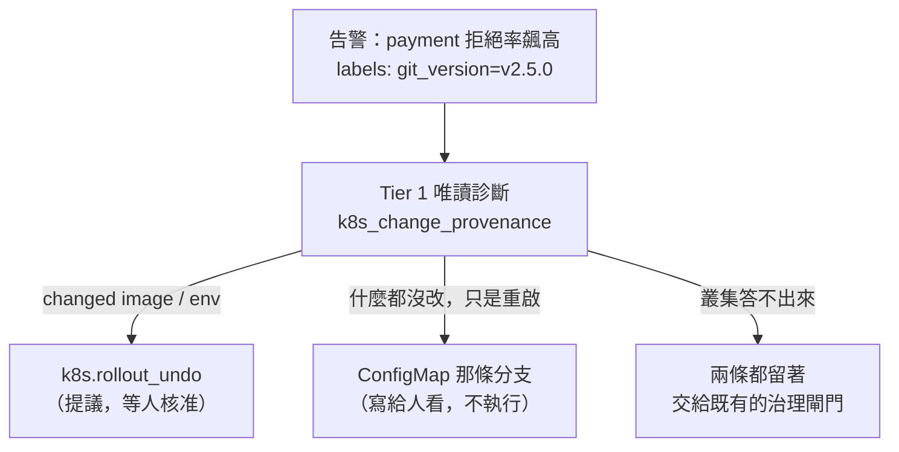

# Day36：讓診斷去挑處置，而不是事後把錯的那個劃掉

> 昨天那道檢查是對的
> 但它是在一份本來就不該有那個動作的清單上
> 把那個動作劃掉

昨天收在一個看起來挺漂亮的地方：提議之前先問叢集「上一次 rollout 到底改了什麼」，叢集說「什麼都沒改」，於是 `k8s.rollout_undo` 被標成不適用，不提議了。信心 0.95 也一樣擋。

今天早上重看那條路徑的時候，我才注意到它的形狀有點怪。

程式碼在範例 repo [`OTel_AIOps_Agent`](https://github.com/tedmax100/OTel_AIOps_Agent) 的 [`ironman-2026/day36/`](https://github.com/tedmax100/OTel_AIOps_Agent/tree/main/ironman-2026/day36)。指令一樣假設從 `aiops-agent/service/` 底下跑。

## 那個動作一開始為什麼會在清單上

runbook 是這樣寫的：一張告警，一份診斷步驟，一份處置步驟。`payment-decline-rate-high` 這張告警配的處置只有一個，`rollout undo`。

問題是這張告警**分不出兩種事故**。有人推了一個壞掉的 image，跟有人把掛載的 ConfigMap 裡的 flag 翻了一下再重啟，在 Prometheus 上是同一條線、同一個 `git_version` 標籤、同一張告警。而 `rollout undo` 只有在第一種情況下有用。

所以昨天那道檢查在做的事情，其實是：runbook 給了一個對兩種事故都成立的建議，然後我在最後一刻用叢集的事實把其中一種情況下的錯誤答案劃掉。

**這是補丁，不是設計。** 而且它有兩個很實際的副作用：

1. 值班的人看到的是「這次沒有提議任何動作」。理由躺在服務的 log 裡，畫面上什麼都沒有。
2. 那道檢查目前只認得一條規則（rollout undo 對上 template 外的變更）。多一種事故，就要多寫一條 if。

真正該修的是 runbook 只能給一個答案這件事。

## 一份 runbook，兩條處置

所以今天做的事情很小：讓 remediation 的步驟可以帶條件，而條件讀的是**已經跑完的那批唯讀診斷**。

```yaml
diagnostics:
  # 分岔點
  - id: provenance
    desc: 上幾次 rollout 到底改了什麼——換了 template，還是只是重啟
    action: k8s_change_provenance
    args: { service: payment-service }

remediation:
  - desc: 把 payment-service 回滾到上一版
    action: k8s.rollout_undo
    when:
      diagnostic: provenance
      output_contains: "restores a genuinely different pod template"
```

`when` 刻意做得很不會表達：只有「哪一條診斷」、「它的狀態」、「它的輸出有沒有這段字」、「事故參數等不等於某個值」，全部是 AND，沒有 or、沒有 not、沒有運算式。

這個限制是故意的。半夜三點看不懂的分支，比沒有分支更糟；比這個複雜的東西應該是第二份 runbook，不是同一份裡面更聰明的一行。

決定分岔的是叢集回的那句話，不是模型寫的那段話——這跟昨天那句「工具只是把答案放在它拿得到的地方，確定性那層才每次都成立」是同一件事，只是這次確定性那層搬到了 runbook 裡。



## 我差一點自己埋一顆雷

寫完第一版，我本來要給那個 `provenance` 診斷加一條 `check`，讓它「確認故障在 template 外面」。手指停在鍵盤上大概三秒，然後想起 `execution.py` 裡有這麼一段：一個提案被人核准、真的要執行之前，**它會把那份 runbook 的診斷再跑一次，任何一條 `check` 失敗就中止執行**。

那是一道好門，它擋的是「你按核准的時候，世界已經跟提議的時候不一樣了」。

但它跟分支放在一起會出事。如果 `provenance` 帶著「必須說 outside the template」這條 check，那麼在**真的推壞了 image** 的那條分支上，這條 check 本來就該失敗——於是那條分支上正確的處置（回滾）會在核准之後被自己的前置檢查中止掉。

**`check` 是「這件事必須成立，否則不要動手」；`when` 是「這是哪一種事故」。** 兩件事長得像，放在同一份 YAML 的同一層，而搞混的代價是一個被核准的正確處置在最後一秒被無聲擋掉。

所以拿來分類的診斷步驟不帶 `check`，只用 `output_contains` 分岔。這句話寫進了 `select_remediation()` 的 docstring、runbook 的註解，還有一條測試——因為三個月後的我一定會想「這條加個 check 更嚴謹吧」。

## 第二條分支我沒讓它可執行

ConfigMap 那條分支，我原本理所當然要接上 `k8s.configmap_flag_set`——那個動作早就寫好了，session-cache 那個劇本用的就是它。

寫到一半停下來查了一件事：payment-service 的 flag 是什麼時候讀的。

**開機時讀一次。**

而 `k8s.configmap_flag_set` 不會重啟任何東西（user-service 是每個 request 重讀，所以同一個動作在那個劇本裡是真的有效的）。也就是說，如果我把它接上去，agent 會做出一個「診斷完全正確、但執行了也不會有任何變化」的提議——**那正是昨天整天在修的那個錯誤，換了一件衣服**。

所以那條分支的 action 寫成 `manual.configmap_flag_set_and_restart`，一個**沒有註冊在 registry 裡**的名字。未註冊的動作本來就會被提議流程跳過，所以這是靠結構擋的，不是靠我記得。值班的人會看到完整的步驟敘述（翻 flag，然後重啟 payment，因為 flag 是開機才讀的），但系統一個字都不會提議去執行。

等哪天那個動作學會順手 `rollout restart`，這條分支再接上去。在那之前，誠實地少做一件事。

## 分支往「開」的方向壞

一個步驟只有在條件**明確為假**的時候才會被拿掉。沒跑診斷、runbook 裡的 id 打錯、provenance 查詢炸了——三種情況都是兩條分支全部留著：

```
case                                             offered
diagnostics never ran                            2 (both branches)
the condition names an id that does not exist    2 (both branches)
the provenance query errored                     2 (both branches)
```

理由是兩個代價不對稱。拿錯的代價是值班的人**永遠看不到那個修法**；留錯的代價是治理閘門多審一行，而那道閘門本來就在那裡。

而且沒被選上的那條**留在畫面上，帶著原因**：

```
## Runbook remediation branch
- [NOT FOR THIS INCIDENT] Roll back payment-service to the previous version — `k8s.rollout_undo`
  (provenance does not say 'restores a genuinely different pod template')
- [APPLIES] Set payment_use_new_validator=false in the payment-flags ConfigMap, then restart
  payment-service (the flag is read at process start, so the flip alone does nothing)
```

「我們沒有回滾，因為上幾次 rollout 根本沒改到跑起來的東西」是一句關於這次事故的事實，值班的人讀完會知道這是哪一種故障。一份被默默縮短的清單什麼都沒教到人。

昨天那道適用性檢查沒有拿掉。分支是在 runbook 寫對的時候省下麻煩，適用性檢查是在 runbook 寫錯、或者根本沒寫分支的時候接住——一個是設計，一個是保險，而且兩個問的是同一個叢集。

## 下半場：那筆六月的調查，比清單上寫的難看

今天的另一半是把待標清單上「只有人判得了」的那幾筆處理掉。標註這件事前面講校準那幾天說過：能填 `correct` 的只有人或機械 grader，agent 自己標自己不算數。

第一筆是六月的 `1539e7b9b01d65bb`，清單上寫「conf 0.8，很可能錯」。下手前我先開了逐字稿，然後發現事情比「答錯了」複雜：

**同一個 fingerprint 那天晚上跑了八次**，從 15:59 到 16:04。而其中 16:03:03 那一次，它**查到了對的答案**——引用了 `payment_charges_total` 上 `reason=new_validator_odd_cents` 的數字跟對應的 log，還明講「human reviewer 建議是 database connection 問題」但證據不支持。

然後最後一次又倒回去說是 gateway/database timeouts，信心 0.8。

那張告警的名字是 `payment-decline-rate-high-wrong-test`——那是一個故意餵錯假設進去的測試。而它**查對了，又被說服回去了**。

這比從頭到尾沒查到更值得記一筆，因為它說明對的證據曾經在對話裡出現過，是後面的推理把它蓋掉的。

標的時候只標最後那一列，另外七列留 NULL。同一場事故重跑八次算八個樣本，就是前面講排練污染校準池的同一個病。

## 待標清單裡有四筆是根本標不了的

剩下三筆是 chat 問答。點下去，404。

原因很單純也很難看：**chat 的調查只寫進 `investigations`，不會寫 `calibration`**，而標註是往 calibration 那張表填的。所以待辦清單上列著三件「等人處理」的事，而人一件都處理不了。

一個裡面有做不了的事的佇列，會訓練人不要再看那個佇列。這比少一個功能嚴重。

第二個洞更安靜。整個產品裡唯一的標註入口 `POST /investigations/{fp}/label` 是這樣寫的：

```python
grading_mode=CULPRIT,   # 「這個兇手指對了嗎」
```

寫死的。不管那次調查有沒有指認過任何人。

而那三筆 chat 裡有一筆是這樣的：使用者沒給任何事故、問的是 RED 指標怎麼設，agent 回「沒有事故可查」，**信心 0.0**。這是完全正確的行為。可是用「兇手指對了嗎」那把尺去量它，它會因為「答對了」而被算成一筆信心 0.0 卻正確的樣本——校準誤差整整 1.0，也就是理論上的最大值。前面講校準那天踩過一次的坑，這裡有一顆按鈕可以直接踩回去。

所以補了兩件事：沒有 calibration 列就從 investigation 補一列 pending 的；以及 `default_grading_mode()`——**從 run 自己判**該用哪把尺（沒指認任何人就是 inconclusive），而不是從按鈕判。API 仍然可以明寫 `grading_mode`，CLI 也補上了 `--grading-mode / --dimension / --note`。

## 兩筆我刻意不標

- **「一切正常」conf 0.9**：要判它得有那天的資料，早就過保留期了。而且同一段對話 22 分鐘前才說「api-gateway 有大量 5xx」，接著自己收回成 inconclusive 兩次。在這種來回之後，我沒有證據說它對或錯。**沒證據就標，正是校準池上次被污染的原因。**
- **「各服務請求速率」conf 1.0**：它報 api-gateway 跟 webapp 都是 ≈4.75 req/s。4.75 在這套 demo 上是一個已知的假數字——`*_duration_seconds` 把秒記進毫秒的預設 bucket，`histogram_quantile` 會恆為 ~4.75 的那個 artifact。兩個不同服務報同一個 4.75，比較像那個 artifact，不像流量。**這筆該做的不是標對錯，是去查那個 4.75 從哪來的。**

## 門動了，而且是往難看的方向動

```
labeled runs          5 → 6      （門檻 20，還是紅的）
band n (conf≥0.8)     3 → 4      （門檻 3，綠了）
band accuracy       1.0 → 0.5    （門檻 0.7，紅）
overconfidence           0.1667  （上限 0.1，紅）
```

`band accuracy` 從 1.0 掉到 0.5。

這是今天最值得寫下來的數字。先前那個 1.0 是三筆撐起來的，而且**裡面沒有半個「高信心而且錯」的樣本**——那不是準，那是還沒遇到。今天補進去一筆高信心的錯例，準確率就腰斬了。

一個從來沒有紅過的門，跟一個不存在的門，證據等級是一樣的。這句話前面講回歸清單那天寫過，今天輪到校準曲線自己。

## 這對值班的人為什麼危險

前面那半段的危險是最直接的：agent 說「回滾到上一版」，你照做，拒絕率一動也不動，然後你開始懷疑是不是自己漏了什麼——而真正的問題是那個動作從結構上就不可能有效。你損失的不只是時間，是**對自己判斷的信任**，在最不該損失它的時候。

後面那半段的危險慢一點但更深。待辦清單上列著標不了的事、按鈕用錯的尺算分數，這些都不會報錯，畫面上一切正常。於是校準曲線繼續是 1.0，治理閘門繼續說「這一格是綠的」，而那個綠燈的意思其實是「還沒有人遇到它錯的時候」。**當有一天你真的要靠那個數字決定要不要讓它自己動手，你會發現你在讀一個從來沒被反例考過的分數。**

## 還沒做的

- 那條 ConfigMap 分支還是人工的。要讓它可執行，得先讓 `k8s.configmap_flag_set` 學會在需要的時候順手重啟 deployment——而「什麼時候需要」本身就是另一個要寫進契約的事實。
- `when` 只讀 Tier 1 診斷的輸出字串。比對的是 `output_contains`，如果哪天 provenance 那句 verdict 的措辭改了，分支會安靜地不成立。那句話現在同時是人看的訊息跟機器的判斷依據，這遲早要拆開。
- 標註仍然只有 6 筆，離 20 還很遠，而那條路只有一個走法：更多真實事故的 run，也就是更多事故劇本。
- 那個 4.75 沒有查。
