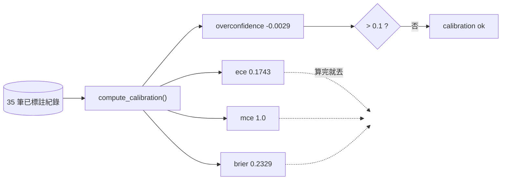
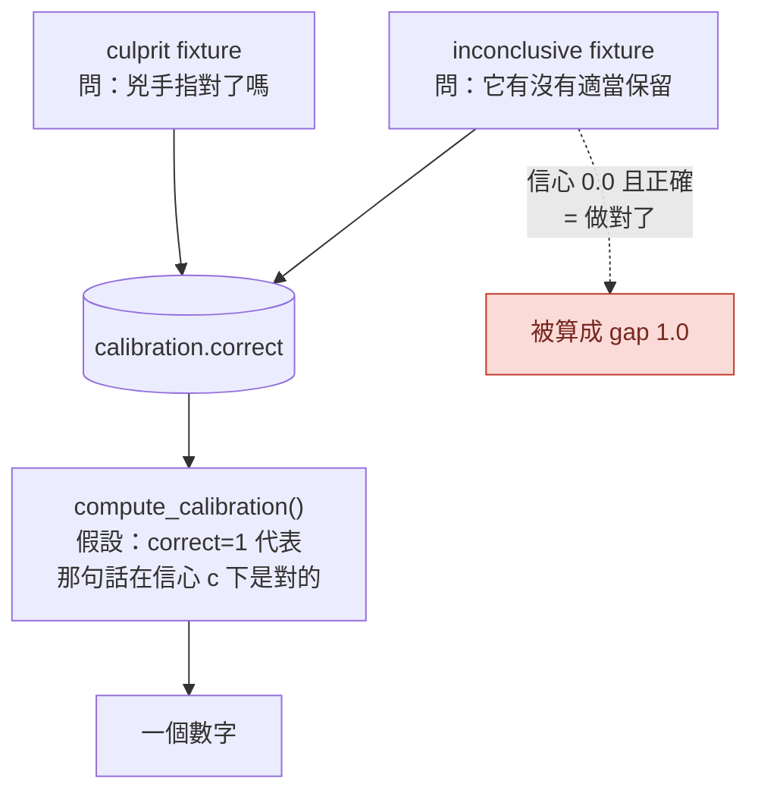
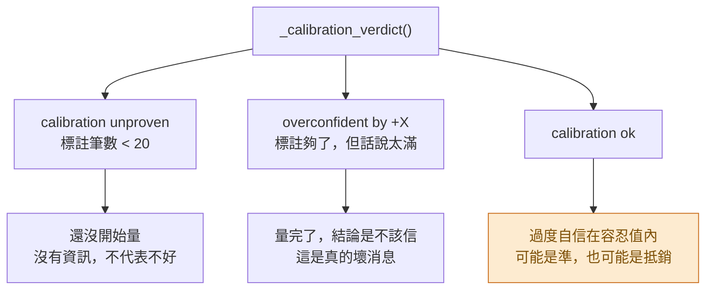

# Day37：整體過度自信 -0.0029，而它是 -0.28 跟 +0.205 加起來的

> 治理平面問的是一個是非題
> 這隻 agent 的信心可不可信
> 而它讀的是一個平均數
> 平均數最擅長的事情就是把兩種相反的錯誤變成沒有錯誤

昨天把 35 筆標註搬進治理平面讀得到的地方，`calibration unproven` 變成了 `calibration ok`，整體過度自信是 `-0.0029`。那個數字漂亮到我當下就知道有問題，因為那批資料是同一隻 agent 在三個場景上跑出來的，沒有道理準到小數第三位才開始出現誤差。

今天就是把那個數字拆開來看。

程式碼在範例 repo [`OTel_AIOps_Agent`](https://github.com/tedmax100/OTel_AIOps_Agent) 的 [`ironman-2026/day37/`](https://github.com/tedmax100/OTel_AIOps_Agent/tree/main/ironman-2026/day37)。今天全部是唯讀的，沒有寫任何東西。

## 那個關卡到底讀了什麼

先看 `compute_calibration()` 算出來的東西。它一次給四個數字：

- `ECE`（Expected Calibration Error，期望校準誤差）：把紀錄按信心值分箱，每一箱算「說的」跟「做到的」差多少，再按箱子大小加權平均。**差距取絕對值**，所以不會抵銷。
- `MCE`（Maximum Calibration Error）：所有箱子裡最糟的那一箱。
- `Brier score`：每一筆的 `(信心 − 對錯)²` 平均，愈低愈好。
- `overconfidence`：整體平均信心減掉整體正確率。**這個沒有取絕對值**，正的代表話說太滿，負的代表低估自己。

而 `_calibration_verdict()` 只讀最後那一個：

```python
overconf = calib.get("overconfidence")
if overconf > settings.governance_max_overconfidence:
    return False, f"overconfident by {overconf:+} > ..."
```

前面三個算完就丟掉。這個選擇有它的道理，`overconfidence` 是唯一一個帶方向的，而治理真正怕的是話說太滿那一側；但它同時也是唯一一個**會抵銷**的。跑一次腳本就看得到差別：

```bash
# 從 o11y-bench 主 repo 的根目錄跑
python3 ironman-2026/day37/calibration_report.py
```

```
[1] what the gate reads
  labeled=35  overconfidence=-0.0029  tolerance=0.1
  ece=0.1743  mce=1.0  brier=0.2329
  the whole store                        -> auto     calibration ok (overconfidence -0.0029, 35 runs)
```

同一批資料，`overconfidence` 是 `-0.0029`，容忍值是 0.1，過得非常輕鬆。而 `ECE` 是 `0.1743`，如果關卡讀的是這個數字、門檻一樣是 0.1，它會直接被擋下來。



## 第一張可靠度圖

把分箱印出來，`-0.0029` 是怎麼來的就很清楚了：

```
[2] the reliability diagram behind that one number
  band        n    stated  actual  gap
  [0.0,0.1)  2    0.0     1.0     1.0    ->
  [0.1,0.2)  4    0.1     0.0     0.1    <-
  [0.3,0.4)  2    0.3     0.0     0.3    <-
  [0.6,0.7)  12   0.6     0.5833  0.0167
  [0.7,0.8)  6    0.7     0.8333  0.1333 ->
  [0.8,0.9)  6    0.8     0.5     0.3    <-
  [0.9,1.0)  3    0.9     1.0     0.1    ->
  (<- stated above actual = overconfident;  -> stated below actual = underconfident)
```

箭頭是我加的，`<-` 是話說太滿、`->` 是低估自己。七個箱子裡兩種方向交錯出現，加起來就互相吃掉了。

有一箱要特別看：`[0.8,0.9)`，6 筆，說 0.8、實際只對一半。0.8 剛好是 `governance_conf_high`，也就是走到 AUTO 那條路的門檻。**這隻 agent 最不可信的信心區間，正好就是決定要不要放手的那一格。**

至於 `MCE` 是 1.0，來自最上面那一箱：信心 0.0、正確率 1.0。它說「我不知道」，然後被判定為對。這在校準的數學裡是最大可能誤差，但直覺上它一點都不危險。這個矛盾就是今天真正的題目。

> 值班的人在意的從來不是 ECE 那個數字，是「它跟我說 0.8 的時候我該不該相信」。分箱表回答得了這個問題，一個總分回答不了。

## 三個場景，三種完全不同的行為

再往下切一層，按 fixture 分開看：

```
[3] the same rows, per fixture
  payment-decline-service (culprit)      n=15  conf=0.72   acc=1.0    overconf=-0.28    ece=0.28
  user-service-no-incident (inconclusive) n=10  conf=0.34   acc=0.3    overconf=+0.04    ece=0.44
  order-service-discover-before-query (inconclusive) n=10  conf=0.57   acc=0.2   overconf=+0.37  ece=0.37
```

三行三種故事：

`payment-decline-service` 15 跑 15 中，全對，而信心平均只有 0.72。這是**低估自己**，過度自信是 `-0.28`。這一題它其實會做，只是不敢講。

`order-service-discover-before-query` 10 跑 2 中，正確率 0.2，而信心平均 0.57。過度自信 `+0.37`，遠遠超過容忍值。這才是危險的那一個。

`user-service-no-incident` 的過度自信只有 `+0.04`，看起來是三個裡面最健康的，但它的正確率是 0.3。這一格等一下要單獨講。

把 `-0.28` 跟 `+0.37` 混在一起平均，就會得到接近零的東西。那個 `-0.0029` 不是「校準得很好」，是**兩個相反方向的毛病剛好一樣大**。

## 兩種 `correct`，不是同一種對

這是今天最該記住的一段，而且它不是統計問題，是語意問題。

eval 的 fixture 有兩種評分模式。`culprit` 模式問的是「它有沒有指對兇手」；`inconclusive` 模式是給沒有真的出事的告警用的，問的是「它有沒有適當地保留」，判定條件寫在 fixture 裡：

```yaml
expect: inconclusive
max_confidence: 0.6        # correct iff the agent hedges at/below this
forbid_services:
  - payment-service
  - order-service
```

兩種模式的結果，寫進的是資料庫裡**同一個 `correct` 欄位**。而 `compute_calibration()` 的數學假設只有一種：`correct=1` 代表「它用信心 c 講的那句話是對的」，所以信心愈高、正確率也愈高才叫校準良好。

放到 `inconclusive` 那邊，這個假設整個反過來。一筆信心 0.0、`correct=1` 的紀錄，意思是「它正確地拒絕亂猜」，那是我們希望看到的行為；但校準的數學讀到的是「它只給了 0.0 卻答對了」，算出 gap = 1.0。**這隻 agent 做對了事情，然後在校準表上被記了一筆最大誤差。** 前面那個 MCE 1.0 就是這樣來的。



這個形狀我在 Day2 講過，只是那時候的例子是 `status` 欄位多了一個 `retrying`：欄位名稱沒變，值域的意義變了，而所有讀它的東西都不知道。今天輪到我自己寫的 `correct` 欄位。

拆開來算，數字會變成這樣：

```
[4] split by grading mode
  culprit fixtures ('blame was right')   n=15  conf=0.72   acc=1.0    overconf=-0.28    ece=0.28
  inconclusive fixtures ('it hedged')    n=20  conf=0.455  acc=0.25   overconf=+0.205   ece=0.405

  culprit fixtures only                  -> propose  calibration unproven (15 labeled run(s) < 20); autonomy withheld
  everything (what the gate does today)  -> auto     calibration ok (overconfidence -0.0029, 35 runs)
```

最後兩行放在一起看有點刺眼。只算「指對兇手」那 15 筆，關卡的回答是**標註不夠、自主權保留**；把 20 筆量的是另一件事的紀錄混進去，同一個關卡的回答變成**校準良好、可以放手**。

昨天我說那 35 筆只有三個 fixture，資訊量比數字看起來少。今天這句話還要再收緊一次：三個 fixture 裡，只有一個在量校準曲線假設的那件事，而它只有 15 筆。

## 那 `inconclusive` 那 20 筆該怎麼看

先講清楚，我不覺得那 20 筆沒有價值，反而它們量到的東西比另外 15 筆更接近 Day1 的原始問題。

`order-service-discover-before-query` 這個 fixture 的註解寫著它就是為了那次失敗寫的：agent 用寫死的 schema 去查 log、拿到三次空結果、然後還是報了一個數字。10 跑 2 中的意思是，這個毛病現在還在，只是它現在會在信心 0.6 左右犯，而不是 1.0。

`user-service-no-incident` 那 10 筆更值得看。它的過度自信是 `+0.04`，在三個 fixture 裡最漂亮，但正確率只有 0.3，十次裡有七次它沒有適當保留，其中一次還用 0.8 的信心去指認一個沒有出事的服務的鄰居。**一個看起來校準良好的數字，底下是一個十次有七次亂指的行為。** 因為在 `inconclusive` 模式下，信心跟正確與否根本不是同一個維度的東西，平均起來自然接近。

Day30 那次我抱怨過它在推論裡自己寫「沒有找到反證」卻給 1.0。今天有了 35 筆之後可以講得更精確一點：在它真的會的那一題上，它其實低估自己（0.72 對上 1.0 的正確率）；在它不會的那兩題上，它高估自己。**它不是普遍地太有自信，它是分不出自己會不會。** 這兩件事需要的處理完全不同，而只看一個總分的話，兩者都看不到。

## 兩種紅燈，跟一種沒有名字的綠燈

`_calibration_verdict()` 會回三種話，對值班的人的意義差很多：



第一種是「還沒開始量」。它長得像壞消息，其實只是沒有資訊，補標註就會變。第二種是「量完了，而結論是不該信」，這才是真的紅燈。這兩句話在程式碼裡是兩個不同的回傳值，這個設計是對的。

而第三種，也就是今天實際拿到的那個，沒有被跟第一種分開：`calibration ok`。它可能代表這隻 agent 的信心真的可信，也可能代表它的兩種毛病剛好抵銷。**這兩件事在畫面上、在資料庫裡、在那句 `calibration_note` 裡，長得一模一樣。**

昨天講過三道鎖的第二道今天開了。現在知道它開的理由不太站得住，而系統沒有任何地方會這樣講。

## 誰有資格決定哪些紀錄算數

平台工程的角度今天落在一個很小的地方：`compute_calibration()` 吃的是 `load_records()` 的**全部**，沒有任何過濾參數。要算什麼、不算什麼，這個決定目前不存在於程式碼裡，因為根本沒有地方可以表達它。

而這個決定其實有好幾個維度：評分模式（今天講的）、新鮮度（三個月前的紀錄還算數嗎）、fixture 的多樣性（同一題跑十次算十筆還是一筆）、來源（昨天那個 `eval-harness` 該不該算「非自我」）。這四個問題現在的答案都是同一個：全部算，因為沒有人被問過。

這是那種「不做決定也是一種決定」的地方，而它的代價要等到有人真的想放手的那天才會出現。到那天，做決定的人會發現他手上唯一的旋鈕是 `governance_max_overconfidence` 那個數字，而調它並不能解決上面任何一個問題。

> 舉個現實案例，這跟只看單元測試涵蓋率的團隊是同一種病。涵蓋率 85% 這個數字本身沒有錯，錯的是拿它回答「這份程式碼可不可靠」，而那個問題它答不了。今天這個 `-0.0029` 就是 AIOps 版本的涵蓋率。

## 今天沒做的事

- **關卡還是只讀 `overconfidence`，沒有改讀 ECE。** 這是另一個獨立的決定，跟下面那段一起改的話，數字動了會分不出是哪一個造成的。
- **沒有補 fixture。** 唯一在量校準的那個 fixture 只有 15 筆，離門檻還差 5 筆，而補的方式不該是把同一題再跑五次。
- **沒有畫圖。** 上面那張分箱表是純文字的，做成真的可靠度圖是 plugin 那邊的事。
- **信心是怎麼產生的完全沒碰。** 今天只量它準不準，沒有動 playbook 裡那段要求 agent 自評的規則。

## 寫完之後補的：讓那個欄位自己說它在回答什麼

上面那段本來停在「不知道 `inconclusive` 那批該怎麼算」。寫完之後我還是把它做掉了，因為 `inv_query_similar()` 那句 SQL 讓我有點不安：

```sql
SELECT i.payload FROM investigations i
JOIN calibration c ON c.run_id = i.fp
WHERE ... AND c.correct = 1
```

過去事故庫撈的是 `correct = 1`。照現在的標法，「在一個沒出事的告警上正確地保留」會被當成一次**成功解決的過去事故**撈出來餵給 agent。目前還沒發作，因為 eval 那批沒有寫進 `investigations` 表，但接下來要做的實驗正是要讓那張表有東西。

做的事情很小，一個欄位：calibration 表加上 `grading_mode`，記下這一列的 `correct` 到底在回答哪個問題。誰知道就誰填 — harness 從 fixture 的 `expect` 拿、plugin 上人按對錯的那條路填 `culprit`，其他一律留 NULL。然後 `compute_calibration()` 多一個 `modes` 參數，`governance_calibration_modes` 預設 `["culprit"]`，NULL 不算數（不知道就不算，跟這系列一路的預設一樣）。

`inconclusive` 那 20 筆沒有被丟掉，它們改用一個不套校準數學的數字來報：

```
[5] the inconclusive rows, reported as what they actually measure
  hedged appropriately on 5/20 non-incidents (rate 0.25), mean stated confidence 0.455
```

20 次裡有 5 次適當保留。這個數字比 `+0.205` 那個假的過度自信誠實得多，而且它就是 Day1 那個問題的直接度量。

改完之後關卡的回答是：

```
culprit only (what the gate does now)  -> propose  calibration unproven (15 labeled run(s) < 20); autonomy withheld
```

**綠燈變回紅燈，而且是「還沒量夠」那一種紅燈。** 昨天開的那道鎖今天又鎖回去了，理由是它昨天根本不該開。

## 小結

總結來說，今天拿到的第一張校準曲線，最有用的部分不是那個總分，是分箱之後看到的形狀：這隻 agent 在它真的會的題目上低估自己、在不會的題目上高估自己，而這兩件事在一個平均數裡剛好抵銷成一個很好看的數字。

比較實際的收穫是，它讓「要不要放手」這個問題有了一個可以討論的具體對象。在 0.8 那一格它只對一半，而 0.8 正好是自主權的門檻，這句話比「校準良好」具體得多，也比較容易讓一個團隊在會議上真的做出決定。至於那個補上去的欄位，它把系統從「綠燈，但理由是假的」換成「紅燈，理由是還沒量夠」，後者比較難看，但它是可以靠做事解決的。

> 我原本以為今天會寫一篇「數字不好看，所以還不能放手」的文章。
> 結果數字好看得要命，難寫的變成怎麼解釋它為什麼不算數 XD
